# User Guide
* [Introduction](#introduction)
* [Getting Started](#getting-started)
    * [Download](#download)
    * [Launch](#launch)
    * [Visual Introduction](#visual-introduction)
    * [Start using Agendum](#start-using-agendum)
* [Features](#features)
	* [Adding a task](#adding-a-task-add)
	* [Renaming a task](#renaming-a-task--rename)
	* [Rescheduling a task](#rescheduling-a-task--schedule)
	* [Marking a task as completed](#marking-a-task-as-completed--mark)
	* [Unmarking a task](#unmarking-a-task--unmark)
	* [Deleting a task](#deleting-a-task--delete)
	* [Undoing your last changes](#undoing-your-last-changes--undo)
	* [Searching for tasks](#searching-for-tasks--find)
	* [Listing all tasks](#listing-all-tasks--list)
	* [Creating an alias for a command](#creating-an-alias-for-a-command--alias)
	* [Removing an alias command](#removing-an-alias-command--unalias)
	* [Viewing help](#viewing-help--help)
	* [Specifying the data storage location](#specifying-the-data-storage-location--store)
	* [Loading from another data storage location](#loading-from-another-data-storage-location--load)
	* [Synchronizing with Google calendar](#synchronizing-with-google-calendar-sync)
	* [Exiting Agendum](#exiting-agendum--exit)
	* [Bonus: Keyboard shortcuts](#keyboard-shortcuts)
* [FAQ](#faq)
* [Conclusion](#conclusion)
* [Command Summary](#command-summary)
	* [Date Time Format](#date-time-format)

&nbsp;

[comment]: # (@@author A0148095X)
## Introduction
Hi there! Do you have too many tasks to do? Are you unable to keep track of all of them? Are you looking for a hassle-free task manager which will work swiftly?

Enter Agendum.

This task manager will assist you in completing all your tasks on time. It will automatically sort your tasks by date so you can always see the most urgent tasks at the top of the list!

Agendum is simple, flexible and phenomenally keyboard friendly. With just one line of command, Agendum will carry out your wishes. You don’t ever have to worry about having to click multiple buttons and links. Agendum is even capable of supporting your own custom command words! This means that you can get things done even faster, your way.


&nbsp;


[comment]: # (@@author A0003878Y)
## Getting Started

### Download

1. Ensure that you have Java version `1.8.0_60` or above installed on your computer.
2. Download the latest `Agendum.jar` from [here](../../../releases).<br>
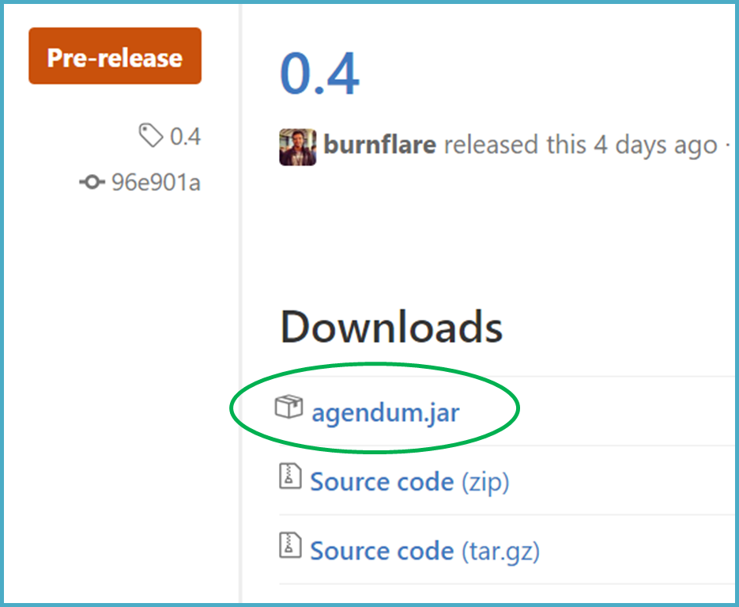<br>
3. Copy the jar file to the folder that you intend to use as the root directory of Agendum.

### Launch

To launch Agendum, double-click on `Agendum.jar` to launch Agendum. Welcome!

Here is the main window you will be greeted with. Initially the task panels are empty but fill them up with tasks soon.

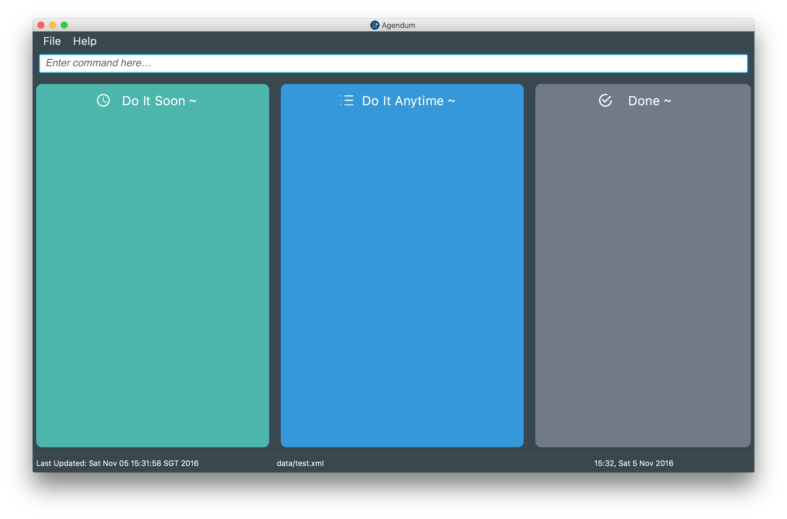<br>

[comment]: # (@@author A0133367E)
### Visual Introduction

Here is what Agendum may look like with some tasks added and completed.

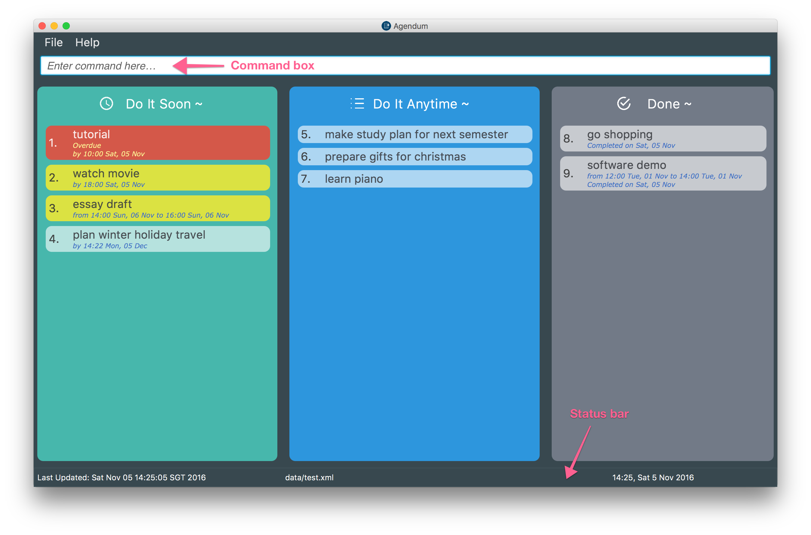<br>

Notice how Agendum has 3 panels: **"Do It Soon"**, **"Do It Anytime"** and **"Done"**.
* **"Do It Soon"** panel will show your **uncompleted** tasks with deadlines and events. Those tasks demand your attention at or by some specific time! Agendum has helpfully sorted these tasks by their deadline or event time.
    * **Overdue** tasks _(e.g. tutorial)_ will stand out in red at the top of the list.
    * **Upcoming** tasks (happening/due within a week) _(e.g. essay draft)_ will stand out in light green next.
* **"Do It Anytime"** panel will show your **uncompleted** tasks which you did not specify a deadline or happening time. Do these tasks anytime.
* **"Done"** panel will show all your completed tasks. To make it easier for you to keep track of what you have done recently, Agendum will always show the latest completed tasks at the top of the list.

Agendum will clearly display the name and time associated with each task. Notice that each task is displayed with a ID. For example, the task *learn piano* has a ID *7* now. We will use this ID to refer to the task for some Agendum commands.

The **Command Box** is located at the top of Agendum. Enter your keyboard commands into the box!
Just in case, there is a **Status Bar** located at the bottom of Agendum. You can check today's date and time, where your Agendum's to-do list data is located and when your data was last saved.

Agendum also has a pretty **Help Window** which summarizes the commands you can use. Agendum might show pop-ups and highlights after each commands for you to review your changes.

[comment]: # (@@author A0148031R)
### Start using Agendum
*This is a brief introduction and suggestion on how to get started with Agendum. Refer to our [Features](#features) section, for a more extensive coverage on what Agendum can do.*

**Step 1 - Get some help**

Feeling lost or clueless? To see a summary of Agendum commands, use the keyboard shortcut <kbd>CTRL</kbd> + <kbd>H</kbd> to bring up the help screen as shown below. You can start typing a command and press <kbd>ESC</kbd> whenever you want to hide the help screen.

**Step 2 - Add a task**

Perhaps, you can start by adding a task to your empty Agendum to-do list. For example, you might remember you have to return your library books. Type the following line in the command box:

`> add return library books`

Since you did not specify a time to return the books, Agendum will add this task to the **Do It Anytime** panel. The task *return library books* has a ID *1* now.

**Step 3 - Update your task (if needed)**

You might change your mind and want to update the details of the task. For example, you might only want to return a single book "Animal Farm" instead. Type the following line in the command box:

`> rename 1 return "Animal Farm"`

Agendum will promptly update the changes. What if you suddenly discover the book is due within a week? You will want to return "Animal Farm" by Friday night. To (re)schedule the task, type the following command:

`> schedule 1 by friday 8pm`

Since you will have to return your books by a specific time, Agendum will move this task to the **Do It Soon** panel.

**Step 4 - Mark a task as completed**

With the help of Agendum, you remembered to return "Animal Farm" punctually on Friday. Record this by marking the task as completed. Type the following line in the command box:

`> mark 1`

Agendum will move the task _(return "Animal Farm")_ to the **Done** panel.

**Step 5 - Good to go**

Continue exploring Agendum. Add more tasks to your Agendum to-do list and try out the various convenient commands given in the next section. Do note that the ID of the task might change as new tasks are added, updated and marked. Agendum takes care of it for you but you should always refer to the current ID displayed.

**Summary of all the visual changes**

Here is a **summary of all the visual changes** you should see at every step:
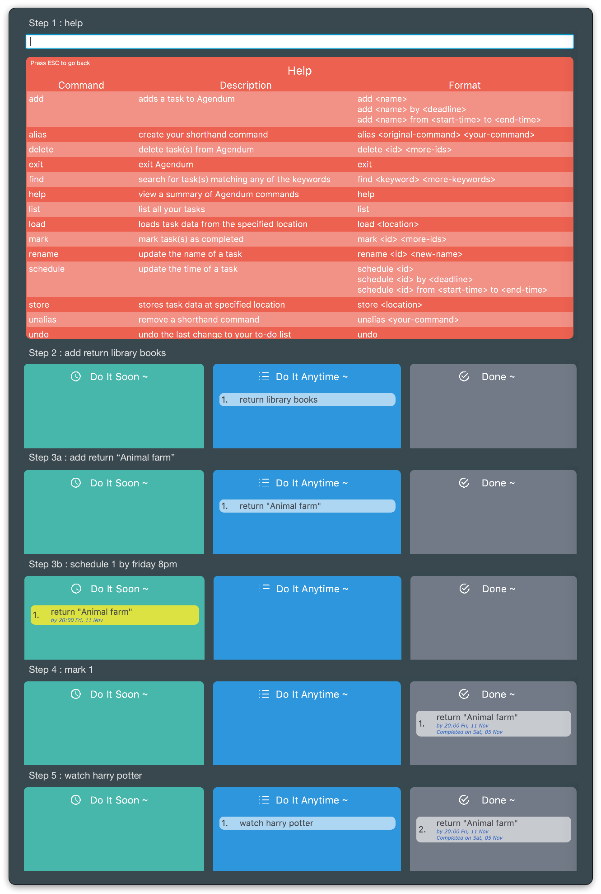<br>

From Step 4 to 5, the id of the task _return "Animal Farm"_ changed from 1 to 2.


&nbsp;


[comment]: # (@@author A0003878Y)
## Features

### Commands

**Here are some general things to note:**
> * All command words are case-insensitive. e.g. `Add` will match `add`
> * Words enclosed in angle brackets, e.g.`<name>` are the parameters. You can freely decide what you want to use in its place.
> * Parameters with `...` after them can have multiple instances (separated by whitespace). For example, `<id>...` means that you can specify multiple indices such as `3 5 7`.


### Adding a task: `add`

If you have a task to work on, add it to the Agendum to start keeping track! <br>

Here are the *acceptable format(s)*:

* `add <name>` - adds a task which can be done anytime.
* `add <name> by <deadline>` - adds a task which have to be done by the specified deadline. Note the keyword `by`.
* `add <name> from <start time> to <end time>` - adds a event which will take place between start time and end time. Note the keyword `from` and `to`.

Here are some *examples*:

```
Description: I want to watch Star Wars but I don't have a preferred time.
> add watch Star Wars
Result: Agendum will add a task to the "Do It Anytime" panel.

Description: I need to return my library books by the end of this week.
> add return library books by Friday 8pm
Result: Agendum will add a task "return library books" to the "Do It Soon" panel.
It will have a deadline set to the nearest upcoming Friday and with time 8pm.

Description: I have a wedding dinner which will take place on 30 Oct night.
> add attend wedding dinner from 30 Oct 7pm to 30 Oct 9.30pm
Result: Agendum will add a task "attend wedding dinner" to the "Do It Soon" panel.
It will have a start time 30 Oct 7pm and end time 30 Oct 9.30pm.
```

> A task cannot have both a deadline and a event time.

Did Agendum intepret part of your task name as a deadline/event time when you did not intend for it to do so? Simply `undo` the last command and remember to enclose your task name with **single** quotation mark this time around.
```
> add 'drop by 7 eleven' by tmr
```

#### Date Time Format
How do you specify the `<deadline>`, `<start time>` and `<end time>` of a task?

Agendum supports a wide variety of date time formats. Combine any of the date format and time format below. The date/time formats are case insensitive too.

*Date Format*

| Date Format     | Example(s)           |
|-----------------|----------------------|
| Month/day       | 1/23                 |
| Day Month       | 1 Oct                |
| Month Day       | Oct 1                |
| Day of the week | Wed, Wednesday       |
| Relative date   | today, tmr, next wed |

 > If no year is specified, it is always assumed to be the current year.
 > It is possible to specify the year before or after the month-day pair in the first 3 formats (e.g. 1/23/2016 or 2016 1 Oct)
 > The day of the week refers to the following week. For example, today is Sunday (30 Oct). Agendum will interpret Wednesday and Sunday as 2 Nov and 6 Nov respectively (a week from now).

*Time Format*

| Time Format     | Example(s)                              |
|-----------------|-----------------------------------------|
| Hour            | 10, 22                                  |
| Hour:Minute     | 10:30                                   |
| Hour.Minute     | 10.30                                   |
| Relative time   | this morning, this afternoon, tonight   |

> By default, we use the 24 hour time format but we do support the meridian format as well e.g. 10am, 10pm

Here are some examples of the results if these formats are used in conjunction with the `add` command.  
```
> add submit homework by 9pm
Result: The day is not specified. Agendum will create a task "submit homework"
with the deadline day as today (the date of creation) and time as 9pm

> add use coupons by next Wed
Result: The time is not specified. Agendum will create a task "use coupons"
with deadline day as the upcoming Wednesday and time as the current time.

> add attend wedding dinner from 10 Nov 8pm to 10 Nov 9pm
Result: All the date and time are specified and there is no ambiguity at all.
```

Note
> If no year, date or time is specified, the current year, date or time will be used.
> It is advisable to specify both the date and time.


Helpful tip: With Agendum, you can skip typing the second date only if the deadline/event is **happening some time in the future**
```
> add attend wedding dinner from 30 Nov 8pm to 9pm
```


[comment]: # (@@author A0133367E)
### Renaming a task : `rename`

Agendum understands that plans and tasks change all the time. <br>

If you wish to update the description of a task, you can use the following *format*:

* `rename <id> <new name>` - give a new name to the task identified by `<id>`. The `<id>` must be a positive number and be in the most recent to-do list displayed.

Here is an *example*:<br>
<br>

```
Description: I want to be more specific about the movie I want to watch for task id #2.
To update the name of the task,
> rename 2 watch Harry Potter
```

Agendum will promptly update the displayed task list! <br>
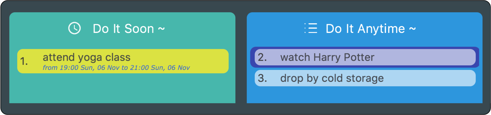<br>


### (Re)scheduling a task : `schedule`

Agendum recognizes that your schedule might change, and therefore allows you to reschedule your tasks easily.

Here are the *acceptable format(s)*:

* `schedule <id>` - re-schedule the task identified by `<id>`. It can now be done anytime.  It is no longer bounded by a deadline or event time!
* `schedule <id> by <deadline>` - set or update the deadline for the task identified. Note the keyword `by`.
* `schedule <id> from <start time> to <end time>` - update the start/end time of the task identified by `<id>`. Note the keyword `from` and `to`.

Note:
  > * Again, `<id>` must be a positive number and be in the most recent to-do list displayed.
  > * `<deadline>`, `<start time>` and `<end time>` must follow the format previously defined in [Date Time Format](#date-time-format)
  > * A task cannot have both a deadline and a event time.

Here are some *examples*: <br>
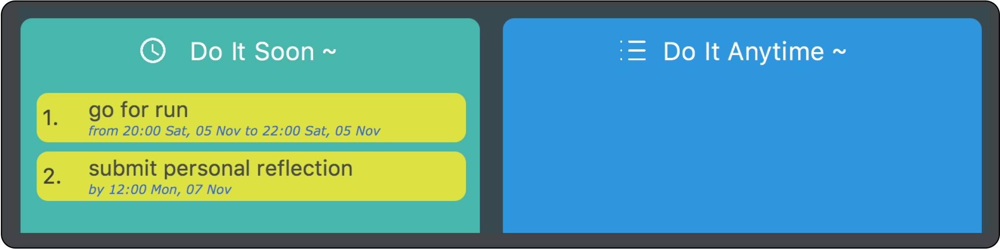<br>

```
Description: I decide that I can go for a run at any time instead.
> schedule 1
Result: Agendum will start/end time of the task "go for a run" and it will
move to the "Do It Anytime" panel

Description: I want to submit my reflection earlier.
> schedule 2 by tmr 2pm
Result: Agendum will update the deadline of "submit personal reflection". It
will then be sorted in the "Do It Soon" panel.
```

Agendum will promptly update the displayed task list! <br>
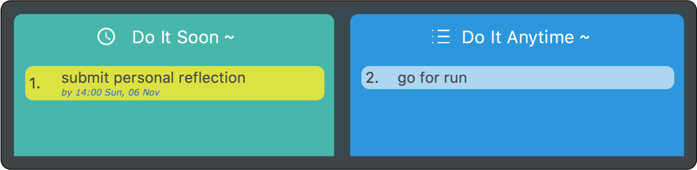<br>


### Marking a task as completed : `mark`

Have you completed a task? Well done! <br>
Celebrate the achievement by recording this in Agendum.

Here is the *format*:
* `mark <id>...` - mark all the tasks identified by `<id>`(s) as completed. Each `<id>` must be a positive number and in the most recent to-do list displayed.

```
Description: I just walked my dog!
> mark 4
Result: Agendum will move "walk the dog" to the "Done" panel

Description: I had a really productive day and did all the other tasks too.
> mark 1 2 3
Result: Agendum will save you the hassle of marking each individual task as
completed one by one. It is satisfying to watch how all the tasks move to the
"Done" panel together.

You can also try out any of the following examples:
> mark 1,2,3
> mark 1-3
The tasks with display ids 1, 2 and 3 will be marked as completed.
```

* You can specify a id (e.g. 1) or a range of id (e.g. 3-8). They must be separated by whitespace (e.g. 1 2 3) or commas (e.g. 2,3)

The changes are as shown below.<br>
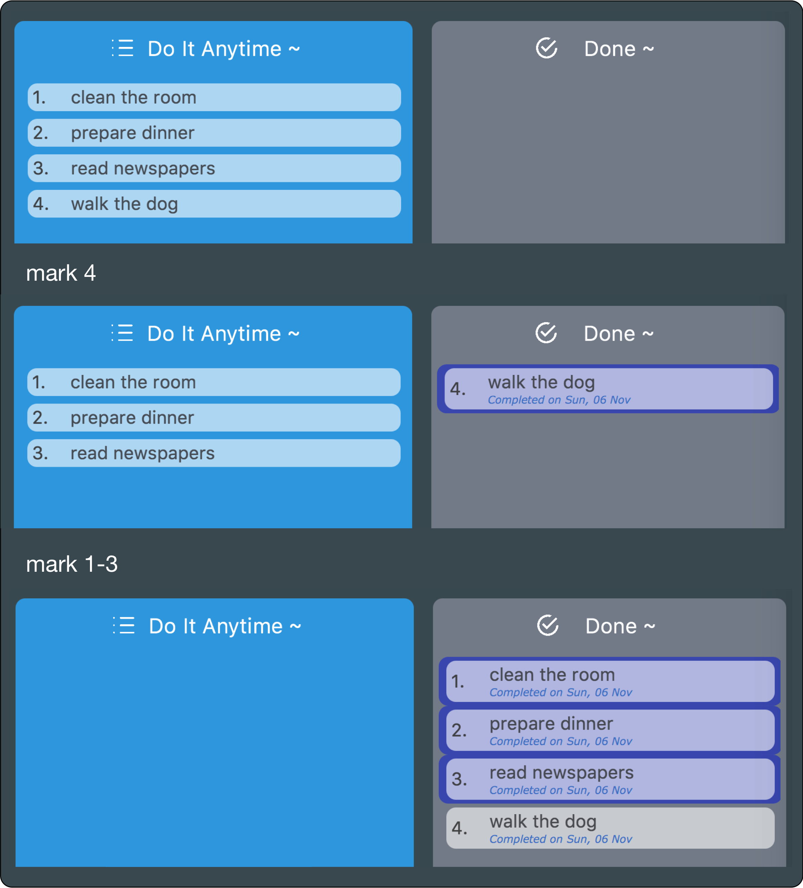<br>


### Unmarking a task : `unmark`

You might change your mind and want to continue working on a recently completed task.
They will conveniently be located at the top of the done panel.

To reflect the change in completion status in Agendum, here is the *format*:
* `unmark <id>...` - unmark all the tasks identified by `<id>`s as completed. Each `<id>` must be a positive number and in the most recent to-do list displayed.

This works in the same way as the `mark` command. The tasks will then be moved to the **"Do It Soon"** or **"Do It Anytime"** panel accordingly. <br>


### Deleting a task : `delete`

We understand that there are some tasks which will never get done and are perhaps no longer relevant. <br>
You can remove these tasks from the task list to keep these tasks out of sight and out of mind.

Here is the *format*:
* `delete <id>...` - delete all the tasks identified by `<id>`s as completed. Each `<id>` must be a positive number and in the most recent to-do list displayed.

Here are some *examples*:<br>
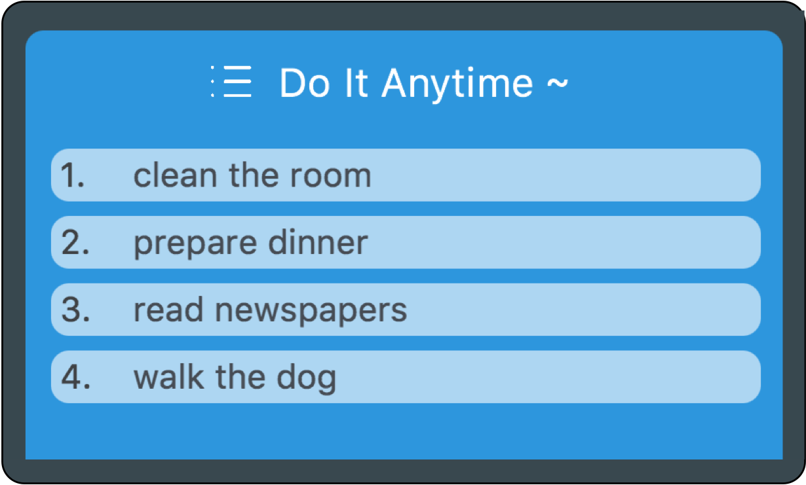<br>

```
Description: I just walked my dog and no longer want to view this task anymore.
> delete 4
Result: Agendum will delete the task "walk the dog" and it will no longer
appear in any of the 3 panels.

Description: I do not want to view the tasks at all.
> delete 1 2 3
Result: Agendum will save you the hassle of deleting each individual task but
still allows you to selectively choose what to delete.
You can also try out any of the following examples:
> delete 1,2,3
> delete 1-3
The tasks with display ids 1, 2 and 3 will be deleted.
```

* You can specify a id (e.g. 1) or a range of id (e.g. 3-8). They must be separated by whitespace (e.g. 1 2 3) or commas (e.g. 2,3)

The deleted tasks will appear in a popup window. <br>
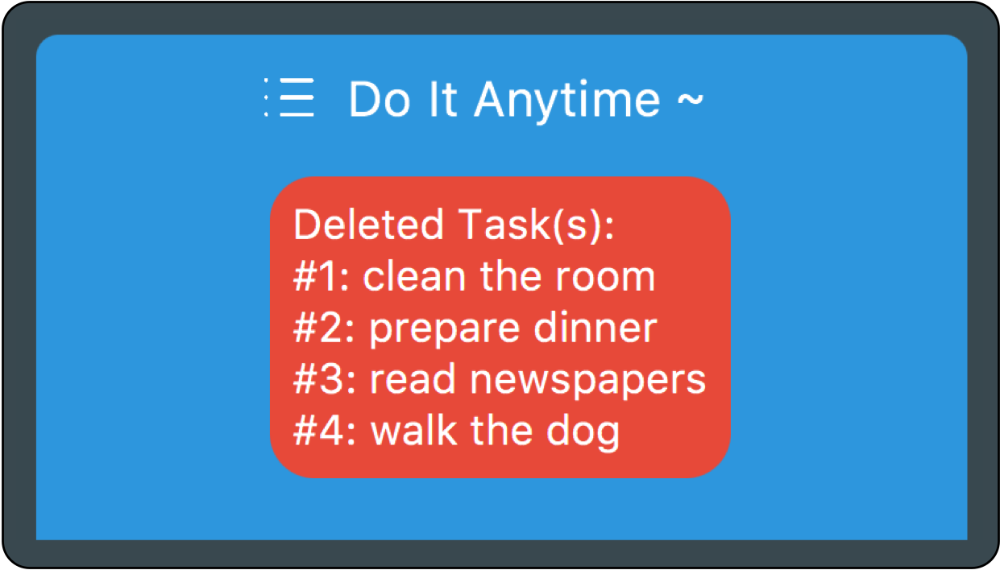<br>


### Undoing your last changes : `undo`  

Agendum understands that you might make mistakes and change your mind. Hence, Agendum does offer some flexibility and allow you to reverse the effects of a few commands by simply typing `undo`. Multiple and successive `undo` are supported.

Commands that can be "undone" include:
* `add`
* `rename`
* `schedule`
* `mark`
* `unmark`
* `delete`

Although some commands cannot be undone, you can still reverse the effect manually and easily.
* `store` - choose to `store` in your previous location again
* `load` - choose to `load` data from your previous location
* `alias` - `unalias` the shorthand command you just defined
* `unalias` - `alias` the shorthand command you just removed
* `undo` - scroll through your previous commands using the <kbd>↑</kbd> and <kbd>↓</kbd> again and enter the command to execute it again
* `list`/`find` - there is only a change in your view but no change in the task data. To go back to the previous view, use <kbd>ESC</kbd>

Examples:
```
> add homework
Result: Agendum adds the task "homework"
> undo
Result: Agendum removes the task "homework"
```


[comment]: # (@@author A0148031R)
### Searching for tasks : `find`

As your task list grows over time, it may become harder to locate a task.<br>
Fortunately, Agendum can search and bring up these tasks to you (if only you remember some of the keywords): <br>

Here is the *format*:
* `find <keyword>...` - filter out all tasks containing any of the keyword(s) given

  > * The search is not case sensitive. e.g `assignment` will match `Assignment`
  > * The order of the keywords does not matter. e.g. `2 essay` will match `essay 2`
  > * Only the name is searched
  > * Only full words will be matched e.g. `work` will not match `homework`
  > * Tasks matching at least one keyword will be returned (i.e. `OR` search). e.g. If I search for `homework assignment`, I will get tasks with names that contains `homework` or `assignment` or both.

Here is an *example*: <br>
 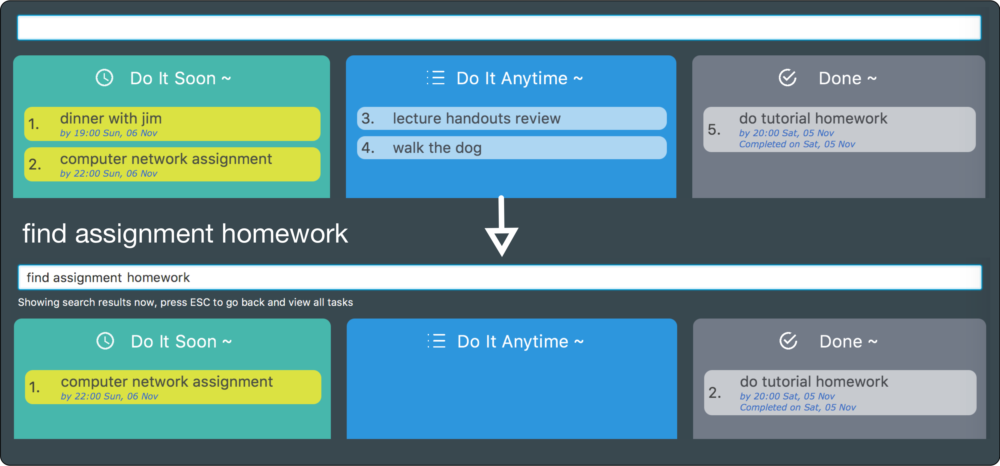<br>

Although you are looking at a narrowed down list of tasks, your data is not lost! Simply hit <kbd>ESC</kbd> to exit your find results and see a list of tasks.


### Listing all tasks : `list`

Alternatively, after you are done searching for tasks, you can use the following command to return to the default view of all your tasks: <br>
The format is simply `list`.


[comment]: # (@@author A0148095X)
### Creating an alias for a command : `alias`

Perhaps you want to type a command faster, or change the name of a command to suit your needs; <br>
fret not, Agendum allows you to define your own aliases for commands. <br>
You can use both the original command and your own shorthand alias to carry out the same action.

To create an alias, here is the *format*:
* `alias <original command> <your command>`

> * `<your command>` must be a single alphanumeric word. It cannot be a original-command or already aliased to another command.
> * `<original command>` must be a command word that is specified in the Command Summary section

Examples:
```
> alias mark m
Result: you can now use `m` or `mark` to mark a task as completed.
> alias mark mk
Result: Now you can use "m", "mk" or "mark" to mark a task as completed.
```


### Removing an alias command : `unalias`

Is a current alias inconvenient? Have you thought of a better one? <br>
Or perhaps you are thinking of using an alias for another command instead. <br>

To remove a previously defined alias, here is the *format*:
* `unalias <your command>`

> * `<your command>` should be an alias you previously defined.
> * After removing this particular alias, you can still use the original command word or other unremoved aliases.

Examples:
```
If mark is aliased with "m" and "mk".
> unalias mk
Result: "mk" can no longer be used to mark tasks; now you can only use the
original command "mark" or "m" to mark a task as completed.
```


[comment]: # (@@author A0148031R)
### Viewing help : `help`

At any point in time, if you need some reminder about the commands available, you can use the `help` command. Type `help` or use <kbd>Ctrl</kbd> + <kbd>H</kbd> to summon the help screen. To exit the help screen, use <kbd>Ctrl</kbd> + <kbd>H</kbd> again, or simply press <kbd>ESC</kbd>.

Here is a tip: You can directly enter your next command too! Agendum will also exit the help screen and show your task list.


[comment]: # (@@author A0148095X)
### Specifying the data storage location : `store`

Are you considering moving Agendum’s data files to another file directory?
You might want to save your Agendum task list to a Cloud Storage service so you can easily access from another device.
Agendum offers you the flexibility in choosing where the task list data will be stored.
The task list data will be saved to the specific directory and future data will be saved in that location.

Here is the *format*:
* `store <location>`

> * `<location>` must be a valid path to a file on the local computer.
> * If there is an existing file at `<location>`, it will be overriden.
> * The data storage file at the original location will not be deleted.
> * This command is similar to a "Save as..." in other applications.

Examples:
```
> store C:/Dropbox/mytasklist.xml
```


### Loading from another data storage location : `load`

After relocating Agendum’s data files, you might want to load that exact copy of Agendum’s task list from a certain location, or from a Cloud Storage service. Agendum also offers you the flexibility to choose which data files to import.

Here is the *format*:
* `load <location>`

> * `<location>` must be a valid path to a file on the local computer.
> * Your current data would have already been saved automatically in its original data storage location.
> * Agendum will then show data loaded from `<location>` and save data there in the future.
> * You will not be able to `undo` immediately after loading as there have been no changes to the loaded list.

Examples
```
> load C:/Dropbox/mytasklist.xml
```

### Synchronizing with Google calendar: `sync`

If you have a Google account and want to synchronize your tasks from Agendum to Google Calendar, this command enables you to do exactly that! Synchronization takes place when you turn it on.

Here is the *format*:
* `sync ON` or `sync OFF`

> * `sync` must have either ON or OFF after the command word
> * Only data from Agendum will be synchronized to Google Calendar
> * Only tasks with a start and end date/time will be synchronized
> * Please accept or decline Google's request for permission for Agendum client to manage your calendar. Do not close the window abruptly.


### Exiting Agendum : `exit`

Are you done with organizing your tasks? Well done! <br>
To leave Agendum, type `exit`. See you soon!


### Keyboard Shortcuts

To work even faster you can also use keyboard shortcuts: <br>
1. Use <kbd>↑</kbd> and <kbd>↓</kbd> to scroll through previously typed commands. You don't need to remember or enter them again! <br>
2. If you are entering a new command, use <kbd>↓</kbd> to instantly clear the command line and start afresh. <br>
3. Use <kbd>Tab</kbd> to quickly auto-complete a command word when you are typing. <br>
4. Use <kbd>Ctrl</kbd> + <kbd>H</kbd> to conveniently switch between the help window and the command box. Also, you can use <kbd>ESC</kbd> to close help window. <br>
5. Use  <kbd>Ctrl</kbd> + <kbd>Z</kbd> in place of `undo`


&nbsp;


## FAQ

<html>
<dl>
   <dt> Q: How do I save my task data in Agendum? </dt>
   <dd> Agendum saves your data automatically whenever your task list is updated. There is no need to save manually. Agendum will save the data at the speicified storage location. By default, it will save to `data/todolist.xml` </dd>

   <dt> Q: How do I transfer my data to another computer? </dt>
   <dd> Firstly, note down the current save location of Agendum's task data (which is displayed in the bottom status bar). In your file directory, navigate to this location and copy the data file to a portable USB device, hard disk or your cloud storage folder. Alternatively, you can make use of the <code>store</code> command to transfer the file within Agendum. Then, ensure that you have installed Agendum in the other computer. Copy the data file from your device onto the other computer, preferrably in the same folder as Agendum. Use the <code>load</code> command to load it into Agendum. </dd>

   <dt> Q: Why did Agendum complain about an invalid file directory? </dt>
   <dd> Check if the directory you wish to relocate to exists and if you have enough administrator privileges. </dd>

   <dt> Q: Can Agendum remind me when my task is due soon? </dt>
   <dd> Agendum will always show the tasks that are due soon at the top of list. However, Agendum will not show you a reminder (yet). </dd>

   <dt> Q: Why did Agendum complain that the task already exists? </dt>
   <dd> You have previously created a task with the same name, start and end time. The tasks have the same completion status too! Save the trouble of creating one or it will be helpful to distinguish them by renaming instead.

   <dt> Q: Why did Agendum reject my alias for a command? </dt>
   <dd> The short-hand command cannot be one of Agendum’s command keywords (e.g. add, delete) and cannot be concurrently used to alias            another command (e.g. m cannot be used for both mark and unmark). </dd>

   <dt> Q: I can't launch Agendum. What is wrong? </dt>
   <dd> Check if the config file in data/json/config.json contains the correct file paths to other data such as your to-do list. It might be helpful to delete the user preferences file. </dd>

</dl>
</html>

&nbsp;


[comment]: # (@@author A0133367E)
## Conclusion
We hope that you will find Agendum and our user guide helpful. If you have any suggestions on how we can make Agendum better or improve this guide, please feel free to post on our [issue tracker](https://github.com/CS2103AUG2016-W11-C2/main/issues).


## Command Summary

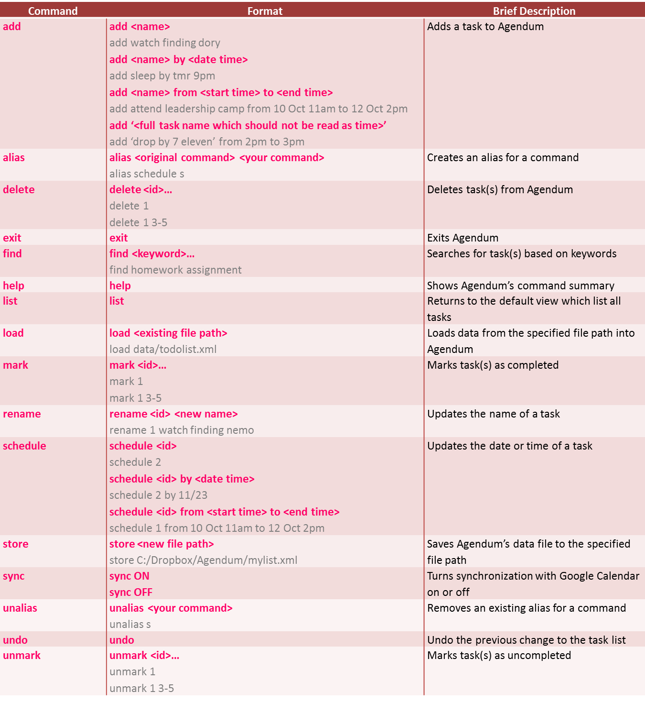<br>

For a quick reference,
> * Parameters with `...` after them can have multiple instances (separated by whitespace).
> * Commands are case insensitive
> * `<deadline>`, `<start time>` and `<end time>` must follow the format previously defined in [Date Time Format](#date-time-format)
