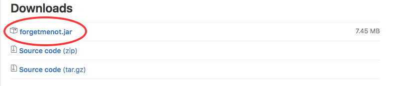

# User Guide

* [Quick Start](#quick-start)
* [Features](#features)
* [Command Summary](#command-summary)

<!-- @@author A0139671X -->
## Quick Start

0. Ensure you have Java version `1.8.0_60` or later installed in your Computer. 
   > Having any Java 8 version is not enough.  
   This app will not work with earlier versions of Java 8.
   
1. Download the latest `forgetmenot.jar` from the [releases](../../../releases) tab.
   > 
2. Copy the file to the folder you want to use as the home folder for ForgetMeNot.
3. Double-click the file to start the app. The application should appear in a few seconds. 
   > 

4. Type the command in the command box and press <kbd>Enter</kbd> to execute it.  
   e.g. typing **`help`** and pressing <kbd>Enter</kbd> will open the help window. 
5. Refer to the [Features](#features) section below for details of each command. 
6. Refer to the [Command Summary](#command-summary) section below for a summary of commands.  
<!-- @@author -->

<!-- @@author A0147619W -->
## Features

> **Command Format**
> * Words in angle brackets `<>` are parameters.
> * The order of parameters is fixed.

<!-- @@author A0139671X -->
#### Finding more information about various commands: `help`
Displays the list of commands(along with their formats) to assist the user in using ForgetMeNot. 
Format: `help`
<!-- @@author -->

<!-- @@author A0147619W -->
#### Adding a Task: `add`
Adds a task to the task manager 
Date Formats: dd/mm/yy, days (e.g Monday, Friday, Today, Tomorrow), dd Month yy
Time Format: 12-hour clock(Eg:10am, 5:30pm, etc).Users can also use natural language commands like today, tmr, 3 days later, next mon. 
             It also recognises holidays like christmas and new year.  
 
* If you want to use keywords such as `at`, `from`, `to` and `by` in the task name in isolation, it should be preceded by a `\\`.             
* If no particular time is mentioned, ForgetMeNot adds a task at the current time.
* If the user tries to add a task which is clashing with any other task, ForgetMeNot displays a warning message.

##### Adding a floating task
Adds a task without any start time or end time  
Format : `add <task name>` 

Examples:
* `add Read Harry Potter`
* `add meet Jim \\at Holland Village`

##### Adding a task with a Start Time only
Adds a task with only the start time  
Format : `add <task name> at/from <Start Time>`

Examples:
* `add Homework at 2pm` (This add a task to 2pm of the current day)
* `add project meeting at 21/11/16` (This gives it the current time when you add the task)
* `add tutorial at `7pm 12/12/16`
* `add buy gift at 3 days later`
* `add buy presents at christmas`

##### Adding a deadline task
Adds a task with only the end time  
Format : `add <task name> by/to <End Time>`

Examples:
* `add Homework by 2pm` (This add a task to 2pm of the current day)
* `add project meeting at 21/11/16` (This gives it the current time when you add the task)
* `add tutorial by 12/12/16 7pm`
* `add buy gift by 9pm 3 days later`
* `add buy presents by new year`

##### Adding an event task
Adds a task with a start time and an end time  
Format : `add <task name> at/from <start time> by/to <end time>`

Examples:
* `add exam from tmr 7pm to tmr 8pm`
* `add event from today 5pm to next fri 10pm`

<!-- @@author A0139671X -->
##### Adding a recurring task
Adds a recurring task a certain number of times with a specified duration in between. If the number of times is not specified, ForgetMeNot adds by default, 10 instances of the recurring task. Recurring task addition is not supported for task without any date or time.  

Format : `add <task name> at/from <start time> by/to <end time> every <number> <time interval> x<number>`  
Restrictions on  `<number>` : It has to be numeric. For example, 8 and not eight.  
Restrictions on `<time intervals>` : day(s), week(s), month(s), year(s)  

Examples:
* `add family dinner by 9pm friday every year`

	Add 10 instances of the task with a year in between the instances.
	
* `add jog with jim at 9pm tomorrow every 2 weeks`

	Add 10 instances of the task with 2 weeks in between the instances.
	
* `add planning meeting from 2pm thursday to 3pm thursday every 30 days x3`

	Add 3 instances of the task with 30 days in between the instances.
	
* `add movie night at 8pm Friday every 3 months x2`

	Add 2 instances of the task with 3 months in between the instances.

#### Editing a Task: `edit`
Allows the user to edit a particular task. Once a task is given a time, it can only be modified and not removed. If you wish to remove a time from a task, you may delete the task and re-add it without the time. Edit is supported for multiple fields at once.  
Format: `edit <task index> <new detail(s) to edit>`

Example:
* `edit 2 from 11am to 2pm` 

	Edit the start time to 11am and end time to 2pm for the task at index 2.

* `edit 1 CS2103T Tutorial` 
	
	Edit the name to CS2103 Tutorial for the task at index 1.

* `edit 2 at today 3pm` 
	
	Edit the start time to the current day 3pm for the task at index 2.
	

#### Undo a Task: `undo`
Undo the most recent task entered in the command line. Undo only supports for task modifying commands such as add, delete, clear, edit and redo but not find, show, setstorage. Once ForgetMeNot is exited, the possible undo history is cleared.  
Format: `undo`

#### Redo a Task: `redo`
Redos the most recent undo executed.Redo supports as many undos that were executed. Once ForgetMeNot is exited, or a new task modifying command is executed, the history of possible redos is cleared.  
Format: `redo`

#### Deleting a Task: `delete`
Deletes the particular index of a task that is displayed on the main list of tasks.  
Format: `delete <task index>`

Example:
* `delete 1`
	
	Delete task indexed 1.
	
#### Finding a Task: `Find`
Finds tasks in ForgetMeNot. ForgetMeNot will display all task with the input keywords. Find does not display subsets of a word. For example, `find home` does not display homework 
Format: `find <task name>`

Example:
* `find project`

	Finds all tasks with the word project in the name.
	
* `find homework assignment`

	Finds all task with the word homework or assignment in the name.
	

### Mark as done: `done`
Marks a task as done. A task that is done will be removed from the main list and placed in the done list.  
Format: `done <task index>`

Example:
* `done 1`
	
	Removes task indexed 1 from the list and sends it to the done list.
<!-- @@author -->

#### Showing full list: `show`
Displays all the task for the user to view. 
Format: `show`

##### Showing list for today: `show today`
Displays all the task for today for the user to view. 
Format: `show today`

##### Showing list for tomorrow: `show tomorrow`
Displays all the task for tomorrow for the user to view. 
Format: `show tomorrow`

##### Showing list for specific date: `show <date>`
Displays all the task for a specific date for the user to view. 
Format: `show <date>`

Example:
* `show 10/10/16`

##### Showing list for a specific parameter: `show <parameter>`
Displays all the task for a specific <parameter> the user to view. 
<parameter> only takes in dates for parameter as show in the examples. 
Format: `show <parameter>`

Example:
* `show 2 days later`
* `show next week`
* `show 2 days after tmr`
* `show next tuesday`

##### Showing a list for overdue tasks: `show overdue`
Displays all the overdue tasks.  
Format `show overdue`

##### Showing a list for floating tasks: `show floating`
Displays all the floating tasks.  
Format `show floating`

##### Show all the done tasks: `show done`
Displays all the done tasks.  
Format: `show done`

#### Clearing the display: `clear`
Clears all the tasks in the task manager  
Format: `clear`

##### Clearing only the done tasks: `clear done`
Clears all the done tasks  
Format: `clear done`

<!-- @@author A0147619W -->
#### Selecting a task: `select`
Selects a task based on index.  
Format: `select <index>`

Example:
* `select 2`

#### Set storage: `setstorage`
Allows the user to change the storage location to a different folder.  
Format: `setstorage <folder name>`

* The new file name must end with a `.xml` extension.

Example:
* `setstorage data/newFile.xml`

#### Exit: `exit`
Allows the user to exit the application.  
Format: `exit`

#### Saving the data 
ForgetMeNot data are saved in the hard disk automatically after any command that changes the data. 
There is no need to save manually.

## Command Summary

Following is the list of all commands:

| Command     | Format                                             | Description                                    										   |
|-------------|----------------------------------------------------|-------------------------------------------------------------------------------------------|
| `help`      | `help`                                             | Opens a help page                              										   |
| `add`       | `add` `<name>`                                     | Adds a floating task                           										   |
|             | `add` `<name>` at `<Start Time>`                   | Adds a task only with a start time             										   |
|             | `add` `<name>` by `<End Time>`                     | Adds a deadline task                                                                      |
|             | `add` `<name>` from `<Start Time>` to `<End_Time>` | Adds an event task from start time to end time                                            |
|             | `add` `<name>` `<time detals>` every `<duration>`  | Adds 10 instances of a task with a specified   duration in between                        |
|             | `add` `<name>` `<time details>` every `<duration>` x`<instances>`| Adds the specified instances of a task with a specified duration in between |
| `edit`      | `edit` `<index>` `<New Parameters>`                | Edits a task with the new parameters           										   |
| `done`      | `done` `<index>`                                   | Marks a task as done                           										   |
| `delete`    | `delete` `<index>`                                 | Removes a task from the task manager           										   |
| `show`      | `show`                                             | Shows all the tasks, due on the parameter(Eg: 5 days later)                               |
|             | `show` done                                        | Shows the done tasks                           										   |
|             | `show` today                                       | Shows all tasks for today                      										   |
|             | `show` tmr                                         | Shows all tasks for tomorrow                   										   |
|             | `show` floating                                    | Shows all the floating tasks                   										   |
|             | `show` overdue                                     | Shows all the overdue tasks                    										   |
|             | `show` `<date>`                                    | Shows all tasks for that particular date       										   |
|             | `show` `<parameter>`                               | Shows all the                     														   |
| `undo`      | `undo`                                             | Undoes the most recent command                 										   |
| `redo`      | `redo`                                             | Redoes the latest undo                         										   |
| `find`      | `find` `<name>`                                    | Finds a task with task name as <name>          										   |
| `clear`     | `clear`                                            | Clears all the tasks in the task manager       										   |
|             | `clear done`                                       | Clears all the done tasks from the done list   										   |
| `select`    | `select` `<index>`                                 | Highlights the particular task at that index   										   |
|`setstorage` | `setstorage` `<folder name>`                       | Set storage to a particular folder             										   |
|`exit`       | `exit`                                             | Exits ForgetMeNot                              										   |
