# User Guide

* [About](#about)
* [Getting Started](#getting-started)
* [Features](#features)
* [FAQ](#faq)
* [Command Summary](#command-summary)

## About
In this modern day, we’re all swamped with numerous tasks to do everyday. It is no wonder that task managers have become an indispensable tool in our everyday lives. However, we often spending more time figuring out where’s the add button or how to edit our tasks. 

Well, fret not! Here’s introducing Unburden! With Unburden, you won’t need to trouble yourself with what or where to click. It utilizes a simple and intuitive command line interface which only requires you to type. No more clicking or scrolling!

Unburden features a clean interface with colour coding to prioritize your tasks. It’s simple to use and easy to manage! All you need to know is shown on the screen, just type your queries and leave the rest to Unburden! What’s more is that Unburden works offline! So now you can even use it when your WIFI is down. 

Need to unburden? Let’s get started!

## Getting Started

1. Ensure you have Java version `1.8.0_60` or later installed in your Computer. 
   > Having any Java 8 version is not enough.  
   This app will not work with earlier versions of Java 8.
   
2. Download the latest `unburden.jar` from the [releases](../../../releases) tab.
3. Copy the file to the folder you want to use as the home folder for `Unburden`.
4. Click on the application icon to launch it and wait for the application to pop up.
   > 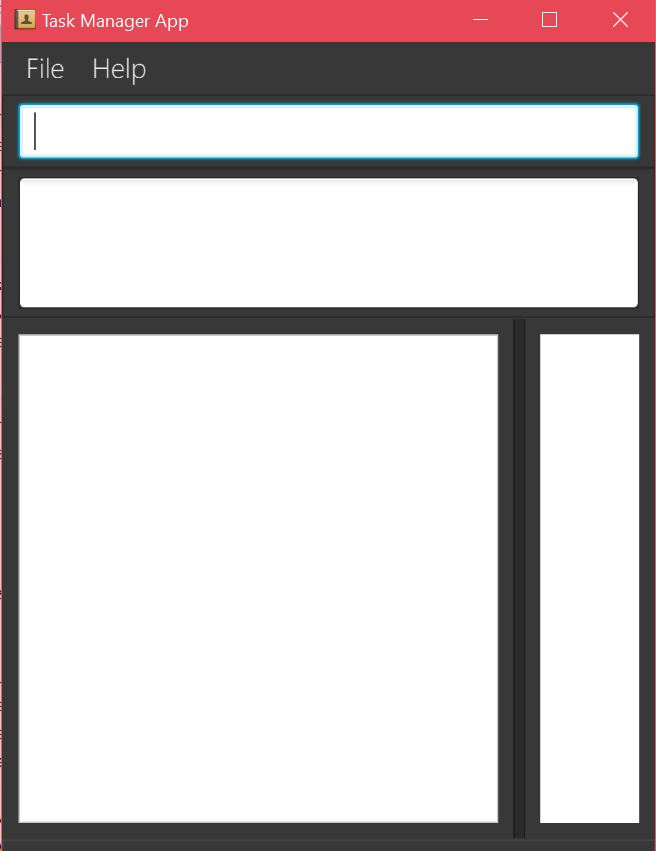

5. Type the command in the command box and press <kbd>Enter</kbd> to execute it.  
   e.g. typing **`help`** and pressing <kbd>Enter</kbd> will display the list of commands that can be used in the application.
   > 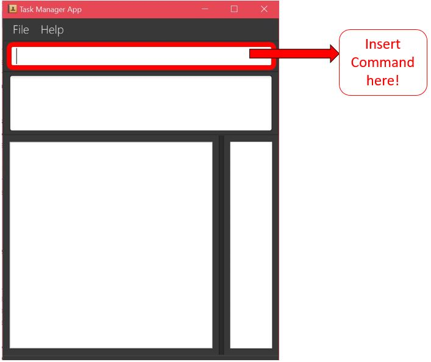
   
6. Refer to the [Features](#features) section below for details of each command. 

## Features

### Command Summary

Command | Format  
-------- | :-------- 
Help | `help <command word>`
Add | `add <Task description> <Date if applicable> <Start time if applicable> <End Time if applicable>`
Delete | `delete <task name>`
List | `list`
Find | `find <Task Name if applicable> or find <Date> or find <Tags>`
clear| `clear`
Edit | `edit <Task Index> <Date if applicable> <Start Time if applicable> <End Time if applicable>`
Exit | `exit`

### Command Format

1. Commands are not case sensitive and can be entered as both “Add” or “add.”
2. Dates can be entered in the format DD-MM-YYYY or in words limited to “today” or “tomorrow.”
3. Time should be entered in the 24 hour clock format such as “2330” to represent 11:30pm or “0520” to represent 05:20am.

#### 1. Help Command

If you wish to know what kinds of commands the software have and what 
are the formats. 
Format: `help`
   > 
   
> Help is also shown if you enter an incorrect command e.g. `abcd`

#### 2. Add Command: `add`

2.1  Adding a task with a deadline, start time and end time  
Format: `add <Task Name> d/<Deadline> s/<Start Time> e/<End Time>`
   > 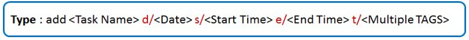
   
   Examples :  
   add CS2103 project d/09-07-2016 s/1700 e/1900 t/CS2103  
   add FC2020 tutorial d/03-05-2008 s/1800 e/2000  
   add Dance rehersal d/19-09-2015 s/1300 e/1500  
   
You may type the command as shown below
   > 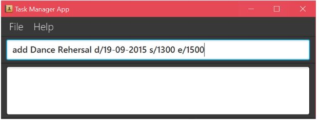
   
Upon pressing <kbd>Enter</kbd>, you will see the task you have added as shown below.
   > 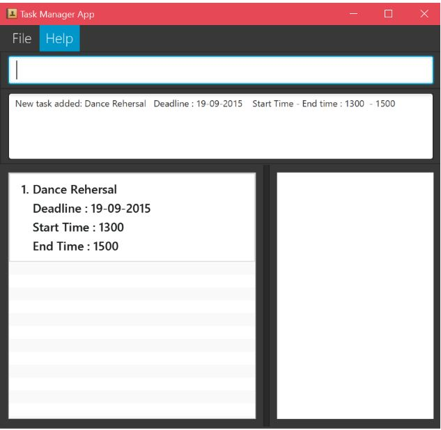

2.2  Adding a task with only a deadline
Format: `add <Task Name> d/<Deadline>`
   > 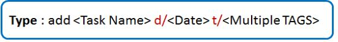
   
   Examples :  
   add Orbital Splashdown d/18-06-2016 t/Orbital  
   add Music Talent show d/28-04-2008 t/Show  
   add Complete Workout d/13-03-2009  
   
Upon pressing <kbd>Enter</kbd>, you will see the task you have added as shown below.
   > 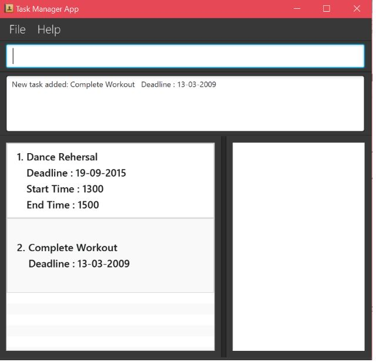
   
2.3 Adding a task without a deadline
Format: `add <Task Name>`
   > 
   
   Examples :  
   add Complete Joke book t/Jokes  
   add Plan Trip to Germany  
   add Book train tickets  
   
Upon pressing <kbd>Enter</kbd>, you will see the task you have added as shown below.
   > 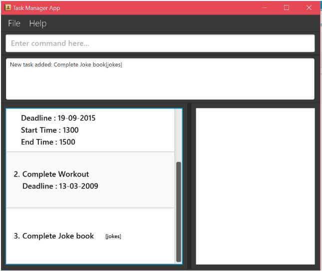

   
#### 3. Delete Command : `delete`

Deletes the specific task from the address book. Irreversible. 
Format: `delete <Task Index>`
   > 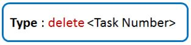
   
   Examples :  
   delete Dance Rehearsal  
   delete Go to the Gym  
   
Once done, the updated list of tasks will be displayed as shown below
   > 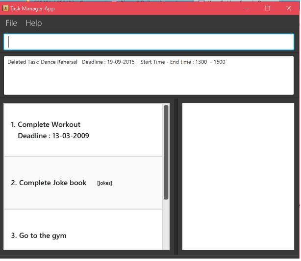

#### 4. List Command

Shows a list of all tasks in the list of tasks. 
Format: `list`
   > 

You can then see all of the tasks in the application in the display as shown below.
   > 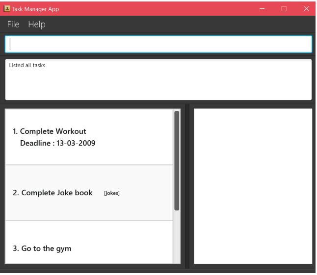

#### 5. Find Command

5.1 If you wish to find certain tasks, enter the keywords in the task or the task name 
Format: `find`
   > 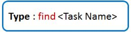
   
   Examples :  
   find workout  
   find gym  
				
You can then see all of the tasks with that keyword or name  in the application’s display window. 
For example, i keyed in “find workout” in the command line and the task with the keyword “workout” is displayed as shown below. 
   > 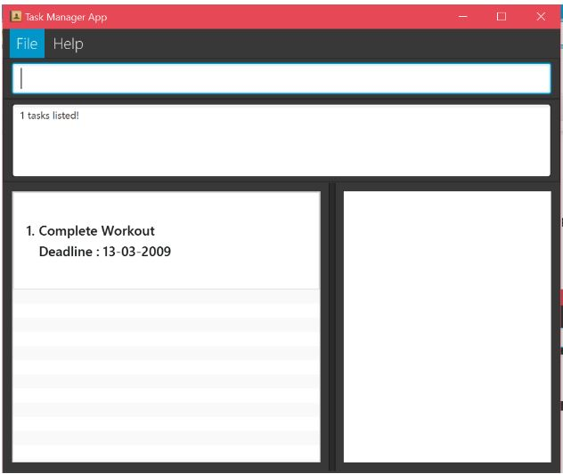

#### 6. Clear Command

If you wish to clear all the tasks in the task manager in one go, without having to delete each one by one, you can make use of the “clear” command. 
 
Format: `clear`
   > 
				
Simple type the command “clear” as shown above and all tasks will be automatically deleted and the message that “Unburden has been cleared!” would appear as shown below. 
   > 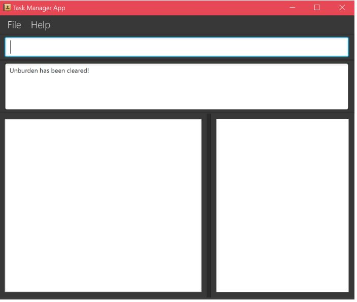
   
#### 7. Edit Command

7.1 If you wish to edit the deadline, start time and end time of certain tasks
 
Format: `edit <Task Index> d/<Deadline> s/<start Time> e/<End Time>`
   > 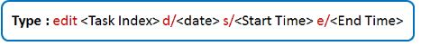
   
   Examples :  	
   edit 1 d/09-07-2016 s/1700 e/1900 t/CS2103  
   edit 3 d/06-03-2009 s/1800 e/1900  
		
By doing so, the date, start time and end time will be updated and the updated list will be displayed as shown below. 
   > 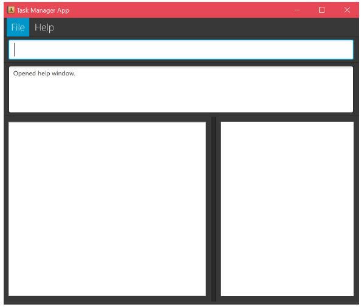
   
7.2 If you wish to edit the deadline certain tasks
 
Format: `edit <Task Index> d/<Deadline>`
   > 
   
   Examples :  
   edit 3  d/09-07-2016  
   edit 2  d/03-05-2008  
		
By doing so, the date, start time and end time will be updated and the updated list will be displayed as shown below. 
   > 

7.3 If you wish to edit the start time and end time of certain tasks
 
Format: `edit <Task Index> s/<Start Time> e/<End time>`
   > 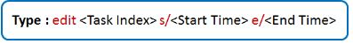
   
   Examples :  
   edit 2  s/1700 e/1900 t/CS2103  
   edit 3 s/1800 e/2000  
		
By doing so, the date, start time and end time will be updated and the updated list will be displayed as shown below. 
   > 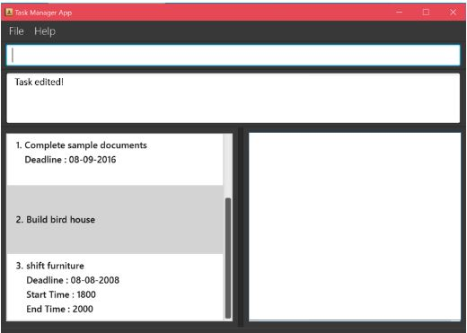
   

#### 8. Exiting the program : `exit`
Exits the program. 
Format: `exit`
   > 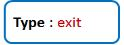

Simply type `exit` in the command line as shown below
   > 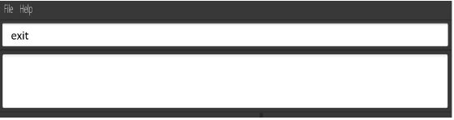

The application will be closed.

#### Saving the data 
Address book data are saved in the hard disk automatically after any command that changes the data. 
There is no need to save manually.

## FAQ

**Q**: How do I transfer my data to another Computer? 
**A**: Install the app in the other computer and overwrite the empty data file it creates with 
       the file that contains the data of your previous Address Book folder.
       
## Command Summary

Command | Format  
-------- | :-------- 
Add | `add <Task description> <Date if applicable> <Start time if applicable> <End Time if applicable>`
Delete | `delete <task name>`
List | `list`
ListByDate | `listbydate <Date>`
HelpAll | `help`
Help | `help <command word>`
Exit | `exit`

