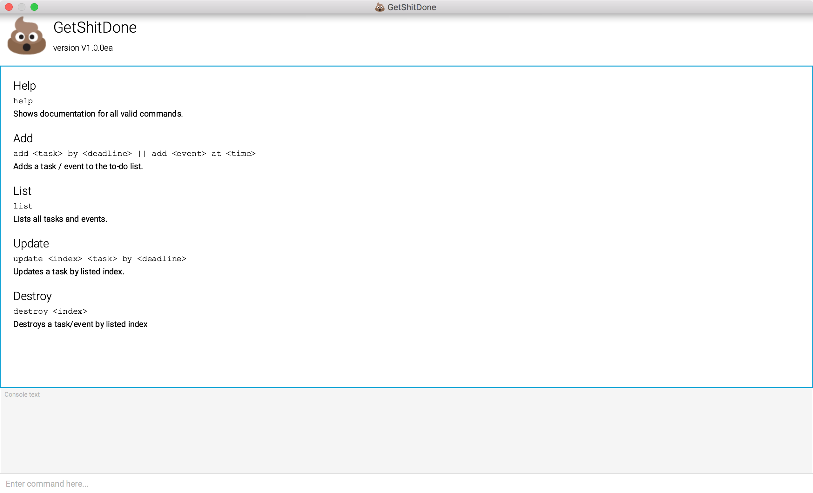
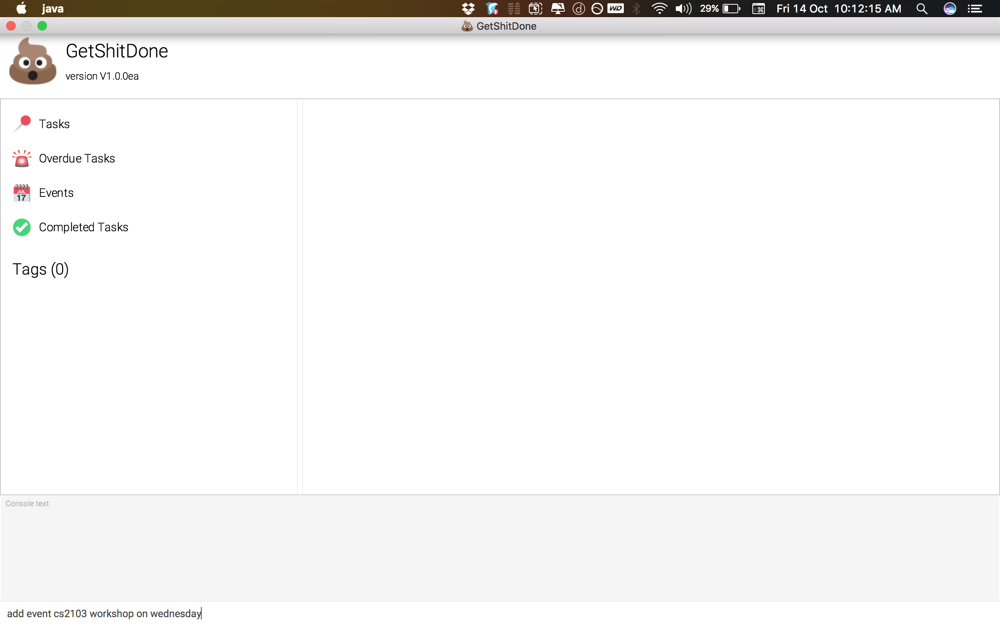
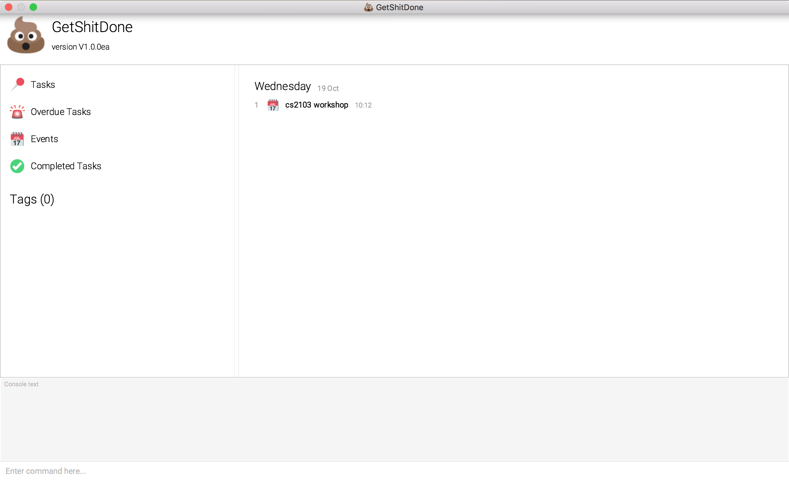
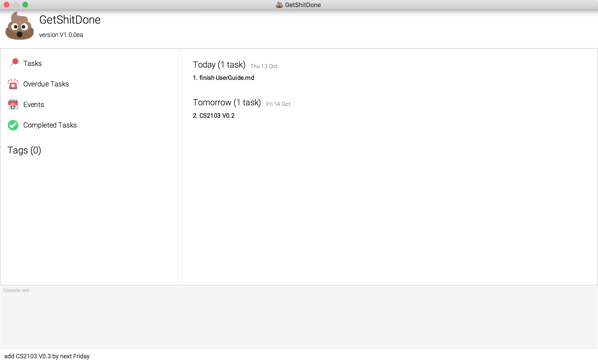
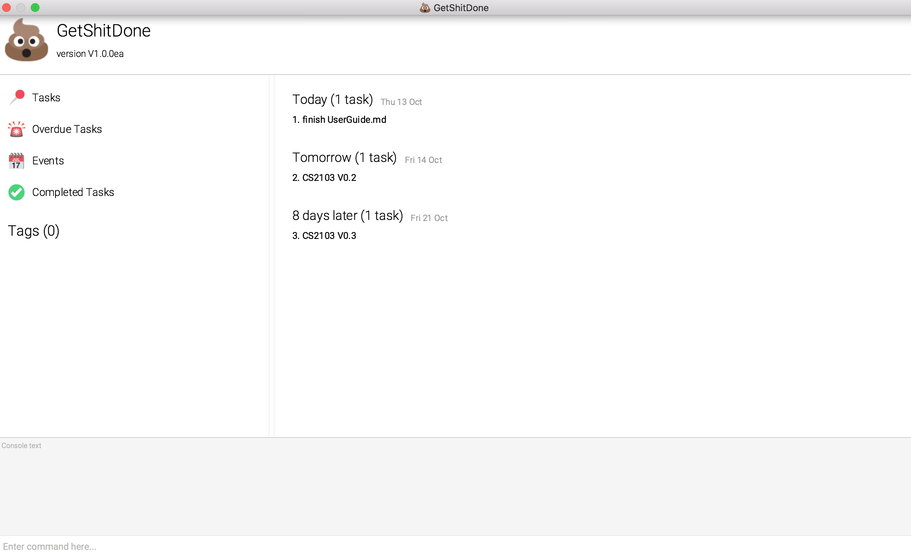
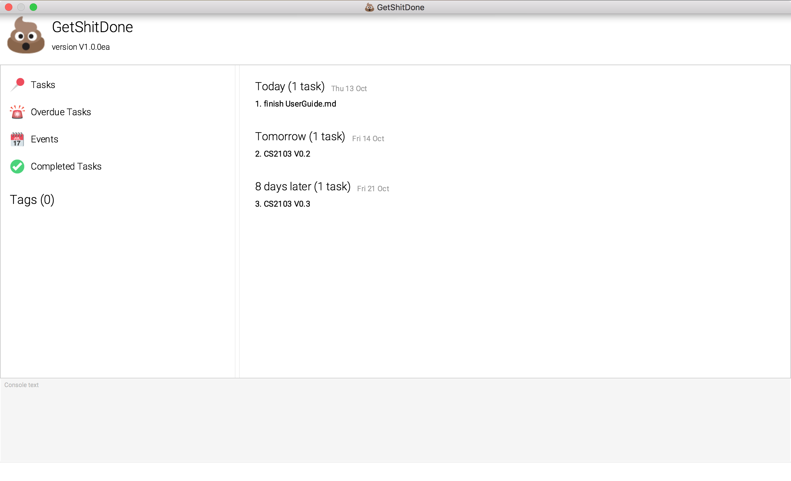
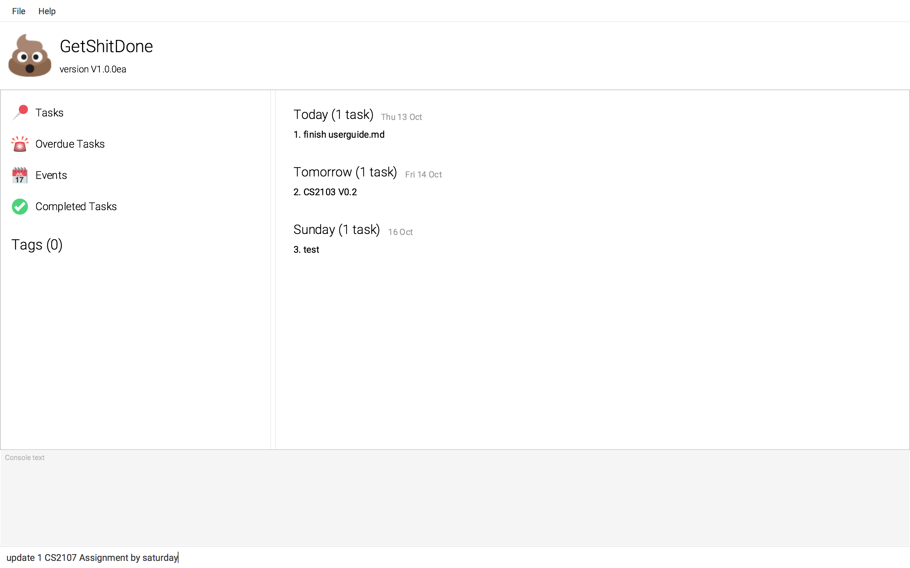
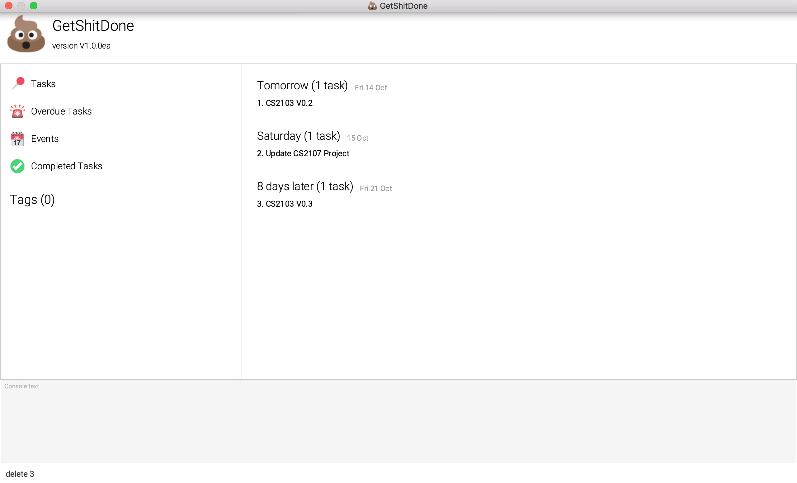
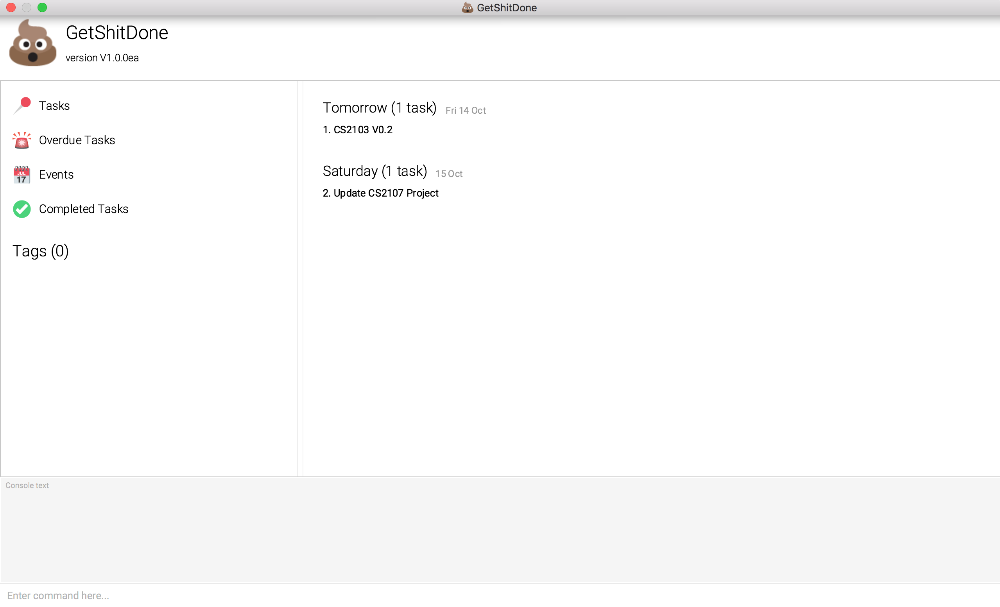

# User Guide

This product is not meant for end-users and therefore there is no user-friendly installer. 
Please refer to the [Setting up](DeveloperGuide.md#setting-up) section to learn how to set up the project.

## Contents

* [Starting the Program](#starting-the-program)
* [Features](#features)
* [FAQ](#faq)
* [Command Summary](#command-summary)

## Starting the Program

1. Find the project in the `Project Explorer` or `Package Explorer` (usually located at the left side)
2. Right click on the project
3. Click `Run As` > `Java Application` and choose the `Main` class.
4. The GUI should appear in a few seconds.

## Features

> **Command Format**
> * Words in `UPPER_CASE` are the parameters.
> * Items in `SQUARE_BRACKETS` are optional.
> * Items with `...` after them can have multiple instances.
> * The order of optional parameters are flexible.

#### Viewing help : `help`
Shows a list of all commands in GetShitDone.  
Format: `help`

Examples:

* `help`  
  Shows all available commands and examples 
  

> Help is also shown if you enter an incorrect command e.g. `abcd`
 
#### Adding a task/event: `add`
Adds a task/event to GetShitDone  
Format: `add [event] NAME [by/on deadline] [t/TAG]...` 

> *Note:* An **event** is a special kind of **task**. It does not have any deadlines, but instead it has start and end dates.
 
> * Tasks/events can either have a start (and optional end date), OR a deadline, OR neither, but not both.
>   * If start date is included without an end date, the end date will default to the start date.
>   * If both start/end date and deadline are provided, the application will display an error.
>   * Date formats can be flexible. The application is able to parse commonly-used human-readable date formats.
>     * e.g. `1 Oct`, `Monday`, `next wed`, `tomorrow`, etc.
> * Dates can include time as well.
>   * If only time is specified, it will default to today's date, or if a start date is provided, it will default to that of the start date. 
>   * If time is not specified, it will default to 00:00 of the particular date.
>   * Time formats are flexible as well. The application supports 24 hour format and AM/PM format.
>     * e.g. `Monday 3pm`, `today 1930`, `5:30pm`, `10.00 am`
> * Tasks can have any number of tags (including 0).
>   * To add multiple tags, use `t/TAG` successively. e.g. `t/Tag 1 t/Tag 2`

Examples: 

 * `add CS2103 Project`
 * `add event CS2103 Workshop on Wednesday`  
 
 

 * `add CS2103 V0.3 by next Friday`
 
 

#### Listing all tasks : `list`
Shows a list of all tasks in GetShitDone. Able to filter by type of task (task/event), or based on completed or not.  
Format: `list [TYPE]`

> Valid parameters: 
> * `events` / `event` (has start/end date)
> * `tasks` / `task` (has optional deadline)
> * `complete` / `completed`
> * `incomplete`

Examples:

* `list`  
 >  Lists all tasks and events.
  
  
* `list events`  
>   Lists all events.

*  `list complete task`
   > List all completed tasks

#### Finding all tasks containing any keyword in their name & tag: `find`

Finds tasks whose name and tags contain any of the given keywords.  
Format: `find KEYWORD [MORE_KEYWORDS]...`

> The search is not case sensitive, the order of the keywords does not matter, only the task name is searched,  and tasks matching at least one keyword will be returned (i.e. `OR` search).  
> Wildcards can be used, e.g. `a*` will return the tasks `Assignment 1` and `Dinner and Dance`.

Examples: 

* `find assignment2`  
Returns `Assignment2` & `assignment2`
  
* `find assginment2 project`  
Returns any tasks having names or tag containing `assignment2`, `Assignment2`,  `project`, `Project`

#### Editing a task : `update`

Edits the specified task from GetShitDone.
Format: `update INDEX [NAME] [s/START_DATE] [e/END_DATE] [d/DEADLINE] [t/TAG]..`

> Edits the task at the specified `INDEX`. The index refers to the index number shown in the most recent listing.

Examples: 

* `update 1 CS2107 Project by saturday`  
  Update the 1st task's name to CS2107 Project and change the deadline to Saturday   
  
  

#### Deleting a task : `delete`

Deletes the specified task from GetShitDone. Requires confirmation from the user to prevent unintentional deletes.
Format: `delete INDEX`

> Deletes the task at the specified `INDEX`. 
  The index refers to the index number shown in the most recent listing.

Examples: 

* `delete 3`
  Deletes the 3rd task in GetShitDone.

* `find assignment2`  
  `delete 1`  
  Deletes the 1st task in the results of the `find` command.

#### Clearing the Database : `clear`

Clear tasks/events by specific instruction from GetShitDone. Requires confirmation from the user to prevent unintentional deletes.
Format: `clear [event/task] [date]`

> Clear the task or events at the specified `date`. 

Examples: 

* `clear task`
  Clear all  tasks in GetShitDone.

* `clear event to yesterday`  
  Clear all events up to yesterday [inclusive].

#### Removing a tag : `untag`

Removes the specified tag of the task. 
Format: `untag INDEX TAG_NAME`

> Removes the tag for the task at the specified `INDEX`. 
  The index refers to the index number shown in the most recent listing.

Examples: 

* `list`  
  `untag 2 CS2103`  
  Untag the tag of `CS2103` of the 2nd task in GetShitDone.

* `find assignment2`  
  `untag 1 CS2103`  
  Untag the tag of `CS2103` of the 1st task in the results of the `find` command.

#### Remove Tag : `removeTag`  

Removes the specified tag of the task. 
Format: `removetag TAG_NAME`

> Removes all the tasks that is tagged with `TAG_NAME`.

Examples: 

* `removeTag CS2103`    
  Deletes all the tasks that are tagged with `CS2103` **the application**.

#### Completing a task : `complete`

> **Depend on how we implement this command. We could have a hidden tag from user that it is completed, so we could implement list command to display those without the tag. (TBC)**

Completes the specified task from GetShitDone.
Format: `complete INDEX`

> completes the task at the specified `INDEX`. 
  The index refers to the index number shown in the most recent listing.

Examples: 

* `list `  
  `complete 2`  
  Completes the 2nd task in GetShitDone.

* `find assignment2`  
  `complete 1`  
  Completes the 1st task in the results of the `find` command.

#### Uncompleting a task : `uncomplete`

> **Depend on how we implement this command. We could have a hidden tag from user that it is completed, so we could implement list command to display those without the tag. (TBC)**

Uncompletes the specified task from GetShitDone.
Format: `uncomplete INDEX`

> uncompletes the task at the specified `INDEX`. 
  The index refers to the index number shown in the most recent listing.

Examples: 

* `list`  
  `uncomplete 2`  
  Uncompletes the 2nd task in GetShitDone.

* `find assignment2`  
  `uncomplete 1`  
  Uncompletes the 1st task in the results of the `find` command.

#### Sorting : `sort`

Sorts tasks based on start date, end date, deadline

**To be filled**

#### Aliasing: `alias`

Adds aliases for existing commands. *For advanced users.*  
Format: `alias [EXISTING_COMMAND] [NEW_ALIAS]`

Examples:
* `alias find f`  
  `f Irvin`
  Aliases `find` to `f`, and subsequently `f` can be used to `find` tasks.

#### Unaliasing: `unalias`

Removes existing aliases. *For advanced users.*  
Format: `unalias [ALIAS]`

Examples:
* `unalias f`
  Removes the alias for `f`.

#### View **non-private** details of a task : `view`
Displays the **non-private** details of the specified task.  
Format: `view INDEX`

> Views the task at the specified `INDEX`. 
  The index refers to the index number shown in the most recent listing.

Examples: 

* `list`  
  `view 2`  
Views the 2nd task in the the application  
  
* `find Betsy`  
  `view 1`
  Views the 1st task in the results of the `find` command.

#### Undo tasks : `undo`
Undo commands in **the application**.  
Format: `undo [COUNT]`

> Performs undo repeatedly based on the specified `COUNT`. 
  
Examples: 

* `undo`  
  Undo to the previous state of **the application**.
  
* `undo 2`  
  Undo twice to the state of **the application**.

#### Redo tasks : `redo`
Redo commands in **the application**.  
Format: `redo [COUNT]`

> Performs redos based on the specified `COUNT`. 
  
Examples: 

* `undo`  
  Undo to the previous state of **the application**.
  
* `undo 2`  
  Undo twice to the state of **the application**.

#### View themes : `theme`

View all themes supported by the application. 
Format: `theme`  

#### Changing a theme : `changetheme`

Change the theme of GetShitDone.  
Format: `changetheme INDEX`

> Change the theme at the specified `INDEX`. 
  The index refers to the index number shown in the theme command.

Examples: 

* `theme`  
`changetheme 2`  
Changes to the 2nd theme provided in GetShitDone.

#### Exiting the program : `exit`
Exits the program.  
Format: `exit`  

#### Saving of data
The application data are saved in the hard disk automatically after any command that changes the data.  
There is no need to save manually.

#### Changing the save location (TBU)
The application data are saved in a file called `addressbook.json` in the project root folder.
You can change the location by specifying the file path as a program argument. 

> The file name must end in `.json` for it to be acceptable to the program.
>
> When running the program inside Eclipse, you can [set command line parameters before running the program](http://stackoverflow.com/questions/7574543/how-to-pass-console-arguments-to-application-in-eclipse).

## FAQ

**Q**: How do I transfer my data to another computer? 
**A**: Install the app in the other computer, and replace `saved_tasks.json` from the root of the application directory.

## Command Summary

**Standard Actions** 

Command | Format  
-------- | :-------- 
Add | `add NAME [s/START_DATE [e/END_DATE]] [d/DEADLINE] [t/TAG]...`
Complete | `complete INDEX`
Uncomplete | `uncomplete INDEX`
Help | `help`

**Viewing** 

Command | Format  
-------- | :-------- 
List | `list [TYPE]`
Find | `find KEYWORD [MORE_KEYWORDS]...`

**Editing** 

Command | Format  
-------- | :-------- 
Update | `update INDEX [s/START_DATE] [e/END_DATE] [d/DEADLINE] [t/TAG]...`
Delete | `delete INDEX`
Remove Tag | `removetag INDEX TAG_NAME`
Undo | `undo [COUNT]`
Redo | `redo [COUNT]`

**Advanced Actions** 

Command | Format  
-------- | :-------- 
Show themes | `theme`
Change theme | `changetheme`
Add alias | `alias`
Remove alias | `unalias`
