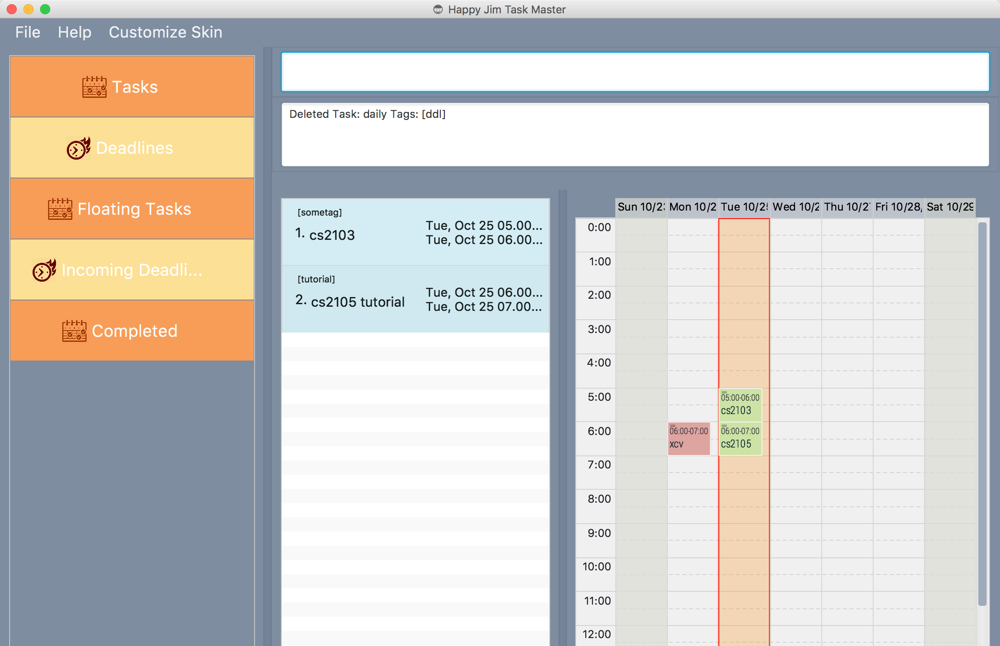
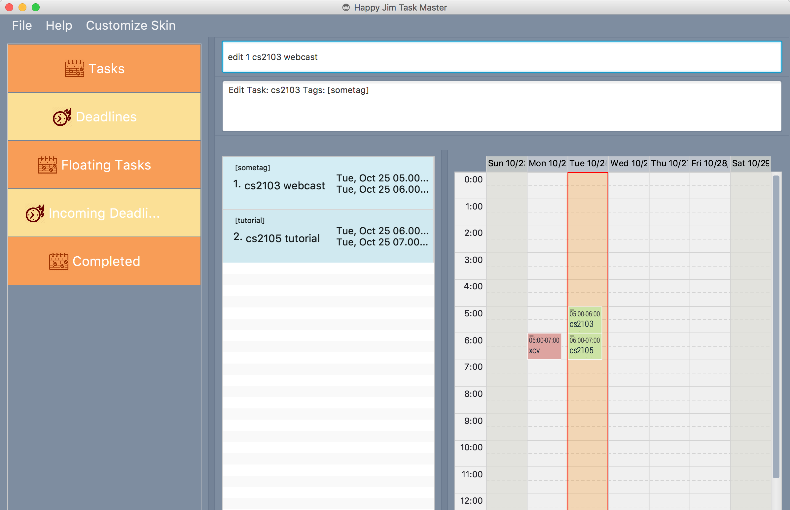
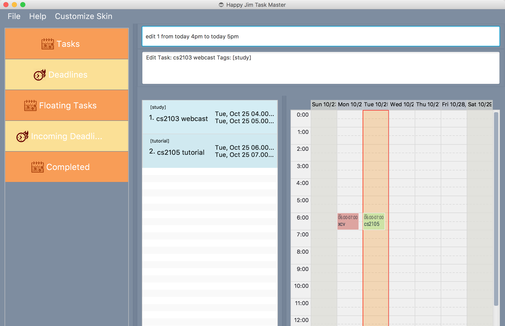
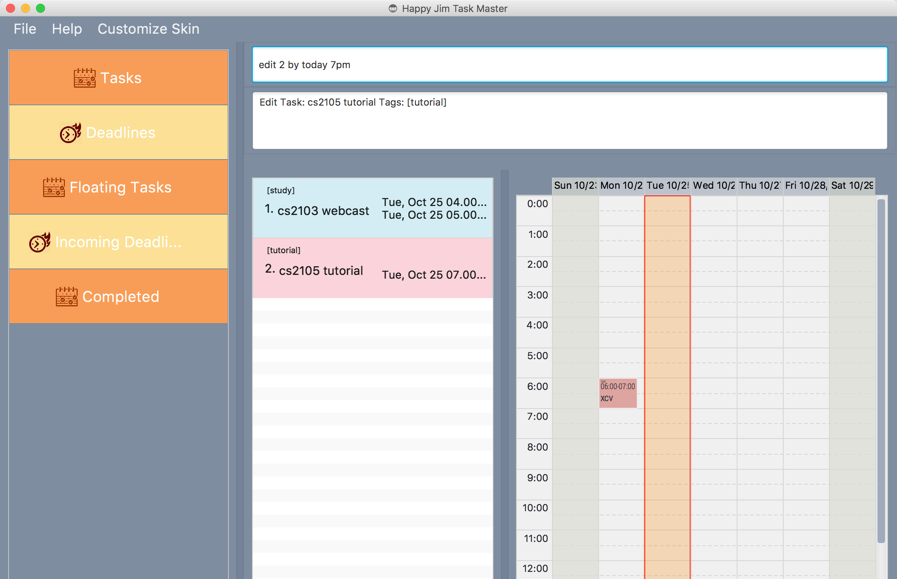
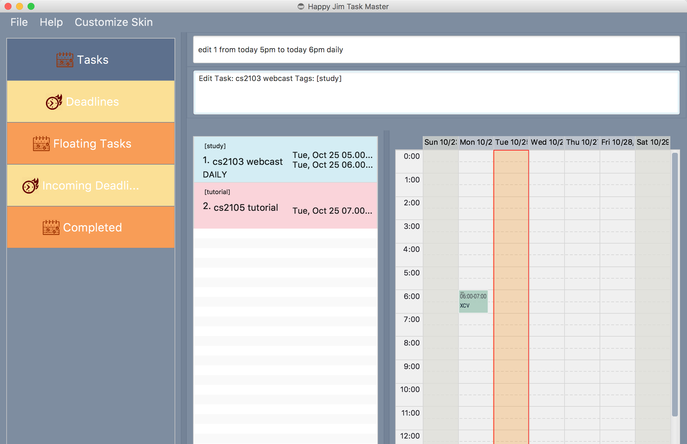
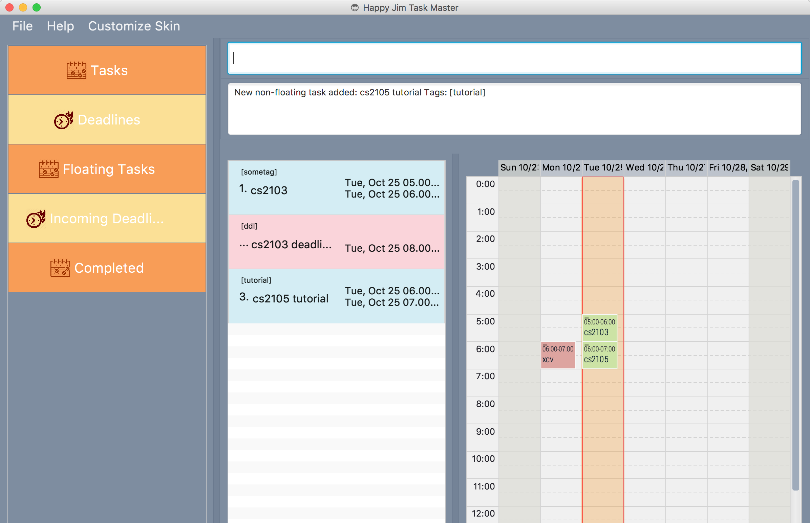
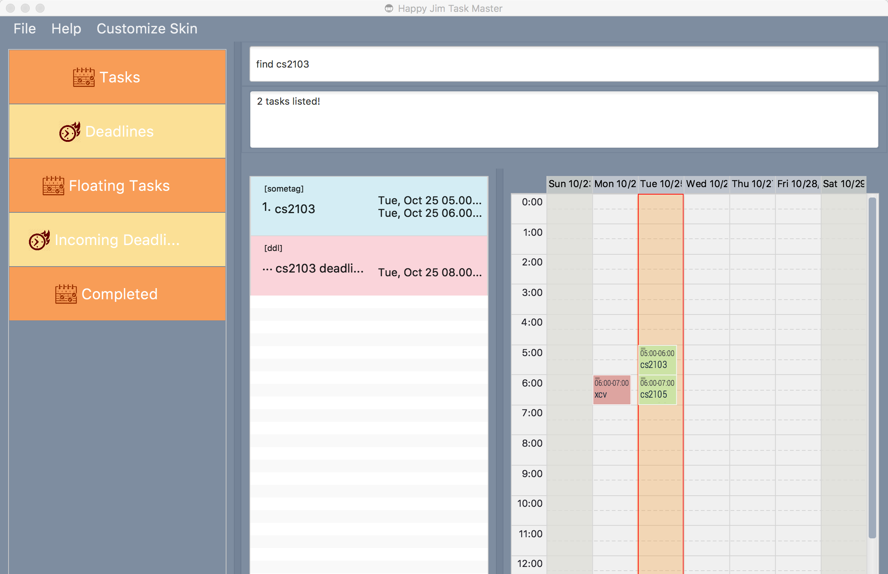
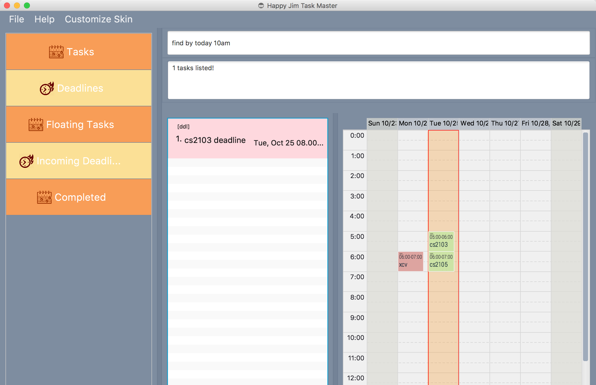
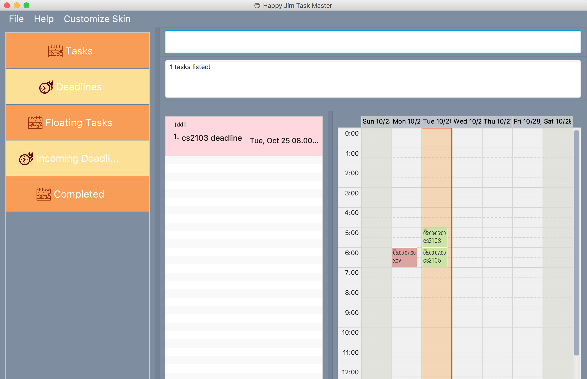

# User Guide

* [Quick Start](#quick-start)
* [Features](#features)
* [FAQ](#faq)
* [Command Summary](#command-summary)

## Quick Start

0. Ensure you have Java version `1.8.0_60` or later installed in your Computer. 
   > Having any Java 8 version is not enough.  
   This app will not work with earlier versions of Java 8.
   
1. Download the latest `happyjimtaskmanager.jar` from the [releases](../../../releases) tab.
2. Copy the file to the folder you want to use as the home folder for your Address Book.
3. Double-click the file to start the app. The GUI should appear in a few seconds. 
   > 

4. Type the command in the command box and press <kbd>Enter</kbd> to execute it.  
   e.g. typing **`help`** and pressing <kbd>Enter</kbd> will open the help window. 
5. Some example commands you can try:
   * **`view`** : View floating task of the day
   * **`add`**` Homework by 24 sep 6pm : 
     adds a task named `Homework` to the Task Master .
   * **`delete`**` 212` : deletes the task with ID 212 shown in the current list
   * **`exit`** : exits the app
6. Refer to the [Features](#features) section below for details of each command. 

## Features

> **Command Format**
> * Words in `UPPER_CASE` are the parameters.
> * Items in `SQUARE_BRACKETS` are optional.
> * Items with `...` after them can have multiple instances.
> * The order of parameters is fixed.

#### Viewing help : `help`
Format: `help`

> Help is also shown if you enter an incorrect command e.g. `abcd`

Example:
* `help` 
 
#### Adding a floating task: `add`
Adds a task to the todo list 
Format:`add TASK_NAME [t/TAG]...` 

> Words in `UPPER_CASE` are the parameters, items in `SQUARE_BRACKETS` are optional, 
> items with `...` after them can have multiple instances. Order of parameters are fixed. 
>  
> Tasks can have any number of tags (including 0)

Examples:  
* `add Homework` 
* `add Homework tag/CS1231`

<<<<<<< HEAD
#### Adding a task with deadline: “add”
=======
#### Adding a task with deadline: `add`
>>>>>>> 0c59181a2dbd91c468c733feaeadad2873ae129c
Format: `add TASK_NAME by DATE TIME [RECURRING_TYPE] [t/TAG]...`

> Words in `UPPER_CASE` are the parameters, items in `SQUARE_BRACKETS` are optional, 
> items with `...` after them can have multiple instances. Order of parameters are fixed. 
>  
> `RECURRING_TYPE` consists of daily, weekly, monthly and yearly. 
> Tasks can have only 1 `RECURRING_TYPE`.
> Tasks can have any number of tags (including 0).

Examples:
* `add Homework by 24 sep 8pm tag/CS1231`
* `add Homework by 24 sep 6pm daily tag/CS1231`

<<<<<<< HEAD
#### Adding a task with start time and end time: “add”
Format: `add TASK_NAME from DATE TIME to DATE TIME [RECURRING_TYPE] [tag/TAG]`
=======
#### Adding a task with start time and end time: `add`
Format: `add TASK_NAME from DATE TIME to DATE TIME [RECURRING_TYPE] [t/TAG]...`
>>>>>>> 0c59181a2dbd91c468c733feaeadad2873ae129c

> Words in `UPPER_CASE` are the parameters, items in `SQUARE_BRACKETS` are optional, 
> items with `...` after them can have multiple instances. Order of parameters are fixed. 
>  
> `RECURRING_TYPE` consists of daily, weekly, monthly and yearly. 
> Tasks can have only 1 `RECURRING_TYPE`.
> Tasks can have any number of tags (including 0).

Examples:
* `add Homework from 24 sep 8pm to 25 sep 9pm tag/CS1231`
* `add Homework start/24 sep 9pm end/25 sep 7pm daily tag/CS1231`

<<<<<<< HEAD
#### View floating task of the day : “view”
=======
#### View floating task of the day : `view`
>>>>>>> 0c59181a2dbd91c468c733feaeadad2873ae129c
Format: view /OPTION

> Words in `UPPER_CASE` are the parameters, items in `SQUARE_BRACKETS` are optional, 
> OPTION currently supports f : floating

Examples: 
* `view /f`

<<<<<<< HEAD
#### View non-floating task of the day : “view”
=======
#### View non-floating task of the day : `view`
>>>>>>> 0c59181a2dbd91c468c733feaeadad2873ae129c
Format: view date/DATE

> Words in `UPPER_CASE` are the parameters, items in `SQUARE_BRACKETS` are optional,

Examples: 
* `view date/2409`
* `view date/24sep`

#### Edit tasks : `edit`
Format: `edit TASK_ID [NEW_TASK_NAME] [from DATE_TIME to DATE_TIME | by DATE_TIME [daily | weekly | monthly | yearly] ] [tag/EDIT_TAG]...`

> Every field in edit is optional. After you specify the task that you are going to edit,
> you are able to change its name, date time and tag.
> For editing date time of a task, you have the following restrictions:
> 1. You cannot change a non-floating task to a floating task
> 2. You cannot directly change recurring type of a task (need to specify time first).

Examples: 
* `edit 1 cs2103 webcast`
	
	
* `edit 1 t/study`
	
* `edit 1 from today 4pm to today 5pm`
	
* `edit 2 by today 7pm`
	
* `edit 1 from today 4pm to today 5pm daily`
	

<<<<<<< HEAD
#### Delete tasks : “delete”
=======
#### Delete tasks : `delete`
>>>>>>> 0c59181a2dbd91c468c733feaeadad2873ae129c
Format: delete TASK_ID

> Words in `UPPER_CASE` are the parameters, items in `SQUARE_BRACKETS` are optional, 

Examples:
* `Delete 212`

<<<<<<< HEAD
#### Archive completed tasks : “done”
=======
#### Archive completed tasks : `done`
>>>>>>> 0c59181a2dbd91c468c733feaeadad2873ae129c
Format: done TASK_ID

> Words in `UPPER_CASE` are the parameters, items in `SQUARE_BRACKETS` are optional, 

Examples:
* `done 1`

   
   
   
   >Completed tasks can be viewed from navigation bar on the side.

<<<<<<< HEAD
#### Block out timeslot : “block”
=======
#### Block out timeslot : `block`
>>>>>>> 0c59181a2dbd91c468c733feaeadad2873ae129c
Format: block from [START_DATE] START_TIME to [START_DATE] START_TIME [t/TAG]

> Words in `UPPER_CASE` are the parameters, items in `SQUARE_BRACKETS` are optional, 

Examples:
* `block from today 8pm to today 9pm`

 > 
 > 

<<<<<<< HEAD
#### Undo tasks : “undo”
=======
#### Undo tasks : `undo`
>>>>>>> 0c59181a2dbd91c468c733feaeadad2873ae129c
Format: u

> Maximum 3 undo

Examples: 
* `u`

   
   
   

<<<<<<< HEAD
#### Redo tasks : “redo”
=======
#### Redo tasks : `redo`
>>>>>>> 0c59181a2dbd91c468c733feaeadad2873ae129c
Format: r

> Maximum 3 redo

Examples: 
* `r`

   
   

#### Find tasks : `find`
Format: `find [KEY_WORD] [from DATE_TIME to DATE_TIME | by DATE_TIME] [t/TAG]...`

> For find command, all parameters optional.
> You are able to search by key words of a particular task,
> or search by a particular time period, search by deadline,
> or search by particular tags.
> (You can have more than one tags to search)

Examples:  
* `find cs2103  `
	
	
* `find from today 5am to today 6am  `
	
* `find by today 10am`
	
* `find cs2103 tag/lolo`
	
	
<<<<<<< HEAD
#### Undo tasks : “clear”
=======
#### Undo tasks : `clear`
>>>>>>> 0c59181a2dbd91c468c733feaeadad2873ae129c
Format: clear

> clears all the tasks

Examples: 
* `clear`

<<<<<<< HEAD
#### Change directory: “Change directory”
=======
#### Change directory: `cd`
>>>>>>> 0c59181a2dbd91c468c733feaeadad2873ae129c
Format: cd FILE_PATH

> Words in `UPPER_CASE` are the parameters, items in `SQUARE_BRACKETS` are optional,

Examples: 
* `cd data\newlist.xml`

   
   

#### Exiting the program : `exit`
Exits the program. 
Format: `exit`  

## FAQ

**Q**: How do I transfer my data to another Computer? 
**A**: Install the app in the other computer and overwrite the empty data file it creates with 
       the file that contains the data of your previous Address Book folder.

**Q**: How do i get started using the task manager? 
**A**: Type 'help' or any incorrect command will bring you to the help screen.
       
## Command Summary

Command | Format  
-------- | :-------- 
Add | `add TASK_NAME [t/TAG]...`
Add | `add TASK_NAME by DATE TIME [RECURRING_TYPE] [t/TAG]...`
Add | `add TASK_NAME from DATE TIME to DATE TIME [RECURRING_TYPE] [t/TAG]...`
Edit | `edit TASK_ID [from EDIT_START_DATE EDIT_START_TIME to EDIT_END_DATE EDIT_END_TIME] [by EDIT_END_DATE EDIT_END_TIME] [t/EDIT_TAG]...`
Delete | `delete TASK_ID`
Complete | `done TASK_ID`
Block | `block TASK_NAME from [START_DATE] START_TIME to [START_DATE] START_TIME [t/TAG]...`
Redo | `r`
Undo | `u`
Find | `find [KEY_WORD] [from DATE_TIME to DATE_TIME | by DATE_TIME] [t/TAG]...`
Clear | `clear`
Change directory | `cd FILE_PATH`
Exit | `exit`
