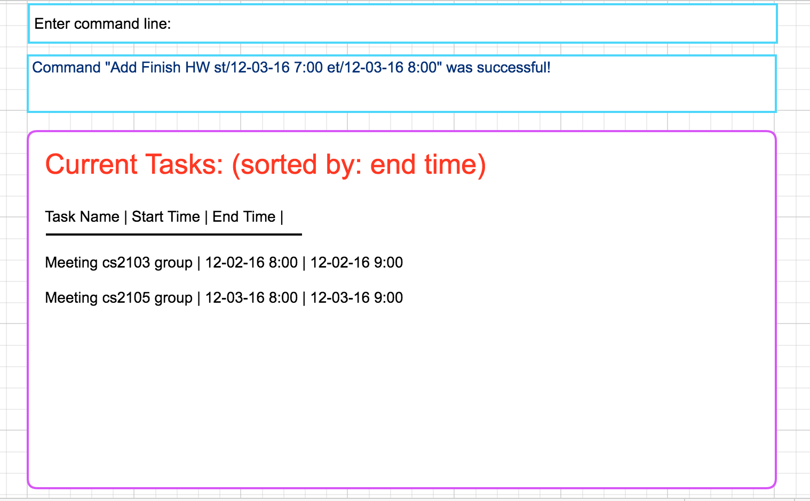

# User Guide

* [Quick Start](#quick-start)
* [Features](#features)
* [FAQ](#faq)
* [Command Summary](#command-summary)

## Quick Start

0. Ensure you have Java version `1.8.0_60` or later installed in your Computer. 
> Having any Java 8 version is not enough.  
This app will not work with earlier versions of Java 8.

1. Download the latest `addressbook.jar` from the [releases](../../../releases) tab.
2. Copy the file to the folder you want to use as the home folder for your Address Book.
3. Double-click the file to start the app. The GUI should appear in a few seconds. 
> 

4. Type the command in the command box and press <kbd>Enter</kbd> to execute it.  
e.g. typing **`help`** and pressing <kbd>Enter</kbd> will open the help window. 
5. Some example commands you can try:
* **`list`** : lists all tasks
* **`add`**` `add Do Homework d/ 19/02/12 t/13:43 n/ cs2103 homework` : 
adds a task named `Do Homework` to the Task List.
* **`delete`**` 3` : deletes the 3rd task shown in the task list
* **`exit`** : exits the app
6. Refer to the [Features](#features) section below for details of each command. 

Synchronization capability to other task management sites (ex: Google calendar)
Back-up data that can be used to recover if original copy gets deleted
Able to migrate all items into .txt file

## FAQ

**Q**: How do I transfer my data to another Computer? 
**A**: Install the app in the other computer and overwrite the empty data file it creates with 
the file that contains the data of your previous Address Book folder.

## Command Summary

Command | Format  
-------- | :-------- 
Add | `add NAME d/DATE t/TIME n/NOTE...`
Clear | `clear`
Delete | `delete INDEX`
Find | `find KEYWORD [MORE_KEYWORDS]`
List | `list`
Help | `help`
Edit | `INDEX tn/TASK_NAME d/DATE t/TIME n/NOTE r/REMINDER`
Sort | `sort`
Upcoming | `upcoming`
Group | `group GROUP_NAME [INDEX_DELIMITED_BY_COMMAS]`

