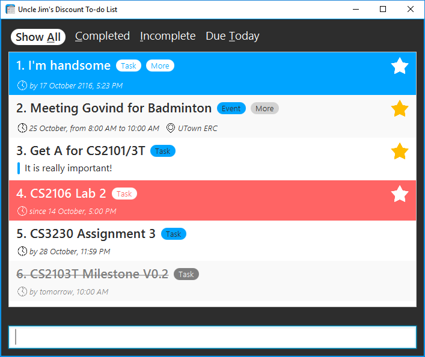
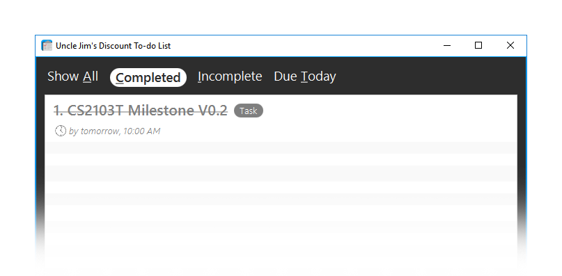
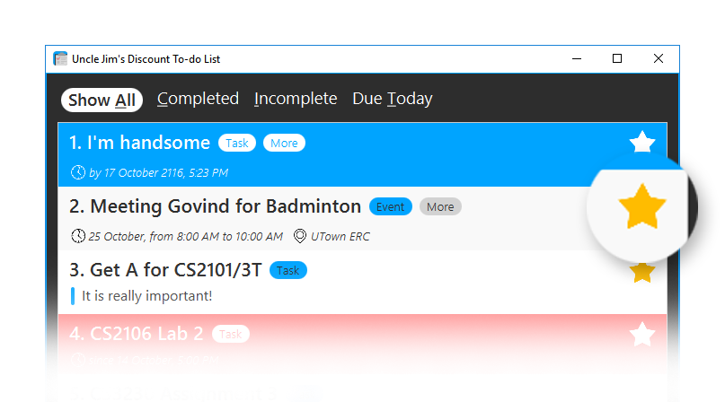

[TOC]

## Introduction

In today's hectic society, our lives feel like a never-ending procession of tasks, deadlines, events and anniversaries to keep up with. Tracking these daily activities on a to-do list can be daunting. Many task management applications today have too many buttons that you have to click through just to add a task, and user interfaces that are so cumbersome it is hard for you to make it a habit to use.

Ever wished for a tool that can manage all your daily activities in distinct categories, and suggest to you which one you want to complete first? Well, look no further as Uncle Jim's Discount To-do List is here to save your day.

Uncle Jim's Discount To-do List (Uncle Jim in short) is a revolutionary mouse-free personal task manager that helps you to keep track of your daily activities through the power of your keyboard. Gone are the days when you had to click through several pages of menus just to add a simple task to your schedule. Our command line interface is not only flexible but remarkably easy to use. Just type the command and hit enter!

Moreover, we know that you understand your activities better. So Uncle Jim allows you to create your very own categories to organise your activities. Uncle Jim is also capable of managing both tasks *and* event so you don't have to use two different applications to be productive. Our unique product will intelligently sieve out urgent deadlines and serve up reminders for you so you will no longer overlook another significant activity.

Sounds exciting? Then let's get started!

## Quick Start

1. Ensure you have [**Java version 8 update 60**][java]{: .print-url } or later installed on your computer.

    !!! warning "This application will not work with earlier versions of Java 8"

2. Download the latest copy of `UJDTDL.jar` from our [releases][releases]{: .print-url } page.
3. Save the file to the folder you want to use for this application.
4. Double-click the file to start the application. You should see something like this

     <figcaption>Initial launch screen of Uncle Jim</figcaption>

5. Type in the command box and press <kbd>Enter</kbd> to execute it. 
6. Here are some example commands you can try:

     * **`add`**` Finish CS2103T homework /d next Friday` - 
       adds a new task with the deadline set at next Friday
     * **`delete`**` 3` - deletes the 3rd task shown in the current list
     * **`exit`** - exits the app
     
7. Refer to the [commands reference](#commands-reference) section below for details of each command.

## Command Reference

You can refer to the section below for the full list of commands that are available in Uncle Jim. For quick reference you can also refer to the [command summary](#command-summary) at the end of this guide or use the `help` command when using the app.   

### Notes regarding command format

* Words in `UPPERCASE` are the parameters.
* Items in `[SQUARE BRACKETS]` are optional.
* To specify parameters, such as the deadline for a task, use flags. Flags follow the Unix command format - single dash (eg. `/f`) for short flags and double dash for long flags (eg. `--all`)
* Items with `...` within each parameter means you can add more items within the same parameters than specified.
* Most commands that refer to a particular task or event in the list require an `INDEX`. This is a number indicated on the left of a task or event as shown in the screenshot below:

<figcaption>Use the number on the side to choose the task for your command</figcaption>

### Entering in dates 

Uncle Jim supports flexible date formats so you can enter dates in the formats specified below:

* **Formal dates**

    Dates in a standard numerical form such as DDMMYYYY or DD/MM/YY. 
  
    !!! example 
        1978-01-28  
        29/10/94

* **Relaxed dates**

   It is not always necessary write it in full formal date formats, Uncle Jim allows relaxed date formats as well. If you don't include the full date we will use the current month or year 
  
    !!! example 
        Oct 12 9pm
        9 May
  

* **Relative dates**

    We also understand days of the week and even relative date and time. 

    !!! example
        next Thursday  
        tomorrow evening  
        in two days

!!! note If no time is specified when entering a date, Uncle Jim will use the current time by default 

### Viewing help : **`help`**

Format: **`help`**

Help allows you to have a quick reference of the commands in case you forgot the format to follow.  
 
### Adding a task or event: **`add`**

Format:  
**`add`**` TASK NAME [/d DEADLINE] [/m DESCRIPTION] [/p] [/t TAG 1, TAG 2...]`  
**`add`**` EVENT NAME /d START END [/m DESCRIPTION] [/l LOCATION] [/p] [/t TAG 1, TAG 2...]`

You can add new tasks or events to the To-do List using the `add` command.  

Although the list of parameters above looks intimidating, all of them except the name of the task are optional. Tasks will be turned into events automatically if there are two dates specified under the `/d` flag. 

Here are some common scenarios where you would use the various parameters:

#### Adding a task

You can add a task by simply giving a name.

!!! example
    **`add`**` Finish up developer guide for CS2101` 

#### Adding an event

You can add events by specifying a start time and end time with the `/d` flag. Event locations can be specified by adding them with the `/l` flag.  

!!! example
    **`add`**` Music at the park /d 11 Dec 6pm to 8pm /l Botanic Gardens /p`

#### Adding a deadline

If you need something done by a specific time, add a deadline to your task by specifying a single date and time with the `/d` flag.

!!! example
    **`add`**` Submit V.0.0 /d 5 Oct 2359`

#### Adding descriptions to a task

If you need to add more details to a task, you can add them under the `/m` flag. Note that these descriptions will be hidden from default view, once the task is added. To learn how to see these details again refer to [the `show` command](#showing-details-of-a-task-show).

!!! example
    **`add`**` Destroy the Earth /m Going to need a lot of TNT for this. Remember to get them at sale on Friday - 50% discount on bulk orders!`

#### Pinning a task

Have task you don't want to forget? These types of tasks or events can be pinned to the top of the list using the `/p` flag. See [the `pin` command](#pinning-a-task-pin) for more details.

!!! example
    **`add`**` Meet Li Kai at Friday Hacks! /d 21 Oct 6pm to 8pm /p`

#### Organizing tasks using tags

If you have a lot of tasks you can use tags to organize them. See [the `tag` command](#manage-tags-tag) for more detail.

!!! example
    **`add`**` Finish tutorial 6 /d 10 Oct /t CS2106, School`

#### Parameter reference

Flag | Parameter        | Used to
-----| ---------------- | ----------------------
`/d` | `DEADLINE`       | Specify a deadline for the task
`/d` | `START END`      | Specify the start and end time for the event
`/m` | `DESCRIPTION`    | Add a long description to the task or event
`/l` | `LOCATION`       | Add a location to the event 
`/p` | -                | Pins the task to the top of the list
`/t` | `TAG 1, TAG 2, ...` | Tags to help organize your tasks 

### Deleting a task: **`delete`**

Format: **`delete`**` INDEX`

This allows you to delete the task specified by the `INDEX` parameter. The index refers to the index number shown in the current view.

!!! note
    If you accidentally deleted the wrong task, not to worry! You can undo the action later on. See the [undo](#undoing-an-action-undo)

!!! example
    
    **`delete`**` 2`  
    :    Deletes the 2nd task on the list 
      
    **`find`**` Y2S1`  
    **`delete`**` 1`  
    :    Deletes the 1st task in the results of the **`find`**` Y2S1` command.

### Marking a task complete: **`complete`**

Format:  
**`complete`**` INDEX`  
**`complete`**` --all`

After finishing a task, you can mark it complete by specifying the index of the task you wish to mark complete in the `INDEX` parameter. Completed tasks have their title struckthrough. 

If you wish to mark a batch of task in the current view as complete, you can use the `--all` flag to mark them all as complete. 

Note that this is a toggle command, so if `INDEX` specified is an 

<figcaption>Enjoy the satisfaction of marking completed tasks</figcaption>

### Pinning a task: **`pin`**

Format: **`pin`**` INDEX`

If a particular task or event is important, you can pin it to the top of every list the item appears in using this command. You can also use this command to unpin any pinned task. 

<figcaption>Prioritize important tasks with pinned tasks.</figcaption>

### Editing a task: **`edit`**

Format:  
**`edit`**` INDEX [NAME] [/d DEADLINE] [/m DESCRIPTION] [/r TIME] [/p]`  
**`edit`**` INDEX [NAME] [/d START END] [/m DESCRIPTION] [/l LOCATION] [/p]`

You can edit tasks or events using the `edit` command. This command accepts the same parameters as the `add` command with the addition of `INDEX`, which specifies which task or event you want to edit. 

Note that edits are automatically saved, and any errors can be undone using `undo`. 

### Manage tags: **`tag`** 

Add, edit and delete tags.  
Format:   
**`tag`**` INDEX TAG 1, TAG 2, ...`  
**`tag`**` INDEX /a NEW TAG, ...`  
**`tag`**` /e OLD NEW`  
**`tag`**` [INDEX] /d TAG`  

You can use tags to organize your tasks easily. Tags are case insensitive, and each task can have up to five of them. Use the `tag` command to add, edit or delete tags from one or all of the tasks. Here are the scenarios you would use each format of the `tag` command: 

#### Retagging a task 

You can replace the tags on a task with new ones using the `INDEX` with the list of new tags:

!!! example
    **`tag`**` 1 nus, cs2101, cs2103t` 
    :     Replace the tags on the first task with `nus`, `cs2101` and `cs2103t`

#### Adding tags to a task 

If you wish to add more tags to a task, use `/a`:

!!! example
    **`tag`**` 1 /a cs2103T`
    :    Adds the `cs2103T` tag to the first task on the list

#### Editing tags 

You can also rename tags using `/e`:

!!! example
    **`tag`**` /e Business Pleasure` 
    :    Renames the `Business` tag to `Pleasure` 
    

#### Deleting tags 

You can also remove a tag from either a single task, or all tasks at once with `/d`: 

!!! example
    **`tag`**` 1 /d important` 
    :    Removes the `important` tag from the first task  
    
    **`tag`**` /d important` 
    :    Removes the `important` tag from **all** tasks. Remember you can always `undo` if you make a mistake. 

!!! note "Keep it simple!"
    Tags are only really necessary if you have a *lot* of tasks. Uncle Jim works just as well even if you don't use tags. For maximum productivity, keep your tags short and simple, and keep them broad so that you can apply them to many tasks.
    
### Showing details of a task: **`show`**

  
Format: **`show`**` INDEX`

Descriptions of tasks and events are hidden by default. In order to display them, you can use this command to toggle between the expanded version of a task and its compact form.

### Switching views: **`view`**
  
Format: **`view`**` VIEW`

You can drill down into your To-do List and see specific tasks, such as your incomplete tasks or today's schedule, using the `view` command:

!!! example
    **`view`**` completed`
    :    Show completed tasks only 

<figcaption>Find important and soon overdue tasks</figcaption>

You can also use the underlined character in the view's name as the shortcut when switching views. 

!!! example
    **`view`**`i`
    :    Show incomplete tasks only, since `i` is the underlined character as shown in the image above. 

### Finding tasks: **`find`**

Format: **`find`**` KEYWORD [MORE KEYWORDS]`

You can search for tasks using the `find` command. The search is case insensitive and the order of the keywords does not matter. Only the title and tags are searched, and any tasks matching at least one keyword will be returned.

!!! note 
    Keywords are separated by spaces, not comma

!!! example  
    **`find`**` John`  
    :    Returns **Meet John for lunch**
    
    **`find`**` Jo`  
    :    Returns any task with **Jo** in the title, such as **Meet John for lunch**, 
         **Jogging at the park**, or **Jousting fights at the gym**
    
    **`find`**` Jo Ja`  
    :    Returns any task with either **Jo** or **Ja** in the title, such as 
         **Meet John for lunch**, **Meet Jane for lunch**, or **Jack and Jane's wedding**

### Exiting the app: **`exit`**
  
Format: **`exit`**  

If you wish to exit the program, simply type `exit`.

### Undoing an action: **`undo`**

Format: **`undo`**

If you make any mistake, simply typing `undo` to undo your last action. 

!!! note
    Only applies to commands which have made changes to the To-do list like `add`, `edit` and `delete`

### Redoing an action: **`redo`**
  
Format: **`redo`**

Similar to the `undo` command, you can redo your most recent action that you revoked as well. 

### Loading an existing data file: **`load`**

Format: **`load`**` FILENAME`

You can use `load` to load another `.xml` file into the application. This can be used to restore a backup or switch to different lists. You can also use this to manage different To-do lists, such as having one for home and another for work.

!!! example

    **`load`**` myDiscountTodo.xml`

### Changing the save location: **`save`**

Format: **`save`**` [FILENAME]`

By default, to-do list data are saved in a file called `discountTodo.xml` in the `data` folder. You can change the save file by specifying the file path as the first argument when running the program, or by using the `save` command.
 
The `save` command will show you the location of the current save file if you use it without specifying a `FILENAME`. 

!!! note "Autosave"
    Your to-do list is saved automatically every time it is updated. There is no need to save manually after each edit. 

## FAQ

**Q**: Is my data secure?  
**A**: Your data is stored locally on your hard drive. So, your data is as secure as your hard drive. We do not have access to your to-do list. 

**Q**: How do I back up my data?  
**A**: As your data is saved to the file that you specified, you can simply copy this file to a back up storage of your choice.

**Q**: How do I sync my data with multiple devices?  
**A**: Simply load the file to a cloud sync service like Dropbox or Google Drive, and all updates will be reflected automatically to all devices using the file.

**Q**: How do I pay for this project?  
**A**: Donations can be made via PayPal or Kashmi. Cash donations are fine too. Basically if you wish to donate we will find a way for us to receive your money.

## Command Summary

Command  | Format  
-------- | :-------- 
Help     | **`help`**
Add      | **`add`**` NAME [/d DEADLINE or START END] [/m DESCRIPTION] [/p] [/t TAG 1, TAG 2...]` 
Delete   | **`delete`**` INDEX`
Complete | **`complete`**` INDEX` or `/all`
Pin      | **`pin`**` INDEX`
Show     | **`show`**` INDEX`
Edit     | **`edit`**` INDEX [NAME] [/d DEADLINE or START END] [/m DESCRIPTION] [/r TIME] [/p] [/t TAG 1, TAG 2...]`
Tag      | **`tag`**` INDEX TAG 1, [TAG 2...]` or `INDEX a/ NEW TAG` or `/e OLD NEW` or `[INDEX] /d TAG`
Find     | **`find`**` KEYWORD [MORE KEYWORDS...]`
Undo     | **`undo`**
Redo     | **`redo`**
Load     | **`load`**` FILENAME`
Save     | **`save`**` [FILENAME]`
View     | **`view`**` VIEW`

[java]: https://www.java.com/en/download/
[releases]: https://github.com/CS2103AUG2016-W10-C4/main/releases
