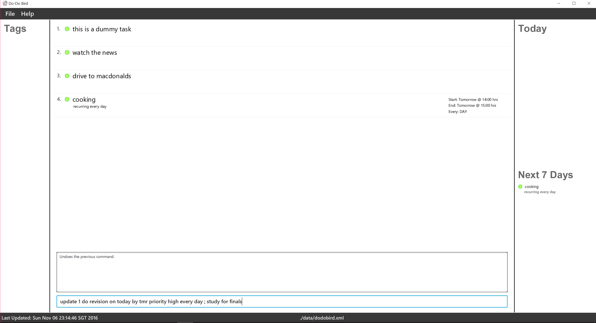
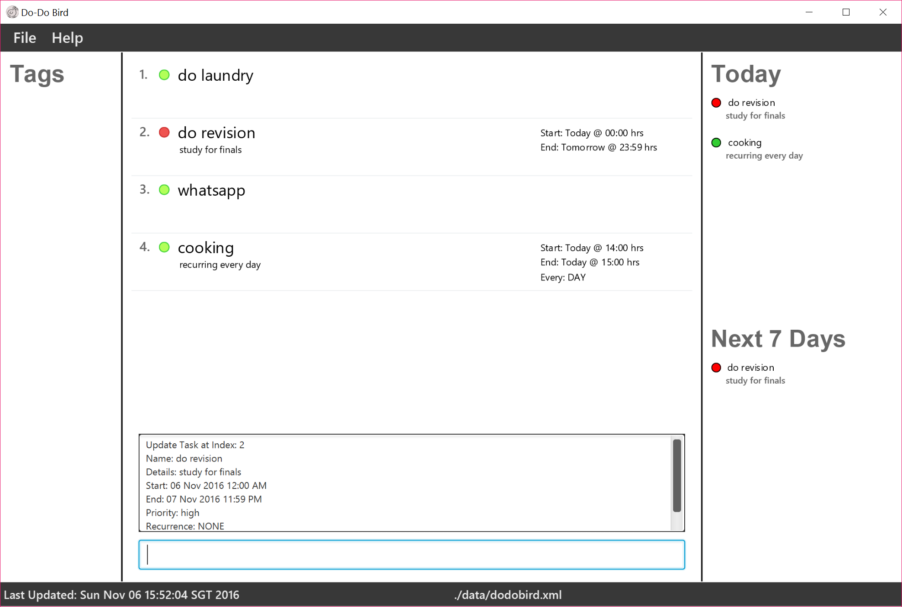
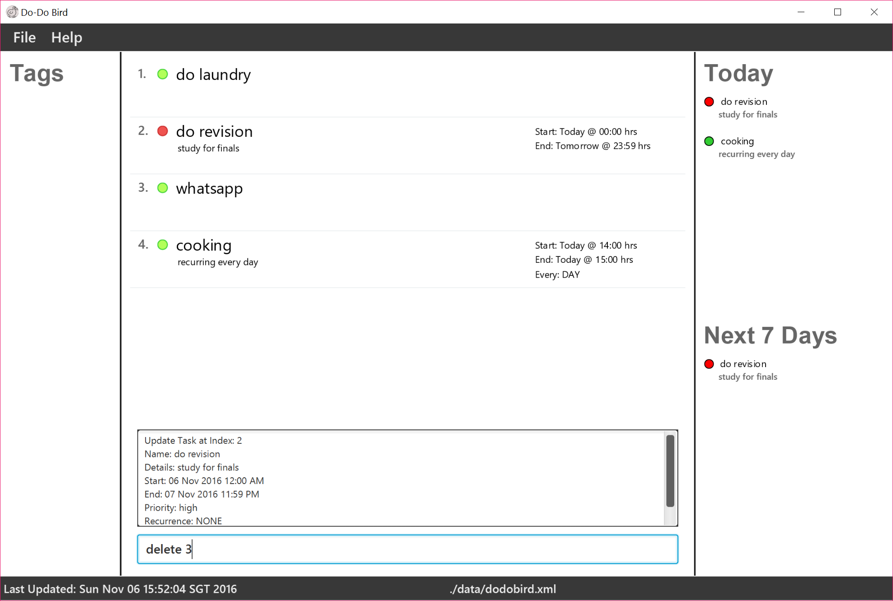
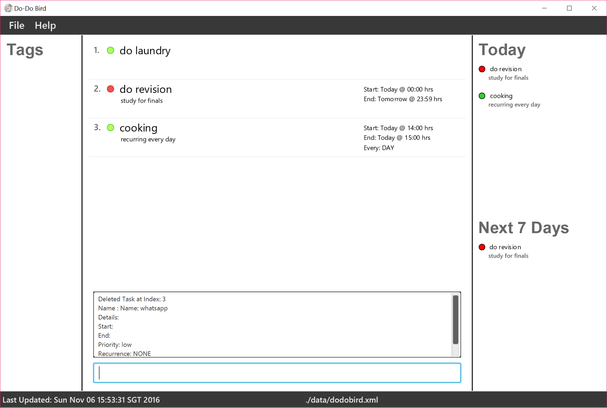
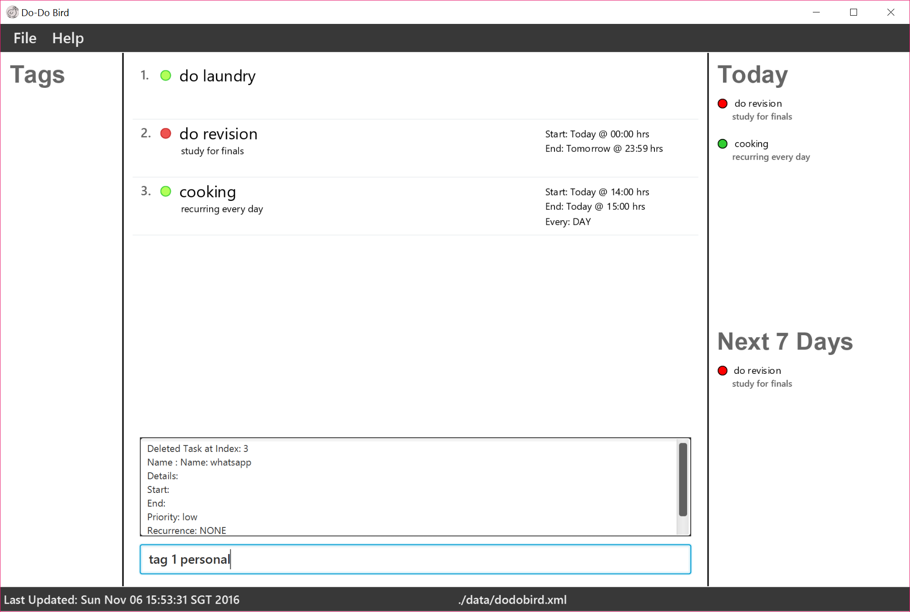
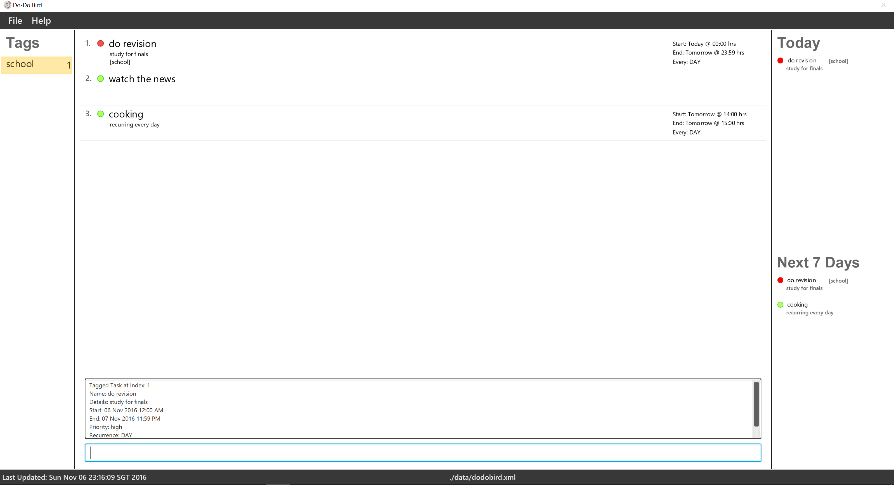

# User Guide

* [Quick Start](#quick-start)
* [Features](#features)
* [FAQ](#faq)
* [Command Summary](#command-summary)

<!-- @@author A0142421X -->
## About Do-Do Bird
Have you ever wished that you could spend more time with people important to you? How about having more time for your hobbies? Wouldn’t it be great if there was an application that could help you sort through this chaos and let you focus on what’s important in life?
Enter Do-Do Bird, an intelligent personal assistant that organises your tasks for you. Do-Do Bird uses natural language processing to execute your every command. With Do-Do Bird, your life will never be the same.

<!-- @@author A0093896H -->
## Quick Start

0. Ensure you have Java version `1.8.0_60` or later installed in your Computer. 
   > Having any Java 8 version is not enough.  
   This app will not work with earlier versions of Java 8.

1. Download the latest `dodobird.jar` from the [releases](../../../releases) tab.
2. Copy the file to the folder you want to use as the home folder for your Do-Do Bird application.
3. Double-click the file to start the application. The GUI should appear in a few seconds.

   > 

4. Type the command in the command box and press <kbd>Enter</kbd> to execute it.  
   e.g. typing **`help`** and pressing <kbd>Enter</kbd> will open the help window.
5. Some example commands you can try:
   * **`search on`**` tomorrow`:  see all tasks for tomorrow.
   * **`add`**` Meet with professor from 10/10/17 09:30 till 17:00;`
   * **`delete`**` 3` : deletes the task with ID #3.
   * **`exit`** : exits the app.
6. Refer to the [Features](#features) section below for details of each command. 

# Features
 
> **Command Format**
> * Items in `SQUARE_BRACKETS` are optional.
> * Items with `...` after them can have multiple instances.
> * The order of parameters is fixed.
 
> **Priority Format**
> * high, mid, low
 
> **Recurrence Format**
> * day, week, month, year
 
> **Date and Time Format**
> * **Date**
>   * MM/DD/YYYY or MM-DD-YYYY  
>       * E.g: 12/25/2017 or 12-25-2017
>   * DD MMM YYYY
>       * E.g: 25 Oct 2017
>   * DD MMMM YYYY
>       * E.g 25 October 2017
>   * Relative dates
>       * E.g tomorrow, yesterday, today, next monday, 2 days later
> * **Time**
>   * 24-hours format: 0930
>   * 12-hours format: 0930pm
>   * Presets: morning, noon, evening, night, midnight
 
<!-- @@author A0142421X -->
> **ID**
> The ID of a task is the index of the task as displayed on the screen

 **Task Fields**
Field | Specifier | Format
------|:----------|:-------
Task Name | | TASK_NAME
'On' Date | on | on DATE [TIME]
'By' Date | by | by DATE [TIME]
Priority | priority | priority LEVEL
Recurrence | every | every RECURRENCE
Details | ; | ; DETAILS

## Viewing help : `help`
Directs user to the help page. 

Format: `help`

> Help is also shown if you enter a valid command word but with an invalid format.

## Adding a task: `add`
Adds a task to Do-Do Bird. 
Below are the possible formats to follow in order to add a task. 

Format:
* `add TASK_NAME`
* `add TASK_NAME [; a line of details]`
* `add TASK_NAME by DATE [TIME] [; a line of details]`
* `add TASK_NAME on DATE [TIME] [; a line of details]`
* `add TASK_NAME on DATE [TIME] by DATE [TIME] [; a line of details]`
* `add TASK_NAME on DATE [TIME] by DATE [TIME] every [RECURRENCE] [; a line of details]`
* `add TASK_NAME on DATE [TIME] by DATE [TIME] priority [PRIORITY] [; a line of details]`

> * The Date and Time formats are provided above.  
> * The available options for priority and recurrence are provided above. 

Examples:

* **`add`**` Meet with professor ; consultation for mid-terms`
* **`add`**` CS1010 Lab 4 by 10/10/2017`
* **`add`**` Amy's weddings on 25/10/17;`
* **`add`**` demoAdd on today by tomorrow priority mid ; for show only`
* **`add`**` cooking on today 1400 by 1500 every day ; recurring every day`

Demo: 
Typing the below command will result in the task shown in the below GUI.
  
Result:  
 
>Figure 1

<!-- @@author A0142421X -->
## Searching tasks: `search`
Do-Do Bird’s search function helps you to filter out tasks using different search specifiers.  

Formats | Function
--------|:-----------
`search` | displays a list of all uncompleted tasks
`search done` | displays a list of all completed tasks
`search all` | displays a list of all tasks
`search floating` | displays a list of floating tasks
`search KEYWORD [MORE_KEYWORDS]` | displays a list of tasks with keyword in its task name
`search before DATE [TIME]` | displays a list of tasks that start before the specified date and time
`search after DATE [TIME]` | displays a list of tasks that end after the specified date and time
`search on DATE [TIME]` | displays a list of tasks that starts on the specified date and time
`search from DATE [TIME] to DATE [TIME]` | displays a list of tasks that start and end on the specified date and times
`search tag TAG` | displays a list of tasks that are tagged under the specified tag

<!-- @@author A0093896H -->
Examples:
* **`search`**` Party fun NIgHt OUTzz`
* **`search`**` before 25/10/17 09:30`
* **`search`**` on 25/10/17 09:30`
* **`search`**` tag birthdays`
* **`search`**` priority mid`
* **`search`**` floating`

> * Add `done` `undone` or `all` at the back of the command to indicate whether you want to see tasks that are completed or not.
> * Default search results will list tasks that are not completed.
> * The search is case insensitive. e.g `meeting` will match `Meeting`.
> * The order of the keywords does not matter. e.g. `Meet Professor` will match `Professor Meet`
> * Tasks matching at least one keyword will be returned (i.e. `OR` search).
    e.g. `Meeting` will match `Meeting Professor`

Demo:  
Typing the below command will result in the task shown in the below GUI  
  
Result:  
 

<!-- @@author A0121643R -->
## Marking tasks as done : `mark`
Marking a task in Do-Do Bird as completed. 

Format: `mark ID`

Examples:

* **`mark`**` 2` 
Mark the task at index 2 as complete.

Demo: 
Type the `mark` command:  
  
Result:  
 

## Unmarking tasks : `unmark`
Unmark a task as uncompleted. 

Format: `unmark ID`

Examples:

* **`unmark`**` 2` 
Mark the task with index 2 as uncompleted.

## Updating a task: `update`
Update an existing task inside Do-Do Bird. 

Format:

* `update ID [NEW_NAME] [on DATE Time] [by DATE Time] [priority PRIORITY] [every RECURRENCE] [; a line of new details]`

> * Date and Time formats follow the above guidelines.
> * The available options for priority and recurrence are provided above
> * To remove any pre-existing optional fields, prefix a `-` to the field specifier.

Examples:

* **`update`**` 1 every week ; weekly affair`  
  Update the task with `ID #1` to reflect new recurrence and details

* **`update`**` 2 on 14/10/17 by 18/10/17;`  
  Update the task with `ID #2` to reflect new start and end dates

* **`update`**`  3 test task on - priority mid `  
  Update the task with `ID #3` to remove old on date and reflect new priority level

Demo:  
Typing the below command will result in the task shown in the below GUI.  
  
Result:  
 

## Deleting a task : `delete`
Deletes the specified task from the Do-Do Bird. 

Format: `delete ID`

Examples:

* **`delete`**` 3` 
Deletes the task with `ID #3` in the Do-Do Bird.

Demo:  
Typing the below command will result in the task shown in the below GUI.  
  
Result:  
 

<!-- @@author A0142421X -->

## Tagging a task : `tag`
Tags the task with the specified tag. 

Format: `tag ID TAG`

Examples:

**`tag`**` 2 Tutorial` 
Tags the task with `ID #2` with the `Tutorial` tag

Demo:  
Typing the below command will result in the task shown in the below GUI.  
  
Result:  
 

## Untagging a task : `untag`
Untags the task from the specified tag. 

Format: `untag ID TAG`

Examples:

* **`untag`**` 2 Tutorial` 
Untags the task with `ID #2` from `Tutorial` tag

<!-- @@author A0138967J -->
## Storing : `store`
Change the storage location for the data file. 

Format: `store location`

## Undoing : `undo`
Undo the last operation. 

Format: `undo`

## Resetting : `reset`
Resets user's config to default. 

Format: `reset`

## Clearing all entries : `clear`
Clears all entries from the Do-Do Bird. 

Format: `clear`  

## Exiting the program : `exit`
Exits the program. 

Format: `exit`  

#### Saving the data
To-do list data are saved in the hard disk automatically after any command that changes the data. 
There is no need to save manually.

## FAQ

**Q**: How do I transfer my data to another Computer? 
**A**: Install the app in the other computer and overwrite the empty data file it creates with
       the file that contains the data of your previous Do-Do Bird folder.
<!-- @@author A0121643R -->
## Command Summary

Command | Format | Example
------- | :----- | :-------
Add | `add TASKNAME` | add hello
	| `add TASKNAME priority PRIORITY` | add hello priority high/mid/low
	| `add TASKNAME ; DETAILS` | add hello ; first time use
	| `add TASKNAME on DATE`|  add hello on today/tomorrow/next wed/ 19:00/05:00pm
	| `add TASKNAME by DATE` | add hello by 12/25/2017 19:00 05:00pm
	| `add TASKNAME on DATE by DATE` |add hello on next wed 19:00 by next sunday 12:34am
	| `add TASKNAME on DATE by DATE priority PRIORITY` | add hello on tomorrow 19:00 by sunday 12:34am priority high
	| `add TASKNAME on DATE by DATE priority PRIORITY every RECURRENCE; DETAILS`| add hello on today 9pm by sunday 12:34am priority high every week ; a line of details
Clear | `clear` |
Delete | `delete ID` | delete 12
Help | `help` |
Mark | `mark ID`| mark 12
Unmark | `unmark ID`| unmark 12
Quitting | `exit` |
Search | `search KEYWORDS`| search hello PrOjecT MeeTinG
	   | `search before DATE` | search before today 19:00
       | `search on DATE` | search on today 19:00
	   | `search after DATE`| search before today 19:00
	   | `search priority PRIORITY`| search priority high
	   | `search tag TAG` | search tag study   
Tag | `tag ID TAG` | tag 12 study
Untag | `untag ID TAG`| untag 12 study
Undo | `undo` |
Update | `update ID TASKNAME`| update 10 hello again
	   | `update ID on DATE`| update 10 on tmr 07:00pm
	   | `update ID by DATE` | update 10 by tmr 07:00pm
	   | `update ID TASKNAME on DATE` | update 10 hello again on tmr 07:00pm
	   | `update ID TASKNAME byo DATE`| update 10 hello again by tmr 07:00pm
	   | `update ID on DATE by DATE` | update 10 on today 05:00pm by sunday 12:34am
	   | `update ID TASKNAME on DATE by/to DATE`| update 10 hello again on today 19:00 by sunday 12:34am
	   | `update ID TASKNAME on DATE by DATE priority PRIORITY`| update 10 hello again on today 5pm by sunday 12:34am priority mid
	   | `update ID TASKNAME on DATE by DATE priority PRIORITY ; DETAILS`| update 10 hello again on today 05:00pm by sunday 12:34am priority high ; a line of details
      | `update ID TASKNAME on DATE by DATE priority PRIORITY every RECURRENCE; DETAILS`| update 10 hello again on today 19:00 by sunday 12:34am priority high every day ; a line of details
Store | `store` file path | store C:/Users/user/Documents/myList
Reset | `reset` |
