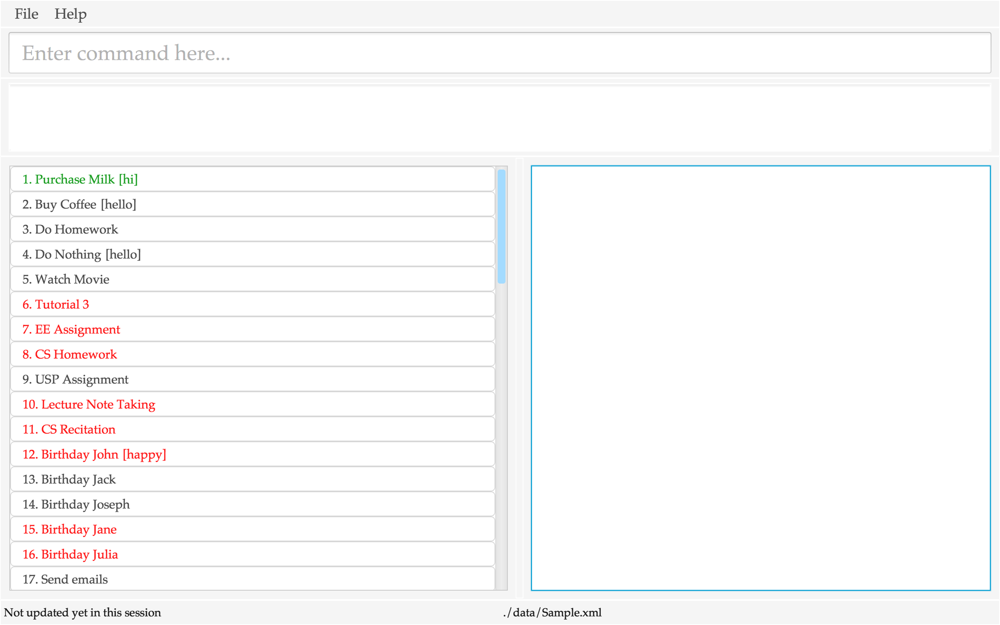
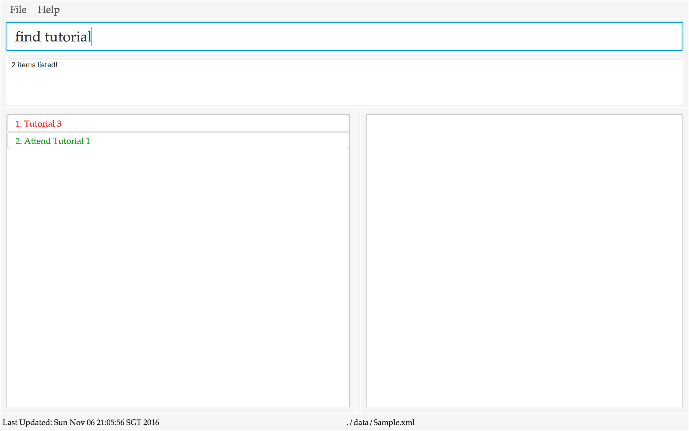

# User Guide

* [Quick Start](#quick-start)
* [Features](#features)
* [FAQ](#faq)  
* [Command Summary](#command-summary)  
* [Credits](#credits)

## Quick Start

0. Ensure you have Java version `1.8.0_60` or later installed in your Computer. Having any Java 8 version is not enough.This app will not work with earlier versions of Java 8. 

1. Download the latest `taskmanager.jar` from the [releases](../../../releases) tab. 

2. Copy the file to the folder you want to use as the home folder for your Task Manager. 

3. Double-click the file to start the app. The GUI should appear in a few seconds. 

 

4. Type the command in the command box and press <kbd>Enter</kbd> to execute it.
   e.g. typing **`help`** and pressing <kbd>Enter</kbd> will open the help window. 

5. Some example commands you can try:
	   * **`list`** : lists all items
	   * **`add task n/Eat`** adds a task named `Eat` to the taskmanager
	   * **`delete`**` 3` : deletes the 3rd task shown in the current list
	    
   * **`exit`** : exits the app
    
6. Refer to the [Features](#features) section below for details of each command. 

## Features

> **Command Format**
> * Words in `UPPER_CASE` are the parameters.
> * Items in `SQUARE_BRACKETS` are optional.
> * Items with `...` after them can have multiple instances.
> * `/` should only be used in user input after a parameter indicator (e.g. `n/`). Usage anywhere else may lead to unexpected results.
> * The order of parameters is fixed unless otherwise specified.

### Getting Started

1. Open the Application 

2. You will see a welcome message and a list of commands that you can use.

3. At any time, you can view the list of commands again by typing ‘help’.

4. If you type an incorrect command, help-screen auto pops out

### When you need help (To see a list of all commands)

1. Type ‘h[elp]’.

2. Press `Enter`.

3. The list of commands, their format and their function will be shown.

### When you have a new deadline, task or event

#### Add a deadline

1. Type `a[dd] d[eadline] [n/]NAME ed/DATE et/TIME` or `a[dd] d[eadline] n/NAME edt/DATE_TIME_TEXT(e.g. next wed 3pm)`.

2. `add` can be replaced by `a`. `deadline` can be replaced by `d`. `n/` prefix for NAME is optional.

3. If et is not specified, et is assumed to be 23:59.

4. Press `Enter`.

5. The deadline will be added to your to do list.

#### Add a task

1. Type `a[dd] t[ask] [n/]NAME`.

2. `add` can be replaced by `a`. `task` can be replaced by `t`. `n/` prefix for NAME is optional.

3. Press `Enter`.

4. The task will be added to your to do list.

#### Add an event

1. Add an event by typing `a[dd] e[vent] [n/]NAME sd/START_DATE st/START_TIME ed/END_DATE et/END_TIME` or `a[dd] e[vent] [n/]NAME sdt/START_DATE_TIME_TEXT(e.g. two hours later) edt/END_DATE_TIME_TEXT(e.g. next wed 3pm)`.

2. `add` can be replaced by `a`. `event` can be replaced by `e`. `n/` prefix for NAME is optional.

3. If st is empty, st is assumed to be 00:00.

4. If et is empty, et is assumed to be 23:59.

5. Press `Enter`.

[comment]: # (@@author A0140060A)

### When you need to find a deadline, task or event
1. Type `f[ind] KEYWORD` where `KEYWORD` is part of the item's name.

2. Press `Enter`.

3. App will display a list of items with names containing the keyword in the bottom left pane.

>  Example Command: `find CS2105`  

>
 
> App Response for `find CS2105`

### When you need to edit a deadline, task or event
* At least one optional parameter must be specified.
* All optional parameters can be in any order.
* sdt/edt supports Natural Language Input. (Note: sdt/edt will be favoured if sdt/edt and sd/ed or st/et are entered together)
* Editing tags: `#` prefix to add a tag, `#-` to delete an existing tag. (Note: You cannot add a duplicate tag or delete a non-existent tag.)

#### Edit a task’s name
For tasks, you can only edit the name and its tags.

##### If you know a keyword in the task's name

1. Type `f[ind] KEYWORD`.

2. Type `e[dit] INDEX n/NEW_NAME [#TAG_TO_ADD] [#-TAG_TO_DELETE]`.

3. Press `Enter`.

> Example Command:
> 1. `find random module`
> 2. `edit 1 n/CS2103 #work #-play`

##### If you know the index of the task in the displayed list

1. Type `e[dit] INDEX n/NEW_NAME [#TAG_TO_ADD] [#-TAG_TO_DELETE]`.

2. Press `Enter`.

> Example Command: `edit 1 n/CS2103 #work #-play`

#### Edit a deadline's name, end date and end time
For deadlines, you can only edit the name, end date and time.

##### If you know the keyword of the deadline

1. Type `f[ind] KEYWORD`.

2. Press `Enter`.

3. Type `e[dit] INDEX [n/NEW_NAME] [edt/NEW_END_DATE_TIME] [ed/NEW_END_DATE] [et/NEW_END_TIME] [#TAG_TO_ADD] [#-TAG_TO_DELETE]`.

4. Press `Enter`.

> Example Command:
> 1. `find random module`
> 2. `edit 1 n/CS2103 edt/next thursday 2 pm #work #-play`

##### If you know the index of the deadline in the displayed list

1. Type `e[dit] INDEX [n/NEW_NAME] [edt/NEW_END_DATE_TIME] [ed/NEW_END_DATE] [et/NEW_END_TIME] [#TAG_TO_ADD] [#-TAG_TO_DELETE]`.

2. Press `Enter`.

> Example Command: `edit 1 n/CS2103 edt/next thursday 2 pm #work #-play`

#### Edit an event’s name, start date, start time, end date and end time

For events, you can edit the name and both start and end dates and times.  
(Note: editing the end datetime to be before the start datetime is an illegal operation and is not allowed)

##### If you know the keyword of the event

1. Type `f[ind] KEYWORD`.

2. Press `Enter`.

3. Type `e[dit] INDEX [n/NEW_NAME] [sdt/NEW_START_DATE_TIME] [sd/NEW_START_DATE] [st/NEW_START_TIME] [edt/NEW_END_DATE_TIME]  [ed/NEW_END_DATE] [et/NEW_END_TIME] [#TAG_TO_ADD] [#-TAG_TO_DELETE]`.

4. Press `Enter`.

> Example Command:
> 1. `find random module`
> 2. `edit 1 n/CS2103 sdt/next friday 2 pm edt/next friday 4 pm #work #-play`
If you know the index of the event in the displayed list

1. Type `e[dit] INDEX [n/NEW_NAME] [sdt/NEW_START_DATE_TIME] [sd/NEW_START_DATE] [st/NEW_START_TIME] [edt/NEW_END_DATE_TIME] [ed/NEW_END_DATE] [et/NEW_END_TIME] [#TAG_TO_ADD] [#-TAG_TO_DELETE]`.

2. Press `Enter`.

> Example Command: `edit 1 n/CS2103 sdt/next friday 2 pm edt/next friday 4 pm #work #-play`

[comment]: # (@@author )

### When you need to view your deadlines, tasks and events

####View all deadlines, tasks and events

1. View the entire task manager by typing `l[ist]`.

2. Press `Enter`.

####View all tasks

1. View the entire task list by typing `l[ist]t[ask]`.

2. Press `Enter`.

####View all deadlines

1. View the entire deadline list by typing `l[ist]d[eadline]`.

2. Press `Enter`.

####View all events

1. View the entire event list by typing `l[ist]e[vent]`.

2. Press `Enter`.

### When you want to delete a deadline, task or event

####Delete one deadline, task or event

1. Type `del[ete] INDEX`.

2. Press `Enter`.

####Delete 2 deadlines, tasks or events

1. Type `del[ete] INDEX1 INDEX2`.

2. Press `Enter`.

### When you are done with a deadline, task or event

1. Type `d[one] INDEX`.

2. Press `Enter`.

### When you are not done with a deadline, task or event

1. Type `n[ot]d[one] INDEX`.

2. Press `Enter`.

### When you want to undo your last action that caused a changed in your todo list

1. Type `u[ndo]`.

2. Press `Enter`.

### When you want to specify a custom save location for your data

> * File to save in is limited to .xml format.

1. Type `save VALID_FILE_PATH`.
2. Press `Enter`.

# FAQ

# Command Summary

Command | Format  
-------- | :--------
Add Task | `a[dd] t[ask] [n/]NAME [#TAG_TO_ADD]`
Add Deadline | `a[dd] d[eadline] [n/]NAME ed/DATE et/TIME` or `a[dd] d[eadline] [n/]NAME edt/DATE_TIME_TEXT [#TAG_TO_ADD]`
Add Event | `a[dd] e[vent] [n/]NAME sd/START_DATE st/START_TIME ed/END_DATE et/END_TIME [#TAG_TO_ADD]` or `a[dd] e[vent] [n/]NAME sdt/START_DATE_TIME_TEXT edt/END_DATE_TIME_TEXT [#TAG_TO_ADD]`
Clear | `cl[ear]`
Delete | `del[ete] INDEX [SECOND_INDEX]`
Done | `d[one] INDEX`
Edit Task | `e[dit] INDEX n/NEW_NAME [#TAG_TO_ADD] [#-TAG_TO_DELETE]`
Edit Deadline | `e[dit] INDEX [n/NEW_NAME] [edt/NEW_END_DATE_TIME] [ed/NEW_END_DATE] [et/NEW_END_TIME] [#TAG_TO_ADD] [#-TAG_TO_DELETE]`
Edit Event | `e[dit] INDEX [n/NEW_NAME] [sdt/NEW_START_DATE_TIME] [sd/NEW_START_DATE] [st/NEW_START_TIME] [edt/NEW_END_DATE_TIME] [ed/NEW_END_DATE] [et/NEW_END_TIME] [#TAG_TO_ADD] [#-TAG_TO_DELETE]`
Find | `f[ind] KEYWORD [MORE_KEYWORDS]`
Help | `h[elp]`
List all items | `l[ist]`
List Tasks | `l[ist]t[ask]`
List Deadlines | `l[ist]d[eadline]`
List Events | `l[ist]e[vent]`
Notdone | `n[ot]d[one] INDEX`
Select | `s[elect] INDEX`
Undo | `u[ndo]`

# Credits

This application makes use of the [addressbook-level4](https://github.com/se-edu/addressbook-level4) code provided by the NUS SoC CS2103 Teaching Team.
Libraries used:  
[prettytime](https://github.com/ocpsoft/prettytime)
