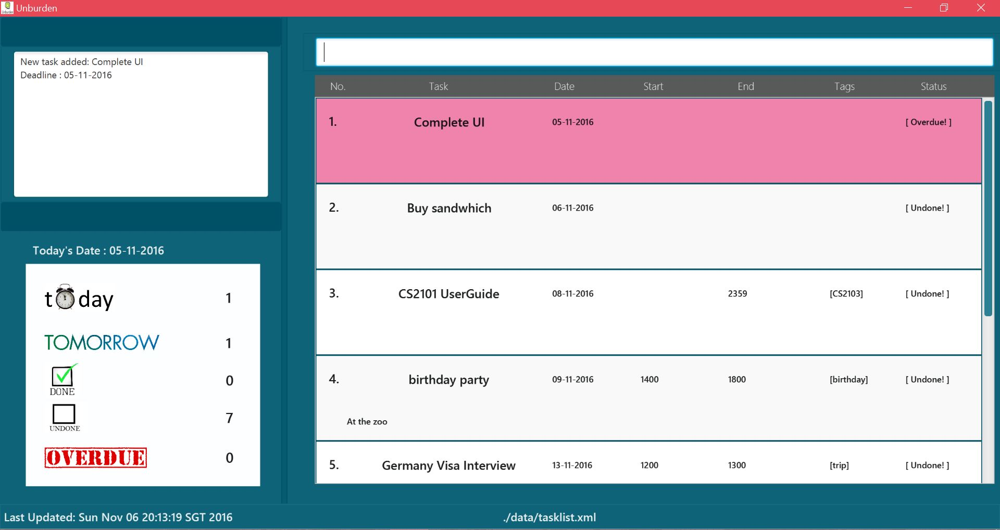
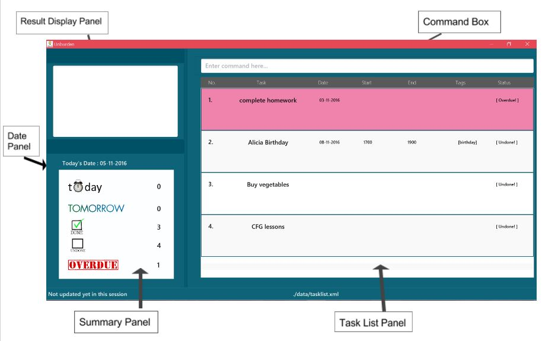
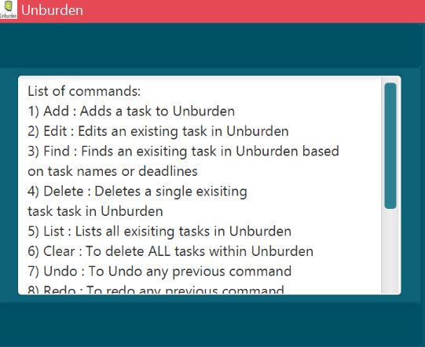
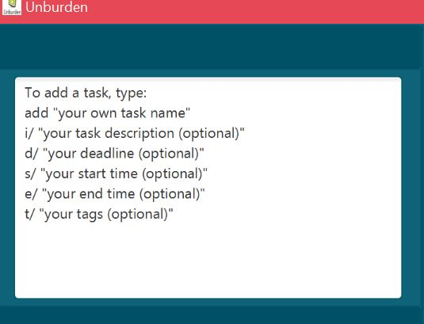
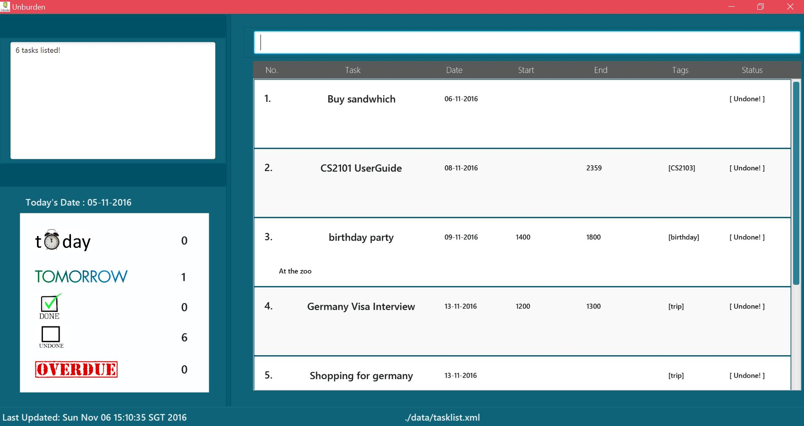

<!--@@A0143095H	-->

# User Guide

  
 
     

* [About](#about)
* [Getting Started](#getting-started)
* [Features](#features)
    * [Help Command](#1-help-command)
    * [Add Command](#2-add-command-add)
    * [Delete Command](#3-delete-command-delete)
    * [Edit Command](#4-edit-command)
    * [Done Command](#5-done-command)
    * [Undone Command](#6-undone-command)
    * [List Command](#7-list-command)
    * [Find Command](#8-find-command)
    * [Clear Command](#9-clear-command)
    * [Undo Command](#10-undo-command)
    * [Redo Command](#11-redo-command)
    * [Exit Command](#12-exiting-the-program-exit)
* [FAQ](#faq)
* [Command Summary](#command-summary)

## About
In this modern day, we're all swamped with numerous tasks to do everyday. It is no wonder that task managers have become an indispensable tool in our everyday lives. However, we often spending more time figuring out where's the add button or how to edit our tasks. 

Well, fret not! Here's introducing Unburden! With Unburden, you won't need to trouble yourself with what or where to click. It utilizes a simple and intuitive command line interface which only requires you to type. No more clicking or scrolling!

Unburden features a clean interface with colour coding to prioritize your tasks. It's simple to use and easy to manage! All you need to know is shown on the screen, just type your queries and leave the rest to Unburden! What's more is that Unburden works offline! So now you can even use it when your WIFI is down. 

Need to unburden? Let's get started!

## Getting Started

1. Ensure you have Java version `1.8.0_60` or later installed in your Computer. 
   > Having any Java 8 version is not enough.  
   This app will not work with earlier versions of Java 8.
   
2. Download the latest `unburden.jar` from the [releases](../../../releases) tab.
3. Copy the file to the folder you want to use as the home folder for `Unburden`.
4. Click on the application icon to launch it and wait for the application to pop up.
   > 

5. Type the command in the command box and press <kbd>Enter</kbd> to execute it.  
   e.g. typing **`help`** and pressing <kbd>Enter</kbd> will display the list of commands that can be used in the application.
   > 
   
6. Refer to the [Features](#features) section below for details of each command. 

## Features

### Command Format

1. Commands are not case sensitive and can be entered as both "Add" or "add."
2. Dates can be entered in the format DD-MM-YYYY or in words limited to "todaY" or "tomorrow."
3. Time should be entered in the 24 hour clock format such as "2330" to represent 11:30pm or "0520" to represent 05:20am.

### Layout of Unburden 

   > 

 
 

## 1. Help Command

### 1.1  Help  

If you wish to know all of the commands and their formats, you may type in the command format as shown below.   
#### Format: `help`
   
> Help is also shown if you enter an incorrect command e.g. `abcd`

 Examples :  
   help  
   Help     
    > 

 

### 1.2  Help "Command"  

If you wish to know the specific formats of each individual command or require assistance for a specific command, you may enter the command format as shown below. .  
#### Format: `help "COMMAND" `
   
> Help is also shown if you enter an incorrect command e.g. `abcd`

 Examples :  
   help add  
   Help  list   
   Help  find     
    > 
    
This command will show you the command format of the specific command you have entered in the result display panel. For example, if     i type “help add,” the result display panel will show the specific format of the add command. 

 
 

## 2. Add Command: `add`

The add command enables you to add 4 different type of tasks : Floating, deadline, deadline with end time and an event.  You may also enter in a task description for longer task names and tags which can help you identify similar tasks. For all task types, adding task description and tags are optional.  

Upon entering your command, the task will be displayed in the task list panel and the entry will also be shown in the result display panel as shown below.  

   > 
   
   
### 2.1 Add a floating task 
If you are unsure of the date or time of your task and wish to add floating tasks, you may simply enter the command format as shown below.  
#### Format: `add <Task Name> i/<Task Description> t/<Tags>`
   
   Examples :  
   add Complete Joke book t/Jokes  
   add Plan Trip to Germany  
   add Book train tickets  

 

### 2.2	Add a deadline Task   

If you wish to add tasks with only a deadline for tasks that are supposed to be due by a specific date, you may enter the command as shown below.  
#### Format: `add <Task Name> i/<Task Description> d/<Deadline> t/<Tags>`
   
   Examples :  
   add Orbital Splashdown i/ Create the userguide d/18-06-2016 t/Orbital  
   add Music Talent show d/28-04-2008 t/Show  
   add Complete Workout d/13-03-2009  

 

### 2.3	Add a deadline Task with end time   
If you wish to add tasks with a deadline and end time for tasks that are supposed to be due by a specific time on a certain date, you may enter the command as shown below.  
#### Format: `add <Task Name> i/<Task Description> d/<Deadline> e/<End time> t/<Tags>`
   
   Examples :  
   add Orbital Splashdown i/ Create the userguide d/18-06-2016 t/Orbital  
   add Music Talent show d/28-04-2008 t/Show  
   add Complete Workout d/13-03-2009  

 

### 2.4	Add an event   
If you wish to add events which have a specific date, start time and end time, you may enter the command as shown below.  
#### Format: `add <Task Name> i/<Task Description> d/<Deadline> s/<Start Time> e/<End time> t/<Tags>`
   
  Examples : 
  Add Janice Birthday  i/At Science centre d/15-11-2016 s/1400 e/1800  
  Add USS Halloween d/13-11-2016 s/2100 e/2300  
  Add Work dinner party d/21-11-2016 s/1900 e/2100  

 
 

## 3. Delete Command : `delete`

If your task or event has been cancelled, you can simply delete the task or event by typing the command as shown below. The index refers to the index of the task you wish to delete. 
#### Format: `delete <Task Index>`
   
   Examples :  
   delete 1  
   delete 4  
   
Upon entering the command, the task list panel will be automatically updated and the task would be deleted from the list. 

 
 

## 4. Edit Command

If you have entered an entry wrongly or if the date of your event has changed, Unburden can easily allow you to edit your task without deleting it and adding it again. You are required to type the index of the task you wish to edit and you can edit any of the parameters of the task as shown below.  
#### Format: `edit <Task Index> i/<Task Description> d/<Deadline> s/<start Time> e/<End Time>`
   
   Examples :  	
   Edit 1 CS2101 UserGuide  
   Edit 5 Plan trip to Vegas  
   Edit 3 i/Oranges,apples and pears   
   Edit 2 d/12-11-2016  
   Edit 4 s/1300 e/1900  
   Edit 2 Buy vegetables i/oranges d/12-11-2016 s/1800 e/1900  
		
Upon entering your command, you will be able to view the updated task in the task list panel. 
   

 
 

## 5. Done Command

If you have completed a task and you wish to remove it from your list in the task list panel, you can simply mark the task as done. The index shown below refers to the index of the task you wish to mark as done. Once you have marked a task as done, it will disappear from the task list panel.   
#### Format: ` done <INDEX> `
   
   Examples :  
   done 1  
   done 2  
				
You can then view the color change in the task that you have marked as done.
  

## 6. UnDone Command

If you have marked a task as done but you realise that you have yet to complete it, you can mark the task as undone once again. The format for the undone command is similar to that of the done command as shown below.   
#### Format: ` undone <INDEX> `
   
   Examples :  
   undone 1  
   undone 2  
				
You can then view the color change in the task that you have marked as undone.
  

## 7. List Command

Since the task list panel inherently displays the list of undone tasks, the list command is able to modify the task list panel to show different lists depending on the command entered.  

### 7.1 List Date 

If you wish to view all tasks that you have entered which have a deadline from today to a certain date, you may simply enter "list DATE" and the task list panel will be updated. You may type the command as shown below where the date refers to the date you wish to limit the list to. 

#### Format: `list <DATE>`
   
   Examples :  
   list 08-11-2016  
   list 13-11-2016  

For example, if you type `List 09-11-2016`,  the task list panel would display the list of tasks entered which have a deadline before and including 09-11-2016 as shown below.  

   > 
   
    

### 7.2 List Date to date 

If you wish to view all tasks that you have entered which have a deadline from a specific date to another date, you may make use of the `list date to date` command. The task list panel will be updated to show only the tasks which have a deadline within the range of dates you have entered.  

Note : This range includes the dates you have entered as well.  

#### Format: `list <DATE> to <DATE>`
   
   Examples :  
   List 06-11-2016 to 09-11-2016  
   List 08-11-2016 to 13-11-2016   

For example, if you type `List 08-11-2016 to 13-11-2016 `,  the task list panel would display the list of tasks entered which have a deadline within the range 08-11-2016 and 13-11-2016 as shown below. .  

   > 
   
    

### 7.3 List done 

If you wish to list all the tasks completed,  you may make use of the list done command as shown below.  

#### Format: `list done`

 

### 7.4 List overdue 

If you wish to list all the tasks you have overdue,  you may make use of the list overdue command as shown below.   

#### Format: `list overdue`

 

### 7.5 List 

If you wish to list all the undone tasks in unburden, you may make use of the list command as shown below.    

#### Format: `list`

 

### 7.6 List all 

If you wish to list all the tasks in unburden, you may make use of the list all command as shown below.  

#### Format: `list all`

 
 

## 8. Find Command

If you wish to search for specific dates, names or tags, you can simply use the find command to do so. 

### 8.1 Find name and tags 

If you wish to find tasks with specific names or tags, you may simply enter any keyword in the task name and the task would appear in the task list panel. You may use the command as shown below.  

#### Format: `find <KEYWORD>`
   
   Examples :  
   find workout  
   find gym  
				

### 8.2 Find date 

If you wish to find tasks with a specific date, you may simply enter the date and the task with that deadline would appear in the task list panel. You may use the command as shown below.  

#### Format: `find <Date>`

   Examples :  
   find 07-09-2008  
   find today  
   find tomorrow  
   
You can then see all of the tasks with that date in the application's display window.   
  

## 9. Clear Command

If you wish to delete all tasks in the current list displayed, you may simply use the clear command to do so. You may use the command as shown below. 
 
#### Format: `clear`
   
 
 

## 10. Undo Command

If you regret entering a command or wish to undo an action you have done, you may simply make use of the undo command to do so. You may use the command as shown below.  
Note! : The undo command works on the clear command as well.   

#### Format: ` undo  `
   
 
    
   
## 11. Redo Command
If you accidentally used the undo command and you wish to redo your changes, you may simply make use of the redo command. You may use the command as shown below.  
#### Format: ` redo  `
   
  

## 12. Exiting the program : `exit`
To exit Unburden, you may use the command as shown below.  
#### Format: `exit`

The application will be closed.

#### Saving the data 
Address book data are saved in the hard disk automatically after any command that changes the data. 
There is no need to save manually.

## FAQ

**Q**: How do I transfer my data to another Computer? 
**A**: Install the app in the other computer and overwrite the empty data file it creates with 
       the file that contains the data of your previous Address Book folder.
       
### Command Summary

Command | Format  
-------- | :-------- 
Help | `help <command word>`
Add | `add <Task description> <Date if applicable> <Start time if applicable> <End Time if applicable>`
Delete | `delete <task name>`
Edit | `edit <Task Index> <Date if applicable> <Start Time if applicable> <End Time if applicable>`
Done | `done <Task Index>`
undone | `undone <Task index> `
List | `list`
Find | `find <Task Name if applicable> or find <Date> or find <Tags>`
clear| `clear`
undo | `undo`
redo | `redo`
Exit | `exit`

