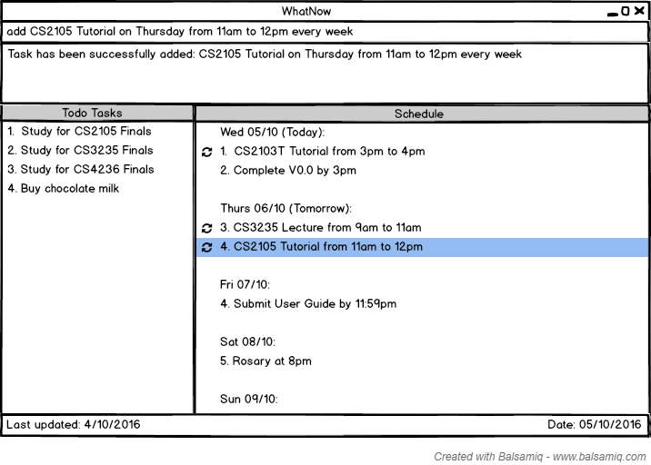
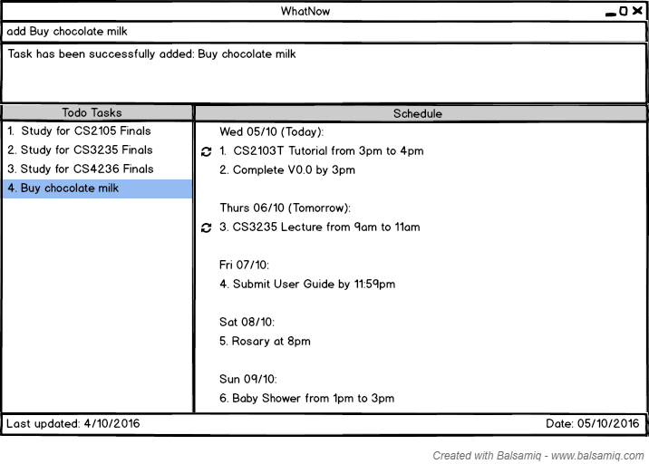
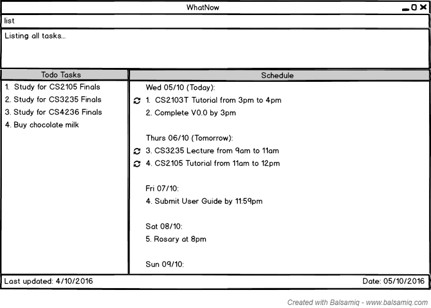
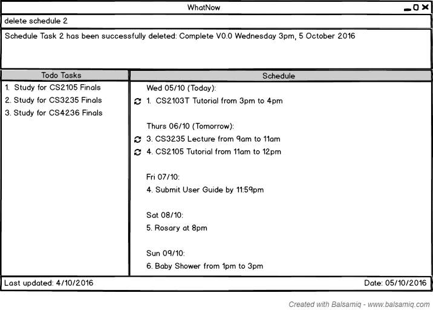
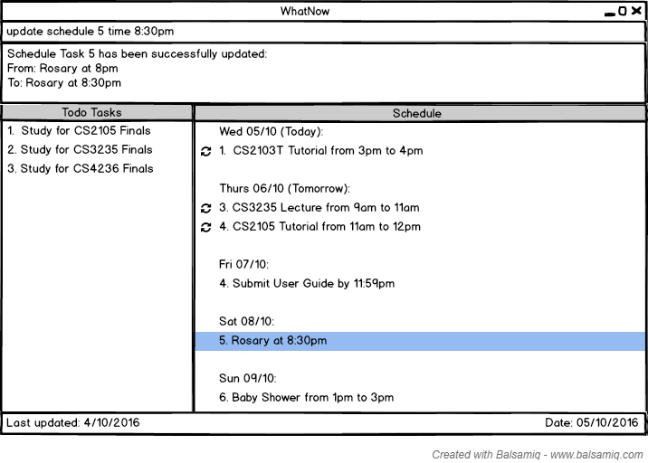
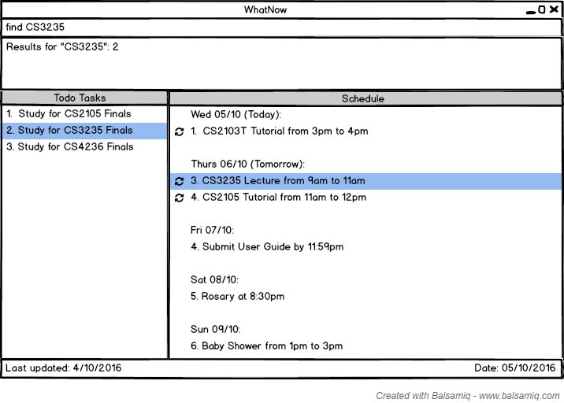
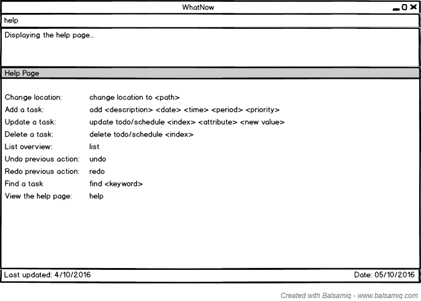

# User Guide
Are you feeling stressed or overwhelmed with the number of things you have to do? When you are drowning in the pool of to-dos, even mundane tasks like buying milk may bring tears to your eyes. Well you can hold back those precious tears because WhatNow will help you to manage all your tasks.

Now that you know WhatNow is [about](../README.md), you can follow this guide to learn how to use WhatNow effectively.

Welcome to WhatNow! 

# Table of Contents
* [Quick Start](#quick-start)
* [Features](#features)
* [FAQ](#faq)
* [Command Summary](#command-summary)

## Quick Start

0. Ensure you have Java version `1.8.0_60` or later installed in your Computer. 
   > Having any Java 8 version is not enough.  
   This app will not work with earlier versions of Java 8.
   
1. Download the latest `WhatNow.jar` from the [releases](../../../releases) tab.
2. Copy the file to the folder you want to use as the home folder for your WhatNow.
3. Double-click the file to start the app. The GUI should appear in a few seconds. 
   > 

4. Type the command in the command box and press <kbd>Enter</kbd> to execute it.  
   e.g. typing **`help`** then press <kbd>Enter</kbd> will open the help window. 
5. Some example commands you can try:
   * **`list`** : lists all tasks in WhatNow
   * **`add`**` Buy groceries` : adds a task called `Buy groceries` to WhatNow.
   * **`delete`**` 3` : deletes the 3rd task shown in the current list
   * **`exit`** : exits WhatNow
6. Refer to the [Features](#features) section below for details of each command. 

## Features

> **Command Format**
> * Words in `UPPER_CASE` are the parameters.
> * Items in `SQUARE_BRACKETS` are optional.
> * Items with `...` after them can have multiple instances.
> * The order of parameters is fixed.
 
#### Adding a task: `add`
Adds a task to WhatNow
Format: `add "DESCRIPTION" [on/by] [today/tomorrow/DAY/DATE] [from/by/at] [START_TIME] [to/till] [END_TIME] [every] [DAY/day/week/month/year] [low/medium/high]` 

Examples:
* `add "Do CS2103T tutorial" on 4 Oct 2016 from 10am to 11am every week`
* `add "Watch Storks movie" on 10/10 from 1pm to 3pm` 
* `add "CS2103 Project" on 20/11/2016 high`
* `add “CS2105 Tutorial” on Thursday from 11am to 12pm every week`
* `add "Buy chocolate milk"`

>Tasks with date and time specified will be added to WhatNow as a schedule task and will be  displayed under the heading "Schedule".
> 

>Tasks without date and time specified will be added to WhatNow as a todo task and will be  displayed under the heading "Todo Tasks".
> 

#### Listing all tasks : `list`
Shows a list of all tasks in WhatNow. 
Format: `list`

Examples: 
* `list`
> 

#### Deleting a task : `delete`
Deletes a task from WhatNow. Reversible. 
Format: `delete todo/schedule INDEX`

> Deletes the task at the specified `INDEX` from todo tasks or schedule as specified. 
  The index refers to the index number shown in the current listing. 
  The index **must be a positive integer** 1, 2, 3, ...

Examples: 
* `list` 
  `delete todo 4` 
  Deletes the 4th todo task from the displayed list in WhatNow.
> 
* `list` 
  `delete schedule 2` 
  Deletes the 2nd schedule task from the displayed list in WhatNow.
> 
#### Updating a task : `update`
Updates a task from the list displayed 
Format: `update todo/schedule INDEX description/date/start/end/time/status/priority  NEW_VALUE`

> Updates the description/date/start/end/time/status/priority of the task at the specified `INDEX` from todo tasks or schedule as specified. 
  The index refers to the index number shown in the current listing. 
  The index **must be a positive integer** 1, 2, 3, ...

Examples: 
* `update todo 3 description Avengers` 
   Selects the 3rd todo task from the displayed list and changes the task description to ‘Avengers’
* `update schedule 5 time 8:30pm` 
   Selects the 5th schedule task from the displayed list and changes the time to 8:30pm.
> 

#### Undoing the previous action : `undo`
Undo the previous action 
Format: `undo`  

Examples: 
* `undo` 
   Undo the previous action
> 

#### Redoing the previous action : `redo`
Redo the previous action 
Format: `redo`  

Examples: 
* `redo` 
   Redo the previous action
> 

#### Finding tasks containing any keyword in their description: `find`
Finds tasks whose description contain any of the given keywords. 
Format: `find KEYWORD [MORE_KEYWORDS]`

> * The search is case sensitive. e.g `Read` will not match `read`
> * The order of the keywords does not matter. e.g. `Read books` will match `books Read`
> * Only the description is searched.
> * Only full words will be matched e.g. `Book` will not match `Books`
> * Tasks matching at least one keyword will be returned (i.e. `OR` search).
    e.g. `Read Study` will match `Read books`

Examples: 
* `find Read` 
  Returns `Read books` but not `read`
* `find Read books lecture notes` 
  Returns Any tasks having description `Read`, `books`, `lecture` or `notes`.
* `find CS3235` 
  Returns Any tasks having description `CS3235`.
> 

#### Viewing help : `help`
Format: `help`

> Help is also shown if you enter an incorrect command e.g. `abcd`
> 

#### Saving the data 
WhatNow data are saved in the hard disk automatically after any command that changes the data. 
There is no need to save manually.

#### Clearing all tasks : `clear`
Clears all tasks from WhatNow. 
Format: `clear`  

#### Exiting the program : `exit`
Exits the program. 
Format: `exit`  

## FAQ

**Q**: How do I transfer my data to another Computer? 
**A**: Install the app in the other computer and overwrite the empty data file it creates with 
       the file that contains the data of your previous WhatNow folder.
       
## Command Summary

Command | Format  
-------- | :-------- 
Add | `add "DESCRIPTION" [on/by] [today/tomorrow/DAY/DATE] [from/by/at] [START_TIME] [to/till] [END_TIME] [every] [DAY/day/week/month/year] [low/medium/high]`
Update | `update todo/schedule INDEX [description/date/start/end/time/status/priority]  NEW_VALUE`
Delete | `delete todo/schedule INDEX`
List | `list`
Undo | `undo`
Redo | `redo`
Find | `find KEYWORD [MORE_KEYWORDS]`
Help | `help`
Clear | `clear`
Exit | `exit`
