# User Guide

# Table of Contents: 
* [Introduction](#introduction)
* [Quick Start](#quick-start)
* [Features](#features)
* [FAQ](#faq)
* [Command Summary](#command-summary)

## Introduction
Are you feeling stressed or overwhelmed with the number of things you have to do? Are you drowning in the pool of to-dos and confused about where to start? WhatNow is here to throw you a lifebuoy and to help you manage all your tasks. It allows you to manage your tasks by entering simple commands without the use of a mouse. You can even find free slots amidst your busy schedule by keying in a special command: freetime.

Now that you know WhatNow is [about](../README.md), you can follow this guide to learn how to use it effectively.

Welcome to WhatNow!

## Quick Start

1. Ensure that you have Java version `1.8.0_60` or later installed in your Computer. 
   > Having any Java 8 version is not enough.
   This app will not work with earlier versions of Java 8.

2. Download the latest `WhatNow.jar` from the [releases](../../../releases) tab.
3. Copy the file to the folder you want to use as the home folder for your WhatNow.
4. Double-click the file to start the app. The GUI should appear in a few seconds. 

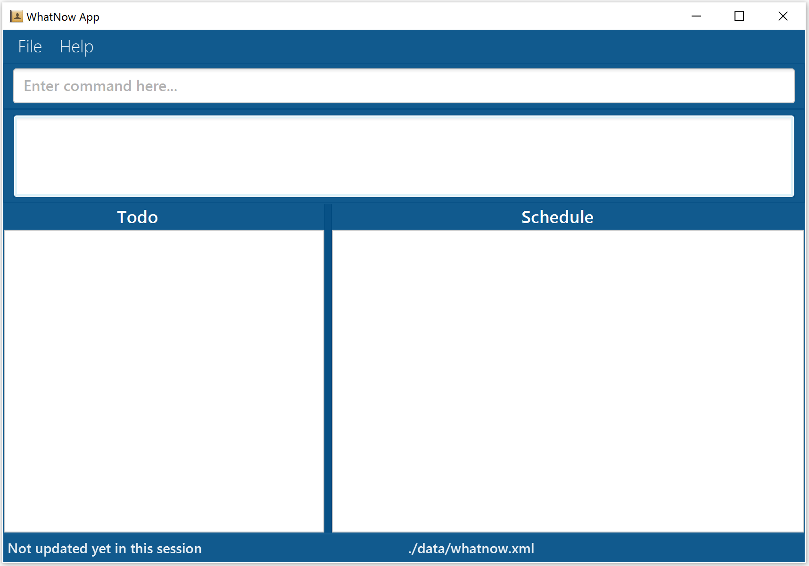 

Figure 1: GUI layout

5. Type a command in the command box and press <kbd>Enter</kbd> to execute it.
   e.g. typing **`help`** then press <kbd>Enter</kbd> will open the help window. 
6. Some example commands you can try:
   * **`list`** : lists all tasks in WhatNow.
   * **`add`**` "Buy groceries"` : adds a task called `Buy groceries` to WhatNow.
   * **`delete`**` todo 3` : deletes the 3rd task shown in the Todo tasks.
   * **`exit`** : exits WhatNow.
7. Refer to the [Features](#features) section below for details of each command. 

## Features

> **Command Format**
> * Words in `UPPER_CASE` are the parameters.
> * Items in `SQUARE_BRACKETS` are optional.
> * Items with `...` after them can have multiple instances.
> * The order of parameters is fixed.

### Changing storage location : `change`
Changes the data file storage location.

Format: `change location to PATH`

Example:
* `change location to C:\Users\user\Desktop`
Changes the data file storage location to C:\Users\user\Desktop

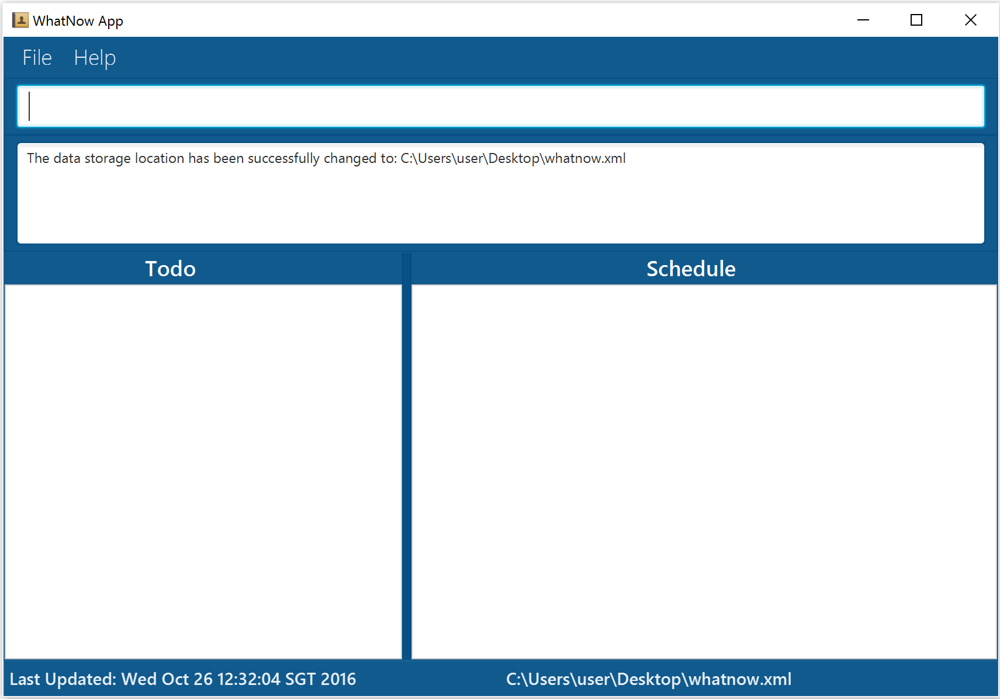 

Figure 2: The storage location is changed

### Adding a task: `add`
Adds everyday tasks, deadlines and events to WhatNow. Everyday tasks are listed under Todo and the others are listed under Schedule.

#### Adds a task to WhatNow
Format: `add "DESCRIPTION" [t/TAG]...`
> * All description should be written within double quotation marks.
> * Tasks without date and time specified will be added to WhatNow as a Todo task and will be displayed under the heading "Todo".

Example:
* `add "Buy chocolate milk"`
Adds a Todo task "Buy choclate milk".

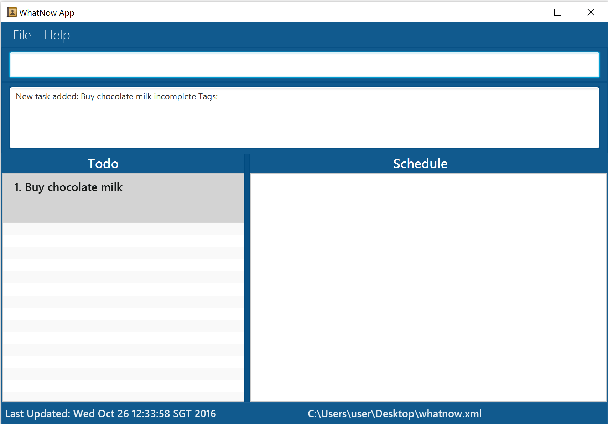 

Figure 3: A task without date and time specified added under Todo

#### Adds a deadline to WhatNow
Format: `add "DESCRIPTION" by TODAY/TOMORROW/DAY/DATE/TIME/DATE-TIME [every] [t/TAG]...`
> * The format for date must be day month year where year is optional. If no year is specified, it is assumed to be the current year.
Eg: 10 Oct, 4 november, 11 August 2017, 12/12/2016.
* If no date is specified, it is assumed to be today.
* Time should be in the 12 hour format.
Eg: 10am, 6PM, 7.30pm, 7:30pm.
* Tasks with date and time specified will be added to WhatNow as a deadline task and will be displayed under the header "Schedule".

Examples:
* `add "CS2103 Project" by 20/11/2016 t/low`
Adds a Schedule task "CS2103 Project" of low priority on 20 November 2016.
* `add "Pay School Fees" by 11am t/medium`
Adds a Schedule task "Pay School Fees" of high priority on today 11am.
* `add "Submit CS2101 User Guide" by 12/12/2016 t/high`
Adds a Schedule task "Submit CS2101 User Guide" of medium priority on 12 December 2016.

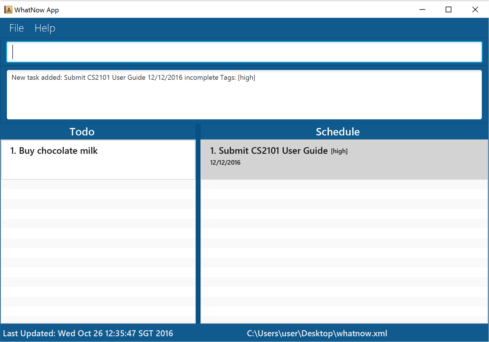 

Figure 4: A deadline task with date, time and priority specified added under Schedule tasks

#### Adds an event to WhatNow
Format: `add "DESCRIPTION" [every] DAY from TIME to TIME [t/TAG]�`

Format: `add "DESCRIPTION" on [every] DATE/TIME/DATE-TIME [t/TAG]�`

Format: `add "DESCRIPTION" from DATE/TIME/DATE-TIME to DATE/TIME/DATE-TIME [t/TAG]�`
> * The format for date must be day month year where year is optional. If no year is specified, it is assumed to be the current year.
Eg: 10 Oct, 4 november, 11 August 2017, 12/12/2016.
* If no date is specified, it is assumed to be today.
* Time should be in the 12 hour format.
Eg: 10am, 6PM, 7.30pm, 7:30pm.
* Tasks with date and time specified will be added to WhatNow as a deadline task and will be displayed under the header "Schedule".

Examples:
* `add �CS2016 Tutorial� every Tuesday from 12pm to 2.30pm t/medium`
Adds a Schedule task "CS2106 Tutorial" of medium priority on every Tuesday from 12pm to 2.30pm.
* `add �Drashti�s Birthday� every 30 Aug t/high`
Adds a Schedule task "Drashti�s Birthday" of high priority every 30 Aug.
* `add �Java Workshop� from 12/12/2016 8am to 15/12/2016 5pm t/high`
Adds a Schedule task "Java Workshop" of high priority from 12 December 2016 8am to 15 December 2016 5pm.

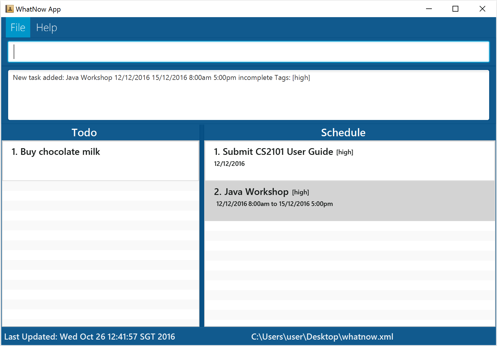 

Figure 5: An event task with period and priority added under Schedule tasks

###Marking a task as completed: done
Marks a task from WhatNow as completed.

Format: `done todo/schedule INDEX`
> * Marks the task at the specified INDEX from Todo or Schedule as completed.
* Completed tasks will be hidden from the current view.
* The index refers to the index number shown in the current listing.
* The index must be a **positive integer** 1, 2, 3, ...

Examples:
* `done todo 1`
Marks the 1st Todo task from the displayed list in WhatNow as completed
* `done schedule 2`
Marks the 2nd Schedule task from the displayed list in WhatNow as completed.

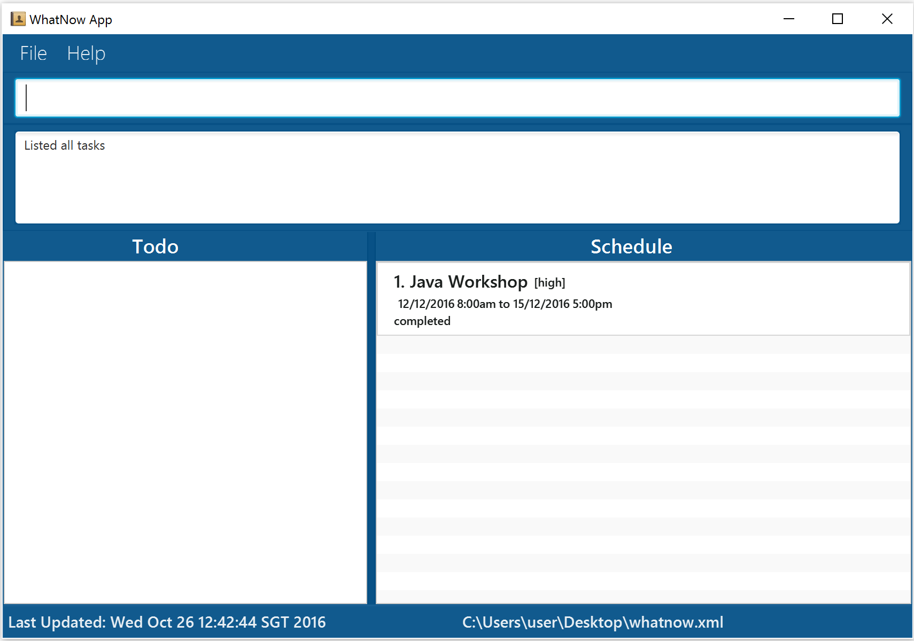 

Figure 6: Display after a task is marked done

### Listing all tasks: `list`
Shows a list of all tasks that match task type, date, time and priority requested by you.

Format: `list [all/completed] [on/at/with] [DATE/PRIORITY]`
> * If all/completed is not stated, then only ongoing (i.e. incomplete) tasks will be displayed.
* The format for date must be day month year where year is optional. If no year is specified, it is assumed to be the current year.
Eg: 10 Oct, 4 November, 11 August 2017, 12/12/2016.
* If no date is specified, it is assumed to be today.
* Time should be in the 12 hour format.
Eg: 10am, 6PM, 7.30pm, 7:30pm.

Examples:
* `list`
Returns the lists of all incomplete tasks.

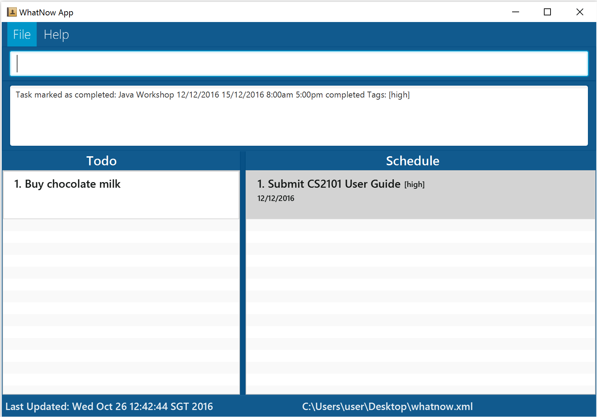 

Figure 7: Display with ongoing task listed

* `list all`
Returns the lists of all incomplete and completed tasks.

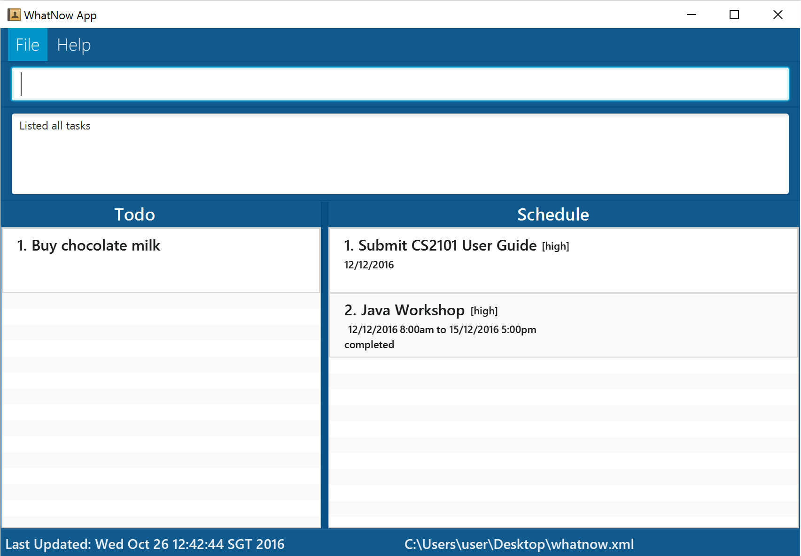 

Figure 8: Display with all tasks listed

* `list done`
Returns the lists of all completed tasks.

 

Figure 9: Display with all completed tasks listed

### Deleting a task: `delete`
Deletes a task from WhatNow.

Format: `delete todo/schedule INDEX`
> * Deletes the task at the specified `INDEX` from Todo or Schedule as specified.
* The index refers to the index number shown in the current listing.
* The index must be a **positive integer** 1, 2, 3, ...

Examples:
* `delete todo 4`
Deletes the 4th Todo task from the displayed list in WhatNow.
* `delete schedule 2`
Deletes the 2nd Schedule task from the displayed list in WhatNow.

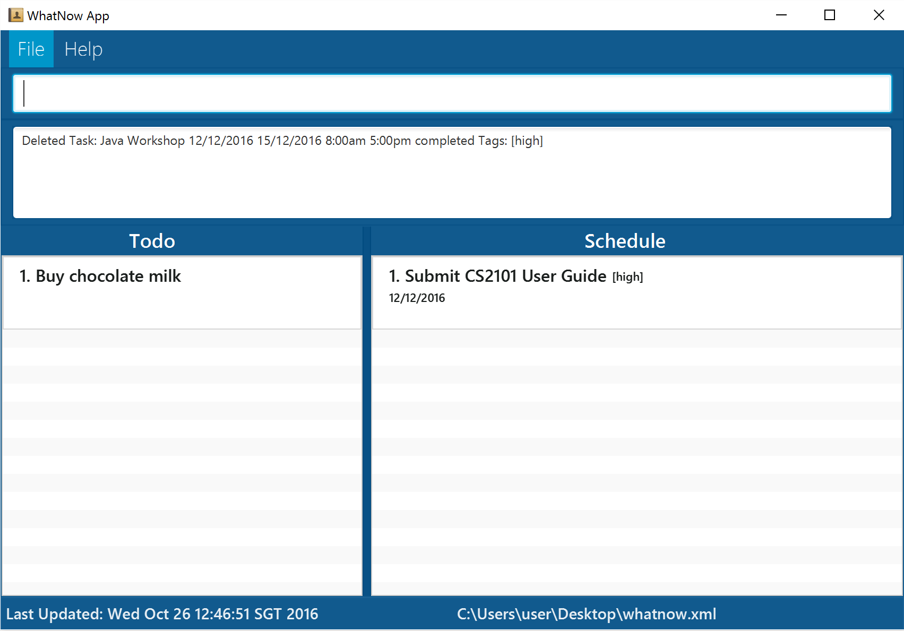 

Figure 10: Display after delete

### Updating a task: `update`
Updates a task from the list displayed.

Format: `update todo/schedule INDEX description/date/time/tag NEW_VALUE`
> * Updates the description/date/time/tag of the task at the specified INDEX from Todo or Schedule as specified.
* The index refers to the index number shown in the current listing.
* The index must be a **positive integer** 1, 2, 3, ...

Examples:
* `update todo 3 description Avengers`
Selects the 3rd Todo task from the displayed list and changes the task description to Avengers.
* `update todo 4 date 11 Nov`
Selects the 4th Todo task from the displayed list and changes the type of task from Todo to Schedule.
* `update schedule 1 date 15/12/2016`
Selects the 1st Schedule task from the displayed list and changes the date to 15/12/2016.

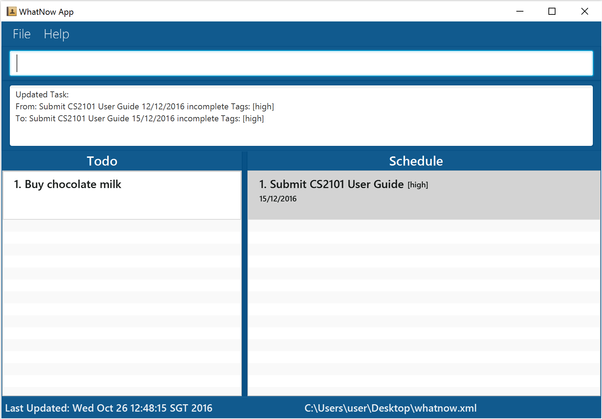 

Figure 11: Display after the update

### Undoing the previous action: `undo`
There can be multiple undoes to revert to the previous state.

Format: `undo`

Example:
* `undo`
Undo the previous action.

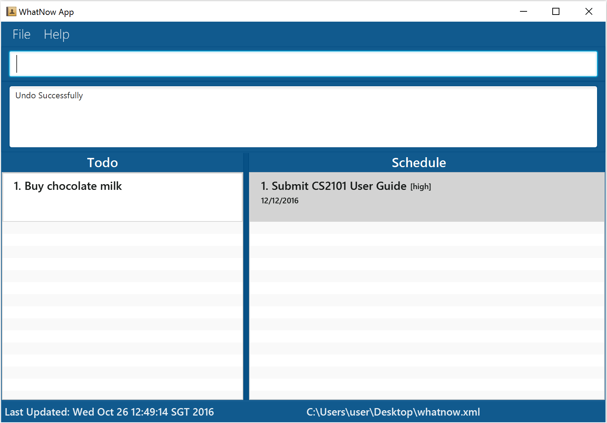 

Figure 12: Display after an update action is undone

### Redoing the previous action: `redo`
There can be multiple redoes to revert to the previous state.

Format: `redo`

Example:
* `redo`
Redo the previous action.

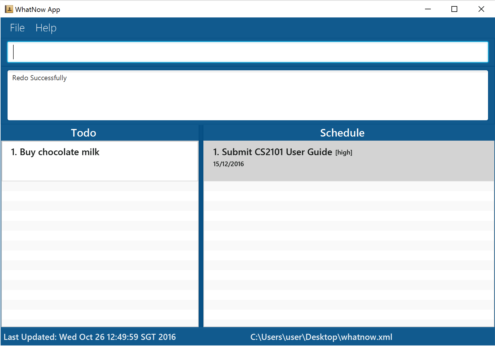 

Figure 13: Display after a redo is called after an undo

### Finding tasks containing any keyword in their description: `find`
Search for all tasks whose description contains any of the given keywords.

Format: `find KEYWORD [MORE_KEYWORDS]`
> * The search is not case sensitive. e.g. Read will match read.
* The order of the keywords does not matter. E.g. Read books will match books Read.
* Only the task description is searched.
* All task descriptions containing the keyword will be matched e.g. Book will match Books.
* Tasks matching at least one keyword will be returned (i.e. OR search). e.g. Read Study will match Read books.

Examples:
* find Read
Returns Read books and read.
* find Read books lecture notes
Return any tasks having the description Read, books, lecture or notes (case insensitive).
* find CS2101
Returns any tasks having the description CS2101.

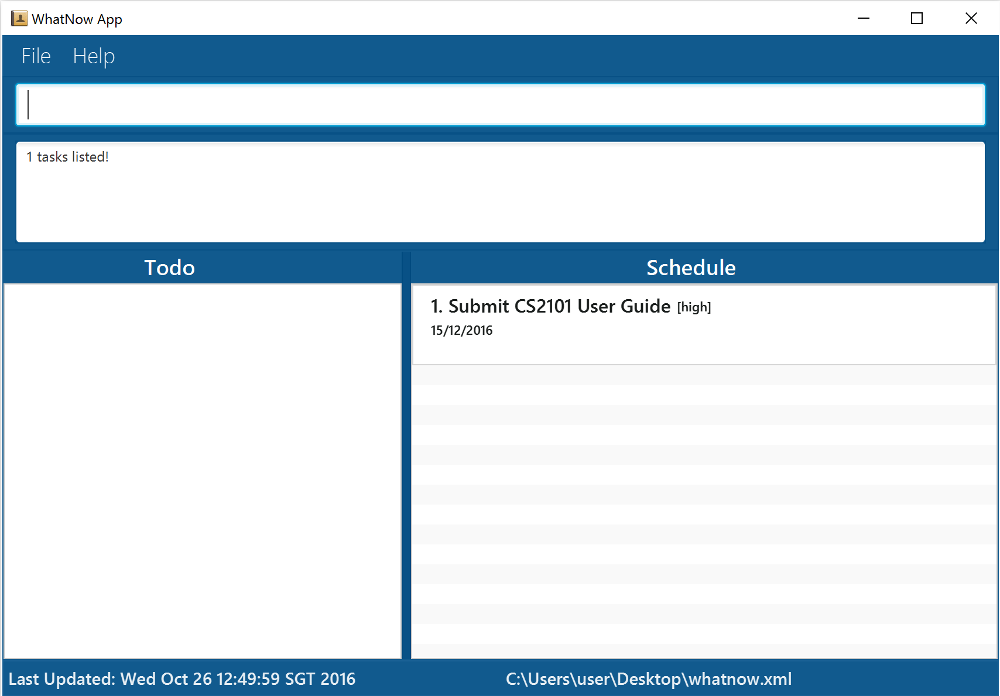 

Figure 14: Display result after find is executed

### Viewing help: `help`
Opens the help page.

Format: `help`

### Saving the data
WhatNow data are saved in the hard disk automatically after any command that changes the data. There is no need to save manually after you make any changes or additions.

### Clearing all tasks: `clear`
Clears all tasks from WhatNow.

Format: `clear`

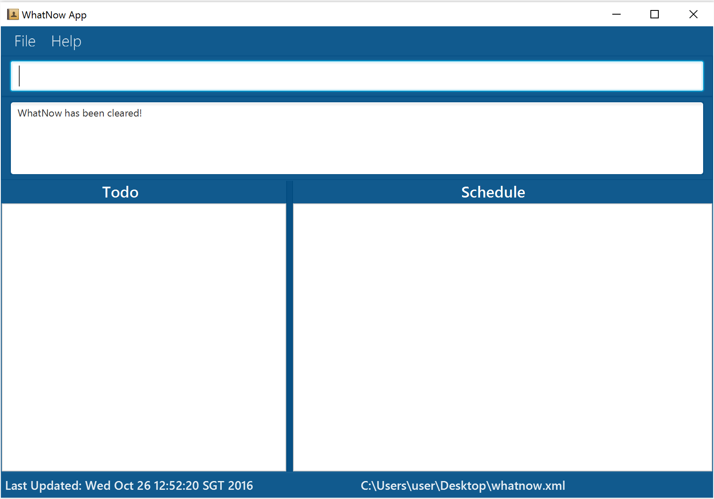 

Figure 15: Display cleared after command executed

### Exiting the program: `exit`
Exits the program.

Format: `exit`

## FAQ
Q: How do I transfer my data to another Computer?
A: Install the app in the other computer and overwrite the empty data file it creates with the file that contains the data of your previous WhatNow folder.

## Command Summary
Command | Format
-------- | :--------
Add | `add "DESCRIPTION" [t/TAG]`   `add "DESCRIPTION" by TODAY/TOMORROW/DAY/DATE/TIME/DATE-TIME [every] [t/TAG]`   `add "DESCRIPTION" [every] DAY from TIME to TIME [t/TAG]�`   `add "DESCRIPTION" on [every] DATE/TIME/DATE-TIME [t/TAG]�`   `add "DESCRIPTION" from DATE/TIME/DATE-TIME to DATE/TIME/DATE-TIME [t/TAG]�`
Change | `change location to PATH`
Clear | `clear`
Delete | `delete todo/schedule INDEX`
Done | `done todo/schedule INDEX`
Exit | `exit`
Find | `find KEYWORD [MORE_KEYWORDS]`
Help | `help`
List | `list [all/completed] [on/at/with] [DATE/TIME/PRIORITY]`
Redo | `redo`
Undo | `undo`
Update | `update todo/schedule INDEX description/date/start/end/priority/tag NEW_VALUE`