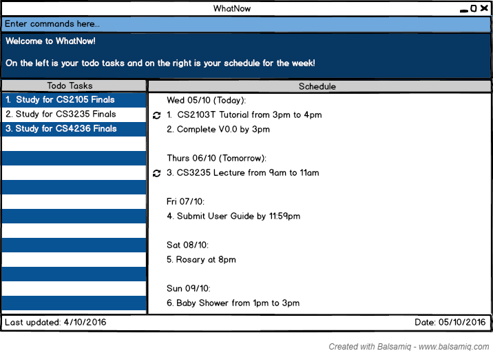

# User Guide
Are you feeling stressed or overwhelmed with the number of things you have to do? When you are drowning in the pool of to-dos, even mundane tasks like buying milk may bring tears to your eyes. Well you can hold back those precious tears because WhatNow will help you to manage all your tasks.

Now that you know WhatNow is [about](../README.md), you can follow this guide to learn how to use WhatNow effectively.

Welcome to WhatNow! 

# Table of Contents
* [Quick Start](#quick-start)
* [Features](#features)
* [FAQ](#faq)
* [Command Summary](#command-summary)

## Quick Start

0. Ensure you have Java version `1.8.0_60` or later installed in your Computer. 
   > Having any Java 8 version is not enough.  
   This app will not work with earlier versions of Java 8.
   
1. Download the latest `WhatNow.jar` from the [releases](../../../releases) tab.
2. Copy the file to the folder you want to use as the home folder for your WhatNow.
3. Double-click the file to start the app. The GUI should appear in a few seconds. 
   > 

4. Type the command in the command box and press <kbd>Enter</kbd> to execute it.  
   e.g. typing **`help`** then press <kbd>Enter</kbd> will open the help window. 
5. Some example commands you can try:
   * **`list`** : lists all tasks in WhatNow
   * **`add`**` Buy groceries` : adds a task called `Buy groceries` to WhatNow.
   * **`delete`**` 3` : deletes the 3rd task shown in the current list
   * **`exit`** : exits WhatNow
6. Refer to the [Features](#features) section below for details of each command. 

## Features

> **Command Format**
> * Words in `UPPER_CASE` are the parameters.
> * Items in `SQUARE_BRACKETS` are optional.
> * Items with `...` after them can have multiple instances.
> * The order of parameters is fixed.

#### Changing storage location : `change`
Changes the data file storage location.  
Format: `change location to PATH`

Examples:
* `change location to C:\Users\Verbena\Dropbox\WhatNow` 
Changes the data file storage location to C:\Users\Verbena\Dropbox\WhatNow 

#### Adding a task: `add`
Adds a task to WhatNow 
Format: `add "DESCRIPTION" [on/by] [today/tomorrow/DAY/DATE] [from/at] [START_TIME] [to/till] [END_TIME] [every] [DAY/day/week/month/year] [low/medium/high]` 

>All task description should be written within double quotation marks. Eg Add “buy eggs”.  
The format for date must be *day month year* where year is optional. Eg: 10th Oct, 4 November, 11th August 2017. Not 12/12/12.  
Time should be in the *12 hour format*. Eg: 10am, 6pm, 7.30pm. Not 7:30pm, 2359.

Examples:
* `add "Do CS2103T tutorial" on 4 Oct 2016 from 10am to 11am every week` 
Adds a recurring scheduled task “CS2103T tutorial” on the 4th October 2016 from 10am to 11am every week. 
* `add "Watch Storks movie" on 10/10 from 1pm to 3pm` 
Adds a scheduled task “Watch Storks movie” on 10th October 2016 from 1pm to 3pm. 
* `add "CS2103 Project" by 20/11/2016 high` 
Adds a scheduled task “CS2103 Project” of high priority on 20th November 2016. 
* `add “CS2105 Tutorial” on Thursday at 11am till 12pm every week` 
Adds a recurring scheduled task “CS2105 Tutorial” on Thursday from 11am to 12pm.
* `add "Buy pizza" at 7pm` 
Adds a scheduled task “Buy pizza” today at 7pm. 
* `add "Charlie Puth concert” on 15th Oct 6pm"` 
Adds a scheduled task “Charlie Puth concert” on 15th October at 6pm.
* `add "Buy chocolate milk"` 
Adds a todo task “Buy chocolate milk”.

>Tasks with date and time specified will be added to WhatNow as a schedule task and will  be displayed under the heading "Schedule".  
> 

>Tasks without date and time specified will be added to WhatNow as a todo task and will  be displayed under the heading "Todo Tasks".
> 

#### Listing all tasks: `list`
Shows a list of all tasks that match task type, date, time and priority requested by user. 
Format: `list [date/time/priority] KEYWORD`

> Shows a list of all tasks that match the keyword for the task type, date, time and priority requested by user.

Examples: 
* `list` 
Returns a list of all tasks.  

* `list completed` 
 Returns a list of all completed tasks.  
* `list todo` 
Returns a list of all todo tasks.  
* `list priority medium` 
Returns a list of all tasks that have a medium priority.  
* `list time 6pm` 
Returns a list of all tasks scheduled at 6pm.  
* `list date 3 Nov` 
Returns a list of all tasks scheduled for 3 November of the current year.  

>If you want to view any of the Todo tasks, Scheduled tasks or Completed tasks only, then you only  need to type in “todo”, “schedule” or “completed” as the keyword after the command list.  
> 

#### Deleting a task : `delete`
Deletes a task from WhatNow. Reversible. 
Format: `delete todo/schedule/completed INDEX`

> Deletes the task at the specified `INDEX` from todo tasks, schedule or completed tasks as specified.  
  The index refers to the index number shown in the current listing. 
  The index **must be a positive integer** 1, 2, 3, ...

Examples: 
* `delete todo 4` 
  Deletes the 4th todo task from the displayed list in WhatNow.  
  
* `delete schedule 2` 
  Deletes the 2nd schedule task from the displayed list in WhatNow.  
  

#### Updating a task : `update`
Updates a task from the list displayed 
Format: `update todo/schedule INDEX description/date/start/end/status/priority  NEW_VALUE`

> Updates the description/date/start/end/status/priority of the task at the specified `INDEX` from todo tasks or schedule as specified.  
  The index refers to the index number shown in the current listing. 
  The index **must be a positive integer** 1, 2, 3, ...

Examples: 
* `update todo 3 description Avengers` 
   Selects the 3rd todo task from the displayed list and changes the task description to ‘Avengers’
* `update todo 4 date 11 Nov` 
   Selects the 4th todo task from the displayed list and changes the type of task from todo to scheduled. 
* `update schedule 5 time 8:30pm` 
   Selects the 5th schedule task from the displayed list and changes the time to 8:30pm.  
 

#### Undoing the previous action : `undo`
There can be multiple undos to revert to the previous state. 
Format: `undo`  

Examples: 
* `undo` 
   Undo the previous action  

#### Redoing the previous action : `redo`
There can be multiple redos to revert to the previous state. 
Format: `redo`  

Examples: 
* `redo` 
   Redo the previous action  

#### Finding tasks containing any keyword in their description: `find`
Search for all tasks whose description contains any of the given keywords. 
Format: `find KEYWORD [MORE_KEYWORDS]`

> * The search is case sensitive. e.g `Read` will not match `read`
> * The order of the keywords does not matter. e.g. `Read books` will match `books Read`
> * Only the task description is searched.
> * All task description containing the keyword will be matched .e.g. `Book` will match `Books`
> * Tasks matching at least one keyword will be returned (i.e. `OR` search).
    e.g. `Read Study` will match `Read books`

Examples: 
* `find Read` 
  Returns `Read books` but not `read`
* `find Read books lecture notes` 
  Returns any tasks having the description `Read`, `books`, `lecture` or `notes`.
* `find CS3235` 
  Returns any tasks having the description `CS3235`.  

#### Viewing help : `help`
Displays a list of all commands.
Format: `help`

> Help is also shown if you enter an incorrect command e.g. `abcd`  
> 

#### Saving the data 
WhatNow data are saved in the hard disk automatically after any command that changes the data. 
There is no need to save manually after you make any changes or additions.

#### Clearing all tasks : `clear`
Clears all tasks from WhatNow. 
Format: `clear`  

#### Exiting the program : `exit`
Exits the program. 
Format: `exit`  

## FAQ

**Q**: How do I transfer my data to another Computer? 
**A**: Install the app in the other computer and overwrite the empty data file it creates with 
       the file that contains the data of your previous WhatNow folder.
       

## Command Summary

Command | Format  
-------- | :-------- 
Add | `add "DESCRIPTION" [on/by] [today/tomorrow/DAY/DATE] [from/at] [START_TIME] [to/till] [END_TIME] [every] [DAY/day/week/month/year] [low/medium/high]`
Change | `change location to PATH`
Clear | `clear`
Delete | `delete todo/schedule/completed INDEX`
Exit | `exit`
Find | `find KEYWORD [MORE_KEYWORDS]`
Help | `help`
List | `list [date/time/priority] KEYWORD`
Redo | `redo`
Update | `update todo/schedule INDEX [description/date/start/end/status/priority]  NEW_VALUE`
Undo | `undo`