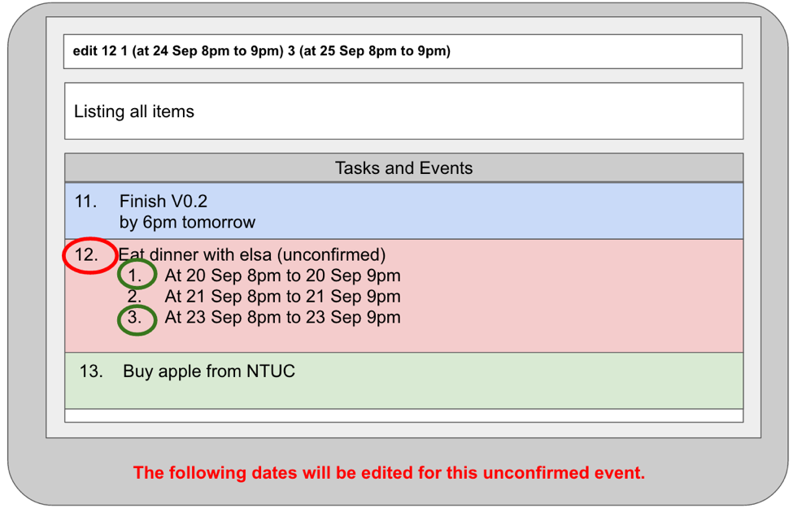
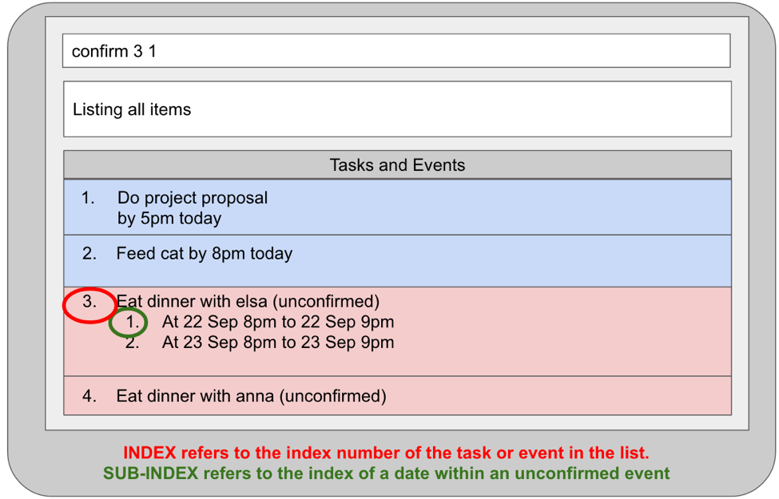

# User Guide

* [Quick Start](#quick-start)
* [Features](#features)
* [FAQ](#faq)
* [Command Summary](#command-summary)

## Quick Start

0. Ensure you have Java version `1.8.0_60` or later installed in your Computer. 
   > Having any Java 8 version is not enough.  
   This app will not work with earlier versions of Java 8.
   
1. Download the latest `dearjim.jar` from the [releases](../../../releases) tab.
2. Copy the file to the folder you want to use as the home folder for your Task Manager.
3. Double-click the file to start the app. The GUI should appear in a few seconds. 
   > 

4. Type the command in the command box and press <kbd>Enter</kbd> to execute it.  
   e.g. typing **`help`** and pressing <kbd>Enter</kbd> will open the help window. 
5. Some example commands you can try:
   * **`list`** : lists all tasks. This is the default view.
   * **`add`**` Learn how to use DearJim` : 
     adds a task to the Task Manager.
   * **`delete`**` 1` : deletes the 1st task shown in the current list
   * **`exit`** : exits the app
6. Refer to the [Features](#features) section below for details of each command. 

## Features

> **Command Format**
> * Words in `UPPER_CASE` are the parameters.
> * Items in `SQUARE_BRACKETS` are optional.
> * The order of parameters is fixed.

#### Viewing help : `help`
Format: `help`

> Help is also shown if you enter an incorrect command e.g. `abcd`
 
#### Adding an item: `add`
Adds an item into the task manager 

*With deadline*

Format: `add NAME by DUE_DATE DUE_TIME [repeat every RECURRING_INTERVAL]`
>Notice the `by` keyword? We use `by` to denote a deadline.

Examples:
* `add Do project proposal by 5pm tomorrow`
* `add Buy coffee for boss by 7am repeat every day`

*Without deadline*

Format: `add NAME [rank PRIORITY]`
>No deadlines? No worries. DearJim allows you to rank your priorities. Assign rank of 1 to 10, with 1 being the most important task. If you did not specify the priority, it will be assigned to a default value of 5.

Example:
* `add Buy coffee powder rank 1`

*With time interval*

`add NAME at DATE START_TIME to [DATE] END_TIME [repeat every RECURRING_INTERVAL]` 
> For events, meetings, we use `at`, `to` to specify the date/time interval.

Example: 
* `add Company meeting tonight at 7pm to 9pm`

*Tentative event*

Format: `add NAME (at DATE START_TIME to [DATE] END TIME...)` 
> Sometimes, we have an unconfirmed event slot. For example, the meeting your boss wants to hold might be on 2-3pm tomorrow, or the day after. 
> Group the list of dates inside `()` and separate each date with `,`

Example: 
* `add Company meeting (at 22 Sep 2pm to 3pm, at 23 Sep 2pm to 3pm)`

#### Editing an item: `edit`
Edits any item in the task manager 

*Any type except tentative*

Format: Replace 	`add` with `edit INDEX`
>Tip: We make the edit commands similar to add commands, so that you only have to learn one of them! Simply replace `add` with `edit INDEX` to do an edit.

Examples:
* `edit 10 Company meeting tomorrow morning at 7am to 9am`
* `edit 3 Buy coffee for boss by 7am repeat every 2 days`

*Tentative events*

Format: Replace `add` with  `edit INDEX (new OR SUB-INDEX)`
>Note: If you want to confirm the time slot, use the `confirm` command instead.

Example:
> 

* `edit 12 1 (at 24 Sep 8pm to 9pm) 3 (at 25 Sep 8pm to 9pm)`

#### Confirming a tentative event: `confirm`
Confirm a tentative event in your task manager. Must have added a tentative event first. Refer to `add` command. 

*Tentative event*

Format: `confirm INDEX SUBINDEX`

Example:
> 

* `confirm 3 1`

#### Deleting an item: `delete`
Delete an item in your task manager This process is reversible with the `undo` command. 
Format:
`delete INDEX` `delete all`

#### Undoing a command: `undo`
Format: `undo`

#### Redoing a command: `redo`
Format: `redo`

#### Archiving an item: `done`
Archive an item in your task manager. 

Format: `done INDEX`

#### Listing all items : `list`
Shows a list of all items in the task manager. 
Format: `list`

#### Find an item : `find`
Find an item by name. 
Format: `find NAME`

#### Saving the data 
Task manager data are saved in the hard disk automatically after any command that changes the data. 
There is no need to save manually.

## FAQ

**Q**: How do I transfer my data to another Computer? 
**A**: Install the app in the other computer and overwrite the empty data file it creates with 
       the file that contains the data of your previous *DearJim* folder.

**Q**: How do I install the program? 
**A**: Double click the icon
       
## Command Summary

Command | Format  
-------- | :-------- 
Add/Edit | `add`/`edit INDEX` `NAME by DUE_DATE DUE_TIME [repeat every RECURRING_INTERVAL]`
Add/Edit | `add`/`edit INDEX` `NAME [rank PRIORITY]`
Add/Edit | `add`/`edit INDEX` `NAME at DATE START_TIME to [DATE] END_TIME [repeat every RECURRING_INTERVAL]` 
Add/Edit | `add`/`edit INDEX (new OR SUB-INDEX)` `NAME (at DATE START_TIME to [DATE] END TIME)`
Confirm | `confirm INDEX SUB-INDEX`
Delete | `delete INDEX`
Undo | `undo`
Redo | `redo`
Done | `done INDEX`
List | `list`
Find | `find NAME`
Help | `help`
