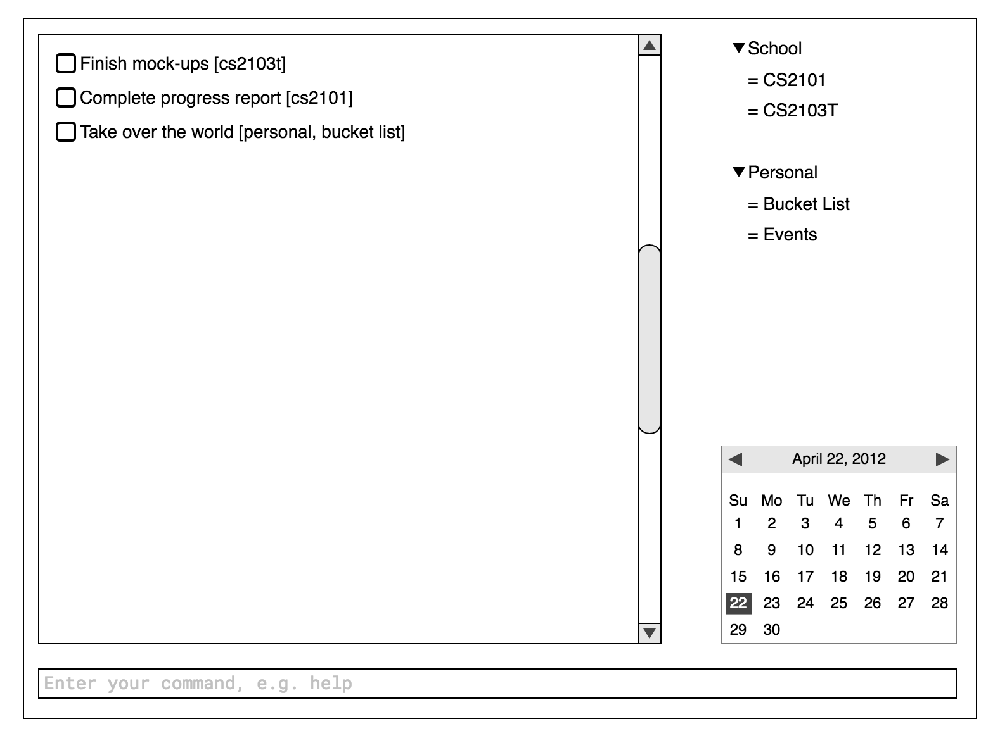

User guide
===================

## Getting Started



Our to-do application primarily takes in input using a command line interface. It supports the basic creation, reading, updating and deletion of entries. You may add entries with or without deadlines. These are known as tasks. Entries with a start and/or end time are known as events.

To start, try adding a new task:

```
$ add Get groceries
```

Before editing a task, you should obtain a task id by listing:

```
$ list

0 [ ] Get groceries
```

You can edit a task with the following command:

```
$ edit 0 -d 3 October
[ ] Get groceries, due: 3 October
```

Undo is quite easily done:

```
$ undo

$ list
[ ] Get groceries
```

Finally, try deleting the task:

```
$ list
[ ] Get groceries

$ delete 0
1 task deleted!

$ list
No tasks to display.
```

## Command Summary

| Command |Format |
| --- | --- |
|add|`add <task_name> [-st <start> -end <end> | -d <deadline>] [-t <tags>]  [-r <recurrence>] [-desc <description>]`|
|list|`list [-f [start=<start_value>] [end=<end_value>] [deadline=<deadline_value>][tags=<comma_separated_tags>] [recurrence=<recurrence_value>] [desc=<description_value>]]`|
|tag|`tag [-d] <task_id> <tag_name> [, <tag_name> …]`|
|edit|`edit <task_id> [-st <start> -end <end> | -d <deadline>] [-t <tags>]  [-r <recurrence>] [-desc <description>]`|
|delete|`delete <task_id>`|
|mark|`mark [-d] <task_id>`|
|show|`show <task_id>`|
|help|`help [<command>]`|
|config|`config [option=value ...]`|


## Commands

```
add <entry_name> [-st <start> -end <end> | -d <deadline>] [-t <tags>]  [-r <recurrence>] [-desc <description>]
```

> Add event or deadline

> Examples:


> - `add CS2103T Lecture -st 1/1/2016:1400 -end 1/1/2016:16:30 -r weekly -t ‘rocks’`

> - `add CS2105 Assignment 1 -d 1/1/2016:1400`

```
list [-f [start=<start_value>] [end=<end_value>] [deadline=<deadline_value>] [tags=<comma_separated_tags>] [recurrence=<recurrence_value>] [desc=<description_value>]]
```

> List all or filtered entries

> Examples:

> - `list`

> - `list -f start=06/09/2016 recurrence=everyday`

```
tag [-d] <entry_id> <tag_name> [, <tag_name> …]
```

> Add tag(s) to a particular entry with a specified id

> Examples:

> - `tag 123 ‘CS2103T’, ‘rocks’`

> Delete tag(s) from a particular entry with a specified id and the -d flag

> - `tag -d 123 ‘rocks’`

> Duplicated tags will only be added once

```
edit <entry_id> [-st <start> -end <end> | -d <deadline>] [-t <tags>]  [-r <recurrence>] [-desc <description>]
```

>  Edit the entry with the specified entry id.

>  `list` should be executed before this command to obtain a entry id.

> Examples:

> - `edit 3 -t school`

> - `edit 13 -r yearly`

```
delete <entry_id>
```
> Delete the task with a particular entry id

> `list` should be executed before this command to obtain a entry id.

> Examples:

> - `Delete 42`

```
mark [-d] <entry_id>
```

> Check or uncheck a entry as completed.

> `list` should be executed before this command to obtain a entry id.

> Examples:

> - `mark 42`

```
show <entry_id>
```
> Display the details of a particular entry

> `list` should be executed before this command to obtain a entry id.

```
help [<command>]
```

> Show available commands and how to use them

> Help is also shown if you enter an incorrect command e.g. abcd

```
config [option=value ...]
```
> Configure user settings: name, file path to data file

> Examples:

> - `config name=Jim`
