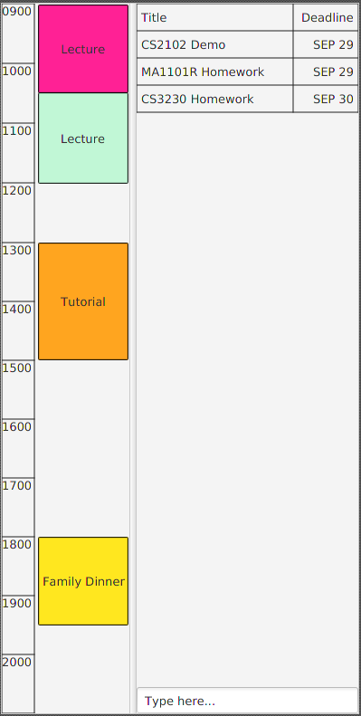

# User Guide

* [About](#about)
* [Quick Start](#quick-start)
* [Features](#features)
* [File Format](#file-format)
* [FAQ](#faq)
* [Command Summary](#command-summary)

##About
TaskMan is a task management application that aims to simplify the way you work with your tasks and events. It is a Java desktop application that can work offline, without requiring Internet connection. 

It uses a simple graphical user interface to display your events and tasks. Instead of trying to find and click buttons all over the screen, you just need to type through your keyboard to give the necessary commands, and TaskMan will do the rest for you. 

## Quick Start

0. Ensure you have Java version `1.8.0_60` or later installed in your Computer. 
   > Having any Java 8 version is not enough.  
   This app will not work with earlier versions of Java 8.
   
1. Download the latest `taskman.jar` from the [releases](../../../releases) tab.
2. Copy the file to the folder you want to use as the home folder for your TaskMan.
3. Double-click the file to start the app. The GUI should appear in a few seconds.
   > 

4. Type the command in the command box and press <kbd>Enter</kbd> to execute it.  
   e.g. typing **`help`** and pressing <kbd>Enter</kbd> will open the help window.
5. Some example commands you can try:
   * **`list`**: lists all tasks
   * **`add`**` CS2103T Tutorial d/wed 0959 start/tue 2359 end/wed 4am` :
     adds a task titled `CS2103T Tutorial` to TaskMan
   * **`delete`**` 3`: deletes the 3rd task shown in the current list
   * **`exit`**: exits the app
6. Refer to the [Features](#features) section below for details of each command. 

## Features

> **Command Format**
> * Words in `UPPER_CASE` are the parameters.
> * Items in `SQUARE_BRACKETS` are optional.
> * Only one item should be picked from items in `CURLY_BRACES`.
> * Items with `...` after them can have multiple instances.
> * The order of parameters is not fixed.

#### Viewing help: `help`
Command Format: `help`

> Help is also shown if you enter an incorrect command e.g. `abcd`
 
#### Adding a task: `add`
Adds a task to TaskMan 
Command Format: `add TITLE [d/DEADLINE] [s/SCHEDULE] [f/FREQUENCY] [t/TAG]...`

Parameter | Format
-------- | :-------- 
`SCHEDULE` | `DATETIME`, `DATETIME to DATETIME` or `DATETIME for X{hr/d/wk/mth/yr}` where X is a number (non-negative integer or decimal) and h is hour, d is day, w is week. Event is taken to be 1 hour long if not specified. 
`DEADLINE` and `DATETIME` | `[this/next] ddd [hhmm]` (more flexibility will be expected in later versions)
`FREQUENCY` | `X{hr/d/wk/mth/yr}` where X is a natural number, hr is hour, d is day, wk is week, mth is month, and yr is year.

The `SCHEDULE` represents the period of time the task is scheduled to be worked on. The presence of just `c/` will mark the task as completed.

> Tasks can have any number of tags. Tags may contain spaces and are case-insensitive (i.e. tags "school", "School", and "SCHOOL" are the same tags).

Examples:
* `add CS2103T Pre-Tutorial Work d/wed 0959 s/tue 2359 to wed 4am`
* `add CS2101 HW d/next mon 1159 t/CS2101 t/V0.0`
* `add Take a shower d/thu 0200 s/thu 0200 to fri 0030 f/1d t/Life`

#### Adding an event: 'add e'
Adds a task to TaskMan 
Command Format: `add e TITLE [s/SCHEDULE] [f/FREQUENCY] [t/TAG]...`

Parameter | Format
-------- | :-------- 
`SCHEDULE` | `DATETIME`, `DATETIME to DATETIME` or `DATETIME for X{hr/d/wk/mth/yr}` where X is a number (non-negative integer or decimal) and h is hour, d is day, w is week. Event is taken to be 1 hour long if not specified. 
`DATETIME` | `[this/next] ddd [hhmm]` (more flexibility will be expected in later versions)
`FREQUENCY` | `X{hr/d/wk/mth/yr}` where X is a natural number, hr is hour, d is day, wk is week, mth is month, and yr is year.

The `SCHEDULE` represents the period of time which the event is occurring.

> Similarly like tasks, events can have any number of tags. Tags may contain spaces and are case-insensitive (i.e. tags "school", "School", and "SCHOOL" are the same tags).

Examples:
* `add CS2103T Lecture s/fri 1400 to fri 1600 f/1wk t/CS2103T`
* `add Project Meeting s/mon 1400 to mon 1400 t/CS2101 t/Lunch Time`

####Changing the View: `view`
Shows a different view based on the parameters entered. 
Command Format: view [{more/less/cal/day}]
Examples:
* `view more` 
Show more details in the list
* `view less` 
Show less details in the list
* `view cal` 
Shows a GUI calendar in for the specified month
* `view day` 
Shows a detailed view of the entire day, inclusive of tasks and vacant timeblocks 

#### Listing all tasks: `list`
Shows a list of all tasks or events, depending on the view, whose titles contain any of the given keywords or contains any given tags. 
Command Format: `list [{e/, all/}] [KEYWORD]... [t/TAG]... `

> * The list returns tasks only by default. Lists with `e/` returns events only while lists with `all/` returns both tasks and events.
> * The search is case-insensitive. e.g `cs3244` will match `CS3244`
> * The order of the keywords does not matter. e.g. `CS3244 Homework` will match `Homework CS3244`
> * Only the title is searched.
> * Only full words will be matched e.g. `CS` will not match `CS3244`
> * Tasks/Events matching at least one keyword or one tag will be returned (i.e. `OR` search).
    e.g. `CS3244` will match `CS3244 Homework`, a task with tags `t/CS2103T` and `t/hw` will match a search for `t/hw`

Examples:
* `find CS2103T` 
  Returns Tasks with `CS2103T` in their titles
* `find CS2101 CS3230 CS2103T t/hw` 
  Returns any task or event having titles `CS2101`, `CS3230`, or `CS2103T` or tag `hw`

#### Completing a Task: `complete`
Marks the specified task as completed.
Command Format: `complete INDEX` or `complete list`

#### Editing a task/event: `edit`
Edits a task or event to TaskMan 
##### For a Task:
Command Format: `edit INDEX TITLE [d/DEADLINE] [s/SCHEDULE] [c/STATUS] [f/FREQUENCY] [t/TAG]...`
##### For an Event:
Command Format: `edit INDEX TITLE [s/SCHEDULE] [f/FREQUENCY] [t/TAG]...`

Parameter | Format
-------- | :-------- 
`SCHEDULE` | `DATETIME`, `DATETIME to DATETIME` (or `DATETIME for X{hr/d/wk/mth/yr}` in later versions) where X is a number (non-negative integer or decimal) and h is hour, d is day, w is week. Event is taken to be 1 hour long if not specified. 
`DATETIME` | `[this/next] ddd [hhmm]` (more flexibility will be expected in later versions)
`STATUS` | `y/n` where y denotes complete and n denotes incomplete
`FREQUENCY` | `X{hr/d/wk/mth/yr}` where X is a natural number, hr is hour, d is day, wk is week, mth is month, and yr is year.

Fields which are not present are assumed to stay unchanged. By adding tags, previous tags are removed and the new tags are added to the task/event.

Examples:
* `list` 
  `edit 1 CS2103T Tutorial s/mon 2200 to tue 0200` 
  Changes title of the 1st task/event to `CS2103T Tutorial` and the schedule to `mon 2200 to tue 0200`
* `edit CS2101 Tutorial d/thu 1159`

#### Deleting a task: `delete`
Deletes the specified task from TaskMan. Irreversible. 
Command Format: `delete INDEX` or `delete list`

> Deletes the task at the specified `INDEX` or `list`.
  The index refers to the index number shown in the most recent listing. 
  The index **must be a positive integer** 1, 2, 3, ...

Examples:
* `list` 
  `delete 2` 
  Deletes the 2nd task in TaskMan.
* `list CS2101` 
  `delete list` 
  Deletes all of the tasks in the result(s) of the `find` command.

#### Select a task: `select`
Selects the task identified by the index number used in the last task listing. 
Command Format: `select INDEX`

> Selects the task and loads the Google search page the task at the specified `INDEX`.
  The index refers to the index number shown in the most recent listing. 
  The index **must be a positive integer** 1, 2, 3, ...

Examples:
* `list` 
  `select 2` 
  Selects the 2nd task in TaskMan.
* `find CS2101` 
  `select 1` 
  Selects the 1st task in the results of the `find` command.

#### Showing all tags: `tag`
Shows all tags used by the user 
Command Format: `tag list`

Examples:
* `tag list` 
  Outputs: V0.1  V0.2  V0.3  Apple  Pear  Orange

#### Adding tags to tasks: `tag`
Adds tags to the specified task from TaskMan 
Command Format: `tag INDEX [t/TAG]...`

Examples:
* `find CS2103T`
  `tag 1 t/V0.1` 
  Tags the first task in the result(s) of `find CS2103T` with the tag V0.1.

#### Removing tags from Tasks: `untag`
Removes tags from the specified task from TaskMan
Command Format: `untag INDEX [t/TAG]...` or `untag all`
Examples:
* `find CS2103T`
  `untag 1 t/V0.1` 
  Untags the tag V0.1 from the first task in the result(s) of `find CS2103T`.
* `list`
  `untag 1 all` 
  Untags all tags from the the first task in list result(s).

#### Editing tag name: `retag`
Edits name of a tag from TaskMan. 
Command Format: `retag t/ORIGINAL_NAME t/DESIRED_NAME`

Examples:
* `retag t/CS2103T t/software engine` 
  Renames the tag `CS2103T` to `software engine`

#### Sorting tasks: `sort`
Sorts the recent listing of tasks according to the specified attribute. Default sort order is ascending. 
Command Format: `sort ATTRIBUTE` [desc]

`ATTRIBUTE` can be either `TITLE`, `DEADLINE`, `START`, or `END`.

Examples:
* sort start desc

#### Viewing command history: `history`
List the latest 10 commands **which have made changes to the data** in reverse chronological order. 
Command Format: `history`

#### Undoing commands: `undo`
Undo the last X commands in the command history. Irreversible. The command history stores a maximum of the 10 latest commands **which have made changes to the data**. 
Command Format: `undo [number]` or `undo all`

Examples:
* `undo` 
  Undo the latest command in TaskMan.
* `undo 2` 
  `undo 3` 
  Undo the latest 5 commands in TaskMan.
* `undo all` 
  Undo the latest 10 commands in Taskman.

<!--
#### Clearing all entries: `clear`
Clears all entries from TaskMan. 
Command Format: `clear`
-->

#### Exiting the program: `exit`
Exits the program. 
Command Format: `exit`

#### Saving the data
TaskMan data are saved in the hard disk automatically after any command that changes the data. 
There is no need to save manually.

#### Setting the save and load location: `storageloc`
Saves to the specified file name and location and sets the application to load from the specified location in the future. 
TaskMan data are saved in a file called tasks.txt in the application folder by default. 
The filename **must end in .xml 
Format: `storageloc [LOCATION]`

Examples:
* `storageloc C:/Users/Owner/Desktop/new_tasks.xml` 
    Sets the new save and load location to C:/Users/Owner/Desktop/new_tasks.xml
* `storageloc default` 
    Sets the new save and load location to tasks.xml in the current application folder

## File Format
The file is saved in xml format, which is easy to read and write with appropriate editors.

#### Task
Each Task is saved in the following format:
> `<tasks>` 
> `<title>TITLE</title>` 
> `<deadline>DD-MM-YYYY TT:TT</deadline>` 
> `<schedule>DD-MM-YYYY TT:TT to DD-MM-YYYY TT:TT</schedule>` 
> `<frequency>X{hr/d/wk/mth/yr}</frequency>` 
> `<tagged>TAGNAME</tagged>` 
> `<tagged>TAGNAME</tagged>` 
> `</tasks>` 

Fields which are empty can be left out. 
Example:
> `<tasks>` 
> `<title>CS2103T Tutorial HW</title>` 
> `<deadline>11-10-2016 23:59</deadline>` 
> `<schedule></schedule>` 
> `<frequency>1wk</frequency>` 
> `<tagged>CS2103T</tagged>` 
> `</tasks>`

#### Event
Each Event is saved in the following format:
> `<events>` 
> `<title>TITLE</title>` 
> `<schedule>DD-MM-YYYY TT:TT to DD-MM-YYYY TT:TT</schedule>` 
> `<frequency>1wk</frequency>` 
> `<tagged>TAGNAME</tagged>` 
> `<tagged>TAGNAME</tagged>` 
> `</events>`

Fields which are empty can be left out. 
Example:
> `<events>` 
> `<title>CS2103T Lecture</title>` 
> `<schedule>01-10-2016 12:00 to 01-10-2016 14:00</schedule>` 
> `<frequency>X{hr/d/wk/mth/yr}</frequency>` 
> `<tagged>CS2103T</tagged>` 
> `<tagged>lecture</tagged>` 
> `</events>`

#### Tag
Each Tag is saved in the following format:
> `<tags>` 
> `<tagName>TAGNAME</tagName>` 
> `</tags>`

Example:
> `<tags>` 
> `<tagName>CS2103T</tagName>` 
> `</tags>`

## FAQ

**Q**: How do I transfer my data to another Computer? 
**A**: Install the app in the other computer and overwrite the empty data file it creates with the file that contains the data of your previous TaskMan folder.

## Command Summary

Command | Format
-------- | :--------
Add | `add TITLE [d/DEADLINE] [s/SCHEDULE] [f/FREQUENCY] [t/TAG]...    `
Add Event | `add e TITLE [s/SCHEDULE] [f/FREQUENCY] [t/TAG]...    `
Clear | `clear`
Complete | `complete`
Delete | `delete INDEX` or `delete list`
Edit | `edit INDEX TITLE [d/DEADLINE] [s/SCHEDULE] [c/STATUS] [f/FREQUENCY] [t/TAG]...`
Exit | `exit`
Help | `help`
History | `history`
List | `list [{e/, all/}] [KEYWORD]... [t/TAG]...`
Retag | `retag t/ORIGINAL t/DESIRED`
Select | `select INDEX`
Sort | `sort ATTRIBUTE [desc]`
Storageloc | `storageloc [LOCATION]` or `storageloc default`
Tag List | `tag list`
Tag | `tag INDEX [t/TAG]...`
Undo | `undo`
Untag | `untag INDEX [t/TAG]...` or `untag all`
View | `view` or `view PARAM`