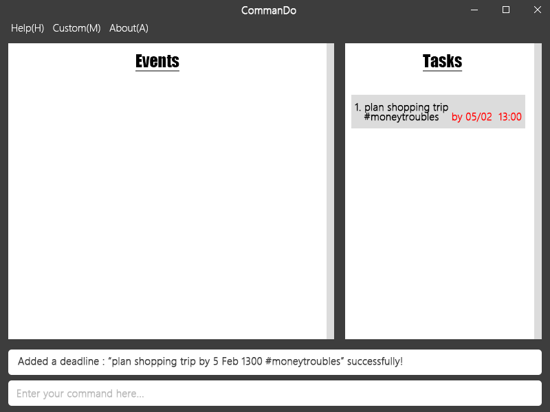
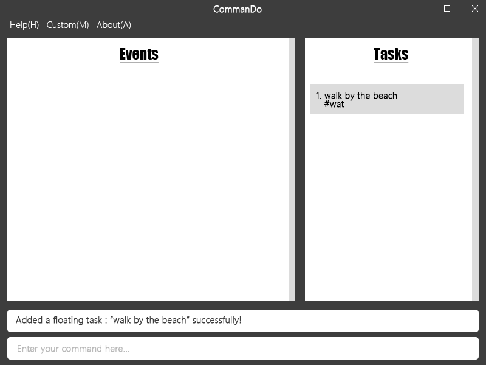
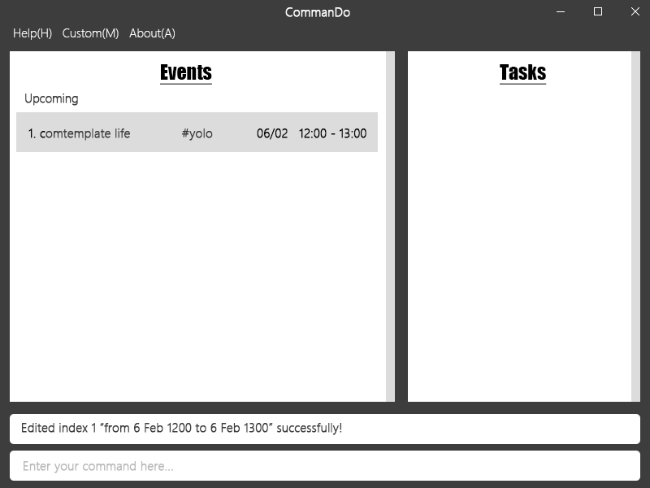
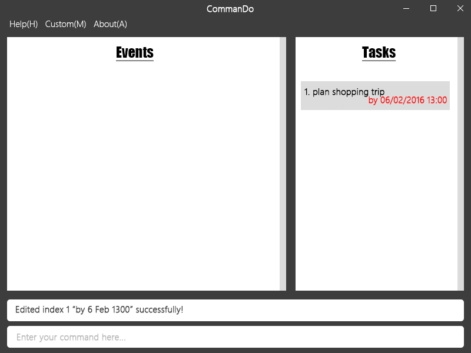
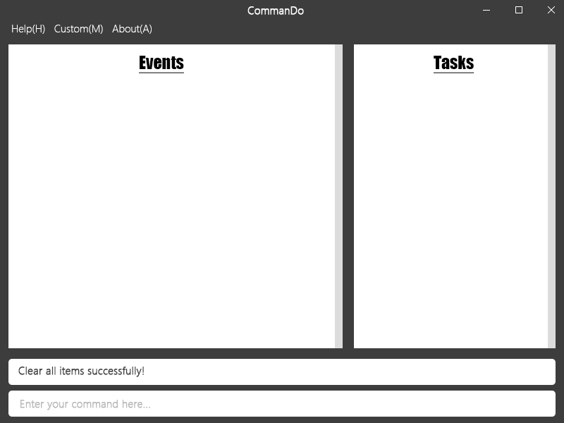

# User Guide

* [About](#about)
* [Quick Start](#quick-start)
* [Commands](#commands)
* [FAQ](#faq)
* [Command Cheatsheet](#command-cheatsheet)

## About
CommanDo is a task scheduler that helps you to manage the flood of things you need to do (to-do items).  This application is a primarily text-based – almost all input will be through commands, using the text box at the bottom. In this guide, we will be splitting the to-do items into 3 groups: events, deadlines and floating tasks, which are differentiated by the number of date time fields they require.

## Quick Start

1. Ensure you have Java version `1.8.0_60` or later installed in your Computer (earlier version of Java 8 will not work).

2. Download the latest `commando.jar` from the [releases](../../../releases) tab.

3. Copy the file to the folder you want to use as the home folder for _CommanDo_.

4. Double-click the file to start the app. The GUI should appear in a few seconds. 

   

   
5. Type the command in the command box and press <kbd>Enter</kbd> to execute it.  
   e.g. typing **`help`** and pressing <kbd>Enter</kbd> will open the help window. 
   
6. Some example commands you can try:

   * `add event participate in 'Eat and Become Fat' competition from 5 Sep 12:30 to 17:30` 
   adds an event with title "participate in 'Eat and Become Fat' competition" with start date & time of 5th September 12:30 and end date & time of 5th Septemeber 17:30 
   * `delete 3` 
   deletes the to-do item visually numbered with a "3"
   * `exit` 
   exits the app
   
7. Refer to the [Commands](#commands) section below for details of each command. 

## Commands

### Viewing Help: `help`

`help [<command_name>]`

> **Command Format**

> * `<>` denotes fields to fill in
> * `[]` denotes optional
> * `...` denotes 0 or more

Shows a complete list of commands and how to use them properly, or help on a single command. When no commands are given, a complete list of commands and examples on how to use them are shown. If one command is given, examples on how to use that specific command is shown. If the fields are incorrect for any other commands, examples of how to use that command will be shown.

### Adding To-Do Items: `add`

To add a to-do item, your input must contain the necessary keywords in the given order. In this case, `add` must be at the start of your input. 

To-do items contain at minimum, a description of what it is. They may be added along with at most 2 date-times and 0 or more tags. In CommanDo, to-do items are split into two groups: Events and Tasks, and shown in their corresponding tabs in on CommanDo.

#### Events:

Events are demarcated by a starting date-time and ending date-time. In CommanDo, they are to-do items with a `from` field and a `to` field.

* `add <description> from <start_datetime> to <end_datetime> [#<tag>...]`

   

More examples: 

Input		   |
:-------------------------------|
`add event participate in 'Eat and Become Fat' competition from 5 Sep 12:30 to 17:30 #important`|
`add event meeting with Dr Tan from 30 Sep 9:00 to 10:00 #work #important`|
`add event wild party in hostel room from 31 Dec 2016 to 1 Jan 2017 #yolo`|

Date & time formats are described in more detail [below](#supported-datetime-formats).

#### Tasks: 

Tasks are bounded by a due date-time. In CommanDo, they are to-do items that may have a `due` field. A task can be something you need to do by a certain date or time, or just something you can do at your own time.

`add <description> [by <due_datetime>] [#<tag>...]`

   

   
   

More examples:

Input		   |
:-------------------------------|
`add do Homework 10 by 23 Sep`|
`add release V0.5 by 7 Nov 2359`|
`add finish FYP by tomorrow 2359`|
`add shop for groceries: banana, pineapple, watermelon #housework`|
`add watch Lord of the Rings`|

### Editing To-Do Items: `edit`

Existing to-do items can be edited by accessing their index, and stating the fields to replace. The new tags in your input will replace the whole list of tags stored for the target to-do item. At least one of the optional parameters should be included, if not the command does nothing.

#### Events: 

Edits the details of an event, listed on screen with a number of `<index>`. At least one of the optional parameters shown below must be provided to make a meaningful edit.

`edit <index> [description] [from <start_datetime>] [to <end_datetime>] [#<tag>...]`

   

More examples:

Input		   | Description  
:-------------------------------| :-------- 
`add meeting with boss from today 1300 to today 1500`| Adding a event
`edit 1 from today 1400 to today 1600`               | Changing the details 
`edit 2 #projectABC`                                 | Adding a tag

#### Tasks: 

Edits the details of a task, listed on screen with a number of `<index>`. At least one of the optional parameters below must be provided to make a meaningful edit. You can edit or add a due date-time to a task. You can also remove the due date-time from a task by entering nothing after the `by` keyword. 

`edit <index> [description] [by <due_datetime>] [#<tag>...]`

   

More examples:

Input		   | Description  
:-------------------------------| :-------- 
`add plan shopping trip`      | Adding a task
`edit 2 shopping trip to IKEA`| Changing the details 
`edit 2 by 6 feb`             | Adding a due date-time
`edit 2 #lunch`               | Adding tags
`edit 2 #lunch #east`         | Adding more tags
`edit 2 by`                   | Removing the due date-time
`add watch Inception`         | Adding a task
`edit 3 watch Gravity`        | Changing the details
`edit 3 #family`              | Adding tags
  
### Deleting To-Do Items: `delete`

Deletes an event, deadline or floating task, listed on screen with a number of `INDEX`.

`delete <index>`

   

### Clearing all To-Do Items: `clear`

Clears all to-do items. Use with caution.

`clear`

   

### Finding To-Do Items: `find`

Searches for and only lists all to-do items which have descriptions or tags containing *all* of the given keywords.

`find <keyword>...`

   

How the search works:

* If 0 keywords are provided, all to-do items will be shown. 
* Case insensitive. – `Chicken Egg` will match `chicken egg`
* Ordering of the keywords does not matter. – `Chicken Egg` will match `Egg Chicken`
* Parts of words will be matched. – `chickens` will match `chicken`, `chicken` will not match `chickens`
* All keywords must be present. – `find chicken egg` will match `chicken lay egg` but not `bird lay egg`

### Setting Save Location: `set`

Changes the location where the to-do list is saved on the file system to `<filepath>`.

`set storage <filepath>`

A file path can be absolute (`C:/home/sally/statusReport`) or relative to the `.jar` file (`joe/foo/bar`). This applies to the next two commands which too, deals with the file location.

### Exporting: `export`

Exports the current to-do list as a save data file at `<filepath>`.

`export <filepath>`

### Importing: `import`

Imports a valid save data file at `<filepath>` and overrides the current to-do list with the imported to-do list.

`import <filepath>`

### Undoing: `undo`

Undos the last `add`, `edit`, `delete`, `clear`, `import` or `set storage` command.

`undo`

### Exiting the Application : `exit`

Closes the application.

`exit`

## FAQ   

### Saving data

Your to-do list is automatically saved to your file system after any command that changes the data. There is no need to save manually. 

### Sharing data across devices

Use the `export` command to generate a save data file, transfer the file to a 2nd device, and use the `import` command on the 2nd device to import your to-do list from that save file. Alternatively, you can use a cloud-syncing service (e.g. [Dropbox](dropbox.com)) and the `set storage` command to sync the to-do list automatically by setting to the same storage file on both devices. 

### Supported date-time formats

*CommanDo* supports a wide variety of date and time formats. 

A valid date-time is defined as:

1. A valid date.
2. A valid date followed by a valid time.

where examples of valid dates include:

| Standard Date Notation | With words | Presets |
|:-------------------------- |:------------------- |:------------------------------------------------ |
| `10/02/2016` *(DD/MM/YYYY)*| `10 Feburary 2016`  | `today`                                          |
| `10/02/16` *(DD/MM/YY)*    | `10 Feb 2016`       | `tomorrow`                                       |
| `10/02` *(DD/MM)*          | `10 Feb`            | `next Wednesday`                                 |
|                            | `10th Feb`          | `<x> days after` *(where `<x>` is bigger than 0)*|
|                            | `Feb 10`            |                                                  |

and examples of valid time include:

| Standard Time Notation | Omitted Colons | Presets |
|:--------- |:------ |:-------------------------------- |
| `19:00` *(hh:mm)*        | `2359` | `morning` *(0900h by default)*   |
| `9am` *(hh)pm/am*        | `0911h`| `afternoon` *(1200h by default)* |
| `11:59pm` *(hh:mm)pm/am* |        | `evening` *(1900h by default)*   |
       
## Command Cheatsheet

Command		   | Format  
-------------------| :-------- 
Help               | `help [<command_name>]`
Add Event          | `add <description> from <start_datetime> to <end_datetime> [#<tag>...]`
Add Task           | `add <description> [by <due_datetime>] [#<tag>...]`
Edit Event         | `edit <index> [description] [from <start_datetime>] [to <end_datetime>] [#<tag>...]`
Edit Task          | `edit <index> [description] [by <due_datetime>] [#<tag>...]`
Delete To-Do Item  | `delete <index>`
Clear              | `clear`
Find               | `find <keyword>...`
Set Save Location  | `set storage <filepath>`
Export             | `export <filepath>`
Import             | `Import <filepath>`
Undo               | `undo`
Exit               | `exit`
