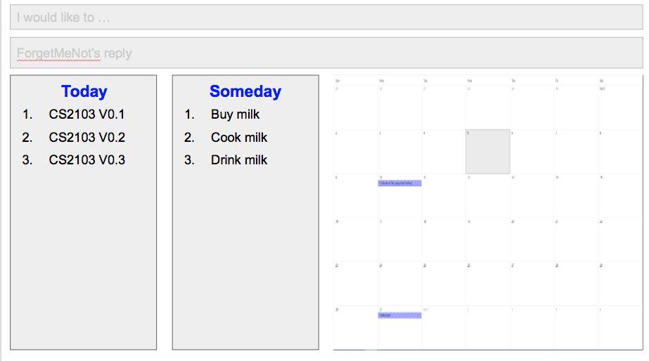

# User Guide

* [Quick Start](#quick-start)
* [Features](#features)
* [Command Summary](#command-summary)

## Quick Start

0. Ensure you have Java version `1.8.0_60` or later installed in your Computer. 
   > Having any Java 8 version is not enough.  
   This app will not work with earlier versions of Java 8.
   
1. Download the latest `forgetmenot.jar` from the [releases](../../../releases) tab.
2. Copy the file to the folder you want to use as the home folder for ForgetMeNot.
3. Double-click the file to start the app. The GUI should appear in a few seconds. 
   > 

4. Type the command in the command box and press <kbd>Enter</kbd> to execute it.  
   e.g. typing **`help`** and pressing <kbd>Enter</kbd> will open the help window. 
5. Refer to the [Features](#features) section below for details of each command. 

## Features

> **Command Format**
> * Words in angle brackets `<>` are parameters.
> * The order of parameters is fixed.

#### Finding more information about various commands: `help`
Displays the list of commands(along with their formats) for the user to help him use those commands. 
Format: `help`

#### Adding a Task: `add`
Adds a task to the task manager 
Date Formats: dd/mm/yy, days (e.g Monday, Friday, Today, Tomorrow), dd Month yy
Time Format: 12-hour clock(Eg:10am, 5:30pm, etc).Users can also use natural language commands like today, tmr, 3 days later, next mon. 
             It also recognises holidays like christmas and new year.  

##### Adding a floating task
Adds a task without any start time or end time  
Format : `add <task name>` 

Examples:
* `add Read Harry Potter`

##### Adding a task with a Start Time only
Adds a task with only the start time  
Format : `add <task name> at/from <Start Time>`

Examples:
* `add Homewok at 2pm` (This add a task to 2pm of the current day)
* `add project meeting at 21/11/16` (This gives it the current time when you add the task)
* `add tutorial at 12/12/16 7pm`
* `add buy gift at 3 days later`
* `add buy presents at christmas`

##### Adding a deadline task
Adds a task with only the end time  
Format : `add <task name> by/to <End Time>`

Examples:
* `add Homewok by 2pm` (This add a task to 2pm of the current day)
* `add project meeting at 21/11/16` (This gives it the current time when you add the task)
* `add tutorial by 12/12/16 7pm`
* `add buy gift by 3 days later`
* `add buy presents by new year`

##### Adding an event task
Adds a task with a start time and an end time  
Format : `add <task name> at/from <start time> by/to <end time>`

Examples:
* `add exam from tmr 7pm to tmr 8pm`
* `add event from today 5pm to next fri 10pm`

##### Adding a recurring task
Adds a task with a recurring period in days  
Format : `add <task name> at/from <start time> by/to <end time> every <number> days`

Examples:
* `add school homework by 9pm friday every 8 days`
* `add planning meeting from 2pm thursday to 3pm thursday every 30 days`
* `add movie night at 8pm Friday every 7 days`

#### Editing a Task: `edit`
Allows the user to edit a particular task 
Format: `edit <task index> <detail to edit> <new value>`

Example:
* `edit 2 from 11am to 2pm` (Edits the start time to 11am and end time to 2pm for task 2)
* `edit 1 CS2103T Tutorial` (Edits the name to CS2103 Tutorial for task 1)
* `edit 2 at today 3pm` (Edits the start time to the current day 3pm for task 2)
* `edit 3 every 7 days` (Edits the recurrence of task 3 to be every 7 days)

#### Priority tasks: `priority`
Allows the user to set the priority of a task when creating it. If the task is of importance, the user can assign it with a high priority.  
Format : `add <task name> priority high`

Example:
* `add CS2101 by 01/01/2016 priority high`

#### Undo a Task: `undo`
Undo the most recent task entered in the command line 
Format: `undo`

#### Redo a Task: `redo`
Redo the most recent undo in the command line 
Format: `redo`

#### Deleting a Task: `delete`
Deletes a particular task in the task manager 
Format: `delete <task index>`

Example:
* `delete 1`

#### Finding a Task: `Find`
Finds tasks in the task manager. Task manager will display all task with the input keywords 
Format: `find <task name>`

Example:
*`find project`

### Mark as done: `done`
Marks a task as done.  
Format: `done <task index>`

Example:
* `done 1`

#### Showing full list: `show`
Displays all the task for the user to view. 
Format: `show`

##### Showing list for today: `show today`
Displays all the task for today for the user to view. 
Format: `show today`

##### Showing list for tomorrow: `show tomorrow`
Displays all the task for tomorrow for the user to view. 
Format: `show tomorrow`

##### Showing list for upcoming: `show upcoming`
Displays all the task for upcoming task for the user to view. 
Format: `show upcoming`

##### Showing list for specific date: `show <date>`
Displays all the task for today the user to view. 
Format: `show <date>`

##### Showing a list for overdue tasks: `show overdue`
Displays all the overdue tasks.  
Format `show overdue`

Example:
* `show 10/10/16`

##### Show all the done tasks: `show done`
Displays all the done tasks.  
Format: `show done`

#### Clearing the display: `clear`
Clears all the tasks in the task manager  
Format: `clear`

##### Clearing only the done tasks: `clear done`
Clears all the done tasks  
Format: `clear done`

#### Selecting a task: `select`
Selects a task based on index.  
Format: `select <index>`

Example:
* `select 2`

#### Set storage: `set storage`
Allows the user to change the storage location to a different folder
Format: `set storage <folder name>`

Example:
* `set storage task manager`

#### Saving the data 
ForgetMeNot data are saved in the hard disk automatically after any command that changes the data. 
There is no need to save manually.

## Command Summary

Following is the list of all commands:

| Command     | Format                                             | Description                                    |
|-------------|----------------------------------------------------|------------------------------------------------|
| `help`      | `help`                                             | Opens a help page                              |
| `add`       | `add` `<name>`                                     | Adds a floating task                           |
|             | `add` `<name>` at `<Start Time>`                   | Adds a task only with a start time             |
|             | `add` `<name>` by `<End Time>`                     | Adds a deadline task                           |
|             | `add` `<name>` from `<Start Time>` to `<End Time>` | Adds an event task from start time to end time |
|             | `add` `<name>` from `<Start Time>` to `<End Time>` | Adds a recurring tasks                         |
|             |  every `<number>` days                             |                                                |
| `edit`      | `edit` `<index>` `<New Parameters>`                | Edits a task with the new parameters           |
| `done`      | `done` `<index>`                                   | Marks a task as done                           |
| `delete`    | `delete` `<index>`                                 | Removes a task from the task manager           |
| `show`      | `show`                                             | Shows all tasks                                |
|             | `show` done                                        | Shows the done tasks                           |
|             | `show` today                                       | Shows all tasks for today                      |
|             | `show` tmr                                         | Shows all tasks for tomorrow                   |
|             | `show` `<date>`                                    | Shows all tasks for that particular date       |
|             | `show` overdue                                     | Shows all the overdue tasks                    |
| `undo`      | `undo`                                             | Undoes the most recent command                 |
| `redo`      | `redo`                                             | Redoes the latest undo                         |
| `find`      | `find` `<name>`                                    | Finds a task with task name as <name>          |
| `clear`     | `clear`                                            | Clears all the tasks in the task manager       |
|             | `clear done`                                       | Clears all the done tasks from the done list   |
| `select`    | `select` `<index>`                                 | Highlights the particular task at that index   |
|`set storage`| `set storage` `<folder name>`                      | Set storage to a particular folder             |
