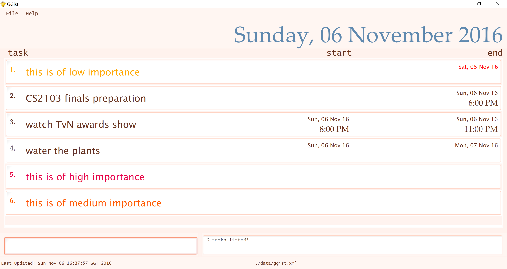
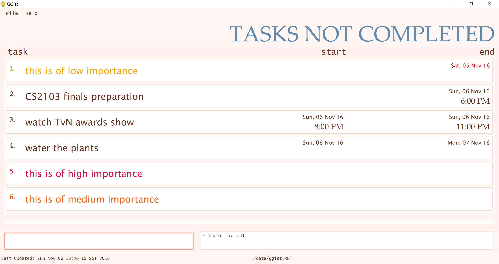
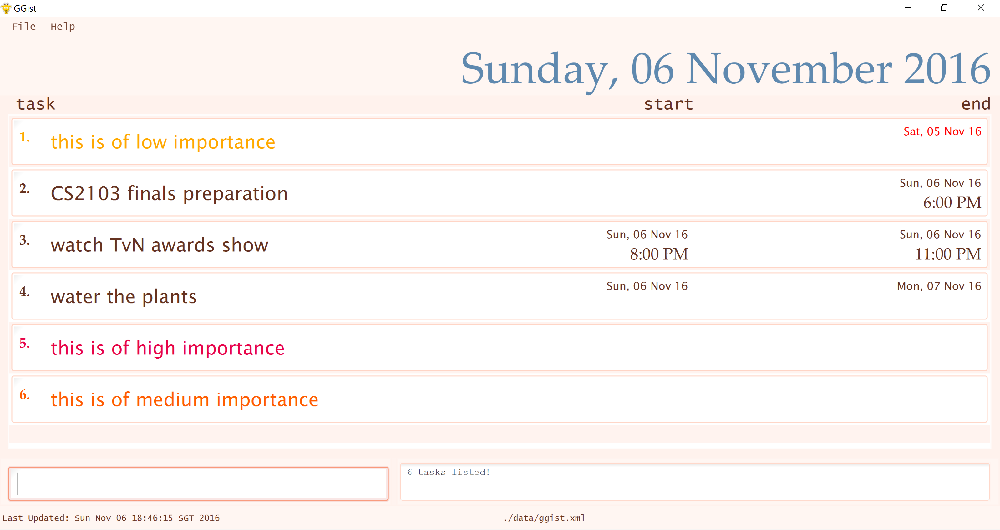
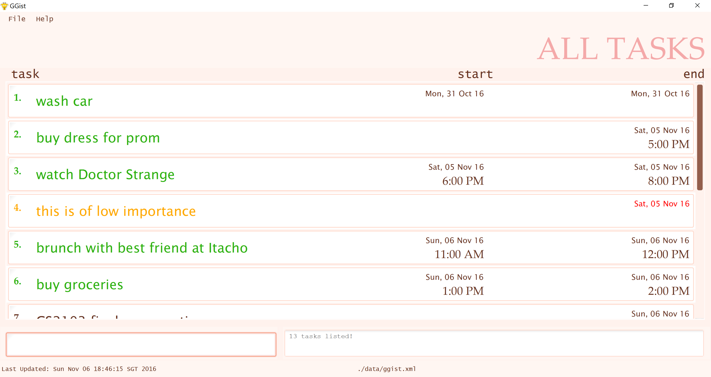
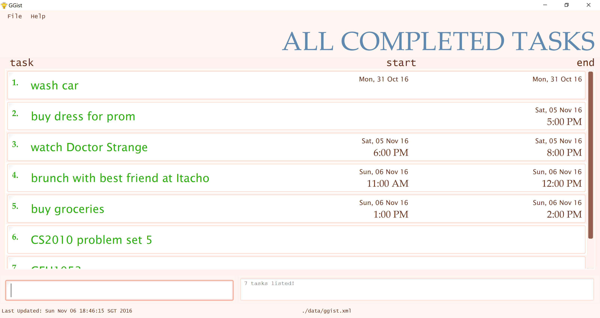
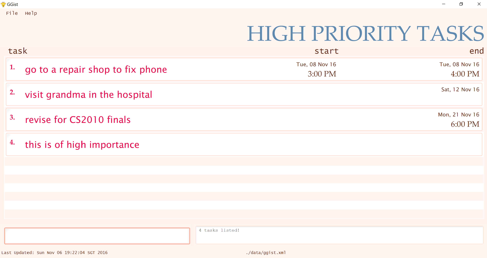
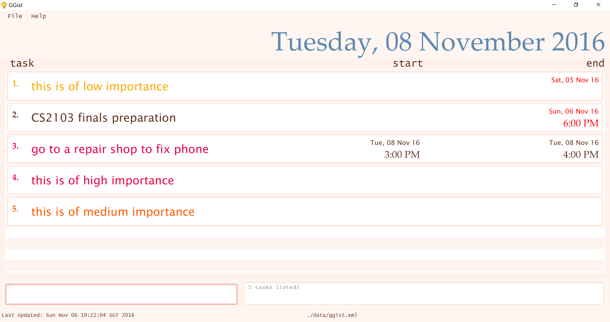

<!-- @@author A0138411N --> 

# User Guide

* [About GGist](#about-ggist)
* [Quick Start](#quick-start)
* [Features](#features)
   * [Adding tasks](#adding-a-task-add)
   * [Listing tasks](#listing-tasks--list-shows-a-list-of-task-of-your-preferred-choice)
   * [Searching for tasks](#searching-tasks-by-keywords-search)
   * [Deleting tasks](#deleting-a-task--delete)
   * [Undo](#undo--undo)
   * [Redo](#redo--redo)
   * [Editing tasks](#editing-a-task--edit)
   * [Marking tasks as done](#marking-a-task-as-done--done)
   * [Marking completed tasks as undone](#marking-a-completed-task-as-undone--continue)
   * [Saving GGist data](#saving-the-data-to-a-specified-location--save)
* [Command Cheatsheet](#command-cheatsheet)

<!-- @@author A0138420N --> 

## About GGist

Are you constantly overwhelmed by the number of things you have to do everyday? Do you have troubles managing your time? If your answer is yes, GGist is the perfect solution for you. GGist is a one-stop, user-friendly desktop application designed to aid busy individuals like you in better managing and prioritising your everyday tasks.

Unlike most of the other task managers in the market, GGist accepts straightforward, one-liner keyboard commands that incorporate flexible natural language. This makes it extremely convenient for working professionals like you who spend most of your time near a computer and prefer typing instead of using the mouse. 

Are you ready to embrace a new style of organised living? Let's begin!

## Quick Start

0. Ensure you have Java version `1.8.0_60` or later installed in your Computer. 
   > Having any Java 8 version is not enough.  
   This application may not work with earlier versions of Java 8.
   
1. Download the latest `GGist.jar` from the [releases](https://github.com/CS2103AUG2016-W13-C2/main/releases) tab.
2. Copy the file to the folder you want to use as the home folder for your GGist application.
3. Double-click on the .jar file. The GUI should appear in a few seconds. 
   >  
   You will be presented with all today's undone tasks when you first open GGist.

4. Type the command in the command box and press <kbd>Enter</kbd> to execute it.  
   e.g. typing **`help`** and pressing <kbd>Enter</kbd> will open the help window.
5. Some example commands you can try:
   * **`list`**` today` : 
     lists all of today's undone tasks.
   * **`add`**` water the plants, 13 dec, 1400` : 
     adds a task `water the plants` with a deadline of 2pm on the 13th of December to GGist.
   * **`delete`**` 3` : deletes the third task in the viewed listing.
   * **`exit`** : exits the application
6. Refer to the [Features](#features) section below for details of each command. 

<!-- @@author A0144727B --> 
## Features

> **Command Format**
> * Words in `UPPER_CASE` are the details of a task.
> * Details are usually separated by commas.
> * The space before or after a comma is optional.
> * Commas may be replaced with prepositions like from, to, on, by.
> * Details in `SQUARE_BRACKETS` are optional.
> * Details with `...` after them can have multiple instances.
> * The order of details is fixed.

#### Viewing help : `help`

Format: `help`

#### Adding tasks: `add` 

Adds a task to GGist 

General format: `add TASK, [DATE] [TIME] -[PRIORITY]`

> * `[DATE]` and `[TIME]` has to separated by a space.
> * If a time without a date is given, the current date will be used by default.

>**`DATE` Format**
> * `10 dec` ,`dec 10`, `tuesday`, `tomorrow` , `next friday`, `next thurs` or their equivalent will work.

>**`PRIORITY` Format**
> * Prefix with a dash `-`
> * Three available levels: `-low` , `-med` , `-high`

##### Tasks without any deadline

Format: `add TASK -[PRIORITY]`

Examples: 
* `add buy milk -low`
* `add buy brother's present`

##### Tasks with deadline

Format: `add TASK, DATE TIME -[PRIORITY]`

Examples: 
* `add write diary, tomorrow 1300`
* `add prepare presentation slides by monday 2pm -high`
* `add movie night on 9pm`

> * The comma after `[TASK]` can be replaced with `by` or `on`. 
> * `[DATE]` and `[TIME]` has to separated by a space or an ' at '. 

##### Tasks with start and end time within the same day

Format: `add TASK, DATE, STARTTIME, ENDTIME -[PRIORITY]`

Examples: 
* `add tennis practice, 21 nov, 1pm, 3pm`
* `add dad's birthday dinner, tomorrow, 7pm to 9pm -high`
* `add lunch with parents on friday from 12pm to 1pm`

> * The comma after `[TASK]` can be replaced with `on`. 
> * The comma after `[DATE]` can be replaced with a space.  
> * The comma after `[STARTTIME]` can be replaced with `to`. 

##### Tasks with start and end time on different days

Format: `add TASK, STARTDATE TIME, ENDDATE TIME -[PRIORITY]`

Examples: 
* `add neurology conference, next thurs 10am, next sunday 7pm -high`
* `add korea holiday from fri 1300 to next fri 2200`

> * The comma after `[TASK]` can be replaced with `from`. 
> * `[STARTDATE]` or `[ENDDATE]` and `[TIME]` has to separated by a space or an ' at '.  
> * The comma after `[STARTDATE] [TIME]` can be replaced with a `to`.

#### Listing tasks : `list` 

Shows a list of tasks of your choice. Note that overdue tasks will be listed at the top in all kinds of listings.

Format: `list [TYPE]`

Examples:
* `list` shows all undone tasks 

* `list today ` shows today's undone tasks 

* `list all` shows all tasks 

* `list done` shows all completed tasks 

* `list [PRIORITY]` shows all tasks with the specified priority level (low, med, high) 

* `list [DATE]` shows all undone tasks with start date or end date as the specified date 

<!-- @@author A0138420N --> 

#### Searching tasks by keywords: `search` 

Searches and shows all tasks with details that contain the specified keyword. 

Format: `search KEYWORD` 

> * The search is not case sensitive.
> * The order of the keywords does not matter. e.g. `buy milk in ntuc` will match `ntuc buy milk`
> * Partial words can be matched e.g. `parallel` will match `parallelogram` but not the other way round.

Examples: 
* `search milk` 
  Lists the all the tasks with names containing the word `milk` if any can be found. 
 <!-- @@author --> 
<!-- @@author A0144727B --> 
#### Deleting tasks : `delete`

Deletes the specified task from the viewed listing. 

Format: `delete INDEX...`

> Deletes the task at the specified `INDEX` in the viewed listing. 
  The index must be a positive integer (1, 2, 3, ...)

Examples: 
* `delete 2` 
  Deletes the second task in the list.
* `search buy milk`  
  `delete 1` 
  Deletes the first task in the result listing of the `search` command.

> To delete more than one task, simply add in indexes separated by a comma.  

Examples: 
* `delete 1, 2, 3`
* `list oct 1` 
  `delete 2, 3` 
<!-- @@author A0138420N -->   
 
#### Undo : `undo`

Reverts the most recent action. Undo can be called multiple times. 

Format: `undo`
<!-- @@author -->  
<!--- @@author A0138411N --->

#### Redo : `redo`

Reverts the most recent undo action. You can consecutively redo as many times as you have consecutively undid. 

Format: `redo`

#### Editing tasks : `edit`

Edits task on the display list. 

Format: `edit INDEX DETAIL_TO_EDIT NEW_INFORMATION`

> More than 1 task detail can be edited at the same time. Simply separate the different details with a comma.

Examples: 
* `edit 1 date oct 11, start time 1800`
* `list dec 30` 
  `edit 5 task buy coconut, end date today, priority low`

<!-- @@author A0138420N -->

#### Marking tasks as done : `done`

Marks a task on the viewed listing as done. The task marked as done will disappear from the viewed listing of undone tasks, but can be retrieved using `list done` to view all completed tasks. 

Format: `done INDEX...`

Examples: 
* `done 1`
* `search oct 1` 
  `done 2`
 
To mark more than one task as complete, simply type in indexes separated by a comma.  

Examples: 
* `done 1, 2, 3`

<!-- @@author A0144727B -->

#### Marking completed tasks as undone : `continue`

Marks a completed task on the done listing as undone. 
Format: `continue INDEX...`

Examples: 
* `list done` 
  `continue 2`
 
To mark more than one completed task as undone, simply type in indexes separated by a comma.  

Examples: 
* `list done` 
  `continue 1, 2, 3`

<!--- @@author A0138411N -->

#### Saving the data to a specified location : `save` 

There is no need to save your data manually. GGist automatically saves all data in the hard disk after receiving any command that changes the data. 
The save data file is located in the`./data` folder together with the `.jar` folder by default. 
You can change the location and port the data file over easily with this command. 

Format: `save FILELOCATION`

Example: 
`save /Users/Documents/OneDrive/data`

> * The new folder has to be a valid, existing folder  
> * To switch back to the default save folder, type `save data`  
> * By default, the filename will be `ggist.xml`

You can also change the file name to your preference. 

Format: `save FILE_NAME.xml`

> The file format has to be .xml

#### Clearing all data : `clear`
Clears all the data in GGist. This action is irreversible. 
Format: `clear` 

#### Exiting the program : `exit`
Exits the program. 
Format: `exit`  

<!-- @@author A0138411N --> 
## Command Cheatsheet

Command | Format  | Example
--------| --------| ------------------------
Add     | `add TASK`  | add buy fruits from ntuc
        | `add TASK, [DATE] [TIME] -[PRORITY]` |  add buy milk by tomorrow morning -low
        | `add TASK, [DATE] [TIME], [DATE] [TIME] -[PRIORITY]` | add go overseas from 20 Dec 10pm to 2 Jan 2017 3pm -high
List    | to see all incompleted tasks | list
        | to see all tasks| list all
        | to see all completed tasks | list done
        | `list DATE`| list 22 Nov
        | `list PRIORITY`| list high
Search  | `search KEYWORD`| search buy
Delete  | `delete INDEX...` | delete 1,2,5
Undo    | `undo`
Redo    | `redo`
Edit    | `edit INDEX FIELD NEW_INFORMATION`|edit 1 start date today
        | `edit INDEX FIELD NEW_INFORMATION, FIELD NEW_INFORMATION`| edit 3 end date 30 nov, end time 10pm
Done    | `done INDEX...`| done 1,6,7
Continue| `continue INDEX...`| continue 1,2,3
Help    | `help`
Save    | `save FILE_LOCATION`| save /Users/OneDrive
        | `save FILE_NAME.xml`| save newfilename.xml
Exit    | `exit`
<!-- @@author --> 
