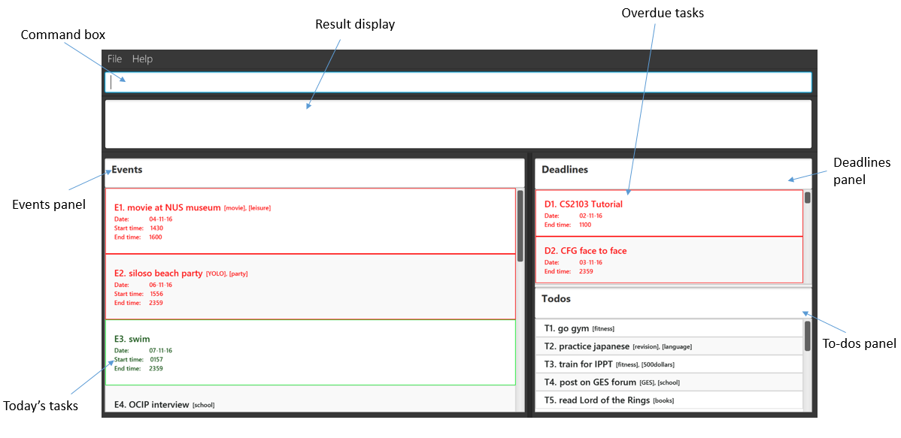

# User Guide

* [Getting Started](#getting-started)
* [Features](#features)
   * [Add command](#1-add-command)
   * [Edit a task](#2-edit-a-task)
   * [Find task by Keyword](#3-find-task-by-keyword)
   * [Marking tasks as done](#4-marking-tasks-as-done)
   * [Display tasks](#5-display-tasks)
   * [Delete task](#6-delete-task)
   * [Undo the Most Recent Commands](#7-undo-the-most-recent-commands)
   * [Redo the Most Recent Undone Commands](#8-redo-the-most-recent-undone-commands)
   * [Clearing the program](#9-clearing-the-program)
   * [Exiting the program](#10-exiting-the-program) 
   * [Help](#11-help)
   * [Setting Storage Folder](#12-setting-storage-folder)
* [How do I transfer my data to another computer?](#how-do-i-transfer-my-data-to-another-computer)
* [Date and Time Formats Accepted](#date-and-time-formats-accepted)
* [Command Summary](#command-summary)

 
## Introduction

Frustrated with the repetitive number of mouse clicks when using task managers? Tired of cluttered windows? Need the ability to easily categorise tasks? Don’t worry! Simply is here to save the day.

Introducing to you Simply, your everyday task manager.

Gone are the repetitive mouse clicks other task managers require of you. With a single line command entry, you can easily create a task and categorize it as you desire. With its simple interface, gone are the cluttered windows of other task managers and tasks can be easily found at a glance.

 
## Getting Started

1. Ensure you have Java version `1.8.0_60` or later installed in your Computer. 
   > Having any Java 8 version is not enough.  
   This app will not work with earlier versions of Java 8.
   
   
2. You can download the latest `simply.jar` from the [releases](../../../releases) tab.
3. Copy the file to the folder you want to use as the home folder for Simply.
4. Double-click the file to start the app. The GUI should appear as below in a few seconds. 
  
 

5. Type the command in the command box and press <kbd>Enter</kbd> to execute it.  
   e.g. typing **`help`** and pressing <kbd>Enter</kbd> will open the help window. 

6. Refer to the [Features](#features) section below for details of each command. 

 
## Features

###1 Add Command
There are three variations to the add command. You are able to choose a task to be categorized under events, deadlines or to-dos. To differentiate the formatting for these commands, refer to the section below.
  
####1.1 Add a to-do

To start things off, let us add a simple task with no date or time, just a simple task to be done anytime and anyday.

>Format: **add** &lt;to-do description&gt; &lt;#tag&gt;

Example: add go swimming #fitness
  
>Note: tags are optional and multiple tags can be added to all tasks.

 
####1.2 Add a deadline

Perhaps after adding a to-do, now you want to add a task with a deadline. Let's say you have to do a report by next Monday, 7pm.

>Format: **add** &lt;deadline description&gt;; &lt;date(DDMMYY)&gt;; &lt;end time&gt; &lt;#tag&gt;

Example: add complete report; 120916; 1900 #fml 
  
>Important: The date is compulsory when adding an deadline. If end time is not specified, a default of 11.59pm on the entered date is set.

 
####1.3 Add an event

Let's say you have to attend a friend's birthday party on the weekend. You know the date, the time it starts, as well as the time it ends.

>Format : **add** [&lt;event description&gt;; &lt;date(DDMMYY)&gt;; &lt;start time&gt;; &lt;end time&gt;] &lt;#tag&gt;

Example: add [Sam's birthday party; 20/12/16 ; 9pm] #birthday #rememberToBuyPresent

>Note: The start time and end time is optional when adding an event. If neither is specified, the default date will be the current date, the default start time will be the current time and the default end time will be 2359.

>Important: The square brackets are compulsory when adding an event.

 
####1.4 Add a tag / multiple tags to existing tasks

Your friend suddenly informs you that he has heard that your teacher has prepared a 'nice' surprise for students who submit the report due on Monday late. Now that the report due on Monday has become a very important task to do, simply type add followed by the index of the report and the tags to be added and <kbd>Enter</kbd>.

>Format: **add** &lt;index&gt; #tag1 #tag2

Example: Add D1 #VeryImportant #omg  

 

###2 Edit a task

When you accidentally enter the wrong details for any of your tasks, worry not. The multiple edit task methods listed below allow you to update specific task details.
  
>Note: Adding a end time to a to-do will automatically convert your to-do into a deadline due today with the specified end time.

>Note: Adding a start time to a deadline will automatically convert a deadline to an event.

>Note: Adding a date to a to-do will automatically convert your to-do into a deadline with a default end time of 2359 on that date.

>Note: Removing the end time from a deadline will automatically convert your deadline to a to-do.

>Note: Removing the start time from a event will automatically convert your event to a deadline.

 
####2.1 Edit task description

Remember the birthday party previously entered? Perhaps now instead of entering Sam's birthday party, you want to change the description to Samantha's birthday party. To do so, simply follow the command format below.

>Format: **edit** &lt;index&gt; **des** &lt;description&gt;

Example: edit E1 des Sam's birthday party

 
####2.2 Edit task date

Now, maybe the date of the birthday party you previously entered is also wrong and should be one day later instead. To change the date, use the following command. 

>Format: **edit** &lt;index&gt; **date** &lt;date&gt;

Example: Edit E1 date 21/12/16
  
>Note: If you add a date to a to-do, this will automatically convert your to-do into a deadline with a default end time of 2359 on that date.

 
If you wish, you can also remove the date of a task by following this format.

>Format: **edit** &lt;index&gt; **date** no date; 

Doing so will change an event into a to-do. Removing the date from a deadline will also change it into a to-do.

 
####2.3 Edit task start time 

Samantha's birthday party is tomorrow and she has called to inform you that her party is starting two hours earlier at 5pm instead. To change the start time, simply use the following command.

>Format: **edit** &lt;index&gt; **start** &lt;start time&gt;

Example: edit E1 start 5pm
  
>Note: Adding a start time to a to-do will automatically convert your to-do into an event with a default day of today, with a default end time of 2359 and start time as entered. 

 
If you wish, you can also remove the start time of a task by following this format.

>Format: **edit** &lt;index&gt; **start** no start; 

Doing so will change a event into a deadline.

 
####2.4 Edit task end time 

Samantha has also informed you that the party is scheduled to end at 11pm, so that you can tell your parents when to pick you up. To update the end time, type the following and <kbd>Enter</kbd>.

>Format: **edit** &lt;index&gt; **end** &lt;end time&gt;

Example: edit E1 end 2300
  
>Note: Adding a end time to a to-do will automatically convert your to-do into a deadline with a default date of today and end time as entered. 

 
If you wish, you can also remove the end time of a task by following this format.

>Format: **edit** &lt;index&gt; **end** no end; 

Doing so to an event will result in it's end time being set to a default of 2359. Removing the end time from a deadline will change the end time to a default of 2359. 

 
####2.5 Edit a specific tag

You have been very busy and forgot to buy Samantha's present so you want to remind yourself that you absolutely have to buy that present tomorrow for her. 

You can do so by changing the existing rememberToBuyPresent tag to AbsolutelyRememberToBuyPresent tag with the following command.

>Format: **edit** &lt;index&gt; **tag** &lt;old_tag&gt;`>`&lt;new_tag&gt;

Example: edit E1 #rememberToBuyPresent`>`#AbsolutelyRememberToBuyPresent

If there is only one tag, you can use the following command instead to change the tag.

>Format: **edit** &ltindex&gt new tag 

  
 
###3 Find Task by Keyword

Should you need to find any task based on details which you only partially remember, the find by keyword command can help you in finding them. Partial keywords are allowed and you can search for tasks by date, time or description. 

> Format: **find** &lt;keyword&gt;

Example: find report

Only tasks with the keyword are displayed. Keywords are NOT case sensitive.

 
###4 Marking tasks as done 

Remember the report that we added at the start? Once you have done it, simply type the following command below and <kbd>Enter</kbd> and you will never have to see it again. Unless of course, if you want to, then we will show you how in the later part of this user guide. 

> Format: done &lt;index&gt;

Example: done D1

This will hide the report that you have completed from the main screen.

 
You can also complete multiple tasks at once by following the formats below.

> Format: done &lt;index&gt;-&lt;index&gt;

Example : done T1-T3

This marks the range of tasks between the first index and the second index as done while this,

> Format: done &lt;index&gt;, &lt;index&gt;

Example: done T1, E2, D4

marks the specified indexes as done.

 
###5 Display tasks

####5.1 Display completed tasks

Remember how we have hidden away your completed report? If you wish to see it again, the following display command will display all completed tasks in their respective categories.

> Format: list done

From here, you can choose to delete these tasks. Deleting will be covered in the section after this. 

 
####5.2 Display all tasks

Now that you have seen all the tasks that you have done, to return to the main default screen, simply type the following command and <kbd>Enter</kbd>.

> Format: list

 
###6 Delete task

If you no longer need any tasks, simply delete them by using the delete command availabe in the following formats. 

> Format: delete &lt;index&gt;

> Format: delete &lt;index&gt;-&lt;index&gt;

> Format: delete &lt;index&gt;, &lt;index&gt; 

Example: delete T3

Example: delete T1-T3

Example: delete T1, T3

The delete command is flexible and allows you to delete more than 1 task at a time. If the indexes entered are separated by a hyphen (-), Simply will delete all tasks between the numbers including the numbers enter. If the indexes are separated by a comma (,) Simply will delete the tasks entered individually. 

 
###7 Undo the Most Recent Commands

Oh no! What happens if you accidentally deleted something by mistake? In life, there are no undos but here, there are. The following undo command enables you to undo the most recent executed command, restoring anything lost.

> Format: undo &lt;number of operations&gt;

Example: undo 2
  
>Note: If no number is entered, the default number of times the command will undo is 1.
  
>Note: If you perform a add command to add a task after undoing another command, you will no longer be able to redo your undone command.

 
###8 Redo the Most Recent Undone Commands

If after using the undo command, you realise that the command you just undid is correct. Simply, type the following command to redo it.

> Format: redo &lt;number of operations&gt;

Example: redo 2
  
>Note: If no number is entered, the default number of times the command will redo is 1.

 
###9 Clearing the program

If you wish to remove all tasks in Simply and start off on a clean slate, simply use the following command.

>Format: clear

 
###10 Exiting the program

When you are done and wish to exit the program, simply type exit and <kbd>Enter</kbd>. This saves all your data and exits the program.

> Format: **exit**

 
###11 Help

Should you forget how to use any of the commands, you can simply type help in the command box and <kbd>Enter</kbd>.
This opens a window showing the command summary for your quick reference. If you need more in-depth details like the advanced features of each command, please refer back to this user guide. 

> Format: **help**

 
###12 Setting Storage Folder

If for any reason, you wish to change the location of the stored data file. Maybe so that you can synchronise that folder with online cloud storage services, you can change the folder by using the following command.

>Format: **storage** &lt;valid file path&gt;

Example: storage C:\Users\Ronald\Documents\DummyFolder

The task manager shifts your data file from the current storage folder to the newly specified one on exit.

 
## How do I transfer my data to another Computer?

**A**: Install the app in the other computer and overwrite the default data file it generates with 
       your current data file.
       
>Note: Search for the default taskbook.xml file that is stored in the data folder and overwrite it.

 
###Date and Time Formats Accepted 
 Date | Time |  
 -------- | :-------- | 
120916| 1300| 
12-09-16| 1pm|  
12/09/16| 1.00pm|  
12.09.16| | 

 
###Command Summary

 No. | Command | Format 
 -------- | :-------- | :--------- | 
1| Add event| add [event_description; date; start_time; end_time]  
2| Add deadline | add deadline_description; date; end_time   
3| Add to-do | add to-do_description 
4| Add with tags | add [event_description, date, start_time, end_time] #tag 
5| Edit | edit &lt;index&gt; **des** &lt;new_task_description&gt;
  |     | edit &lt;index&gt; **date** &lt;new_task_date&gt;
  |     | edit &lt;index&gt; **start** &lt;new_task_startTime&gt;
  |     | edit &lt;index&gt; **end** &lt;new_task_endTime&gt;
  |     | edit &lt;index&gt; **tag** &lt;new_tag&gt;
  |     | edit &lt;index&gt; **tag** oldTag**>**newTag
6| Find | find &lt;keywords&gt; 
7| Done | done &lt;index&gt;, &lt;index&gt;
  |     | done &lt;index&gt;-&lt;index&gt;
8| List | list done 
 |      | list 
10| Delete | delete &lt;index&gt;, &lt;index&gt;
  |     | delete &lt;index&gt;-&lt;index&gt;
11| Undo | undo &lt;number of times to undo&gt; 
12| Redo | redo &lt;number of times to redo&gt; 
13| Clear | clear 
14| Exit | exit 
15| Help | help 
16| Storage| storage &lt;valid file path&gt;  
