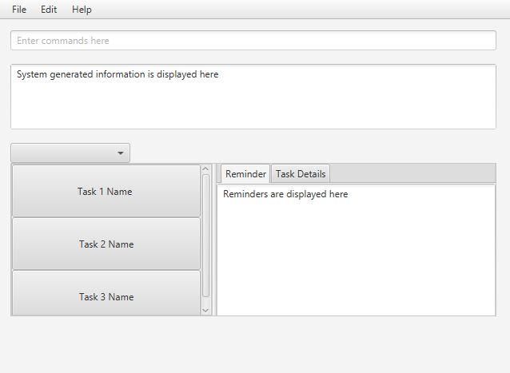

# User Guide

* [Quick Start](#quick-start)
* [Features](#features)
* [FAQ](#faq)
* [Command Summary](#command-summary)

## Quick Start

0. Ensure you have Java version `1.8.0_60` or later installed in your Computer. 
   > Having any Java 8 version is not enough.  
   This app will not work with earlier versions of Java 8.
   
1. Download the latest `addressbook.jar` from the [releases](../../../releases) tab.
2. Copy the file to the folder you want to use as the home folder for your Address Book.
3. Double-click the file to start the app. The GUI should appear in a few seconds. 
   > 

4. Type the command in the command box and press <kbd>Enter</kbd> to execute it.  
   e.g. typing **`help`** and pressing <kbd>Enter</kbd> will open the help window. 
5. Some example commands you can try:
   * **`list`** : lists all contacts
   * **`add`**` Homework  d/MathTut t/Mathematics dd/08102016` : 
     adds a task named `Homework` to the Task Management Tool.
   * **`exit`** : exits the app
6. Refer to the [Features](#features) section below for details of each command. 

## Features

> **Command Format**
> * Words in `UPPER_CASE` are the parameters.
> * Items in `SQUARE_BRACKETS` are optional.
> * Items with `...` after them can have multiple instances.
> * The order of parameters is fixed.

#### Viewing help : `help`
Format: `help`

> Help is also shown if you enter an incorrect command e.g. `abcd`
 
#### Adding a task: `add`
Adds a task to the task management tool 
Format: `add TASK d/DESCRIPTION t/TITLE dd/DUE_DATE i/INTERVAL ti/TIME_INTERVAL ...` 

> Persons can have any number of tags (including 0)

Examples: 
* `add Homework d/ProgrammingEx1 t/Software Engineering dd/06102016 i/7 , `

#### Finding task : `find`
Shows a list of upcoming task in the task management tool. 
Format: `find KEYWORD [MORE_KEYWORDS]`
Examples: 
* `find Homework` 
  Returns `Homework` but not `homework`

#### Deleting a task : `delete`
Deletes the specified task from the task management tool. Irreversible. 
Format: `delete KEYWORD`

> Deletes the task at the specified `KEYWORD`. 
  

Examples: 
* `delete Homework`  

#### Use Shorter Version

#### Set Reminder

#### View Task

#### Add Category

#### Adding task details: `editdetails`
Edit details to the existing task 
Format: `editdetails TASKID d/description t/title dd/duedate [t/TAG]...` 

Examples: 
* `editdetails 0 d/Programming t/SoftwareEngineering dd/10 October [t/TAG]...`

#### Setting task priority: `setpriority`
Set priority to a task
Format: `setpriority TASKID p/PRIORITY_VALUE` 

Examples: 
* `setpriority 0 p/10` 

#### Adding duplicate tasks for specific period of time: `addduplicate`
Set priority to a task
Format: `addduplicate INTERVAL TIMES d/description t/title dd/duedate [t/TAG]...` 

Examples: 
* `addduplicate 7 10 d/Programming t/SoftwareEngineering dd/10 October [t/TAG]...` 

#### Coloring task: `color`
Set color for a code of task
Format: `color TASKID c/COLOR_VALUE` 

Examples: 
* `color 0 c/RED` 

 

## FAQ

**Q**: How do I transfer my data to another Computer? 
**A**: Install the app in the other computer and overwrite the empty data file it creates with 
       the file that contains the data of your previous Address Book folder.
       
## Command Summary

Command | Format  
-------- | :-------- 
Add | `add NAME p/PHONE_NUMBER e/EMAIL a/ADDRESS [t/TAG]...`
Clear | `clear`
Delete | `delete INDEX`
Find | `find KEYWORD [MORE_KEYWORDS]`
List | `list`
Help | `help`
Select | `select INDEX`
