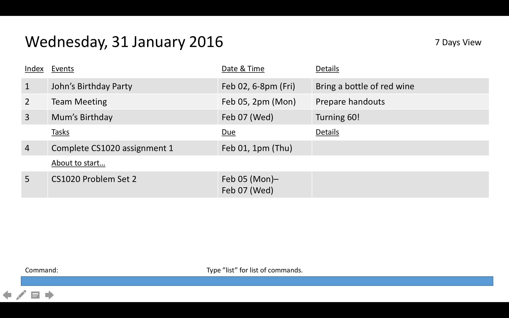

# User Guide

* [Quick Start](#quick-start)
* [Features](#features)
* [FAQ](#faq)
* [Command Summary](#command-summary)

## Quick Start

0. Ensure you have Java version `1.8.0_60` or later installed in your Computer. 
   > Having any Java 8 version is not enough.  
   This app will not work with earlier versions of Java 8.

1. Download the latest `DoDo-Bird.jar` from the [releases](../../../releases) tab.
2. Copy the file to the folder you want to use as the home folder for your DoDo-Bird application.
3. Double-click the file to start the app. The GUI should appear in a few seconds.
   > 

4. Type the command in the command box and press <kbd>Enter</kbd> to execute it.  
   e.g. typing **`help`** and pressing <kbd>Enter</kbd> will open the help window.
5. Some example commands you can try:
   * **`see`**` tomorrow`:  see all tasks for tomorrow.
   * **`add`**` Meet with professor; CS1234; from 10/10/17 09:30; till 17:00;` :
     adds a task named `Meet with Professor` to the tasks list.
   * **`delete`**` 3` : deletes the task with ID #3.
   * **`exit`** : exits the app.
6. Refer to the [Features](#features) section below for details of each command. 

# Features

> **Command Format**
> * Items in `SQUARE_BRACKETS` are optional.
> * Items with `...` after them can have multiple instances.
> * The order of parameters is fixed.

> **Date and Time Format**
> * **Date**
>   * 25/10/2017 or 25-10-2017
>   * 25 Oct 2017
>   * 25 October 2017
>   * tomorrow/yesterday/today/next monday
> * **Time**
>   * 09:30
>   * 09:30pm

## Viewing help : `help`
Shows the help page to user. 
Format: `help`

> Help is also shown if you enter an incorrect command e.g. `abcd`

## Adding a task: `add`
Adds a task to DoDo-Bird. 
Format:

* `add TASKNAME; [a line of details;] [from DD/MM/YY [hh:mm];] [till DD/MM/YY [hh:mm];]`  
* `add TASKNAME; [a line of details;] [DD/MM/YY;]`

> Date and Time formats follow the above guidelines.

Examples:

* **`add`**` Meet with professor; CS1234;`
* **`add`**` Complete tutorial activites; CS1234; from 25/10/17 23:59; till 18/10/17 12:00;`
* **`add`**` Meet with professor; CS1234; 25/10/17;`

## Seeing tasks : `see`
Shows a list of all tasks in DoDo-Bird for a particular date. 
Format: `see DATE`

> * Date and Time formats follow the above guidelines.
> * If input without `DATE`, default will show the task for today.

Examples:

* **`see`**` 18/10/17`
* **`see`**` tomorrow`

## Searching tasks: `search`
Finds tasks whose names contain any of the given keywords or before/after a time. 
Format:

* `search KEYWORD [MORE_KEYWORDS]`
* `search before DD/MM/YY[@hh:mm]`
* `search after DD/MM/YY[@hh:mm]`

Examples:
* **`search`**` Meeting` 
* **`search`**` Meeting Professor` 
* **`search`**` before 25/10/17@09:30` 

> * Only the task name is searched.
> * The search is case insensitive. e.g `meeting` will match `Meeting`, `Meeting` will match `meeting`.
> * The order of the keywords does not matter. e.g. `Meet Professor` will match `Professor Meet`
> * Tasks matching at least one keyword will be returned (i.e. `OR` search).
    e.g. `Meeting` will match `Meeting Professor`

## Marking tasks as done : `mark`
Marking a task in DoDo-Bird as completed. 
Format: `mark ID`

> Mark the task at the specified ID as done. The ID must be a positive integer 1, 2, 3, ...

Examples:

* **`search`**` tomorrow` 
  **`mark`**` 2` 
  Mark the task with `ID #2` in the DoDo-Bird as completed.

## Updating a task: `update`
Update an existing task inside DoDo-Bird. 
Format:

* `update ID; [a line of details;] [from DD/MM/YY [hh:mm];] [till DD/MM/YY [hh:mm];]`
* `update ID; [a line of details;] [DD/MM/YY;]`

> * Date and Time formats follow the above guidelines.
> * Update the task at the specified ID. The ID must be a positive integer 1, 2, 3, ...

Examples:

* **`search`**` tomorrow` 
  **`update`**` 4; CS1234; from 14/10/17; till 18/10/17;`  
  Update the task with `ID #2` in the DoDo-Bird.
* **`search`**` 25/10/17` 
  **`update`**` 3; CS1234; 25/10/17;`  
  Update the task with `ID #3` in the DoDo-Bird.

## Deleting a task : `delete`
Deletes the specified task from the DoDo-Bird. 
Format: `delete ID`

> Deletes the task at the specified `ID`. The ID **must be a positive integer** 1, 2, 3, ...

Examples:

* **`search`**` tomorrow` 
  **`delete`**` 2` 
  Deletes the task with `ID #2` in the DoDo-Bird.
* **`search`**` Tutorial` 
  **`delete`**` 1` 
  Deletes the task with `ID #1` in the DoDo-Bird.

## Undoing : `undo`
Undo the last operation. 
Format: `undo`

> Only undo one operation at most.

## Clearing all entries : `clear`
Clears all entries from the DoDo-Bird. 
Format: `clear`  

## Exiting the program : `exit`
Exits the program. 
Format: `exit`  

#### Saving the data
To-do list data are saved in the hard disk automatically after any command that changes the data. 
There is no need to save manually.

## FAQ

**Q**: How do I transfer my data to another Computer? 
**A**: Install the app in the other computer and overwrite the empty data file it creates with
       the file that contains the data of your previous DoDo-Bird folder.

## Command Summary

Command | Format  
-------- | :--------
Add | `add task -n TaskName [parameters]`
Clear | `clear`
Delete | `delete ID`
Help | `help`
Mark | `mark`
Quitting | `exit`
Search | `search KEYWORD [MORE_KEYWORDS]`
See | `see DATE`
Undo | `undo`
Update | `update task -n TaskName [parameters]`
