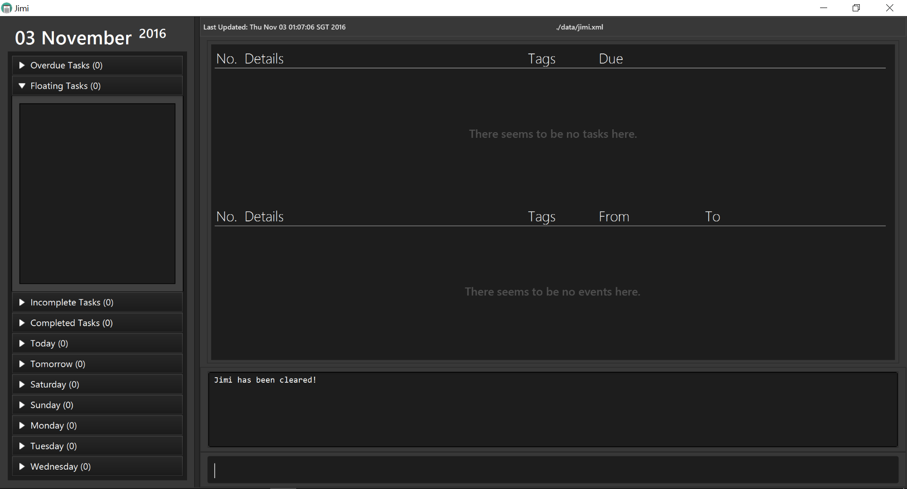
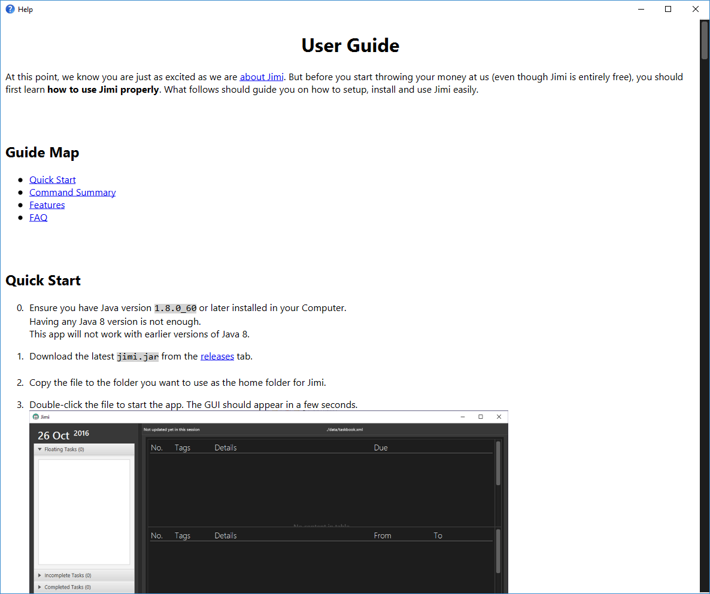
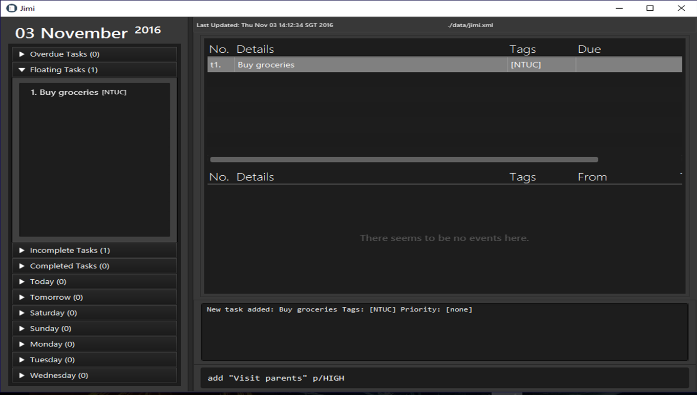
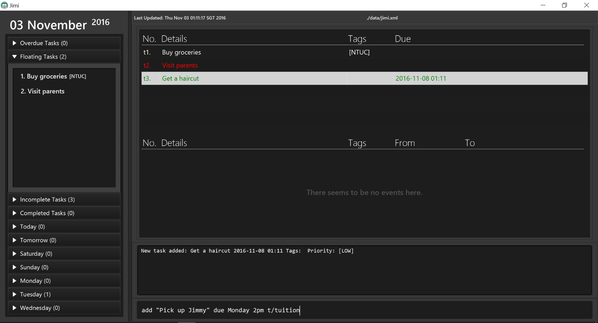
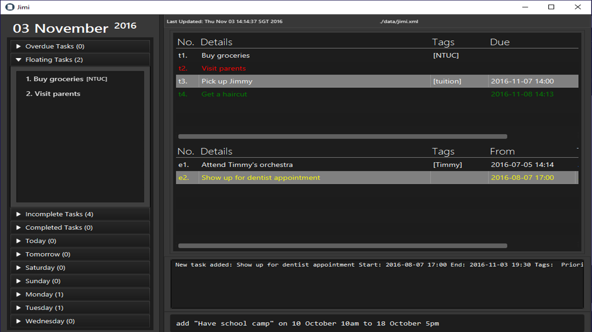
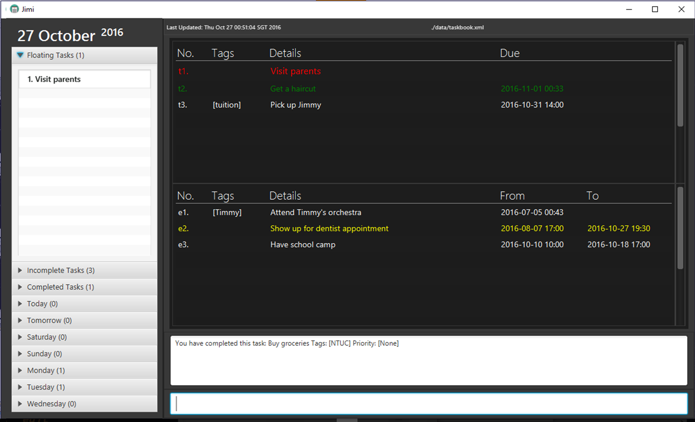
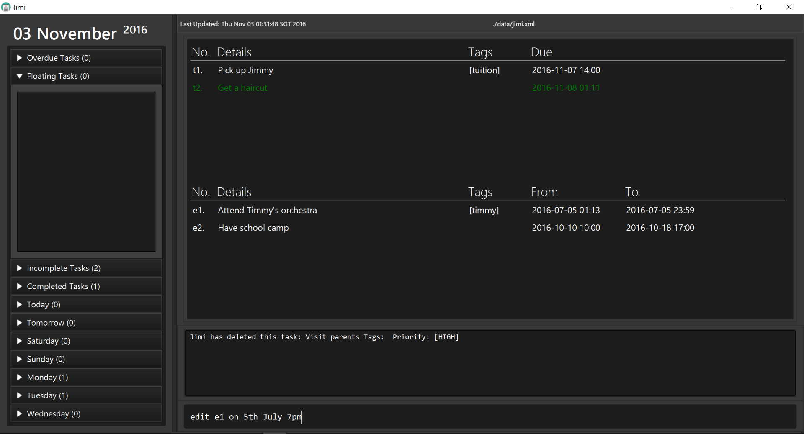
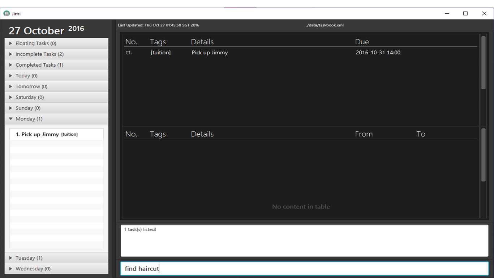
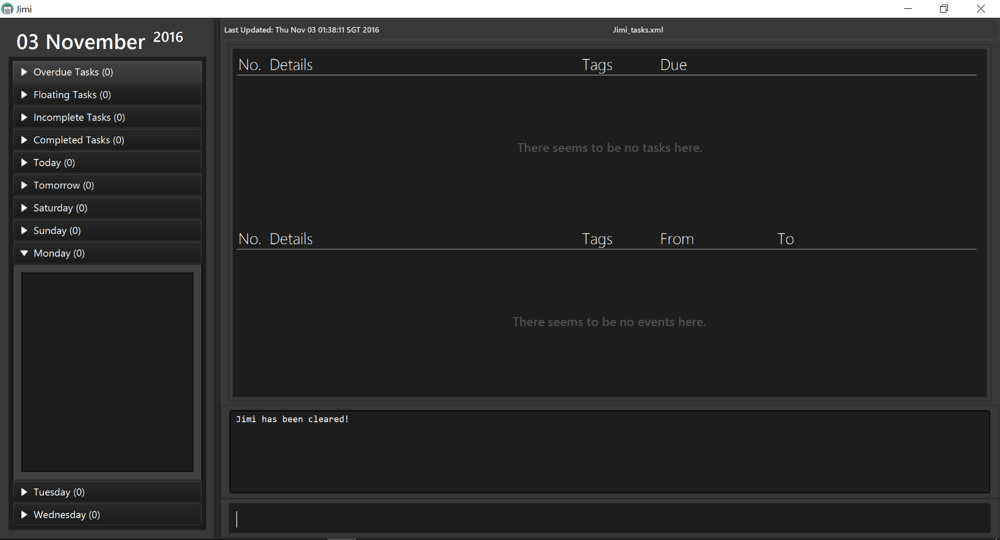

# User Guide

At this point, we know you are just as excited as we are [about Jimi](https://github.com/CS2103AUG2016-T09-C2/main/blob/master/README.md). But before you start throwing your money at us (even though Jimi is entirely free), you should first learn **how to use Jimi properly**. What follows should guide you on how to setup, install and use Jimi easily. 

  

## Guide Map

* [Quick Start](#quick-start)
* [Command Summary](#command-summary)
* [Features](#features)
* [FAQ](#faq)

  

## Quick Start

0. Ensure you have Java version `1.8.0_60` or later installed in your Computer. 
   > Having any Java 8 version is not enough.  
   This app will not work with earlier versions of Java 8.
   
1. Download the latest `jimi.jar` from the [releases](../../../releases) tab.
2. Copy the file to the folder you want to use as the home folder for Jimi.
3. Double-click the file to start the app. The GUI should appear in a few seconds. 
> 

4. Type the command in the command box below and press <kbd>Enter</kbd> to execute it.  
   e.g. typing **`help`** and pressing <kbd>Enter</kbd> will open this user guide in another window.
5. Some example commands you can try: 
   * **`add`**` "do laundry" `**`due`**` tomorrow` : 
     adds a task named `do laundry` due `tomorrow` to Jimi.
   * **`delete`**` t1` : deletes the 1st task shown in the current task list
   * **`exit`** : exits the app
6. Refer to the [Features](#features) section below for details of each command. 

 
 

<!--- @@author A0148040R -->
## Command Summary
Command | Format  
-------- | :-------- 
[Help](#help) | `help`
[Add](#add) | `add "TASK_DETAILS" [t/TAG] [p/PRIORITY]`
&nbsp;| `add "TASK_DETAILS" due DATE_TIME [t/TAG] [p/PRIORITY]`
&nbsp;| `add "EVENT_DETAILS" on START_DATE_TIME [to END_DATE_TIME] [t/TAG] [p/PRIORITY]`
[Complete](#com)| `complete INDEX`
[Delete](#del) | `delete INDEX`
[Edit](#edit) | `edit INDEX NEW_DETAILS`
[Show](#show) | `show SECTION`
[Undo](#undo) | `undo`
[Redo](#redo) | `redo`
[Find](#find) | `find KEYWORD [MORE_KEYWORDS]`
[SaveAs](#saveas) | `saveas NEW_DIRECTORY`
[Clear](#clear) | `clear`
[Exit](#exit) | `exit`

 

<!--- @@author A0140133B -->
### General Information About Command Format

* Commands have to follow a certain format as shown in the table above.
* Replace words in `UPPER_CASE` with your input.
* Items in `[]` are optional.
* The order of your input text is fixed. For instance, `add [DATE_TIME] due [TASK_DETAILS]` is invalid. 
* Some commands allow shorter command words for advanced users. Some commands, due to their critical nature e.g. `exit` or `clear`, you are required to type the full command word.
* Command words are also all case-insensitive i.e. `add` works as well as `ADD`.
* Below is a table of accepted command words of all commands.

Command | Default Command Word | Shortcuts  
-------- | :-------- | :--------
Help | `help` | `h`, `he`, `hel`
Add | `add` | `a`, `ad`
Compete | `complete` | `c`, `co`, `com`, ... , `complet`
Delete | `delete` | `d`, `de`, `del`, ... , `delet`
Edit | `edit` | `e`, `ed`, `edi`
Show | `show` | `s`, `sh`, `sho`
Undo | `undo` | `u`
Redo | `redo` | `r`
Find | `find` | `f`, `fi`, `fin`
SaveAs | `saveas` | None
Clear | `clear` | None
Exit | `exit` | None

 

**Input of Task/Event Name**
* You have to always surround task/event names with double quotation marks, `"`.
* Other than that, you can type anything within those double quotation marks.

<!--- @@author -->
 
<!--- @@author A0148040R -->

**Input of Date and Time in Commands**
* The input of date and time is flexible.
* Eg:
   * Tomorrow 2pm
   * Next Monday
    * 7/11/2016
* You can either input date, time or both.
    * If no time is given, the current time will be used instead.
    * If no date is given, the current date will be used instead.
* However, you cannot input none of them.
* The start-date & time of the events cannot be earlier prior to the end-date & time.

 

**Input of Index**
* In order to differentiate the indexes of the tasks and events in the command inputs:
    * The index of tasks should be preceded by the letter 't'.
    * The index of events should be preceded by the letter 'e'.
    * Eg:
        * complete **t1**
        * delete **e3**

 
 

<!---  @@author A0143471L -->
## Features

####  Viewing help : `help`
Teaches you how to use Jimi.  
Format: `help`

The user guide will open in another window.

> 

  

####  Adding a task: `add`

Adding a floating task to Jimi. 
Format: `add "TASK_DETAILS" [t/TAG] [p/PRIORITY]` 

> * Floating tasks are tasks without any deadlines.

Examples: 
* `add "Buy groceries" t/NTUC`
* `add "Visit parents" p/HIGH`

> 

 

Adds a task with a deadline to Jimi. 
Format: `add "TASK_DETAILS" due DATE_TIME [t/TAG] [p/PRIORITY]`

Examples:
* `add "Get a haircut" due Tuesday p/LOW`
* `add "Pick up Jimmy" due Monday 2pm t/tuition`

> 

 

Adds an event to Jimi. 
Format: `add "EVENT_DETAILS" on START_DATE_TIME [to END_DATE_TIME] [t/TAG] [p/PRIORITY]` 

> * If the event is more than a day long, you may include the end date_time.  
> * You may define the end time of the event if you wish. If you do not, however, Jimi will assume your event lasts a day long.

Examples:
* `add "Attend Timmy's orchestra" on 5th July t/Timmy`
* `add "Show up for dentist appointment" on 8-7-2016 5:00pm to 7:30pm p/MED`
* `add "Have school camp" on 10 October 10am to 18 October 5pm`

> 

  

#### Marking a task as complete: `complete`
Marks an existing task as complete.  
Format: `complete TASK_INDEX`

> * Jimi will mark the task as completed at the specified `TASK_INDEX`. 
> * If you want to revert the task back as incomplete, use the [`undo`](#undo) command.

Example:
* `complete t1`

> 

  

#### Deleting a task/event: `delete`
Deletes the specified task/ event from Jimi. 
Format: `delete INDEX`

> * Jimi will delete the task specified by `INDEX`. 
> * If you need to recover your deleted task/event, use the [`undo`](#undo) command.

Examples: 
* `delete e2`
  Deletes the 2nd event in Jimi.
* `delete t1`
  Deletes the 1st task in the Jimi.

> 

  

<!--- @@author A0140133B -->
#### Editing a detail: `edit`
Edits the specified detail of any task or event.  
Format: `edit INDEX NEW_DETAILS` 

* Jimi edits the task/event specified by `INDEX`, `NEW_DETAILS` are simply the edits you want to make.  
* You can edit everything from the items name to its priority. You can leave out fields that you do not wish to edit too.  
* Although all fields are optional, they can't all be empty!
* Below is the format of `NEW_DETAILS` that Jimi recognizes when editting:  

Editting A | What to Type for `NEW_DETAILS` | Examples | What Jimi Will Do
-------- | :-------- | :-------- | :--------
Dateless Task | ["NEW_TASK_DETAILS"] [t/NEW_TAG] [p/NEW_PRIORITY] | edit t1 "finish this user guide" | Edit just the name of task t1.
Deadine Task | ["NEW_TASK_DETAILS"] [due NEW_DATETIME] [t/NEW_TAG] [p/NEW_PRIORITY] | edit t4 t/bobz | Edit just the tag of task t4.
Event | ["NEW_TASK_DETAILS"] [on NEW_START_DATETIME] [to NEW_END_DATETIME] [t/NEW_TAG] [p/NEW_PRIORITY] | edit e2 "go to concert" to monday p/LOW | Edit name, end date and priority of event e2.

 

* Using edit, you may also convert between item types. That is, you may freely convert between floating tasks (dateless tasks), events, and deadline tasks.  
* Below is the format of `NEW_DETAILS` that Jimi recognizes when converting:  

Converting To | What to Type for `NEW_DETAILS`| Examples
-------- | :-------- | :--------
Dateless Task | float | edit e1 float
Deadline Task | ["NEW_TASK_DETAILS"] due NEW_DATETIME [t/NEW_TAG] [p/NEW_PRIORITY] | edit e3 due tomorrow [p/HIGH]
Event | ["NEW_TASK_DETAILS"] on NEW_START_DATETIME [to NEW_END_DATETIME] [t/NEW_TAG] [p/NEW_PRIORITY] | edit t1 "skip CS2103 lecture" on 29 oct [t/IMPT]

> 

> * If you want to undo your edit, use the [`undo`](#undo) command.

<!--- @@author -->
  
<!---  @@author A0143471L -->

#### Showing section: `show`
Expands and lists sections from the left summary panel.  
Format: `show SECTION`

> * `SECTION` is case-insensitive.
> * For the sections with two words, you can type just the first word of the two. 

Examples:
* `show monday`
* `show completed`

> 

   

#### Undoing previous action: `undo`
Undoes the previous action done in Jimi.  
Format: `undo`

  

#### Redoing previously undone action: `redo`
Redoes the previously undone action done in the task manager.  
Format: `redo`

  

#### Finding all tasks relevant to keywords you input: `find`
Finds and lists all tasks in Jimi whose name contains any of the argument keywords. 
Format: `find KEYWORD [MORE_KEYWORDS]`

> * The order of the keywords you type in does not matter. e.g. `Essay writing` will match `Writing essay`
> * Only the task details are searched.
> * Only full words will be matched e.g. `Essay` will not match `Essays`
> * Tasks with details matching at least one keyword will be returned (i.e. `OR` search).
    e.g. `Writing` will match `Writing essay`

Examples: 
* `find Jimmy`
* `find Haircut`

> 

  

#### Setting save directory : `saveas`
Sets new save directory for the tasks and events in Jimi.
Format: `saveas NEW_DIRECTORY`

> * `NEW_DIRECTORY` should be in the format: `[desired_path]/[file_name].xml`
> * If you want to reset the save directory back to default, type `saveas reset`

Example:
* `saveas Jimi_tasks.xml`

> 

  

#### Clearing all entries : `clear`
Clears all entries from Jimi. 
Format: `clear`  

> 

> If you want to undo your clear, use the [`undo`](#undo) command.

  

#### Exiting the program : `exit`
Exits the program. 
Format: `exit`  

> Before exiting the program, ensure you have no unwanted actions that need to be reverted. You can only undo actions done in the current session.

  

#### Saving the data 
Address book data are saved in the hard disk automatically after any command that changes the data. 
There is no need to save manually.

  

## FAQ

**Q**: How do I transfer my data to another Computer? 
**A**: Install the app in the other computer and overwrite the empty data file it creates with the file that contains the data of your previous Address Book folder.
  
**Q**: Is there a way to be notified of upcoming tasks or events that are due soon? 
**A**: Jimi will display all overdue tasks, upcoming tasks and events at the top Agenda box, so you will always be notified of the most important details first.
  
**Q**: What happens if I typed in a wrong command? 
**A**: An unknown command message will be shown to you.
  
**Q**: What happens if I typed in the format wrongly? 
**A**: An invalid command format message will be shown to you, along with the correct format you should use instead.

