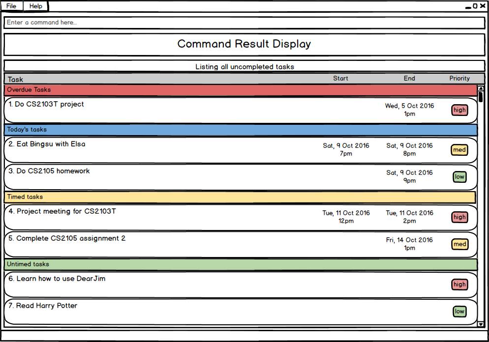

# User Guide

* [Quick Start](#quick-start)
* [Features](#features)
   * [Help](#viewing-help-help)
   * [Add](#adding-a-task-add)
   * [Edit](#editing-a-task-edit)
   * [Delete](#deleting-a-task-delete)
   * [Clear](#clearing-all-tasks-clear)
   * [Done](#archiving-a-task-done)
   * [Undo](#undoing-a-command-undo)
   * [Redo](#redoing-a-command-redo)
   * [List](#listing-tasks-list)
   * [Find](#finding-a-task-find)
   * [Store](#changing-storage-location-store)
   * [Exit](#exiting-the-application-exit)
* [FAQ](#faq)
* [Command Summary](#command-summary)
 

## Quick Start

1. Ensure you have Java version `1.8.0_60` or later installed in your computer. 
   > Having any Java 8 version is not enough.  
   This app will not work with earlier versions of Java 8.
   
2. Download the latest `DearJim.jar` from the [releases](../../../releases) tab.
3. Copy the file to the folder you want to use as the home folder for DearJim.
4. Double-click the file to start the app. The GUI should appear in a few seconds.  

Figure 1: GUI of DearJim

5. Type the command in the command box and press <kbd>Enter</kbd> to execute it.  
   e.g. typing **`help`** and pressing <kbd>Enter</kbd> will open the help window. 
6. Some example commands you can try:
   * **`list`** : lists all tasks. This is the default view.
   * **`add`**` Learn how to use DearJim` : 
     adds a task to DearJim.
   * **`delete`**` 1` : deletes the first task shown in the current list.
   * **`exit`** : exits the app.
7. Refer to the [Features](#features) section below for details of each command. 

 
## Features

> **Command Format**
> * Format: `<command word> <parameters>`
> * Words in `UPPER_CASE` are the parameters.
> * Fields in `[]` are optional.
> * The order of parameters is fixed.

 
### Viewing help: `help`
Opens the user guide with a new window. 
Format: `help` 

 

Figure 2: Help Command

### Adding a task: `add`
Adds a task into DearJim. 
Format: `[add] NAME [start DATE_TIME] [end DATE_TIME] [repeat every RECURRING_INTERVAL] [-PRIORITY]`

>You may also substitute `start` with `from/at`, `end` with `to/by`.

By default, if no valid command is specified, the input will be treated as an `add` command. This means typing in `add` is optional.  
If you would like to add a task with a name that begins with other command words, just include the `add` to override the other command words.  

Example:

|Input|Interpreted Command| Intepreted Parameters | Result|
|---|---|---|---|
|`help my mum to buy cooking ingredients`| `help`|`my mum to buy cooking ingredients`| Execute `help` command|
|`add help my mum to buy cooking ingredients`| `add`| `help my mum to buy cooking ingredients`| `add` a task with name `help my mum to buy cooking ingredients`|

**_Adding a task_**

Format: `NAME `

> The simplest form of a task. Type away!

Example:
* `help my mum to buy cooking ingredients`

 

**_Specifying task priority_**

You can assign a `PRIORITY` of `low`, `medium` or `high` to your task.  
Tasks have `medium` `PRIORITY` by default. 
Keyword: `-PRIORITY`

To specify the priority for a task, input a `-` followed by the `PRIORITY`. 
`PRIORITY` also accepts variations of `low`, `medium` and `high`.

`PRIORITY` | Variations  
-------- | :--------:
`low` | `l`, `low`
`medium` | `m`, `med`, `medium`
`high` | `h`, `high`

Examples:
* `Watch drama -l`
* `Buy coffee powder -med`
* `Buy washing powder -high`

 

**_Adding a task with deadline_**

Nobody likes deadlines. What's worse is missing them.  
Add deadlines to your task so you will know when you need to complete them! 
Format: `NAME end DATE_TIME [repeat every RECURRING_INTERVAL] [-PRIORITY]`

> `end` denotes a deadline.  
> `end` can also be substituted with `by` or `to`.

`DATE_TIME` is flexible! 
* If no `DATE` is specified, `DATE` will be assumed to be today. 
* If no `TIME` is specified, `TIME` will be assumed to be 11:59pm. 

 

**_Valid Dates & Times_**

|Date| Format|Interpreted Date|
|-------- | :-------- |---|
|MM/DD/YYYY| `12/12/2016`| 12 December 2016
|MM/DD/YY| `12/12/16`|12 December 2016|
|MM/DD| `12/12` |12 December, Current Year|
|Calendar|`12 December 2016`, `12th December 2016`  `12 December 16`|12 December 2016
|Calendar (Date and Month)|`12 December`|12 December, Current Year
|Calendar (Month)| `may`, `May`  `dec`, `Dec`, `December`| 1 May, Current Year  1 December, Current Year|
|Day|`monday`, `Mon`|Nearest upcoming Monday|
|Relative Date| `today`, `tonight`  `tmr`, `tommorow`|Today  Tomorrow|
 

|Time| Format| Interpreted Time|
|-------- | :-------- |---|
|24Hr| `20.50`, `20:50`, `2050`| 8.50pm|
|AM/PM| `8.50pm`, `8:50pm`, `0850pm`| 8.50pm|
|Preset|`midnight`  `noon`|12am 12pm|
 

Examples:
* `Do project proposal by 5pm tmr`
* `eat lunch by 1pm today -high`
* `Buy coffee for boss by 7:00`
* `finish CS2101 assignment by 13th Sep`

Inputs with numbers from 1000 to 2359 may be wrongly interpreted as time. If you need to add a task with these numbers, you can enclose the task name with double inverted commas to denote the task name explicitly.

Example:

|Input|Interpreted Command|Interpreted Task Name| Interpreted Deadline| Result|
|---|---|---|---|---|
|`Lower word count by 1500`|`add`|`Lower word count`|`by 1500`|`add` a task with name `Lower word count` and deadline `1500`|
|`"Lower word count by 1500"`|`add`|`Lower word count by 1500`| NONE| `add` a task with name `Lower word count by 1500`|

 

**_Adding a task with time interval_**

Having a company meeting? Planning to have lunch with a friend next week?   
Add a task with a time interval so you will know what time your task starts and ends! 
If you are unsure about the end time for the task, you can leave it blank.   
Format:
`NAME start DATE_TIME [end DATE_TIME] [repeat every RECURRING_INTERVAL] [-PRIORITY]` 
> Note: You may use `from` or `at` to indicate the start time, and `to` or `by` to indicate the end time. 

Example: 
* `Company meeting tonight at 7pm to 9pm`
* `Family dinner at noon`
* `Meet Akshay from 1pm -h`

 

**_Specifying repeated tasks_**

Have one of those pesky tasks you need to do every now and then? 
DearJim also allows you to specify tasks that need to be repeated at a specific `RECURRING_INTERVAL`. Never forget them again! 
Keyword: `repeat every RECURRING_INTERVAL`
> Note: You may only specify a `RECCURING_INTERVAL` for tasks that are timed.

`RECURRING_INTERVAL` can be specified in a few formats, with some examples listed below.

Recurring Interval | Format  
-------- | :-------- 
Hour | `hour`, `3 hours`
Day | `day`, `3 days`, `monday`, `mon`
Week | `week`, `5 weeks`
Month | `month`, `2 months`
Year | `year`, `6 years`

Examples: 
* `Run at track at 7am repeat every 3 days`
* `Visit mum repeat every sun`

 

### Editing a task: `edit`
Just in case you need to change any details, or add in missing ones into your task, simply edit them in DearJim.   
Format: `edit INDEX [NAME] [start DATE_TIME] [end DATE_TIME] [repeat every RECURRING_INTERVAL] [-PRIORITY]`

> `INDEX` refers to the task number in the current displayed list. 
> Note: `edit` has a very similar format to `add`.

Examples:
* `Company meeting tonight at 7pm to 9pm`
* `edit 2 Company meeting tomorrow morning at 7am to 9am -high`

* `Buy coffee for boss by 8am repeat every day`
* `edit 3 Buy coffee for boss by 7am repeat every 2 days`

 

**_Editing out details in a task_**

 You can also remove parameters that are no longer relevant.  
 Format: `edit INDEX [-reset parameter] [repeat] [start] [end] `

|`-reset parameter`|Result|
|---|---|
|`-reset repeat`| Removes recurring interval from task|
|`-reset start`| Removes start time from task|
|`-reset end`| Removes end time from task|

Examples:
* `Buy coffee for boss, by 8am repeat every day`
* `edit 1 -reset repeat start`
* `edit 2 -reset end`

> Note: `-reset` will override any `edit` of the same field that comes before it in your input.

 

### Deleting a task: `delete`
Deletes an existing task in DearJim. This will remove them from the storage.  
Format: `delete INDEX`
> You can `delete` multiple tasks using a single command by entering the indexes of the tasks you want to delete, separating each index with a space.

Example:
* `delete 2`
* `delete 3 5 9`

 

### Clearing all tasks: `clear`
Deletes all tasks in DearJim. 
Format: `clear`

 

### Archiving a task: `done`
Marks a task as done and archives it in DearJim. 
Format: `done INDEX`
> You can `done` multiple tasks using a single command by entering the indexes of the tasks you have completed, separating each index with a space.

Example:
* `done 3`
* `done 1 5`

 

### Undoing a command: `undo`
Reverses the effects of the previous command if the command is reversible. Helps you to undo any accidental mistakes that you have made!  
Format: `undo`
> Commands that you can `undo`
> * `add`
> * `edit`
> * `delete`
> * `clear`
> * `done`

 

### Redoing a command: `redo`
Reverses a previous `undo` command.  
Format: `redo`
> `redo` allows your to reverse your previous `undo` to get back your data!
>
> Note: `redo` only works if no `add`, `edit`, `delete`, `clear` or `done` commands have been entered after the last `undo`.

 

### Listing tasks: `list`
**_Listing all undone tasks_**

Switches the task list view to the undone list view, to show all undone tasks in DearJim. 
Format: `list`

Example:
* `list`
 

**_Listing all done tasks_**

Switches the task list view to the done list view, to show all done tasks in DearJim. 
Format: `list done`

Example:
* `list done`
 

### Finding a task: `find`
Forgot about the details of a task that you have added earlier? You can find an existing task by its name. 
Format: `find NAME`
> `find` is case-insensitive - `find AKSHAY` will match `find akshay`
>
> If no NAME is provided, all uncompleted tasks will be displayed

Examples:
* `find Akshay`
* `find company meeting`
* `find`

 

### Changing storage location: `store`
Need to look at your task on the move? Simply store the data at another location and bring it along with you. 
Format: `store FILEPATH`
> Your data will be saved inside the folder you choose as an XML file

Examples:
* `store data/onthemove.xml`

 

### Exiting the application: `exit`
Closes the application. 
Format: `exit`

 

### Getting hints for command format
If you have forgotten about the command formats, simply type any word and DearJim will provide you hints on the command format that you might want to use!

Examples:
* Typing `add` in the command input generates the format for `add` in the result display

Figure 4: Hints for add command

 

* Typing `delete` in the command input generates the format for `delete` in the result display

Figure 5: Hints for delete command

 

### Saving the data 
Data in DearJim is automatically saved on the hard disk after any command that changes the data is executed. 
There is no need to save manually.

## FAQ

**Q**: How do I transfer my data to another computer? 
**A**: Install the app on the other computer. Upon starting DearJim, an empty data file is created. Overwrite the contents of the data file with the data file in your previous *DearJim* folder.

**Q**: How do I install the program? 
**A**: Double-click the DearJim.jar file.
       
## Command Summary

Command | Format  
-------- | :-------- 
Help | `help`
Add | `[add] NAME [start DATE_TIME] [end DATE_TIME] [repeat every RECURRING_INTERVAL] [-PRIORITY]`
Edit | `edit INDEX [NAME] [start DATE_TIME] [end DATE_TIME] [repeat every RECURRING_INTERVAL] [-PRIORITY] [-reset parameter]`
Delete | `delete INDEX`
Clear | `clear`
Done | `done INDEX`
Undo | `undo`
Redo | `redo`
List | `list [done]`
Find | `find NAME`
Store| `store FILEPATH`
Exit | `exit`
