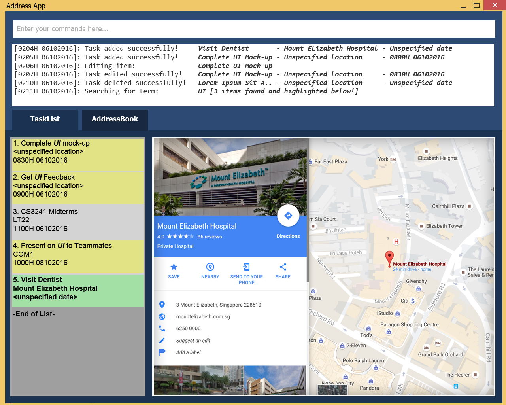

# User Guide

* [Quick Start](#quick-start)
* [Features](#features)
* [FAQ](#faq)
* [Command Summary](#command-summary)

## Quick Start

0. Ensure you have Java version `1.8.0_60` or later installed in your Computer. 
   > Having any Java 8 version is not enough.  
   This app will not work with earlier versions of Java 8.
   
1. Download the latest `malitio.jar` from the [releases](../../../releases) tab.
2. Copy the file to the folder you want to use as the home folder for your malitio.
3. Double-click the file to start the app. The GUI should appear in a few seconds. 
   > 

4. Type the command in the command box and press <kbd>Enter</kbd> to execute it.  
   e.g. typing **`help`** and pressing <kbd>Enter</kbd> will open the help window. 
5. Some example commands you can try:
   * **`list deadlines`** : lists all deadlines
   * **`add`**` drink water` : 
     adds `drink water` to the to-do-list.
   * **`delete`**` 3` : deletes the 3rd item shown in the current list
   * **`exit`** : exits the app
6. Refer to the [Features](#features) section below for details of each command. 

## Features

> **Command Format**
> * Words in `UPPER_CASE` are the parameters.
> * Items in `SQUARE_BRACKETS` are optional.
> * Items with `...` after them can have multiple instances.
> * The order of parameters is fixed.
> * The following format of DATE/TIME is recognised: 2016-10-24 12pm, Oct 24th noon, day after tomorrow 3pm, next wed.
> * If one of the field of year, month, day or time is not specified, the default is current date/time.

#### Viewing help : `help`
Format: `help`

> Help is also shown if you enter an incorrect command e.g. `abcd`
 
#### Adding a task: `add`
Adds a task to the to-do list 
There are three types of tasks that can be added in Malitio 
Namely Floating Task, Deadline and Event. Floating Task are tasks which have no due dates. 
Floating Task Format: `add TASK_NAME [t/TAG] [p/priority]` 
Deadline Format: `add TASK_NAME by DATE/TIME [t/TAG] [p/priority]` 
Event Format: `add TASK_NAME start DATE/TIME end DATE/TIME [t/TAG]`

Examples: 
* `add drink water p/high`
* `add CS2103 homework by 09-10 1100  p/high`
* `add lunch with mom start 05-10 1400 end 05-10 1700 t/don’t be late`

<!--- @@author A0153006W --->

#### Listing tasks: `list`
Shows a list of everything in the to-do list. 
Format: `list [tasks|events|deadlines]`

Shows a list of all events and/or deadlines in the to-do list on and after that date. 
Format: `list [deadlines|events] DATE/TIME`

Examples:
* `list`
* `list deadlines`
* `list deadlines 05-10 1400`
* `list 05-10 1400`
<!--- @@author --->

<!--- @@author a0126633j --->
#### Finding all deadlines/floating tasks/events containing any keyword in their names and tags: `find`
Finds all input entries specified by the type (deadlines/ floating tasks/ events) whose names contain any of the given keywords. 
If the type is not specified, all entries containing the keyword will be displayed.  
Format: `find [f|d|e] KEYWORD  [MORE KEYWORDS]`

> * The search is case insensitive.
> * The order of the keywords does not matter. e.g. `Hans Bo` will match `Bo Hans`
> * Only the task names are searched.
> * Only full words will be matched e.g. `Han` will not match `Hans`
> * Task matching at least one keyword will be returned (i.e. `OR` search).
    e.g. `Hans` will match `Hans Bo`

Examples: 
* `find f lunch` 
  Returns `lunch with mom in floating task` 
* `find d lunch` 
  Returns `lunch with mom in deadlines` 
* `find e lunch` 
  Returns `lunch with mom in events` 
* `find lunch dinner breakfast` 
  Returns any tasks having names `lunch`, `dinner`, or `breakfast`

#### Deleting a task : `delete`
Deletes the specified task from the to-do list. Irreversible. 

Format: `delete INDEX`

> Deletes the task at the specified `INDEX`. 
  The index **must have either 'f','d' or 'e' as a prefix and also a positive integer** f1, e2, d3, ... 

Examples: 
* `delete e2` 
  Deletes the 2nd task in the currently showing events list.
* `delete f1` 
  Deletes the 1st task in the currently showing floating task list. 
<!--- @@author --->

<!--- @@author A0129595N --->

#### Edit a task : `edit`
Edits the specified task from the to-do list. 
Edit Floating Task Format: `edit 'f'INDEX [TASK_NAME] [t/TAG]` 
Edit Deadline Format: `edit 'd'INDEX [TASK_NAME] [by DATE/TIME] [t/TAG]`  
Edit Event Format `edit 'e'INDEX [TASK_NAME] [start DATE/TIME] [end DATE/TIME]`  
To remove all tags from a task without adding new ones, use the parameter: t/null  

> Edits the task at the specified `INDEX` with the given one or more parameters.
  The index refers to the index number shown in the most recent listing. 
  The index **must have either 'f','d' or 'e' as a prefix and also a positive integer** f1, e2, d3, ... 
  At least one of the optional parameters must be present  
  The prefix is not case sensitive.  
  The edit function can only edit the details within the same type of task.  
  No changing of task type supported.  

Examples: 
  `edit e1 end 12-21 2359`  
  Edit the 1st event in the to-do list replacing its original end time with 12-21 2359.  
  `edit 1 n/lunch with mom` 
  Edits the 1st task in the results of the `find` or ‘ command. 
  Need to put at least one field
<!--- @@author --->

<!--- @@author A0122460W--->
#### Completing a floating task or deadline: `complete`
complete the specified floating task or deadline from Malitio by striking out them. 
Format: `complete f/d+INDEX`

> Complete the floating task or deadline at the specified `INDEX`. 
  The index refers to the index number shown in the most recent listing. 
  The index **must have either 'f' or 'd' as a prefix and also a positive integer** eg. f1, d2, ...

Examples: 
  `complete f2` 
  Complete the 2nd floating task in Malitio.
  `complete d1` 
  Complete the 1st deadline in Malitio.

<!--- @@author A0153006W --->

#### Marking as priority : `mark`
Marks the specified task in the to-do list  
Format: `mark INDEX`

Examples:
* `mark f1`

#### Marking as priority : `unmark`
Unmarks the specified task in the to-do list  
Format: `unmark INDEX`

Examples:
* `unmark f1`
<!--- @@author --->

#### Clearing all entries : `clear`
Clears all entries from the to-do list. 
Format: `clear`  

<!--- @@author A0129595N --->
#### Undo the most recent action: `undo`
Undo the most recent data-related command and reverts Malitio to previous state.  
Data-related commands include add, delete, edit and clear.  
Format: `undo`

#### Redo the most recent action: `redo`
Redo the most recent data-related command and reverts Malitio to previous state before undo.  
Redo will no longer be possible after a new data-related command is executed.  
Data-related commands include add, delete, edit and clear.  
Format: `redo`

<!--- @@author --->
#### Exiting the program : `exit`
Exits the program. 
Format: `exit`  

#### Saving the data 
Malitio data are saved in the hard disk automatically after any command that changes the data. 
There is no need to save manually.  

<!--- @@author a0126633j --->
#### Specifying location of local data file: `save`
Users can specify which directory to save their data file. Only valid directory will be created if it does not exist already.  
The old data file will automatically be deleted.
Format: `save DIRECTORY`

Example: 
* `save C://Users` 
  Saves data in C://Users/malitio.xml
<!--- @@author --->

## FAQ

**Q**: How do I transfer my data to another Computer? 
**A**: Install the app in the other computer and overwrite the empty data file it creates with 
       the file that contains the data of your previous malitio folder.
       
## Command Summary

Command | Format  
------- | :------- 
Add	| `add TASK_NAME [by DATE/TIME] [start DATE/TIME end DATE/TIME] [t/TAG]...`
Clear 	| `clear`
Delete  | `delete [f|d|e]INDEX`
Find 	| `find KEYWORD [MORE_KEYWORDS] [t/TYPE]`
List 	| `list`
Edit 	| `edit [f|d|e]INDEX [NAME] [by DATE/TIME] [start DATE/TIME] [end DATE/TIME] [t/TAG]...`
Complete| `complete [f|d|e]INDEX`
Mark 	| `mark [f|d|e]INDEX`
Unmark 	| `unmark [f|d|e]INDEX`
Help 	| `help`
Undo 	| `undo`
Redo 	| `redo`
Save 	| `save DIRECTORY`

