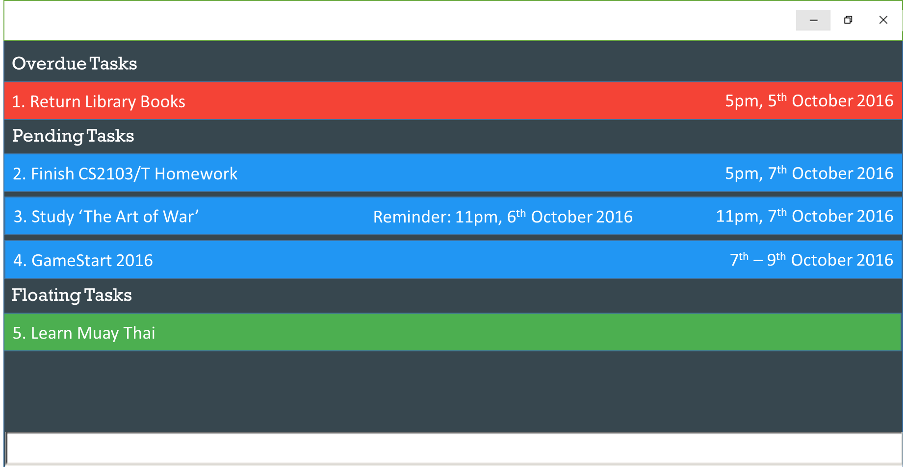
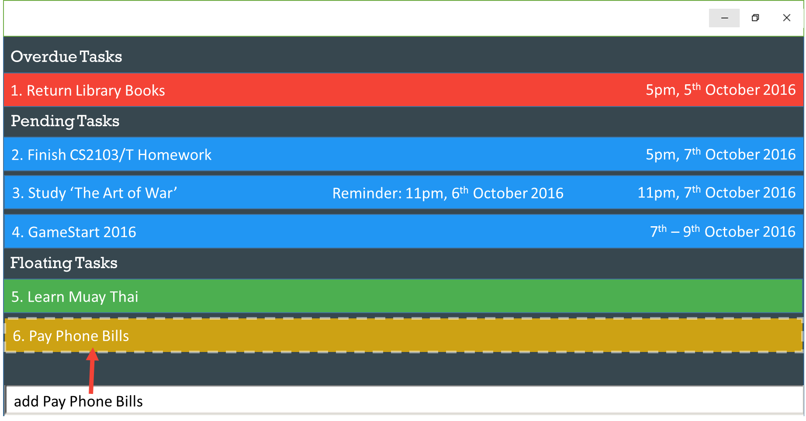
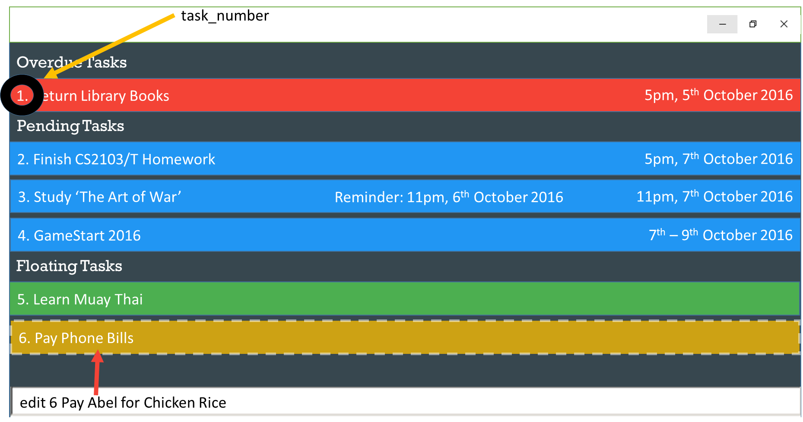
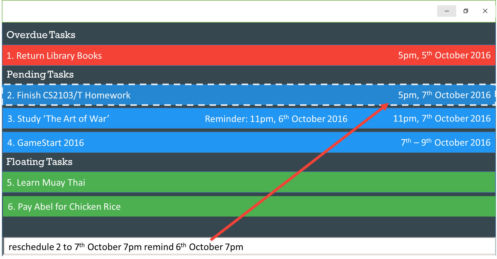
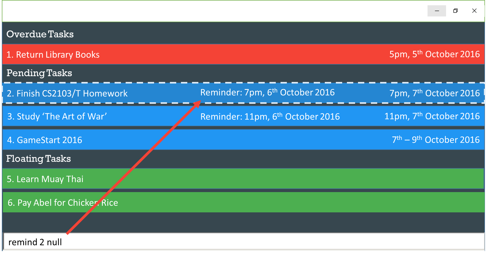
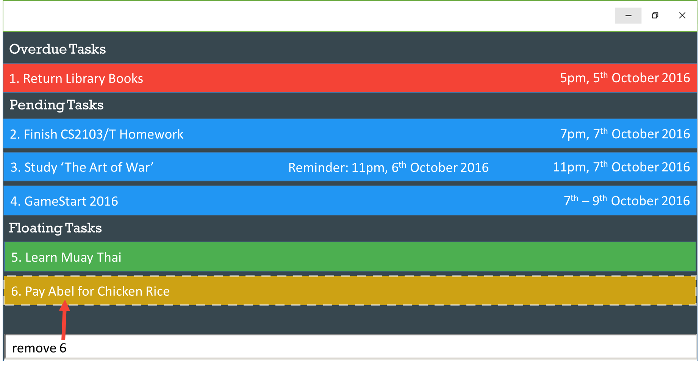
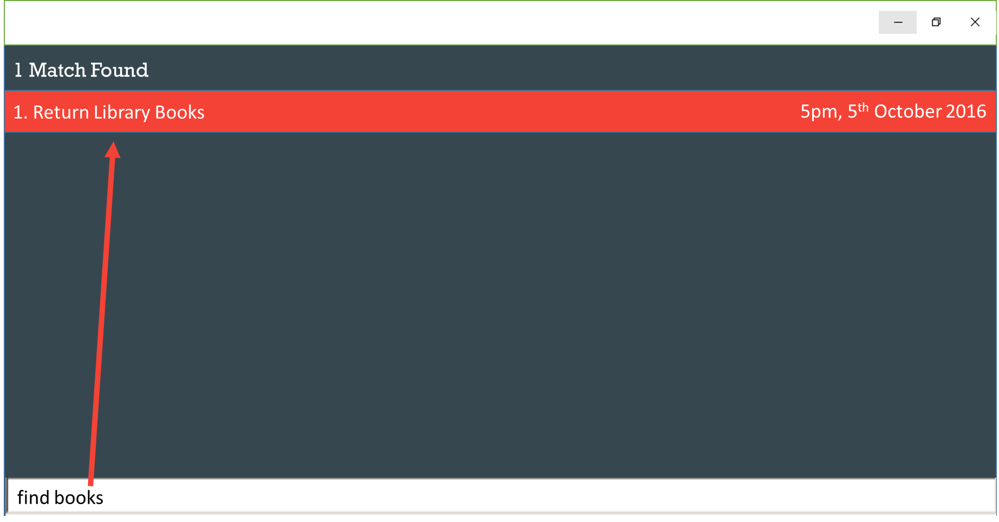
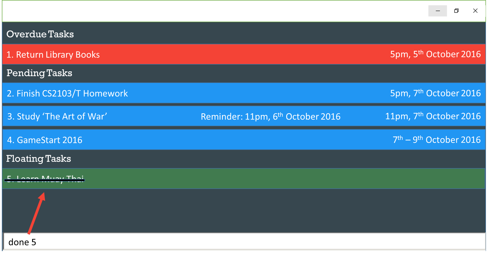
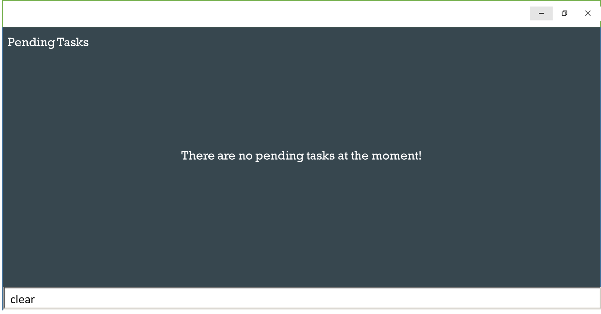
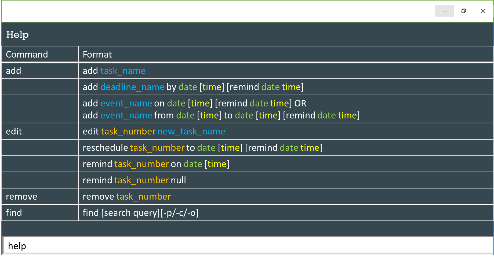

# User Guide

* [About](#about)
* [Quick Start](#quick-start)
* [Features](#features)
* [FAQ](#faq)
* [Command Summary](#command-summary)

## About
Do you have so many tasks to do everyday that you simply cannot keep track of them anymore? Don't you wish there was an easy way to stay on top of your daily tasks without stressing out?

*Taskle is here to help you with all of that.*

It is a task management application with a single text box for all your commands. 
Coupled with short and easy to remember commands, managing your tasks has never been this easy. 

Stop waiting and make "Getting Started with Taskle" the last thing on your to-do list now!

## Quick Start

0. Ensure you have Java version `1.8.0_60` or later installed in your Computer. 
   > Having any Java 8 version is not enough.  
   This app will not work with earlier versions of Java 8.
   
1. Download the latest `Taskle.jar` from the [releases](../../../releases) tab.
2. Copy the file to the folder you want to use as the home folder for your task manager application.
3. Double-click the file to start the app. The GUI should appear in a few seconds. 

4. Type the command in the command box and press <kbd>Enter</kbd> to execute it.  
   e.g. typing **`help`** and pressing <kbd>Enter</kbd> will open the help window. 
5. Some example commands you can try:
   * **`add`**` task_name` : Adds task_name to the to-do list
   * **`add`**` deadline_name by date [time] [remind date time]` : Adds deadline_name to the to-do list with a deadline and an accompanying reminder
   * **`add`**` event_name on date [time] [remind date time]` OR **`add`**` event_name from date [time] to date [time] [remind date time]` : Either adds event_name to the to-do list with either a flexible or fixed timeline and an accompanying reminder
   * **`remove`**` task_number` : Removes the task_number contact shown in the current to-do list
   * **`clear`**` task_number` : Clears all tasks from the application
   * **`exit`** : exits the appplication
6. Refer to the [Features](#features) section below for details of each command. 

## Features

Taskle makes it elegantly simple to manage your tasks. All of its features require only one single line of command making it very easy to use! Furthermore, it will be easy for you to keep track of your tasks with no hassle at all!

> **Command Format**
> * Words in **`BOLD`** are the parameters.
> * Items in `[SQUARE_BRACKETS]` are optional.
> * The order of parameters is fixed.

 

#### Add a Task / Event: `add`
Adds a task / event into the to-do application. You can add tasks with or without specifying the deadlines, and events with or without specifying the end date. In addition, for events and tasks with deadlines, a reminder time can be set for the application to remind you of the upcoming task / event. The time parameter is optional here.  

| Format |  
| :-------- | 
| `add `**`task_name`** |  
| `add `**`deadline_name`**` by `**`date`**` [`**`time`**`] [remind `**`date time`**`]` |  
| `add `**`event_name`**` on `**`date`**` [`**`time`**`] [remind `**`date time`**`]` |
| `add `**`event_name`**` from `**`date`**`[`**`time`**`] to `**`date`**` [`**`time`**`] [remind `**`date time`**`]`  |

Examples:
* `add `**`Pay Bills`**
* `add `**`Do CS2101 Assignment`**` by `**`12 Oct`**
* `add `**`Business Trip`**` from `**`4 Oct`**` to `**`5 Oct`**` remind `**`3 Oct 2pm`**

Note:  
* When entering date and time, the following formats are allowed:
	* 14 Jan, 14/01
	* 9pm, 2100
	* today, tmr
	* mon, tue, wed

* Words such as **by**, **on**, **from** and **to** are reserved for commands. When adding tasks, if the name consists of any of the reserved words, they should be enclosed within double quotation marks, (" "). For example:
	* add "**Collect equipment from Mary**" **tmr**

* When using reserved words **today**, **tmr** and days of the week, it is alright to omit the word **on** (applicable for events). For example:
	* add **Club Briefing tmr** &emsp; instead of: &emsp; add **Club Briefing on tmr**
  	

#### Edit a Task : `edit; reschedule; remind`
Edits a task into the to-do application. There are 3 types of edits possible: Edit Description, Reschedule and Remind. You are required to input the **task_number** (which can be seen in the mockup) in order for the application to identify which task you are intending to edit.  

Type | Format  
:-------- | :-------- 
Edit Description | `edit `**`task_number new_task_name`**  
Reschedule | `reschedule `**`task_number`**` to `**`date`**`[`**`time`**`] [remind `**`date time`**`]`    OR   `reschedule `**`task_number`**` from `**`date`**`[`**`time`**`] to ` **`date`**`[`**`time`**`] [remind `**`date time`**`]`
Remind | `remind `**`task_number`**` on `**`date time`**

Examples:
* `edit `**`3 Pass money to Abel`**

* `reschedule `**`Submit proposal `**` to `**`13 Oct 5pm`**

* `remind `**`1 3 Oct 2pm`**

Note:
* Only one reminder is supported for each task. The date and time specified in the "Remind" command will replace any existing reminder.
 
* Reminders need to have a **time** specified in order to know the exact time to remind you of upcoming appointments.

* To remove a reminder or deadline from a task, you will have to type "**null**" after typing the task number. For example:
	* remind **2 null**
	* reschedule **2 null**
	

	
	
  

#### Remove a Task: `remove`
Removes a task from the to-do application. 
Format: `remove `**`task_number`**

Examples:
* `remove `**`4`**

	

  

#### Finding a Task : `find`
Finds a task in the to-do application, based on keywords.  
Format: `find [`**`search_query`**`][`**`-p/-d/-o`**`]`

Examples:
* `find `**`meeting`**
* `find `**`submission -o`**

Note:
* After typing the words to search for, you can type any of the following keywords to search for specific types of events:
	* **-p**: Tasks that are still pending.
	* **-c**: Tasks that are marked as completed.
	* **-o**: Tasks that are overdue (applicable for deadlines only)
* To view all types of events, you can simply omit the above keywords. 
* To display all tasks, simply type `find`
* To display all the tasks of a specific type, simply omit the **search_query** parameter while including the keyword mentioned above. For example:
	* `find `**`-p`**
	

  

#### Mark a Task as Done: `done`
Marks a task as done. Use this command when you are finished with the task. 
Format: `done`

  

#### Undoing a Recent Command: `undo`
Marks a task as done. This command is used when you are finished with the task.  
Format: `undo`

  

#### Clearing all Tasks: `clear`
Clears all tasks from the application.  
Format: `clear`

  

#### View Help: `help`
Displays a list of available commands. 
Format: `help`

Note:
* Help is also shown if you enter an incorrect command. For example: `abcd`

  

#### Exit the Application: `exit`
Exits the application.  
Format: `exit`  
  

## FAQ

**Q**: How do I transfer my data to another Computer? 
**A**: Install the application in the other computer and overwrite the empty data file it creates with 
       the file created in your previous to-do application folder.
       
## Command Summary

The table below shows the overall list of commands used in the application. 
Note the following conventions used:
* Words in **`BOLD`** are the parameters.
* Items in `SQUARE_BRACKETS` are optional.
* The order of parameters is fixed.

Command `(Shortcut)` | Format  
:-------- | :-------- 
Add `a` | `add `**`task_name`**  
 | `add `**`deadline_name`**` by `**`date`**` [`**`time`**`] [remind `**`date time`**`]` 
 | `add `**`event_name`**` on ` **`date`**` [`**`time`**`] [remind `**`date time`**`]`|
 |`add ` **`event_name`**` from `**`date`** ` [`**`time`**`] to `**`date`**` [`**`time`**`] [remind `**`date time`**`]`  
Edit Description `e` | `edit `**`task_number new_task_name`**
Reschedule `r` | `reschedule `**`task_number`**` to `**`date`**` [`**`time`**`] [remind `**`date time`**`]`  OR   `reschedule `**`task_number`**` from `**`date`**`[`**`time`**`] to ` **`date`**`[`**`time`**`] [remind `**`date time`**`]`
Set Reminder `s` | `remind `**`task_number date time`**
Remove `rm` | `remove `**`task_number`**
Undo `u` | `undo`
Find `f` | `find [`**`search_query`**`] [`**`-p/-c/-o`**`]`
Mark as Done `d` | `done `**`task_number`**
Clear | `clear`
Help `h` | `help`
Exit | `exit`
