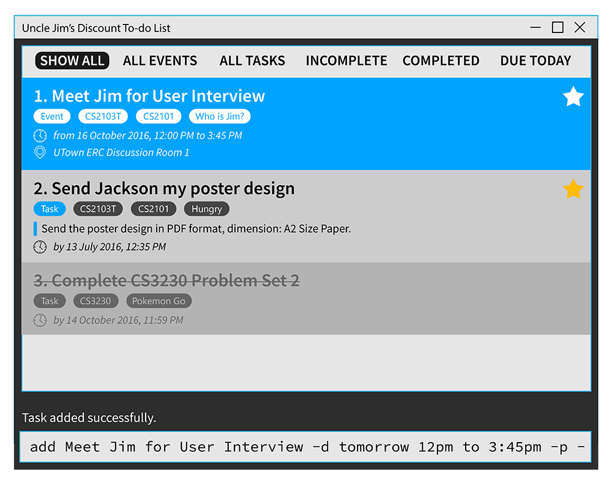

[TOC]

## Introduction

In today's hectic society, our lives feel like a never-ending procession of tasks, deadlines, events and anniversaries to keep up with. Tracking these daily activities on a to-do list can be daunting. Many todo list apps have too many buttons that you have to click through just to add a task, and user interfaces that are so cumbersome it is hard for you to make it a habit to use.

Ever wished for a tool that can manage all your daily activities in distinct categories, and suggest to you which one you want to complete first? Well, look no further as Uncle Jim's Discount To-do List is here to save your day.

Uncle Jim's Discount To-do List (UJDTDL) is a revolutionary mouse-free personal task manager that helps you to keep track of your daily activities through the power of your keyboard. Gone are the days where you had to click through several pages of menus, navigating through unintuitive interface just to add a simple task to your schedule. Our command line interface is not only flexible but remarkably easy to use. Just type out the command hit enter!

Moreover, we know that you understand your activities better. So UJDTDL allows you to create your very own categories to organise your activities. At the same time, UJDTDL is capable of scheduling floating tasks for you if you do not have a fixed time for them. Lastly, our unique product will intelligently sieve out urgent deadlines and serve up reminders for you so you will no longer overlook another significant activity.

Sounds exciting? Then let's get started!

## Quick Start

1. Ensure you have [**Java version 8 update 60**][java] or later installed on your computer.

    !!! warning "This application will not work with earlier versions of Java 8"

2. Download the latest copy of `UJDTDL.jar` from the [releases](../../../releases) tab.
3. Save the file to the folder you want to use for this application.
4. Double-click the file to start the application.

     
    
5. Type the command in the command box and press <kbd>Enter</kbd> to execute it. 
6. Some example commands you can try:

     * **`add`**` Finish CS2103T homework -d next Friday` - 
       adds a new task with the deadline set at next Friday
     * **`delete`**` 3` - deletes the 3rd task shown in the current list
     * **`exit`** - exits the app
     
7. Refer to the [commands reference](#commands-reference) section below for details of each command.

## Features

### Command Line Interface

Time is precious. That's why you're use a productivity app to save time, not to fiddle around with the interface. Our app allows you to create and organize tasks at the speed of thought - just typing, no frails. Put that mouse away, because all you need is your trusty keyboard. 

### Custom Tags and Intelligent Views

Organising your life is important. Compartmentalisation allows you to prioritise which tasks are more important. This is why we baked in the ability to tags each of your tasks and events. UDJTDL will then intelligently filter out relevant categories at your command, and sort them in order of importance so you know what you should be working on at any time.

### Events *and* Tasks

Deadlines and events are equally important. However, most productivity apps only allow you to manage either tasks *or* events. Our application can help you to manage both of them at the same time. No more having to constantly switch between your calendar and todo list applications to be productive. 

 
## Commands Reference

### Command Format

* Words in `UPPERCASE` are the parameters.
* Items in `[SQUARE BRACKETS]` are optional.
* To specify parameters, such as the deadline for a task, use flags. Flags follow the Unix command format - single dash (eg. `-f`) for short flags and double dash for long flags (eg. `--all`)
* Items with `...` within each parameter means you can add more items within the same parameters than specified.
* Most commands that refer to a particular task or event in the list require an `INDEX`. This is a number indicated on the left of a task or event as shown in the screenshot below:

 

### Viewing help : **`help`**
Format: **`help`**

Shows you a help window, which contains a list of commands and their actions.
 
### Adding a task or event: **`add`**

Adds a new task or event.  
Format:  
**`add`**` TASK NAME [-d DEADLINE] [-m DESCRIPTION] [-r TIME] [-p] [-t TAG 1, TAG 2...]`  
**`add`**` EVENT NAME -d START END [-m DESCRIPTION] [-l LOCATION] [-p] [-t TAG 1, TAG 2...]`

Although there are many parameters, you are only required to provide a name of your task or event. 
Tasks will be turned into events automatically if there are two dates specified under the `-d` flag. Here are some common scenarios:

#### Adding a task

Adding a task can be simply giving a name.

!!! example
    **`add`**` Finish up developer guide for CS2101` 

#### Adding an event

Events normally will have include a start time, end time and a location and can be phrased as follows using the `-d` and `-l` flags.

!!! example
    **`add`**` Music at the park -d 11 Dec 6pm to 8pm -l Botanic Gardens  -p`

#### Adding a deadline

If you need something done by a specific time, add a deadline to your task.

!!! example
    **`add`**` Submit V.0.0 -d 5 Oct 2359`

#### Adding a recurring task

Recurring tasks only require the recurring time period. The task will be appear from the first occurrence 
of the specified day. If no date is specified, it will be added to today's list

!!! example
    **`add`**` CS2103T Tutorial -d 10am to 2pm -r every Wednesday`

#### Adding descriptions to a task

More details can be added to the task using the `-m` flag

!!! example
    **`add`**` Destroy the Earth -m Going to need a lot of TNT for this. Remember to get them at sale on Friday - 50% discount on bulk orders!`

#### Pinning a task

Important tasks can be pinned to the top of the list using the `-p` flag. See [the `pin` command](#pinning-a-task-pin) 
for more detail.

!!! example
    **`add`**` Meet Li Kai at Friday Hacks! -d 21 Oct 6pm to 8pm -p`

#### Organizing tasks using tags

If you have a lot of tasks you can use tags to organize them. See [the `tag` command](#managing-tags-tag) 
for more detail.

!!! example
    **`add`**` Finish tutorial 6 -d 10 Oct -t CS2106, School`

#### Parameter reference

Flag | Parameter        | Used to
-----| ---------------- | ----------------------
`-d` | `DEADLINE`       | Specify a deadline for the task
`-d` | `START END`      | Specify the start and end time for the event
`-m` | `DESCRIPTION`    | Add a long description to the task or event
`-l` | `LOCATION`       | Add a location to the event 
`-r` | `PERIOD`         | Create a recurring task
`-p` | -                | Pins the task to the top of the list
`-t` | `TAG 1, TAG 2, ...` | Tags to help organize your tasks 

### Deleting a task: **`delete`**

Deletes the specified task from todo list.  
Format: **`delete`**` INDEX`

Deletes the task at the specified `INDEX`. The index refers to the index number shown in the most recent listing.

!!! example
    
    **`delete`**` 2`  
    :    Deletes the 2nd task on the list 
      
    **`find`**` Y2S1`  
    **`delete`**` 1`  
    :    Deletes the 1st task in the results of the **`find`**` Y2S1` command.

### Marking a task complete: **`complete`**

Format:  
**`complete`**` INDEX`  
**`complete`**` --all`

You can use this command to mark a task as completed. Completed task appear struckthrough to indicate they have been complete. Using the `all` flag will mark all tasks on the current view as completed. 

### Pinning a task: **`pin`**

Format: **`pin`**` INDEX`

If a particular task or event is important, you can pin it to the top of every list the item appears in using this command. You can also use this command to unpin any pinned task. 

### Managing tags: **`tag`**

### Editing a task: **`edit`**

Allows you to edit a specific task.  
Format:  
**`edit`**` INDEX [NAME] [-d DEADLINE] [-m DESCRIPTION] [-r TIME] [-p] [-t TAG 1, TAG 2...]`  
**`edit`**` INDEX [NAME] [-d START END] [-m DESCRIPTION] [-l LOCATION] [-p] [-t TAG 1, TAG 2...]`

Use the `edit` command to make changes to the task specified by `INDEX`. The command accepts the same parameters as the `add` command. Any edit is immediately saved.

### Switch views : **`view`**

Switch between different views.  
Format: **`view`**` VIEW`

You can also use the underlined character in the view's name as the shortcut when switching views. 

!!! example
    **`view`**` completed`
    :    Show completed tasks only 

### Finding tasks: **`find`**

Finds tasks whose tags/name contain any of the given keywords.  
Format: **`find`**` KEYWORD [MORE KEYWORDS]`

The search is case insensitive and the order of the keywords does not matter. Only the title and tags are searched, and tasks matching at least one keyword will be returned.

!!! example  
    **`find`**` John`  
    :    Returns **Meet John for lunch**
    
    **`find`**` Jo`  
    :    Returns any task with **Jo** in the title, such as **Meet John for lunch**, 
         **Jogging at the park**, or **Josting fights at the gym**
    
    **`find`**` Jo Ja`  
    :    Returns any task with either **Jo** or **Ja** in the title, such as 
         **Meet John for lunch**, **Meet Jane for lunch**, or **Jack and Jane's wedding**

### Exiting the program : **`exit`**
Exits the program.  
Format: **`exit`**  

### Undoing an action: **`undo`**

Undo the most recent action.  
Format: **`undo`**

!!! note
    Only applies to commands which have made changes to the todo list.

### Redoing an action: **`redo`**

Redo the most recent action which was undone.  
Format: **`redo`**

### Loading an existing data file: **`load`**

Format: **`load`**` FILENAME`

Loads in another save file. You can use this to restore a backup or switch to different lists so you can 
(for example) have separate lists for school and home. 

!!! example

    **`load`**` "myDiscountTodo.xml"`

### Changing the save location: **`save`**

Format: **`save`**

By default, todo list data are saved in a file called `discountTodo.xml` in the `data` folder. You can change 
the save file by specifying the file path as the first argument when running the program.

!!! note "Autosave"
    Your todo list is saved automatically every time it is updated. There is no need to save manually.

## FAQ

**Q**: Is my data secure?  
**A**: Your data is stored locally on your hard drive. So, your data is as secure as your hard drive. We do not have access to your to-do list. 

**Q**: How do I back up my data?  
**A**: As your data is saved to the file that you specified, you can simply copy this file to a back up storage of your choice.

**Q**: How do I sync my data with multiple devices?  
**A**: Simply load the file to a cloud sync service like Dropbox or Google Drive, and all updates will be reflected automatically to all devices using the file.

**Q**: How do I pay for this project?  
**A**: Donations can be made via PayPal or Kashmi. Cash donations are fine too. Basically if you wish to donate we will find a way for us to receive your money.

## Command Summary

Command  | Format  
-------- | :-------- 
Help     | **`help`**
Add      | **`add`**` NAME [-d DEADLINE or START END] [-m DESCRIPTION] [-r TIME] [-p] [-t TAG 1, TAG 2...]` 
Delete   | **`delete`**` INDEX`
Complete | **`complete`**` INDEX`
Pin      | **`pin`**` INDEX`
Edit     | **`edit`**` INDEX [NAME] [-d DEADLINE or START END] [-m DESCRIPTION] [-r TIME] [-p] [-t TAG 1, TAG 2...]` 
Find     | **`find`**` KEYWORD [MORE KEYWORDS...]`
Undo     | **`undo`**
Redo     | **`redo`**
Load     | **`load`**` FILENAME`
Save     | **`save`**
View     | **`view`**` VIEW`

[java]: https://www.java.com/en/download/