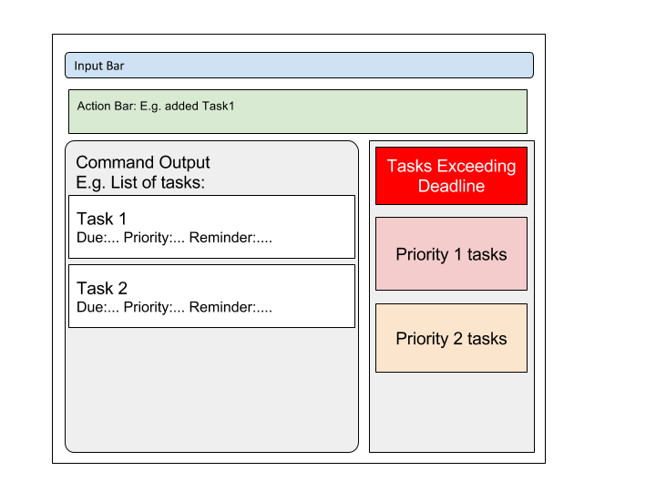

<!-- @@author A0125097A -->

# User Guide

* [Quick Start](#quick-start)
* [Features](#features)
* [FAQ](#faq)
* [Command Summary](#command-summary)

## Quick Start

0. Ensure you have Java version `1.8.0_60` or later installed in your Computer. 
   > Having any Java 8 version is not enough.  
   This app will not work with earlier versions of Java 8.
   
1. Download the latest `lifekeeper.jar` from the [releases](../../../releases) tab.
2. Copy the file to the folder you want to use as the home folder for your Lifekeeper.
3. Double-click the file to start the app. The GUI should appear in a few seconds. 
   > 

4. Type the command in the command box and press <kbd>Enter</kbd> to execute it.  
   e.g. typing **`help`** and pressing <kbd>Enter</kbd> will open the help window. 
5. Some example commands you can try:
   * **`list`** : lists all activities
   * **`add`**` CS2103 T7A1 d/tomorrow 1500 p/2 r/today 1800 t/teamC2` : 
     adds an activity named `CS2103 T7A1` to the Lifekeeper.
   * **`delete`**` 1` : deletes the 1st activity shown in the current list
   * **`exit`** : exits the app
6. Refer to the [Features](#features) section below for details of each command. 

## Features

> **Command Format**
> * Words in `UPPER_CASE` are the parameters.
> * Items in `[SQUARE_BRACKETS]` are optional.
> * Items in `{CURLY_BRACES}` cannot be input together with other items within a separate `{CURLY_BRACES}`
> * Items with `...` after them can have multiple instances.
> * The order of parameters is not fixed.

#### Viewing help : `help`
Format: `help`

> Help is also shown if you enter an incorrect command e.g. `abcd`
 
#### Adding an activity: `add`

Adds an activity to Lifekeeper 
Format: `add ACTIVITY_NAME {[d/DUEDATE] [p/PRIORITY_LEVEL]}{[s/START_TIME] [e/END_TIME]} [r/REMINDER] [t/TAG]...` 

> Activities can have only either `[d/DUEDATE] [p/PRIORITY_LEVEL]` or `[s/START_TIME] [e/END_TIME]` 
> Activities can have any number of tags (including 0)

`DUEDATE` accepts `Date Time` format input and variable inputs namely:
* `tomorrow [TIME]`
* `today [TIME]`

When `TIME` is omitted the default `TIME` will be set to 2359 on the input date given in `DUEDATE`.

`PRIORITY_LEVEL` has to be an integer between `1` to `3`, with `3` being the highest priority, and `1` being the lowest priority.

`START_TIME` accepts `Date Time` format input and variable inputs namely:
* `tomorrow TIME`
* `today TIME`
* `every DAY_OF_WEEK TIME`

`END_TIME` accepts `Date Time` format input and variable inputs namely:
* `tomorrow TIME`
* `today TIME`
* `every DAY_OF_WEEK TIME`
* `TIME`

When `END_TIME` is omitted and `START_TIME` input is given the default `END_TIME` will be set to 1 hour after `START_TIME`

`REMINDER` accepts `Date Time` format input and variable inputs namely:
* `tomorrow TIME`
* `today TIME`

At the stipulated `Date Time` of `REMINDER`, a pop-up notification will appear as a form of reminder.

Examples: 
* `add Grocery Shopping`
* `add Assignment 1 d/tomorrow p/1 r/today 2000`
* `add Project Report d/tomorrow 1700 t/school`
* `add CS2103 T7A1 d/6-12-2016 p/2 r/5-12-2016 1800 t/teamC2`
* `add Lunch s/today 1200`
* `add Executive Meeting s/tomorrow 0900 e/tomorrow 1200`
* `add Concert s/tomorrow 1800 e/tomorrow 2000 r/today 1800 t/Leisure`

<!-- @@author A0131813R -->
#### Listing activities : `list`
Shows a list of activites in Lifekeeper, if any. 
Format: `list [TYPE]`

> If TYPE is not given, all the activites in Lifekeeper will be listed
> If TYPE is given only activities of that type will be listed

`TYPE` accepts the following `done`, `activities`, `events` or `tasks`

Examples:
* `list event`

> shows all events in the list.

<!-- @@author A0125097A -->

#### Finding activities by name: `find`
Finding all activities containing the queried keyword in their name
* Finds activities whose names contain any of the given keywords. 
* Format: `find KEYWORD [MORE_KEYWORDS]`

> * The search is not case sensitive. e.g `study` will match `Study`
> * Tasks matching at least one keyword will be returned.
    e.g. KEYWORD `Shopping` will match the NAME entry `Clothes Shopping`

Examples: 
* `find Homework Assignment` 
  Returns Any activities with words containing `Homework`, `homework`, `Assignment`, or `assignment` in their names.

<!-- @@author A0125680H -->
Finding all activities containing a certain tag    
* Finds activities which has tags of given keywords attached to it.     
* Format: `findtag KEYWORD`   
    
> * The search is case sensitive.     
> * Only full words will be matched.    
> * Only tags matching the EXACT keyword will be returned.
    
Examples:   
* `find CS2103`    
  Returns Any activities containing the tag `CS2103` but not`cs2103`, `CS2103T` or `CS2103Project`.    

#### Deleting an activity: `delete`
Deletes the selected activity from Lifekeeper. Irreversible. 
Format: `delete INDEX`

> Deletes the activity with `INDEX`. 
  The index refers to the index number shown in the most recent listing. 
  

Examples: 
* `list` 
  `delete 1` 
  Deletes the 1st activity in the Lifekeeper activity list.
* `find Dinner` 
  `delete 2` 
  Deletes the 2nd activity listed in the results of the `find` command.

<!-- @@author A0125097A -->
#### Marking an activity as completed: `done`
Marks the activity as completed. Only applicable to activities without start and end time.  
Format: `done INDEX`

> Marks the activity with `INDEX` as completed.
  The index refers to the index number shown in the most recent listing. 

Examples: 
* `list` 
  `done 1` 
  Marks the 1st activity in the Lifekeeper activity list as completed.
* `find Admin` 
  `done 2` 
  Marks the 2nd activity in the results of the `find` command as completed.

<!-- @@author A0125680H -->
#### Editing an activity: `edit`
Edits the selected activity from Lifekeeper. 
Format: `edit INDEX [n/ACTIVITY_NAME] {[d/DUEDATE] [p/PRIORITY_LEVEL]}{[s/START_TIME] [e/END_TIME]} [r/REMINDER] [t/TAG]...` 

> Edits the activity that was previously selected with `INDEX`. 
  The index refers to the index number shown in the most recent listing. 
  

Examples: 
* `list` 
  `edit 2 n/assignment 5 r/today` 
  Edit the selected the 2nd activity in the list by changing its name to `assignment 5` and reminder to `today`.
* `find CS2103 Assignment` 
  `edit 1 d/15-06-2017` 
  Selects the 1st activity in the results of the `find` command and then change the DUEDATE to `15/06/2017`.

#### Undoing an action : `undo`
Reverts the action that was previously executed. 
Format: `undo`

#### Clearing all entries : `clear`
Clears all entries from Lifekeeper. 
Format: `clear`  

#### Exiting the program : `exit`
Exits the program. 
Format: `exit`  

<!-- @@author A0125680H -->
#### Opening a data file : `open`
Loads data from an existing data file into the program. 

* If no filepath or an invalid filepath is specified, or the specified file does not exist, the file chooser will be brought up instead. 
* '/' or '\' can be used to separate components of a file path.
* The `.xml` file suffix may or may not be specified. 
* Format: `open [FILE_PATH]`

> File name cannot consist of any of the following characters: '<', '>', ':', '"', '|', '?', '*'

Examples: 
* `open data/toopen.xml` 
  Loads data from the file `toopen.xml`, in the folder `data` that is in the same directory as the executable JAR file.

<!-- @@author A0125680H -->
#### Saving into a new file : `save`
Saves the Lifekeeper data into a file specified by the user. 

* If no filepath or an invalid filepath is specified, the file chooser will be brought up instead. 
* '/' or '\' can be used to separate components of a file path.
* The `.xml` file suffix may or may not be specified. 
* Format: `save [FILE_PATH]`

> File name cannot consist of any of the following characters: '<', '>', ':', '"', '|', '?', '*'

Examples: 
* `save data/tosave.xml` 
  Creates a new folder named `data` in the same directory as the executable JAR file, and saves the Lifekeeper data in the file `tosave.xml` in that folder.

#### Autosaving of data
Lifekeeper data are saved in the hard disk automatically after any command that changes the data (add, edit, delete). 
There is no need to save manually. 

## FAQ

**Q**: How do I transfer my data to another Computer? 
**A**: Install the app in the other computer and overwrite the empty data file it creates with 
       the file that contains the data of your previous Lifekeeper folder.
       

<!-- @@author A0125097A -->

## Command Summary

Command | Format | Sample Input  
-------- | :-------- | :-------- 
Add | `add ACTIVITY_NAME {[d/DUEDATE] [p/PRIORITY_LEVEL]}  {[s/START_TIME] [e/END_TIME]} [r/REMINDER] [t/TAG]...` | add Dinner with friends s/tomorrow 1800 e/1930 r/today 1800 t/dinner
Edit | `edit INDEX [n/ACTIVITY_NAME] {[d/DUEDATE] [p/PRIORITY_LEVEL]} {[s/START_TIME] [e/END_TIME]} [r/REMINDER] [t/TAG]...` | edit 2 n/assignment d/tuesday 1800 r/monday 1800 t/
Clear | `clear`
Delete | `delete INDEX` | delete 2
Find | `find KEYWORD [MORE_KEYWORDS]` | find assignment
List | `list`
Find Tags | `findtag` | findtag dinner
Done | `done INDEX` | done 2
Undo | `undo`
Help | `help`
Open | `open [FILE_PATH]` | open data/savefile.xml
Save | `save [FILE_PATH]` | save work/schedule.xml
Exit | `exit`