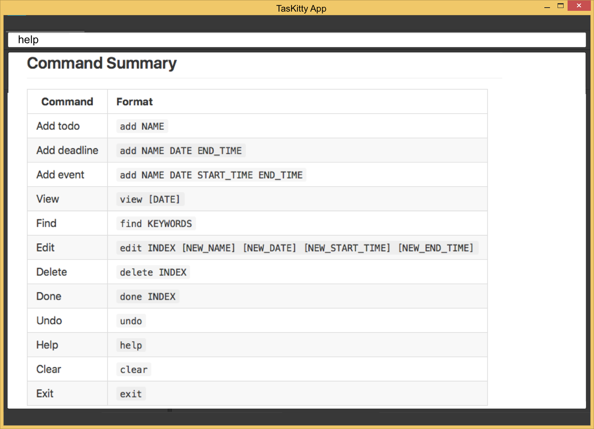
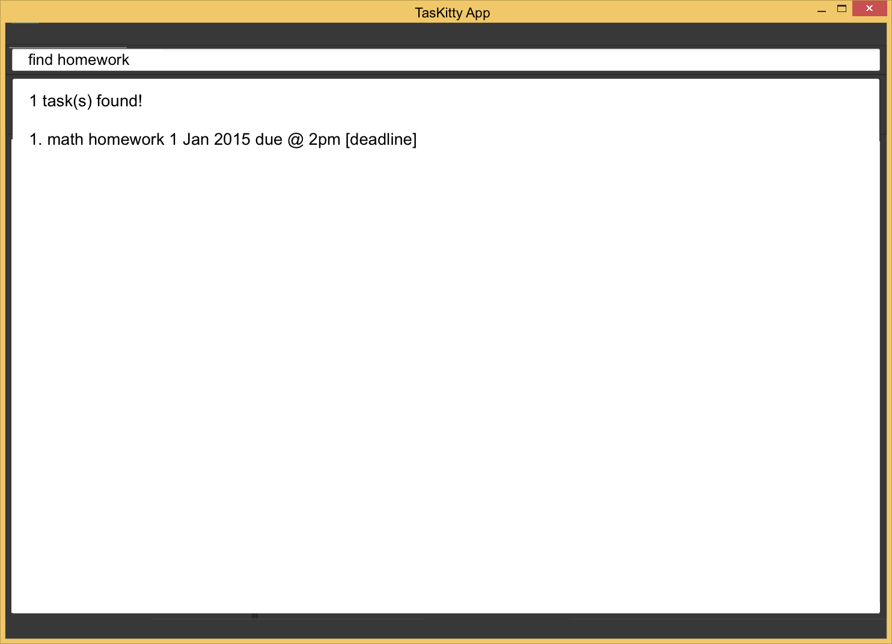

# User Guide

* [Introduction](#introduction)
* [Quick Start](#quick-start)
* [Features](#features)
* [FAQ](#faq)
* [Command Summary](#command-summary)

<!-- @@author A0130853L -->
 
## Introduction

Welcome! This user guide will provide you with all the essential information required for you to make full use of our task manager, TasKitty.

TasKitty is a task manager that can help you manage events, deadlines that you have to meet, or simply tasks that you want to get done whenever you have free time.

If you are a keyboard lover and dislike clicking, then TasKitty is the right task manager for you! It boasts an intuitive command line interface with minimal clicking required, and the commands you have to type in are short and sweet. 

To get started, proceed to the Quick Start section below.

 
<!-- @@author -->
## Quick Start

0. Ensure you have Java version `1.8.0_60` or later installed in your Computer. 
   > Having any Java 8 version is not enough.  
   This app will not work with earlier versions of Java 8.
  
<!-- @@author A0130853L -->
1. Download the latest `TasKitty.jar` from the [releases](../../../releases) tab.
2. Copy the file to the folder you want to use as the home folder for your TasKitty.
3. Double-click the file to start the app. The GUI should appear in a few seconds.  
   

4. Type the command in the command box and press <kbd>Enter</kbd> to execute it.  
   e.g. typing **`help`** and pressing <kbd>Enter</kbd> will open the help window. 
5. Some example commands you can try:
   * **`add`**` read book` : adds a new task named `read book`. 
   * **`add`**` math homework 1 Jan 2015 2pm` : adds a new task that has the deadline `1 Jan 2015 2pm`.
   * **`view`** : lists all tasks for today.
   * **`view`**` 1 Jan 2015` : lists all tasks for specific date.
   * **`delete`**` d1` : deletes the 1st task shown in the current list of deadline tasks.
   * **`exit`** : exits the program.
6. Refer to the [Features](#features) section below for details of each command. 

 
## Features

 
#### View help : `help`
Format: `help`

A pop-up window displaying the command summary will be shown. Help is also shown if you enter an incorrect command e.g. `abcd`. 

 
#### View upcoming tasks: `view`
Lists all upcoming and uncompleted tasks. 
Format: `view`

All uncompleted todo tasks, upcoming events and deadlines will be displayed.
> Note that overdue tasks will be displayed in red.

Example:

* `view` 
  
  
 
#### View all tasks for a specified date: `view DATE`
Lists all events for the specified date, deadlines up to the specified date, and all todo tasks. 
Format: `view DATE`

All todo tasks, events for the specified date and deadlines up to the specified date will be displayed. 
If `view today` is entered, today's tasks, events and deadlines up to today will be displayed.

Example:

* `view 5 Nov` 
  
 
 

#### View all tasks: `view all`
Lists all todo tasks, deadlines and events ever added.
Format: `view all`

All todo tasks, deadlines and events ever added will be displayed, including events that have passed and done tasks.
> Note that events that are over will be marked in orange, and events done will be marked in grey.

Example:

* `view all` 
  
  
 

#### View all completed tasks: `view done`
Lists all completed tasks, deadlines and events.
Format: `view done`

All completed todo tasks, deadlines and events will be shown.

Example:

* `view done` 
  
  
 
<!-- @@author -->
#### Create a new task: `add`
Adds a new task to the todo or deadlines list, or a new event to the event calendar. 
* Todo format: `add NAME` 
* Deadline format: `add NAME END_DATE_TIME` 
* Event format: `add NAME START_DATE_TIME to END_DATE_TIME`

> **Command Format**  
> Tasks are split into 3 categories: `todo`, `deadline`, `event`. 
> `todo`: Tasks that have no specific date/time to be completed by. 
> `deadline`: Tasks that have a specific date/time they must be completed by. 
> `event`: Tasks that have specific start and end date/time. 

> * Words in `UPPER_CASE` are the parameters.
> * Items in `SQUARE_BRACKETS` are optional.
> * Items with `...` after them can have multiple instances.
> * `DATE_TIME` parameter can accept different formats. 2 Jan 2015 3pm, 15:00 2/1/2015 are acceptable formats to represent 2 Jan 2015, 15:00.
> * `DATE_TIME` parameter can also accept relative date formats such as tomorrow and next friday.
> * The order of parameters is fixed.

> Depending on the input format, the task will be saved into 1 of 3 categories: `todo`, `deadline` or `event`.

Examples:

* `add study for test` 
  Adds a `todo` task with NAME as `study for test`. 
  

* `add math assignment 17 Nov 2pm` 
  Adds a `deadline` task with NAME as `math assignment`, DATE as `17 Nov`, END_TIME as `2pm`. 
  

* `add walk dog 5 Nov 2016 17:00 to 18:00` 
  Adds an `event` task with NAME as `walk dog`, DATE as `5 Nov 2016`, START\_TIME as `17:00`, END\_TIME as `18:00`. 
  

<!-- @@author A0130853L -->

 
#### Find tasks: `find`
Finds tasks based on keywords. 
Format: `find KEYWORDS...`

Tasks that partly or completely match the keywords entered will be displayed.  

Example: 
* `find assign` 
  

<!-- @@author -->
 
<!-- @@author A0135793W -->
#### Edit task details: `edit`
Edits a todo, deadline or event already inside the task manager using the index of the task. 
* Format: `edit INDEX [NEW_NAME] [NEW_DATE] [NEW_START_TIME] [NEW_END_TIME]`

> Edits a task at the specified `INDEX` under the todos `t`, deadlines `d` or events `e` section. The `INDEX` refers to the category and index number shown in the most recent listing. eg. `t1` `d2` `e3`  
If no or an invalid category was listed, the app will default to todo format `t`. eg. `1` and `+1` becomes `t1`   
> Format depends on the type of task being edited. When only 1 `TIME` is provided, it is treated as `END_TIME` for both deadline and event.  
> Note that you can enter the `view` command before the `edit` command, to view the list of tasks and events and edit the specified task accordingly. Alternatively, you can use the [`find`](#find-tasks-find) command to narrow down the displayed list of tasks and events.

<!-- @@author -->
<!-- @@author A0130853L -->
Example:

* `view` 
  `edit d2 math assignment2 15 Nov 2016` 
  Edits the 2nd task under the deadline tasks section. Change the NAME to `math assignment2` and DATE to `15 Nov 2016`. 
  

 
#### Delete task: `delete`
Deletes a todo, deadline or event already inside the task manager using the index of the task. 
* Format: `delete INDEX`

Examples:

* `view` 
  `delete d1` 
  Deletes the 1st task under the deadlines section as shown by the `view` command. 
  
  Before: 
   
  
  After: 
   
  
* `view 5 Nov 2016` 
  `delete e1` 
  Deletes the 1st task under the events section for 5 Nov 2016 as shown by the `view DATE` command. 
  
  Before: 
   
  
  After: 
   

 
#### Mark task as done: `done`
Marks a task in the task list as done. 
* Format: `done INDEX`

Tasks that are marked as done are moved to the bottom of the list in their respective sections.  

Example:

* `view all` 
  `done d1` 
  Marks the 1st task today under the deadlines section shown by the `view all` command as completed. 
  
  Before: 
   
  
  After: 
   

<!-- @@author --> 
 
#### Undo previous action: `undo`
Undoes the last completed action. 
Format: `undo`

The previous version will be restored. 
User can keep retyping undo to undo multiple actions. 

Example:
* `undo` 
  Undoes the last deleted item. 
  
  Before: 
   
  
  After: 
   

 

<!-- @@author A0135793W -->

#### Save data: `save`
Saves data to a specified folder. 
Format: `save FILEPATH`

* Windows OS FILEPATH format example: `C:\\Users\\<username>\\Desktop\\CS2103 Tutorial`
* Mac OS FILEPATH format example: `/Users/<username>/Desktop/CS2103 Tutorial`

TasKitty will save any other FILEPATH format in the same directory as TasKitty. 
TasKitty will automatically create the folder if the folder is not present. 

Example:
* `save /Users/<username>/Desktop/CS2103 Tutorial` 
  Saves TasKitty data into the folder CS2103 Tutorial. 
  If folder CS2103 Tutorial is not present, TasKitty will create the folder.

 
<!-- @@author -->
<!-- @@author A0130853L -->
#### Clearing all entries : `clear`
Clears all tasks from the task manager. 
Format: `clear`  

 
<!-- @@author -->
#### Exiting the program : `exit`
Exits the program. 
Format: `exit`  

 
#### Saving the data 
Task manager data are saved in the hard disk automatically after any command that changes the data. 
There is no need to save manually.

 
## FAQ

**Q**: How do I transfer my data to another computer? 
**A**: Install the app in the other computer and overwrite the empty data file it creates with 
       the file that contains the data of your previous task manager's folder.      

 
<!-- @@author A0130853L -->
## Command Summary

Command | Format  
-------- | :-------- 
Add todo | `add NAME`
Add deadline | `add NAME DATE END_TIME`
Add event | `add NAME DATE START_TIME END_TIME`
View upcoming | `view`
View all | `view all`
View date | `view DATE`
View done | `view done`
Find | `find KEYWORDS...`
Edit | `edit INDEX [NEW_NAME] [NEW_DATE] [NEW_START_TIME] [NEW_END_TIME]`
Delete | `delete INDEX...`
Done | `done INDEX...`
Save | `save FILEPATH`
Undo | `undo`
Help | `help`
Clear | `clear`
Exit | `exit`
