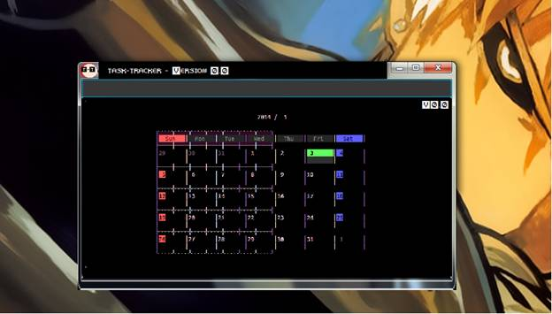

 

# **USER GUIDE** 
---
##**Contents**
*   [About](https://github.com/CS2103AUG2016-T09-C3/main/blob/documents/docs/UserGuide.md#about)
*   [Quick Start](https://github.com/CS2103AUG2016-T09-C3/main/blob/documents/docs/UserGuide.md#quick-start)
*   [Commands](https://github.com/CS2103AUG2016-T09-C3/main/blob/documents/docs/UserGuide.md#commands)
    -   [Add a Task](https://github.com/CS2103AUG2016-T09-C3/main/blob/documents/docs/UserGuide.md#1-add-a-task)
    -   [Edit a Task](https://github.com/CS2103AUG2016-T09-C3/main/blob/documents/docs/UserGuide.md#2-edit-a-task)
    -   [Delete a Task](https://github.com/CS2103AUG2016-T09-C3/main/blob/documents/docs/UserGuide.md#3-delete-a-task)
    -   [List Tasks](https://github.com/CS2103AUG2016-T09-C3/main/blob/documents/docs/UserGuide.md#4-list-tasks)
    -   [Help Command](https://github.com/CS2103AUG2016-T09-C3/main/blob/documents/docs/UserGuide.md#5-help-command)
*   [T-T Bot](https://github.com/CS2103AUG2016-T09-C3/main/blob/documents/docs/UserGuide.md#t-t-bot)
    -   [Call the T-T Bot](https://github.com/CS2103AUG2016-T09-C3/main/blob/documents/docs/UserGuide.md#1call-the-t-t-bot)
    -   [Kill the T-T Bot](https://github.com/CS2103AUG2016-T09-C3/main/blob/documents/docs/UserGuide.md#2kill-the-t-t-bot)

## **About**

**Task Tracker (T-T)**, is a lightweight, easy-to-use software which helps you manage your daily tasks. It is a no-nonsense product which uses Command Line Interface to make the operations quick, easy and intuitive. 

## **Quick Start**

T-T is a lightweight app which does not require much time to install and run. 

> Ensure you have Java version `1.8.0_60` or later installed on your PC.

In order to install T-T, 

1.  Open **Gitbash** at the desired location on your PC and type  
    `git clone https://github.com/t09-c3/task-tracker`  
    Press `Enter`. 
    The Git respository will be cloned onto your PC.  

    (*If you do not have Git on your PC, you can download the T-T files directly from https://github.com/t09-c3/task-tracker*)

2.  Double Click on file named `T-T` to start the app. 

When T-T starts up, you will be asked a friendly `"How are you feeling today?"` question. You may input the hotkey for your current mood and the colour theme for the session will change accordingly. 

## **Commands**

###1. **ADD** a Task

The format for adding a new task is :  
&nbsp; &nbsp;   `add [task] [date] [time] [priority]`  

> * [Task] is compulsary.  
> * If [date] is not specified, the task will be assumed to be a floating task.  
> * [priority] formats are:  
>   *   high
>   *   normal
>   *   low
> * If [priority] is not specified, `normal` priority will be assumed.

 For example: 
*   `add washdishes 09102016 1600 high` will create a high priority washdishes task to be done on 9th October.  
*   `add callmom 09102016` will create a task named "callmom" to be done anytime on 9th October with normal priority. 

###2. EDIT a Task

The format to edit an existing task is :  
&nbsp; &nbsp; `edit [task] [existing date] [existing time] [existing priority] [new date] [new time] [new priority]`  

>   * [existing date], [existing priority] and [existing time] must be mentioned if they were initialised with the original task.
>   * [new date], [new priority] and [new time] are optional.

  For example:  
*   `edit washdishes 09102016 1600 high 09102016 1800`  will edit the existing washdishes task and change the time to 1800 from 1600 and priority to normal from high. 

###3. DELETE a Task

The format to edit an existing task is :  
&nbsp; &nbsp; `delete [task] [existing date] [existing time] [existing priority]`  

>   *   [existing date], [existing time] and [existing priority] must be mentioned if they were initialised in the original task.
>   *   Tasks deleted in the same session can be retrieved with the undo function 

  For example:  
*   `delete washdishes 09102016 1800` will delete the existing washdishes task.

###4. LIST Tasks

The format to edit an existing task is :  
&nbsp; &nbsp; `list [date] [priority]` 

>   *   [date] and [priority] are optional.
>   *   If [date] and [priority] are not mentioned, all tasks will be displayed organised by date.

  For example :  
*   `list 09102016`  will display all tasks due on 9th October.
*   `list high` will display all tasks of high priority.
*   `list` will display all tasks organised by date.

###5. HELP command

Enter `help` into the CLI to list out all the commands.   

##**T-T Bot**
T-T has it's very own playful T-T bot, to provide suggestions and help to you. Managing tasts was never this fun! 

###1. Call the T-T Bot
You can call your friendly T-T bot by typing `T-T` in your input window.
The T-T bot will awaken and be at your service!
![T-T Bot] (images/bot_gif.gif)

###2. Kill the T-T Bot
If you find the T-T Bot too distracting, you can kill it by typing `X-X` in the input window. The T-T Bot will go back to sleep.
  

