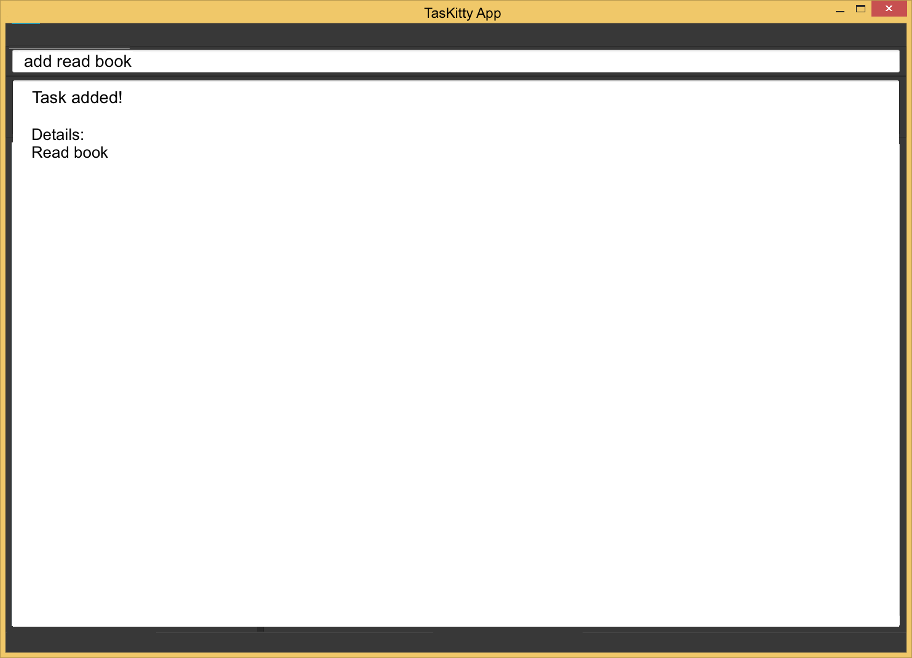

# User Guide

* [Introduction](#introduction)
* [Overview](#overview)
* [Quick Start](#quick-start)
* [Features](#features)
* [FAQ](#faq)
* [Command Summary](#command-summary)

<!-- @@author A0130853L -->

 
## Introduction

Welcome! This user guide will provide you with all the essential information required for you to make full use of our task manager, TasKitty.

TasKitty is a task manager that can help you manage events, deadlines that you have to meet, or simply tasks that you want to get done whenever you have free time.

If you are a keyboard lover and dislike clicking, then TasKitty is the right task manager for you! It boasts an intuitive command line interface with minimal clicking required, and the commands you have to type in are short and sweet. 

To get started, proceed to the Quick Start section below.

 

<!-- @@author A0139930B -->

##Overview

Figure 1: TasKitty Overview

1. This is the `Command Box` for you to type your commands.
2. TasKitty provdes `Feedback` for your actions here.
3. `Events Panel`, where you can view all tasks that have a start and end date.
4. `Deadlines Panel`, where you can view tasks you need to complete before a certain date.
5. `Todos Panel`, where you can view all your tasks that you wish to do someday.
6. This shows the `Current View` of the application. Here, it is showing the Upcoming Tasks.
7. This shows the `Current Path` to the file where the data of TasKitty is stored. There are two types of file paths:
  * Absolute: The filepath from the root folder. eg. `C:/TasKitty/data/taskmanager.xml` 
  * Relative: The filepath from TasKitty. eg. `./data/taskmanager.xml`

<!-- @@author -->

## Quick Start

1. Ensure you have Java version `1.8.0_60` or later installed in your Computer. 
   

    
   Figure 2: TasKitty Welcome Screen
   
<!-- @@author A0130853L -->

2. Download the latest `TasKitty.jar` from the [releases](../../../releases) tab.
3. Copy the file to the folder you want to use as the home folder for your TasKitty.
4. Double-click the file to start the app. The GUI should appear in a few seconds.  
   

5. Type the command in the command box and press <kbd>Enter</kbd> to execute it.  
   e.g. typing **`help`** and pressing <kbd>Enter</kbd> will open the help window.  
  
6. Some example commands you can try:
   * **`add`**` read book` : adds a new task named `read book`. 
   * **`add`**` business proposal 17 nov 2pm` : adds a new task that has the deadline `02:00pm, 17 nov`.
   * **`view`** : lists all upcoming and uncompleted tasks.
   * **`view`**` 1 Jan` : lists all tasks for the specific date.
   * **`delete`**` d1` : deletes the 1st task shown in the current list of deadline tasks.
   * **`exit`** : exits the program.
7. Refer to the [Features](#features) section below for details of each command. 

 
## Features

 
####help : `help`
Format: `help` 
Shortcut key: `F1`

A pop-up window displaying the command summary will be shown. Help is also shown if you enter an incorrect command e.g. `abcd`. 

Figure 3: Help Window

 
#### View upcoming tasks: `view`
Format: `view` 
Shortcut Key: `Ctrl + Shift + T`  
Lists all upcoming and uncompleted tasks. 

Example:

* `view` 
  

  
  Figure 4: View Command
 
 
 
#### View all tasks for a specified date: `view <date>`
Format: `view <date>` 
Lists all events for the specified date, uncompleted deadlines up to the specified date, and all todo tasks. 

Example: 

* `view 7 Nov` 
  

  
  Figure 5: View <date> Command

 
#### View all completed tasks: `view done`
Format: `view done` 
Shortcut key: `Ctrl + Shift + D`  
Lists all completed tasks, deadlines and events. Tasks that are done or over will be shown shown in grey.

Example:
* `view done` 
  

  
  Figure 6: View Done Command
  
 

#### View all tasks: `view all`
Format: `view all` 
Shortcut key: `Ctrl + Shift + L` <r>

Lists all todo tasks, deadlines and events that have been added to TasKitty, including events that have passed and done tasks.
Note that events that are over will be automatically marked and displayed as completed.

Example:

* `view all` 
  

  
  Figure 7: View All Command
  
 

<!-- @@author A0139930B -->
#### Create a new task: `add`

Format (Todo): `add <name> [#tag]...` 
Format (Deadline): `add <name> [end datetime] [#tag]...` 
Format (Event): `add <name> [start datetime] to [end datetime] [#tag]...`  

Adds a new task to the todo or deadline or event list in TasKitty. 
 
<!-- @@author A0130853L -->
Example (Todo): 
* `add buy new tie #work` 
  Adds a `todo` task with `<name>` as `buy new tie`, `<#tag>` as `work`. 
  

  
  Figure 8: Add Todo Command
 
Example (Deadline): 
* `add submit proposal 17 Nov 2pm #work` 
  Adds a `deadline` task with `<name>` as `submit proposal`, `<end datetime>` as `02:00pm, 17 Nov 2016`, `<#tag>` as `work`. 
  

  
  Figure 9: Add Deadline Command

Example (Event): 
* `add walk dog 7 Nov 2016 17:00 to 18:00` 
  Adds an `event` task with `<name>` as `walk dog`, `<start datetime>` as `05:00pm, 7 Nov 2016`, `<end datetime>` as `06:00pm, 7 Nov 2016`. 
  

  
  Figure 10: Add Event Command
  

<!-- @@author A0139930B -->
 
#### Find task: `find`
Format: `find <keyword>...` 
 
Finds tasks based on keywords. Tasks that partly or completely match the keywords entered will be displayed. You can find tags using `#`. 

Example: 
* `find prop` 
  

  
  Figure 11: Find Command
  
* `find #work` 
  

  
  Figure 12: Find Tag Command

 
<!-- @@author A0135793W -->
#### Edit task details: `edit`
* Format: `edit <index> [name] [datetime] `  
Edits a todo, deadline or event already inside the task manager using the index of the task. 
Format depends on the type of task being edited. For deadlines, you can edit only the date by keying in the new date only 

 

<!-- @@author A0130853L -->
Example:

* `edit d2 16 Nov` 
  Edits the 2nd task under the deadline tasks section. Changes the `<date>` to `16 Nov`. 
  

  
  Figure 13: Edit Date Command

 
* `view` 
  `edit t1 buy blue tie` 
  Edits the 1st task under the todo tasks section. Changes the `<name>` to `buy blue tie`. 
  

  
  Figure 14: Edit Name Command
 

#### Delete task: `delete`
* Format: `delete <index>...`  
Deletes one or more todo, deadline or event task already inside TasKitty using the index of the task. 
 

Examples:

* `view` 
  `delete d1` 
  Deletes the 1st task under the deadlines section as shown by the `view` command. 
  
  Before: 
  

   
  Figure 15: Before Delete Command
  
  After: 
  

   
  Figure 16: After Delete Command
  
* `view 7 Nov` 
  `delete e1` 
  Deletes the 1st task under the events section for `7 Nov` as shown by the `view DATE` command. 
  
  Before: 
  

   
  Figure 17: Before Delete From Filtered List Command
  
  After: 
  

   
  Figure 18: After Delete From Filetered List Command
  
<!-- @@author A0139052L -->

* `view` 
  `delete t1 d1 e1` 
  Deletes the 1st task under the each section as shown by the `view` command. 
  
  
  Before: 
  

   
  Figure 19: Before Delete Multiple Command
  
  After: 
  

     
  Figure 20: After Delete Multiple Command
  
<!-- @@author A0130853L -->  

 

#### Mark task as done: `done`
* Format: `done <index>...`  
Marks one or more todo, deadline or event tasks already inside TasKitty as done using index of the task. Tasks that are marked as done are moved to the bottom of their respective lists. 
 
Example:

* `view all` 
  `done d1` 
  Marks the 1st task today under the deadlines section shown by the `view all` command as completed. 
  
  Before: 
  

   
  Figure 21: Before Done Command
  
  After: 
  

   
  Figure 22: After Done Command
  
<!-- @@author A0139052L --> 

* `view all` 
  `done t1-3` 
  Marks the 1st 3 tasks under the todo section shown by the `view all` command as completed. 
  
  Before: 
  

   
  Figure 23: Before Done Multiple Command
  
  After: 
  

   
  Figure 24: After Done Multiple Command
  
<!-- @@author A0130853L -->  

 

#### Undo previous action: `undo`

Format: `undo` 
Shortcut key: `Ctrl + Shift + U`

The previous version will be undone. 
You can undo as many times as you want until the start of the current session. 

Example:

* `delete t1` 
 `undo` 
  Undoes the last deleted item. 
  
  Before: 
  

   
  Figure 25: Before Undo Command
  
  After: 
  

   
  Figure 26: After Undo Command

 

<!-- @@author A0139052L -->
#### Redo previous undone action: `redo`

Format: `redo` 
Shortcut key: `Ctrl + Shift + Y`

The previous undo will be restored. 
You can redo as many times until the latest change. 

Example:

* `redo` 
  Redoes the last deleted item. 
  
  Before: 
  

   
  Figure 27: Before Redo Command
  
  After: 
  

   
  Figure 28: After Redo Command

 

 

 
<!-- @@author A0135793W -->

#### Save/Load data: `path`
Saves data to a specified folder. 
Format: `path <filepath>.xml`

* Windows OS FILEPATH format example: `C:\\Users\\<username>\\Desktop\\CS2103 Tutorial\\TasKitty.xml`
* Mac OS FILEPATH format example: `/Users/<username>/Desktop/CS2103 Tutorial/TasKitty.xml`

> TasKitty must end with a .xml extension. 
> TasKitty will save any other FILEPATH format in the same directory as TasKitty. 
> TasKitty will automatically create the folder if the folder is not present. 
> TasKitty can load data from an existing .xml file if TasKitty is empty. 

Example:

* `path /Users/<username>/Desktop/CS2103 Tutorial/TasKitty.xml` 
  Saves TasKitty data into the folder CS2103 Tutorial with TasKitty.xml as the filename. 
  If folder CS2103 Tutorial is not present, TasKitty will create the folder.

 

<!-- @@author A0130853L -->
#### Clear all entries : `clear`
Clears all tasks from the task manager. 
Format: `clear` 
Shortcut key: `Ctrl + Shift + C`

 

#### Exit the program : `exit`
Exits the program. 
Format: `exit`  

 
<!-- @@author -->
## FAQ

**Q**: The app is not recognizing my tasks correctly! 
**A**: Try to use "quotes" around your task names to help TasKitty differentiate between your task name and other parameters.

**Q**: How do I transfer my data to another computer? 
**A**: Install the app in the other computer and overwrite the empty data file it creates with the file that contains the data of your previous task manager's folder.      

 

<!-- @@author A0130853L -->
## Command Summary

Command | Format  
-------- | :-------- 
Add todo | `add <name>`
Add deadline | `add <name> <end datetime>`
Add event | `add <name> <start datetime> to <end datetime>`
View upcoming | `view` or Ctrl + Shift + T
View all | `view all` or Ctrl + Shift + L
View date | `view <date>`
View done | `view done` or Ctrl + Shift + D
Find | `find <keyword>...`
Edit | `edit <index> <name> <datetime>`
Delete | `delete <index>...`
Done | `done <index>...`
Path | `path <filepath>.xml`
Undo | `undo` or Ctrl + Shift + U
Redo | `redo` or Ctrl + Shift + Y
Help | `help`
Clear | `clear`
Exit | `exit`
