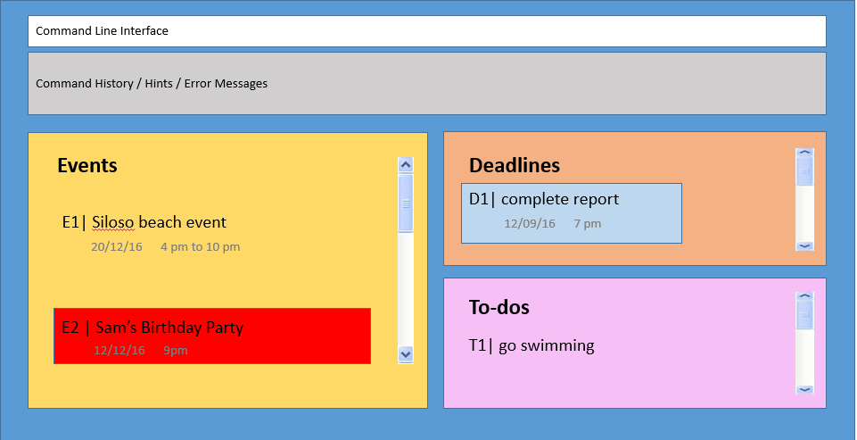

# User Guide

* [Getting Started](#getting-started)
* [Features](#features)
* [FAQ](#faq)
* [Command Summary](#command-summary)

## Getting Started

1. Ensure you have Java version `1.8.0_60` or later installed in your Computer. 
   > Having any Java 8 version is not enough.  
   This app will not work with earlier versions of Java 8.
   
2. Download the latest `simply.jar` from the [releases](../../../releases) tab.
3. Copy the file to the folder you want to use as the home folder for your Simply.
4. Double-click the file to start the app. The GUI should appear in a few seconds. 
  
  

5. Type the command in the command box and press <kbd>Enter</kbd> to execute it.  
   e.g. typing **`help`** and pressing <kbd>Enter</kbd> will open the help window. 

6. Refer to the [Features](#features) section below for details of each command. 

## Features

###1 Add Command
There are three variations to the add command. You are able to choose a task to be categorized under events, deadlines or to-dos. To differentiate the formatting for these commands, refer to the section below.

####1.1 Add an event

>Format : **Add** [&lt;event description&gt;; &lt;date(DDMMYY)&gt;; &lt;start time&gt;; &lt;end time&gt;] &lt;#tag&gt; &lt;priority&gt;

Example: Add [Sam's birthday party; 20/12/16 ; 9pm] #YOLO !

>Note: The start time and end time is optional when adding an event.
>Note: ALL tags are optional and Multiple tags can be added
>Note: ALL marking as a priority is also optional
>Note: Time format accepted: 9pm, 9.45pm, 13:59
>Note: Date format accepted: 20/12/2016, 20/12/16, 201216

>Important: The square brackets are compulsory when adding an event.

####1.2 Add a deadline

>Format: **Add** &lt;deadline description&gt;; &lt;date(DDMMYY)&gt;; &lt;end time&gt; &lt;#tag&gt; &lt;priority&gt;

Example: Add complete report; 120916; 1900 #YOLO ! 

>Important: The date and end time are compulsory when adding an deadline

####1.3 Add a to-do

>Format: **Add** &lt;to-do description&gt; &lt;#tag&gt; &lt;priority&gt;

Example: Add go swimming #YOLO !

>Note: To do tasks do not have a date or time.

>***Note: To add a tag, simply add a # followed by the tag name at the back of the command 
To add a priority, simply add a ! at the back of the command.***

####1.4 Add a tag / multiple tags

You can add tag by adding a # at the end of the command for event, deadline or to-do.

Example: Add [Sam's birthday party; 20/12/16; 9pm] #dontbelate  
Example: Add complete report; 120916; 1900 #prayforuserguide    
Example: Add go swimming #yolo #summerishere #waterforlife

You can also add tag to an existing task.

>Format: **Add** &lt;index&gt; #tag1 #tag2

Example: Add E1 #win #victor #finally  

####1.5 Add priority

You can add priority by adding a ! at the end of the command for event, deadline or to-do in a similar format as that of adding tags.
       
Example: Add go swimming !

###2 Edit a task

The multiple edit task functions allow you to update specific task details.

####2.1 Edit all task details in one go

>Format: **Edit** &lt;index&gt; [&lt;event description&gt;; &lt;date&gt;; &lt;start time&gt;; &lt;end time&gt;; &lt;tags&gt;; !] 

>Format: **Edit** &lt;index&gt; &lt;deadline description&gt;; &lt;date&gt;; &lt;end time&gt;; &lt;tags&gt;; !
 
>Format: **Edit** &lt;index&gt; &lt;to-do description&gt;; !

To add certain task details like start time, simply add their corresponding sections in the command format.

To remove certain task details like end time, simply leave their corresponding sections in the command format blank.

>Note: Adding a start time and end time to a to-do will automatically convert your to-do into and event.

>Note: Adding a end time to a to-do will automatically convert your to-do into a deadline.

>Note: Adding a start time to a deadline will automatically convert a deadline to an event.

>Note: Add a date to a to-do will automatically convert your to-do into a deadline with a default end time of 2359 on that date.

>Note: Removing date from events and deadlines will automatically convert them into a to-do with no date or time.

>Note: Removing start time from events will automatically convert them into deadlines.

>Note: Removing end time from deadlines will automatically set the end time of the deadline to 2359. 
 
####2.2 Edit task description

>Format: **Edit** &lt;index&gt; **des** &lt;description&gt;

Example: Edit T1 des eat apple

####2.3 Edit task date

>Format: **Edit** &lt;index&gt; **date** &lt;date&gt;

Example: Edit E1 date 12/09/16

>Note: If you add a date to a to-do, this will automatically convert your to-do into a deadline with a default end time of 2359 on that date.

####2.4 Edit task start time 

>Format: **Edit** &lt;index&gt; **start** &lt;start time&gt;

Example: Edit E1 start 7am

>Note: Adding a start time to a to-do will automatically convert your to-do into an event with a default day of today and start time as entered. 

####2.5 Edit task end time 

>Format: **Edit** &lt;index&gt; **end** &lt;end time&gt;

Example: Edit E1 end 1900

>Note: Adding a end time to a to-do will automatically convert your to-do into a deadline with a default date of today and end time as entered. 

####2.6 Edit a specific tag

>Format: **Edit** &lt;index&gt; **tag** &lt;old_tag&gt; ***>*** &lt;new_tag&gt;

Example: Edit D1 #doOrdie > #died

####2.7 Edit task priority 

>Format: **Edit** &lt;index&gt; **pri** &lt;priority&gt;

Example: Edit T1 pri 

Example: Edit T1 pri !

>Note: If you want to remove priority, just leave an empty space after pri

>Note: High priority tasks are color coded blue.
 
###3 Find Task by Keyword

The find by keyword command enables you to search for any events, deadlines, to-dos that have been added to Simply. If the searched task is not found, an error message will be shown.

> Format: **Find** &lt;keyword&gt;

Example: 

Find **siloso**

Find 050316

Find 2359

Find #CS2103

Only the tasks with the keyword are displayed.

###4 Mark done tasks 

When you are done with tasks, enter this command to mark them as done and hide them away.

> Format: Done &lt;index&gt;

> Format: Done &lt;index&gt;-&lt;index&gt;

> Format: Done &lt;index&gt;, &lt;index&gt;
    
    
Example: 

Done T1

Done T1-T3

Done T1, T3

>Note: if you want to select more than one task to complete, you can separated the task by a - to complete all tasks that are within the range. In addition, you also need to separate the task by a ; to individually delete them.

###5 Display tasks

####5.1 Display completed tasks

The display command will display the completed tasks in their respective categories.

> Format: list completed

####5.2 Display all tasks

This is mainly used to return to the default screen showing all tasks.

> Format: list

###6 Undo the Most Recent Commands

The undo command enables you to undo the most recent executed command.

> Format: Undo &lt;number of operations&gt;

Example: 

Undo

Undo 2

>Note: The undo command can only undo a maximum of 5 executed commands

>Note: If no number is entered, the default number of times the command will undo is 1.

###7 Redo the Most Recent Commands

The redo command enables you to redo the most recent undone command.

> Format: Redo &lt;number of operations&gt;

Example: 

Redo

Redo 2

>Note: The Redo command can only undo a maximum of 5 undone commands

>Note: If no number is entered, the default number of times the command will redo is 1.

###8 Delete task

####8.1 Deleting a task

The delete command enables you to delete the tasks that you no longer need.

> Format: Delete &lt;index&gt;

> Format: Delete &lt;index&gt;-&lt;index&gt;

> Format: Delete &lt;index&gt;, &lt;index&gt; 

Example: 

Delete T3

Delete T1-T3

Delete T1, T3

>Note: The delete command is flexible and allows you to delete more than 1 task at a time. If the indexes entered are separated by a -, Simply will delete all tasks between the numbers including the numbers enter. If the indexes are separated by a , Simply will delete the tasks entered individually. 

####8.2 Deleting a tag / multiple tags

>Format: **Delete** &lt;index&gt; #tag1 #tag2

Example: Delete E1 #win #victor #finally  

###9 Exiting the program

This command enables you to close the program.

> Format: **Exit**

Example: Exit

###10 Help

> Format: **Help**

Example : Help

## FAQ

**Q**: How do I transfer my data to another Computer? 
**A**: Install the app in the other computer and overwrite the empty data file it creates with 
       the file that contains the data of your previous Address Book folder.

###Command Summary

 No. | Command | Format 
 -------- | :-------- | :--------- | :-----------
1| Add event| add [event_description; date; start_time; end_time] 
2| Add deadline | add deadline_description; date; end_time  
3| Add to-do | add to-do_description 
4| Add with tags and priorities | add [event_description, date, start_time, end_time] #tag !
5| Edit | edit &lt;index&gt; &lt;new_event_description&gt; 
6| Search | search &lt;keywords&gt; 
7| Done | done &lt;index&gt;, &lt;index&gt;... 
8| Undo | undo &lt;number of times to undo, up to 5&gt;
9| Redo | redo &lt;number of times to redo, up to 5&gt;
10| Delete | delete &lt;index&gt;, &lt;index&gt; 
11| Exit | exit 
12| help | help 
