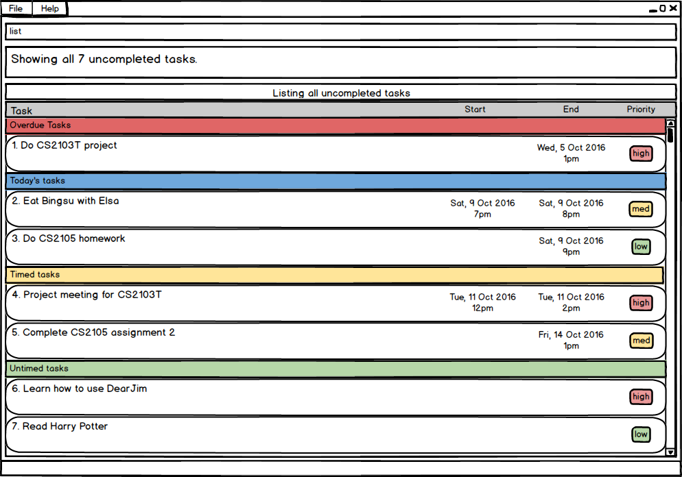
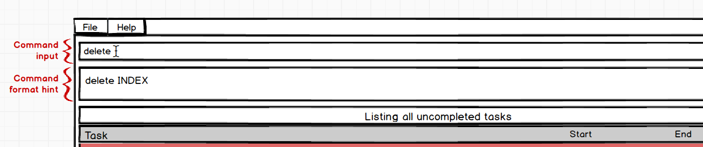

# User Guide

* [Quick Start](#quick-start)
* [Features](#features)
* [FAQ](#faq)
* [Command Summary](#command-summary)

## Quick Start

0. Ensure you have Java version `1.8.0_60` or later installed in your computer. 
   > Having any Java 8 version is not enough.  
   This app will not work with earlier versions of Java 8.
   
1. Download the latest `dearjim.jar` from the [releases](../../../releases) tab.
2. Copy the file to the folder you want to use as the home folder for your Task Manager.
3. Double-click the file to start the app. The GUI should appear in a few seconds.  

Figure 1: GUI of DearJim

4. Type the command in the command box and press <kbd>Enter</kbd> to execute it.  
   e.g. typing **`help`** and pressing <kbd>Enter</kbd> will open the help window. 
5. Some example commands you can try:
   * **`list`** : lists all tasks. This is the default view.
   * **`add`**` Learn how to use DearJim` : 
     adds a task to the Task Manager.
   * **`delete`**` 1` : deletes the first task shown in the current list.
   * **`exit`** : exits the app.
6. Refer to the [Features](#features) section below for details of each command. 

## Features

> **Command Format**
> * Words in `UPPER_CASE` are the parameters.
> * Fields in `SQUARE_BRACKETS` are optional.
> * The order of parameters is fixed.

### Viewing help : `help`
Opens the user guide with a new window. 
Format: `help` 

Example:
* `help`

> 

Figure 2: Help Command

 
### Adding a task: `add`
Adds a task into the task manager. 
Format: `[add] NAME [start DATE_TIME] [end DATE_TIME] [repeat every RECURRING_INTERVAL] [-PRIORITY]`

>You may also substitute `start` with `from/at`, `end` with `to/by`.

By default, if no valid command is specified, the input will be treated as an `add` command.  
This means typing in `add` is optional.  
If you would like to add a task with a name that begins with other command words, just include the `add` to override the other command words.  

Example:

|User Input|Interpreted Action|
|---|---|
|`help my mum to buy cooking ingredients`| Command: `help`   Arguments: `my mum to buy cooking ingredients` |
|`add help my mum to buy cooking ingredients`|Command:`add`   Task name: `help my mum to buy cooking ingredients`|

**_Adding a task_**

Format: `NAME `

> The simplest form of a task. Type away!

Example:
* `Buy coffee powder`

**_Specifying task priority_**

You can assign your task a `PRIORITY` of `low`, `medium` or `high`.  
Tasks have `medium` `PRIORITY` by default. 
Keyword: `-PRIORITY`

To specify the priority for a task, input a `-` followed by the `PRIORITY` you would like. 
`PRIORITY` also accepts variations of `low`, `medium` and `high`.

`PRIORITY` | Variations  
-------- | :--------:
`low` | `l`, `low`
`medium` | `m`, `med`, `medium`
`high` | `h`, `high`

Examples:
* `Do something later -l`
* `Buy coffee powder -med`
* `Buy washing powder -high`

**_Adding a task with deadline_**

Nobody likes deadlines. What is worse, is missing them.  
Format: `NAME end DATE_TIME [repeat every RECURRING_INTERVAL] [-PRIORITY]`

> `end` denotes a deadline. 

`DATE_TIME` is flexible! 
If no `DATE` is specified, `DATE` will be assumed to be today 
If no `TIME` is specified, `TIME` will be assumed to be 11:59pm

 

**_Valid Dates & Times_**

|Date| Format|Interpreted Date|
|-------- | :-------- |---|
|MM/DD/YYYY| `12/12/2016`| 12 December 2016
|MM/DD/YY| `12/12/16`|12 December 2016|
|MM/DD| `12/12` |12 December, Current Year|
|Calendar|`12 December 2016`  `12 December 16`|12 December 2016
|Calendar Day and Month|`12 December`|12 December, Current Year
|Calendar Month only| `may`  `dec`| 1 May, Current Year  1 December, Current Year|
|Day|`monday`|Nearest upcoming Monday|
|Relative Date| `today`, `tonight`  `tmr`, `tommorow`|Today  Tomorrow|
 

|Time| Format| Interpreted Time|
|-------- | :-------- |---|
|24Hr| `20.50`, `20:50`, `2050`| 8.50pm|
|AM/PM| `8.50pm`, `8:50pm`, `0850pm`| 8.50pm|
|Preset|`midnight`  `noon`|12am 12pm|

 

Examples:
* `Do project proposal by 5pm tomorrow`
* `eat lunch by 1pm today -h`
* `Buy coffee for boss by 7:00 repeat every day`
* `finish CS2101 assignment by 13th Sep`

> Notice how `end` can be substituted with `by`.

**_Adding a task with time interval_**

Having that company meeting? Planning to have lunch with a friend next week?   
Format:
`NAME start DATE_TIME [end DATE_TIME] [repeat every RECURRING_INTERVAL] [-PRIORITY]` 
> We accept `from` and `at` to indicate the start time and `to` and `by` to indicate the end time.
> `end DATE_TIME` can be unspecified.

Example: 
* `Company meeting tonight at 7pm to 9pm`
* `Family dinner at noon`
* `Meet Akshay from 1pm to 2pm -h`

>Tip: If you do not know the end time for your event yet, you can leave it blank first, and `edit` it in later!

**_Specifying repeated tasks_**

Have one of those pesky tasks you need to do every now and then? DearJim also allows you to specify tasks that need to be repeated at a specific `RECURRING_INTERVAL`. Never forget them again! 
Format: `repeat every RECURRING_INTERVAL`
> Note: You may only specify a `RECCURING_INTERVAL` for tasks that are timed.

`RECURRING_INTERVAL` can be specified in a few formats, with some examples listed below.

Recurring Interval | Format  
-------- | :-------- 
Hour | `hour`, `3 hours`
Day | `day`, `3 days`, `monday`
Week | `week`, `5 weeks`
Month | `month`, `2 months`
Year | `year`, `6 years`

Examples: 
* `Go run at track at 7am repeat every 3 days`
* `Go visit mum repeat every sun`

### Editing a task: `edit`
Edits an existing task in the task manager. Just in case you need to change any details, or add in missing ones.  
Format: `edit INDEX [NAME] [start DATE_TIME] [end DATE_TIME] [repeat every RECURRING_INTERVAL] [-PRIORITY]`
> `INDEX` refers to the task number in the current displayed list. 
> Notice that this is similar to the format for `add`!  

Examples:
* `Company meeting tonight at 7pm to 9pm`
* `edit 2 Company meeting tomorrow morning at 7am to 9am -high`
* `Buy coffee for boss by 8am repeat every day`
* `edit 3 Buy coffee for boss by 7am repeat every 2 days`

**_Editing out details in a task_**

 You can also remove any section if they are no longer relevant!  
 Format: `edit INDEX [-reset parameter] [repeat] [start] [end] `
 > `INDEX` refers to the task number in the current displayed list. 
> Use `[-reset repeat]` to remove the recurring time 
> Use `[-reset start]` to remove the start time 
> Use `[-reset end]` to remove the end time 

Examples:
* `Buy coffee for boss, by 8am repeat every day`
* `edit 1 -reset repeat start`
* `edit 2 -reset end`

>Do note that the reset will overide the editing if done on the same line, allowing you to easily remove any parts at the end of the typing instead of continously pressing the backspace.

### Deleting a task: `delete`
Deletes an existing task in your task manager. This will remove them from the storage. If you want to mark them as done instead, take a look at the format for `done` below.  
Format: `delete INDEX`
> `INDEX` refers to the task number in the current displayed list. 

Example:
* `delete 2`

### Clearing the task manager: `clear`
Deletes all tasks in your task manager. 
This process is reversible with `undo`. 
Format: `clear`
> `clear` allows you to `delete` all tasks with a single command!

Example:
* `clear`

### Archiving a task: `done`
Archives a task in your task manager. So that you can look at all the tasks you have completed, and be proud of yourself!  
Format: `done INDEX`
> Marks a task as `done` as sends it to the archive for future viewing.
> `INDEX` refers to the task number in the current displayed list.

Example:
* `done 3`

### Undoing a command: `undo`
Reverses the effects of the previous command, if the command is reversible. Helps you get out of sticky situations!  
Format: `undo`
> Commands that you can `undo`
> * `add`
> * `edit`
> * `delete`
> * `clear`
> * `done`

Example:
* `undo`

### Redoing a command: `redo`
Reverses a previous `undo` command, if possible.  
Format: `redo`
> `redo` allows your to reverse your previous `undo` to get back your data!
>
> Note: `redo` only works if no `add`, `edit`, `delete`, `clear` or `done` commands have been entered after the last `undo`.

Example: 
* `redo`

### Listing all tasks : `list`
Shows a list of all tasks in the task manager. 
Format: `list`
> Displays all uncompleted tasks in the task manager.

Example:
* `list`

> 

Figure 3: List View

### Finding a task : `find`
Forgot the details about a task you added? Find an existing task by name. 
Format: `find NAME`
> `find` is case-insensitive - `find AKSHAY` will match `find akshay`
>
> If no NAME is provided, all uncompleted tasks will be displayed

Examples:
* `find Akshay`
* `find company meeting`
* `find`

### Exiting the application: `exit`
Closes the application. 
Format: `exit`

Example: 
* `exit`

### Getting hints for command format
Format: none, just type a command and let DearJim provide you hints on the command format that you might want to use!
>DearJim provides you hints on command formats as you type the command!

Examples:
* Typing `add` in the command input generates the format for `add` in the result display

Figure 4: Hints for add command

 

* Typing `delete` in the command input generates the format for `delete` in the result display

Figure 5: Hints for delete command

 

### Saving the data 
Task manager data are saved in the hard disk automatically after any command that changes the data. 
There is no need to save manually.

## FAQ

**Q**: How do I transfer my data to another computer? 
**A**: Install the app in the other computer and overwrite the empty data file it creates with 
       the file that contains the data of your previous *DearJim* folder.

**Q**: How do I install the program? 
**A**: Double click the icon.
       
## Command Summary

Command | Format  
-------- | :-------- 
Add | `[add] NAME [start DATE_TIME] [end DATE_TIME] [repeat every RECURRING_INTERVAL] [-PRIORITY]`
Edit | `edit INDEX [NAME] [start DATE_TIME] [end DATE_TIME] [repeat every RECURRING_INTERVAL] [-PRIORITY] [-reset parameter]`
Delete | `delete INDEX`
Undo | `undo`
Redo | `redo`
Done | `done INDEX`
List | `list`
Find | `find NAME`
Help | `help`
Exit | `exit`
