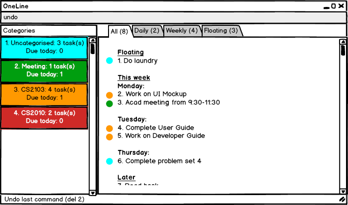

# User Guide 
* [Getting Started](#getting-started)
* [Features](#features)
* [FAQ](#faq)
* [Command Summary](#command-summary)

## Getting Started
1. Ensure you have Java version 1.8.0_60 or later installed in your Computer.
2. Download the latest OneLine.jar from the releases tab.
3. Copy the file to the folder you want to use as the home folder for OneLine.
4. Double-click the file to start the app. The Graphical User Interface (GUI) should appear in a few seconds.

### OneLine's GUI
  

| Tag | Function |
| ----- | ----------- |
| 1 | **Tabs** allow you to switch between different views for different tasks |
| 2 | **Window Manipulation Buttons** allow you to minimise the window to keep OneLine in the background as you work on completing the tasks at hand |
| 3 |Type commands into the **Command Field** and hit <kbd>enter</kbd> to trigger the desired command |
| 4 | Lists of tasks are shown in **Task Pane** |
| 5 | Results of commands (success / fail) are shown in the **Feedback Box** |
| 6 | The list of categories is stored in the **Category Pane** |

## Features
//@@author A0140156R
### Foreword
All commands have a standard format so that you can easily remember them. A typical command will take the form:

> `<Command> <Fields>`

The following segments will list and explain the various commands. The structure of the commands will be explained in this form:

> `<Command> <Required fields> [<Optional fields>]`

Words within the angle brackets "<" and ">" are meant for you to fill according to what is required.  

> `add Meeting with boss` 

For instance, in the example above, "<Task Name>" will refer to "Meeting with boss" when you are trying to add a meeting to your schedule. Note the lack of the angle brackets when you are typing "Meeting with boss".

Words not within angle brackets are keywords, and should be typed as they appear. For instance, if you see see the format "add <Task Name> .on <Date>", you can type `add Meeting with boss .on Wednesday`.

Words within the square brackets "[" and "]" are optional fields. You can choose to include these fields when typing the commands, but it is fully optional.

### Commands

1. Help: `help`  
If you are ever lost, you can bring up the help menu to display all possible commands.
> Displays list of available commmands and their descriptions 
//@@author A0142605N 
2. Add a Task / Event: `add`  
  

    2.1 Add floating tasks  

    Command format: `add <name>`  

    If you don't have a due date in mind for your tasks, you can add a task with just its description.

    `add Get Groceries`

    > Creates and keeps track of a floating task (a task without a deadline).

    2.2 Add Task With Deadlines

    Command format: `add <name> .due [<date><time>]`

    You can use this command to add a task that has to be completed by a specified time.

    `add User Guide .due Wednesday`

    > At least one of `<date>` or `<time>` must be specified.  
    > If no date is specified, date will be set to the current day, or the next day if set time has passed.  
    > If no time is specified, time will be set to 2359.

    2.3 Add Events

    Command format: `add <name> .from [<date><time>] .to [<date><time>]`

    Some of your tasks may take up specific time slots. Adding a task as an event allows OneLine to keep track of that for you.

    `add Meeting with boss .from 2pm .to 4pm`

    > At least one of `<date>` or `<time>` must be specified.  
    > If no date is specified, start date will be set to the current day, or the next day if set time has passed.  
    > If no time is specified, start time will be set to 0000 and end time to 2359.

    2.4 Add Recurring Tasks

    Command format: `add <name> .every <period>`

    This command allows you to add tasks that has to be completed periodically. 

    `add Mentor intern .every Tuesday .from 2pm .to 3pm`  
    `add Grab coffee .every day`  
    `add Record TV show .every Monday`  

    > Creates a task with deadline or event stipulated by `<period>`
    > Note: `period` is either the keyword `day` or the field `<day>` (Monday, Tuesday, Wednesday, etc.)

    2.5 Add Tasks with Category

    Command format: `add <name> #<cat>`

    You can add tasks and tag it with a category using this command. 
    
    > Each task can only be tagged with one category

    `add User Guide .due Wednesday #documentation`

    > Category can be appended to any add command listed above.  
    > If no category is specified, the task is automatically assigned to the default "uncategorised" category. 

3. Editing: ` edit `    
  
Tasks can be edited using their task index, which is atuomatically generated by OneLine and displayed in the task pane. 

    3.1 Edit Task Name
    
    Command format: `edit <index> <new name>`

    3.2 Edit Task Deadline 

    Command format: `edit <index> .due[<time><date>]`

    You can change the deadlines of your tasks with this command.

    `edit 4 .due Monday `
    > To remove the deadline, simply leave the field blank, eg `edit 4 .due`   

    3.3 Edit Task Category 

    Command format: `edit <index> #<new cat>`

    3.4 Edit Category Name 

    Command format: `edit #<cat> #<newcat>`
    
    You can edit categories using the same `edit` command as well. 
    
    3.5 Edit Category Colour 

    Command format: `edit #<cat> .c <newcolour>`

    `edit #documentation .c yellow` 
    
    > Available colours: red, orange, yellow, green, blue, purple, pink, grey.  
    > The default category colour is white.  

4. Listing All Tasks: ` list `  
    4.1 List All Tasks
    
      
    Command format: `list`
    
    This command switches the task pane to the "all" view. Displays all your tasks sorted by due date.

    4.2 List Float  
      
    Command format: `list float`
    
    This command switches the task pane to the "float" view. Displays all your floating tasks.
        
    4.3 List Today  
      
    Command format: `list today`
    
    This command switches the task pane to the "daily" view. Displays all your tasks due today.
    
    4.4 List Week  
      
    Command format: `list week`
    
    This command switches the task pane to the "weekly" view. Displays all your tasks due this week sorted by due date.
    
    4.5 List Done  
      
    Command format: `list done`
    
    This command displays all tasks that have been completed in the past 7 days.
    
    4.6 List Category  
      
    Command format: `list #<cat>`
    
    This command displays all tasks tagged with the specified category "\<cat>".
    
5. Mark Task as Done: ` done `  
  
Command format: `done <index>`

You can use this command to mark a task as completed.

`done 2`  
> Marks a task specified by <index> as completed.  
> You can view all completed tasks with `list done` (4.5)   
    
6. Find: ` find `   
 
Command format: `find <keyword>`  

If you only remember a certain word in a task name, you can search for it using that word. 
 
`find girlfriend` 
	
7. Delete: ` del `   
  

    7.1 Delete a Task / Event 

    Command format: `del <index>` 
    
    You can delete tasks spcified by its index in the task pane.  
    
    7.2 Delete a Category 
    
    Command format: `del #<cat>` 

8. Undo: `undo`   
  

9. Change Storage: `save`    
  
Command format: `save <new path>`

You can change the storage file to the folder specified by `new path`, and bring OneLine with you wherever you go.

    
10. Exit OneLine: `exit` 

## Supported Formats
//@@author A0138848M
### Supported Date Formats
You can choose to enter only the first 3 letters of any month or day when entering commands, and dates are not case-sensitive. For example, `oct` and `October` are both accepted for October.  

| Examples | Interpretation |
|----------|----------------|
| 5 October 2016   5 Oct 16   Oct 5 16   5/10/16   05/10/16   |5 October 2016|
| 5 October   5 Oct   5/10   | 5 Oct of the current year if it has not passed, else 5 Oct of the next year|
| Monday   this mon | the nearest upcoming Monday | 
| next mon   | the Monday that is more than a week away | 
| today | today | 
| tomorrow   tmr | tomorrow |

### Supported Time Formats
Both 24 hour and 12 hour formats are accepted for time, and time entires are not case-sensitive. For example, `10.30pm` and `1030PM` and `2230` are all accepted for 10.30pm.  

| Examples | Interpretation | 
|----------|----------------|
|10.30pm   1030pm   2230   | 10:30pm |
|11am   1100 | 11am | 

### Supported Day Formats
You can choose to enter only the first 3 letters of any day when entering commands, and days are not case-sensitive. For example, `mon`, `monday`, and `Monday` are all accepted for Monday.

| Examples | Interpretation | 
|----------|----------------|
| mon   Monday   monday   | Monday |

## FAQ
Q: How do I transfer my data to another Computer?

A: Install the app in the other computer and overwrite the empty data file it creates with the file that contains the data of your previous Address Book folder.

## Command Summary
| Command | Format |
| ------- | ------ |
| help | `help` |
| add | `add <name> [.due <date>] [#<cat>] [#<cat>] ...`   `add <name> [.from <date><time> .to <date><time>] ...`   `add <name> .every <period> ...` |
| edit | `edit <index> [.due <date>]` `edit #<oldCat> [#<newCat>] [.c <colour>]` |
| list | `list`   `list today`   `list week`   `list float` `list #<cat>` `list done` |
| done | `done <index>` |
| find | `find <keyword>` |
| delete | `del <index>`   `del #<cat>`|
| storage | `save <path>` |
| exit | `exit` |
