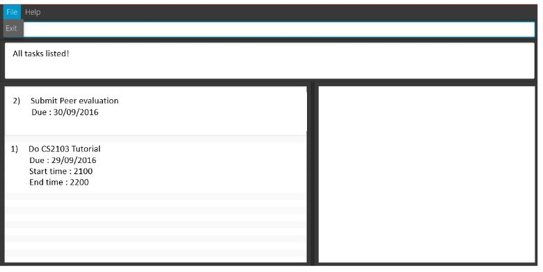

# User Guide

* [About](#about)
* [Getting Started](#getting-started)
* [Features](#features)
* [FAQ](#faq)
* [Command Summary](#command-summary)

## About
In this modern day, we’re all swamped with numerous tasks to do everyday. It is no wonder that task managers have become an indispensable tool in our everyday lives. However, we often spending more time figuring out where’s the add button or how to edit our tasks. 

Well, fret not! Here’s introducing Unburden! With Unburden, you won’t need to trouble yourself with what or where to click. Unburden utilizes a simple and intuitive command line interface which only requires you to type. No more clicking or scrolling!

Unburden features a clean interface with colour coding to prioritize your tasks. It’s simple to use and easy to manage! All you need to know is shown on the screen, just type your queries and leave the rest to Unburden! What’s more is that Unburden works offline too! So now you can even use it when your wifi’s down. 

Need to unburden? Let’s get started!

## Getting Started

1. Ensure you have Java version `1.8.0_60` or later installed in your Computer. 
   > Having any Java 8 version is not enough.  
   This app will not work with earlier versions of Java 8.
   
2. Download the latest `unburden.jar` from the [releases](../../../releases) tab.
3. Copy the file to the folder you want to use as the home folder for `Unburden`.
4. Click on the application icon to launch it and wait for the ‘Welcome’ page to appear.
   > 

5. Type the command in the command box and press <kbd>Enter</kbd> to execute it.  
   e.g. typing **`help`** and pressing <kbd>Enter</kbd> will display the list of commands that can be used in the application.
   > 
   
6. Refer to the [Features](#features) section below for details of each command. 

## Features

#### 1. Add Command: `add`

1.1  Adding a task with a deadline, start time and end time
Format: `add <Task Description> <Date> <Start Time> <End Time>`
   > 
   
You may type the command as shown below
   > 
   
Upon pressing <kbd>Enter</kbd>, you will see the task you have added as shown below.
   > 

1.2  Adding a task with only a deadline
Format: `add <Task Description> <Date>`
   > 

You may enter the command as shown below.
   > 
   
Upon pressing <kbd>Enter</kbd>, you will see the task you have added as shown below.
   > 
   
1.3 Adding a task without a deadline
Format: `add <Task Description>`
   > 
   
You may enter the command as shown below.
   > 
   
Upon pressing <kbd>Enter</kbd>, you will see the task you have added as shown below.
   > 

1.4 Adding a recurring task
Format: `add REC<Task Description> <Date> <Number of days to recur>`
   > 
   
You may enter the command as shown below.
   > 
   
Upon pressing <kbd>Enter</kbd>, you will see the task you have added as shown below.
   > 
   
#### 2. Delete Command : `delete`

Deletes the specific task from the address book. Irreversible. 
Format: `delete <Task description>`
   > 
   
You may delete the task by entering the command as shown below.
   > 
   
Once done, the updated list of tasks will be displayed as shown below
   > 

#### 3. List Command

3.1 Shows a list of all tasks in the list of tasks. 
Format: `list`
   > 

You will want to key in the command as shown below.
   > 

The list of tasks will be displayed in the application as shown below.
   > 

3.2 Listing tasks of a specific date
Format: `listbydate <Date>`
   > 
   
Simply key in the command as shown below.
   > 

The tasks which are due on the date you have just entered will be displayed on the application
   > 
   
#### 4. Help Command

4.1 If you are new to the application and/or require help
Format: `help`
   > 

Simply type help in the command line as shown below.
   > 
   
The application will display the list of commands and what these commands do

4.2 If you are unsure of what the format of a certain command is
Format: `help <Command Word>`
Examples:
   > 
   > 
   > 
   
Simply key it into the command line as shown below. We have used the example of the add command below to help you in your understanding.
   > 

The application will show the format of the particular command you inquired about.
   > 
   
> Help is also shown if you enter an incorrect command e.g. `abcd`

#### Exiting the program : `exit`
Exits the program. 
Format: `exit`
   > 

Simply type `exit` in the command line as shown below
   > 

The application will be closed.
#### Saving the data 
Address book data are saved in the hard disk automatically after any command that changes the data. 
There is no need to save manually.

## FAQ

**Q**: How do I transfer my data to another Computer? 
**A**: Install the app in the other computer and overwrite the empty data file it creates with 
       the file that contains the data of your previous Address Book folder.
       
## Command Summary

Command | Format  
-------- | :-------- 
Add | `add <Task description> <Date if applicable> <Start time if applicable> <End Time if applicable>`
Delete | `delete <task name>`
List | `list`
ListByDate | `listbydate <Date>`
HelpAll | `help`
Help | `help <command word>`
Exit | `exit`

