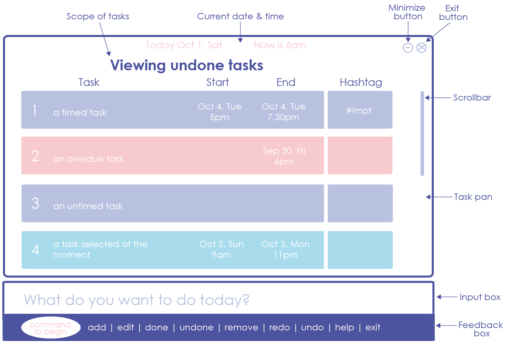

# User Guide

* [Introduction](#introduction)
* [Quick Start](#quick-start)
* [Features](#features)
* [Commands Autocomplete](#commands-autocomplete)
* [Google Integration](#google-integration)
* [FAQ](#faq)
* [Command Summary](#command-summary)

 
## Introduction
With many deadlines and tasks streaming in, you can be easily overwhelmed if you are not able to keep track of them effectively. While traditional task managers require you to interact through a graphical user interface, our task manager allows you to manage your tasks quickly through keyboard commands.

With our task manager, you can add, delete and edit tasks without a fuss. Through the usage of shortcuts, you will be able to enter your desired commands quickly. Best of all, it works with Google Calendar so any changes that you have made on either platform will be synchronized. Managing tasks has never been such a breeze.

 
## Quick Start

0. Ensure you have Java version `1.8.0_60` or later installed in your Computer. 
   > Having any Java 8 version is not enough.  
   This app will not work with earlier versions of Java 8.

1. Download the latest `taskmanager.jar` from the [releases](../../../releases) tab.
2. Copy the file to the folder you want to use as the home folder for your Task Manager.
3. Double-click the file to start the app. The GUI should appear in a few seconds.

 >  

4. Type the command in the command box and press <kbd>Enter</kbd> to execute it.  
   e.g. typing **`help`** and pressing <kbd>Enter</kbd> will open the help window.
5. Some example commands you can try:
   * **`help`** : lists all commands
   * **`add`**` Meeting, July 10, 5pm-6pm` :
     adds a `Meeting` task on `July 10, 5pm-6pm` to the Task Manager
   * **`alias`**` am add Meeting` : `am` is now a shortcut for `add Meeting`
   * **`exit`** : exits the app
6. Refer to the [Features](#features) section below for details of each command. 

 
## Features

> **Command Format**
> * Words in `UPPER_CASE` are the parameters.
> * Items in `SQUARE_BRACKETS` are optional.
> * Items with `/` imply that only one of them is chosen.
> * Items surrounded by open(`(`) and closed(`)`) brackets are grouped together.
> * The order of parameters is fixed.

#### Viewing help : `help`
Format: `help`

> Help is also shown if you enter an incorrect command e.g. `abcd`

 
#### Adding a task: `add`
Adds a task to the task manager 
Format: `add TASK, (DATE,TIME) / DEADLINE`

Examples:
* `add Project meeting, Oct 10, 5pm-6pm`

 
#### Adding a recurring task: `add daily/weekly/monthly/yearly`
Adds a recurring task to the task manager 
Format: `add daily/weekly/monthly/yearly TASK, (DATE,TIME) / DEADLINE`

Examples:
* `add weekly dance lesson, Wednesday, 3pm-4pm`
* `add monthly bill payment, Nov 30`

 
#### Favoriting a task: `favorite`
Favorites the person at the specified INDEX. The index refers to the index number shown in the most recent listing.  
The favorited task will appear at the top of any lists that include it.  
Format: `favorite INDEX`

Examples:
* `list`
* `favorite 2`  
  Favorites the 2nd task in the task list.
* `find Dinner`
* `favorite 1`  
  Favorites the 1st task in the results of the `find` command

 
#### Unfavoriting a task: `unfavorite`
Unfavorites the person at the specified INDEX. The index refers to the index number shown in the most recent listing.  
Format: `unfavorite INDEX`

Examples:
* `list`
* `unfavorite 2`  
  Unfavorites the 2nd task in the task list.

 
#### Searching for tasks using keywords: `find`
Finds tasks that contian any of the given keywords. 
Format: `find KEYWORD [MORE_KEYWORDS]`

> Finds all the tasks with the keywords.  
> Only full words will be matched e.g. meeting will not match meetings
> Persons matching at least one keyword will be returned (i.e. OR search).

Examples:
* `find meeting`  
  Returns all tasks with the keyword meeting.
* `find lunch dinner`  
  Returns any task with lunch or dinner.

 
#### Updating a task: `update`
Updates the specified task. 
Format: `update INDEX TASK/DATE/TIME/DEADLINE`

> Updates the task at the specific index. The index refers to the index shown in the most recent listing. The index must be a positive integer 1, 2, 3…

Examples:
* `list`
* `update 2 project discussion`  
  Updates the 2nd task on the list with taskname project discussion
* `find dinner`
* `update 1 6pm-7pm`  
  Updates the 1st task in the results of the `find` command with the new task time

 
#### Deleting a task: `delete`
Deletes the specified task. 
Format: `delete INDEX`

> Deletes the task at the specific index. The index refers to the index shown in the most recent listing.
> The index must be a positive integer 1, 2, 3… If the task selected is a recurring task, user will be prompted to delete all instances of the task or only the next instance of the task.

Examples:
* `list`
* `delete 2`  
  Deletes the 2nd task on the list
* `find dinner`
* `delete 1`  
  Deletes the 1st task in the results of the `find` command

 
#### Setting an alias: `alias`
Sets a one-word alias for any sentence to be used as a command. 
Format: `alias SHORTCUT [ANY_SENTENCE]`

> `ANY_SENTENCE` is tagged to `SHORTCUT` so that if `SHORTCUT` is used as the first command, `ANY_SENTENCE` will be inserted in it's place instead.
> `SHORTCUT` can only consist of one word.

Examples:
* `alias am add Meeting`
* `am`  
  Typing `am, July 10, 5-6` is the same as `add Meeting, July 10, 5-6`
* `alias s search Dinner`
* `s`
  Typing `s` is the same as `search Dinner`

 
#### Undoing an action: `undo`
Undoes the previous command. 
Format: `undo`

Examples:
* `list`
* `delete 1`
* `undo`  
  Undoes your latest `delete` command

 
#### Listing all persons : `list`
Shows a list of all the tasks. 
Format: `list`

 
#### Clearing all entries : `clear`
Clears all entries from the Task Manager. 
Format: `clear`

 
#### Exiting the program : `exit`
Exits the program. 
Format: `exit`

 
#### Saving the data
Task data are saved in the hard disk automatically after any command that changes the data. 
There is no need to save manually.

 
## Commands Autocomplete
Pressing <kbd>TAB</kbd> will autocomplete the first word by looking up all possible commands.  
If there is only one possible command, the command will be autocompleted.  
However, if there are multiple commands, they will be displayed.  

Examples:
* `al`<kbd>TAB</kbd> 
  `alias` completed for you.
* `cl`<kbd>TAB</kbd> 
  `clear` completed for you.
* `un`<kbd>TAB</kbd> 
  `unfavorite` and `undo` displayed on the screen as possible commands.
* `unf`<kbd>TAB</kbd> 
  `unfavorite` completed for you.

 
## Google Integration

At any time, enter `sync` as a command and follow the on-screen instructions to begin automatically synchronizing your in-app tasks with Google Calendar.

Any of your present and future tasks will be synchronized bidirectionally and automatically. If the same task is edited locally and on Google Calendar, changes made on Google Calendar will be prioritized during synchronization.

 
## FAQ

**Q**: How do I transfer my data to another Computer? 
**A**: Install the app in the other computer and overwrite the empty data file it creates with
       the file that contains the data of your previous Task Manager folder.

 
## Command Summary

Command | Format
-------- | :--------
Help | `help`
Add | `add TASK, (DATE, TIME) / DEADLINE`
Add daily/weekly/monthly/yearly | `add daily/weekly/monthly/yearly TASK, (DATE, TIME) / DEADLINE`
Favorite | `favorite INDEX`
Unfavorite | `unfavorite INDEX`
Find | `find KEYWORD [MORE_KEYWORDS]`
Update | `update INDEX TASK/DATE/TIME/DEADLINE`
Delete | `delete INDEX`
Alias | `alias SHORTCUT ANY_SENTENCE`
Undo | `undo`
List | `list`
Clear | `clear`
Sync | `sync`

