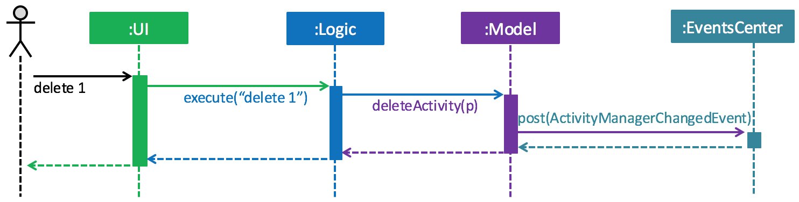
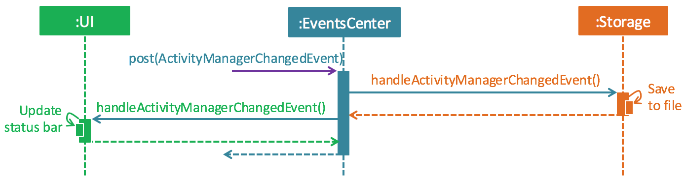
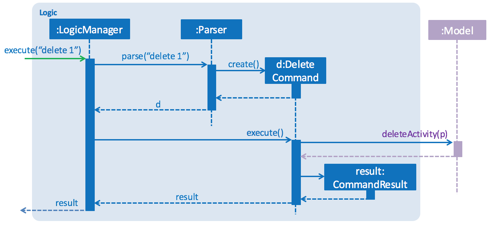
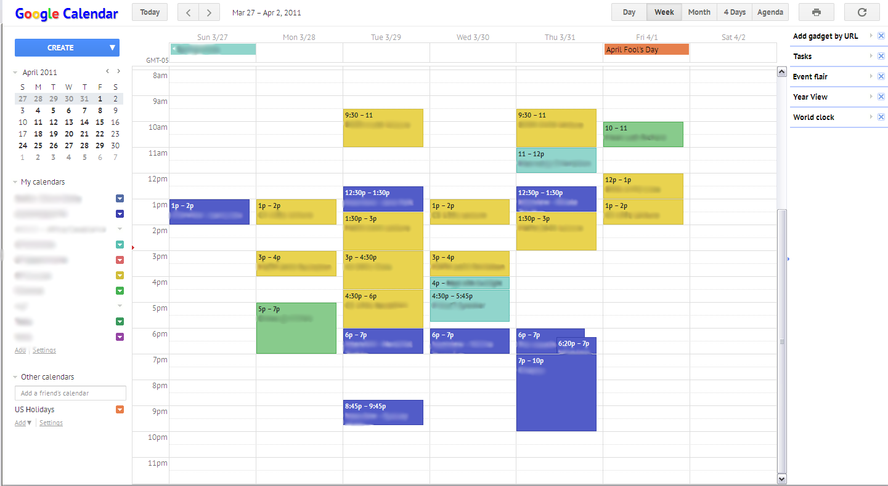
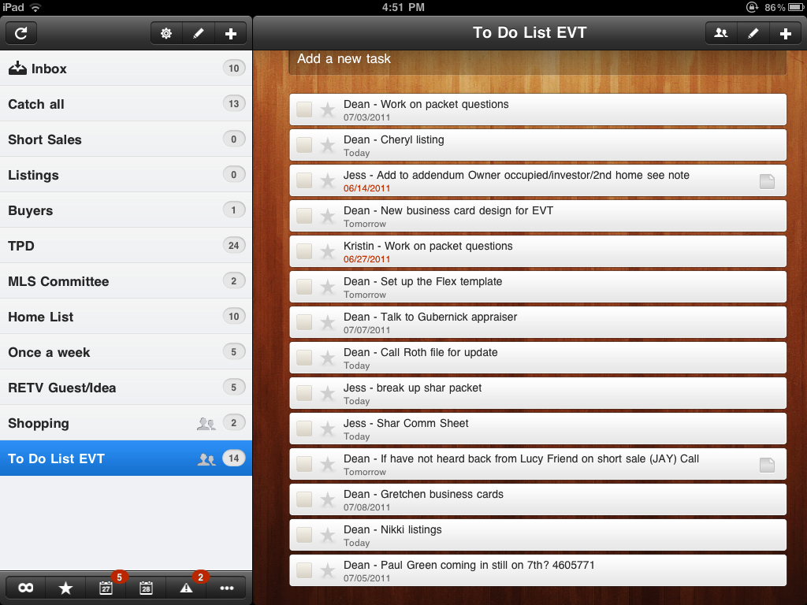
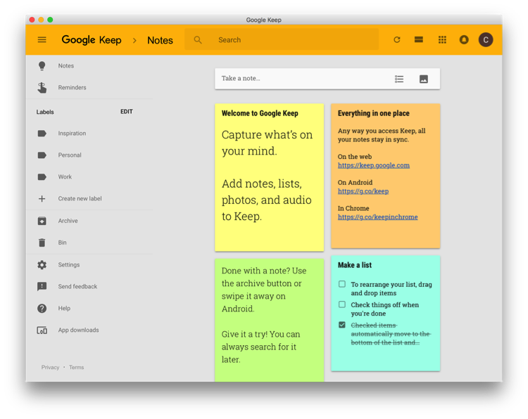
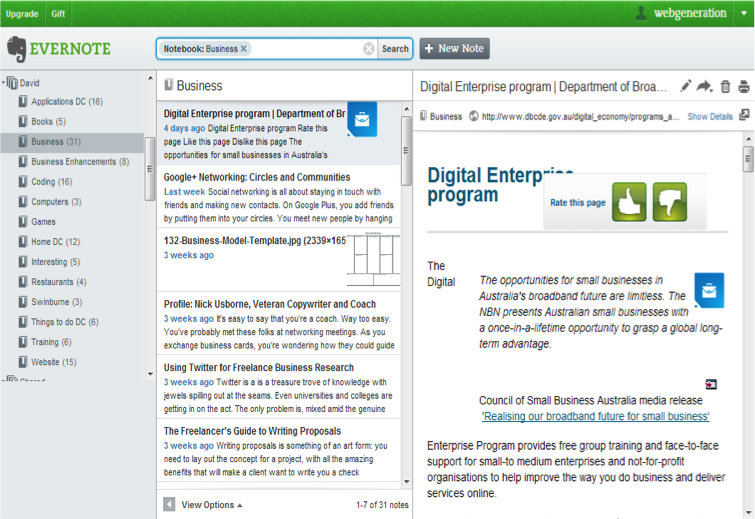

# Developer Guide

## Table of Contents

1. [Introduction](#1-introduction)
2. [Setup](#2-setup)
3. [Design](#3-design)
4. [Implementation](#4-implementation)
5. [Testing](#5-testing)
6. [Dev Ops](#6-dev-ops)
7. [Appendices](#7-appendices) 
    A. [User Stories](#a-user-stories) 
    B. [Use Cases](#b-use-cases) 
    C. [Non-Functional Requirements](#c-non-functional-requirements) 
    D. [Product Survey](#d-product-survey) 
    E. [Glossary](#e-glossary) 

## 1. Introduction

Remindaroo is an activity manager that helps users track tasks, deadlines as well events. It is
a **Java** application that has both a **Text UI** and a **GUI**.

This guide describes the design and implementation of Remindaroo. It aims to help you understand
how Remindaroo works and how you can further contribute to this project. We have organised this
guide in a top-down manner to help you comprehend the big picture before proceeding on to more detailed sections.

## 2. Setup

#### Prerequisites

1. **JDK `1.8.0_60`**  or later 

    > Having any Java 8 version is not enough.  
    This app will not work with earlier versions of Java 8.

2. **Eclipse** IDE
3. **e(fx)clipse** plugin for Eclipse (Do the steps 2 onwards given in
   [this page](http://www.eclipse.org/efxclipse/install.html#for-the-ambitious))
4. **Buildship Gradle Integration** plugin from the Eclipse Marketplace

#### Importing the project into Eclipse

1. Fork this repo, and clone the fork to your computer
2. Open Eclipse (Note: Ensure you have installed the **e(fx)clipse** and **buildship** plugins as given
   in the prerequisites above)
3. Click `File` > `Import`
4. Click `Gradle` > `Gradle Project` > `Next` > `Next`
5. Click `Browse`, then locate the project's directory
6. Click `Finish`

  > * If you are asked whether to 'keep' or 'overwrite' config files, choose to 'keep'.
  > * Depending on your connection speed and server load, it can even take up to 30 minutes for the set up to finish
      (This is because Gradle downloads library files from servers during the project set up process)
  > * If Eclipse auto-changed any settings files during the import process, you can discard those changes.

## 3. Design
### Architecture

 
> Figure 1: _Architecture Diagram_, which explains the high-level design of the App.

Given below is a quick overview of each component.

`Main` has only one class called [`MainApp`](../src/main/java/seedu/manager/MainApp.java).
When user starts up the program, `MainApp` initializes the components in the correct sequence and connects them up with each other.
When user exits the program, `MainApp` shuts down the components and invokes cleanup method where necessary.

[**`Commons`**](#common-classes) represents a collection of classes used by multiple other components.
Two of those classes play important roles at the architecture level.
* `EventsCentre` : This class (written using [Google's Event Bus library](https://github.com/google/guava/wiki/EventBusExplained))
  is used by components to communicate with other components using events (i.e. a form of _Event Driven_ design)
* `LogsCenter` : Used by many classes to write log messages to the App's log file.

The rest of the App consists four components.
* [**`UI`**](#ui-component) : Gets input from the user and display results to the user.
* [**`Logic`**](#logic-component) : Interprets user input and executes command accordingly.
* [**`Model`**](#model-component) : Holds the data of the App in-memory.
* [**`Storage`**](#storage-component) : Reads data from the hard disk and writes data to the hard disk.

Each of the four components
* Defines its _API_ in an `interface` with the same name as the Component.
* Exposes its functionality using a `{Component Name}Manager` class.

> Figure 2: _Sequence Diagram_ of how the components interact for the scenario where the user issues the command `delete 1`.

Note how the `Model` simply raises a `ActivityManagerChangedEvent` when the Activity Manager data are changed, instead of asking the `Storage` to save the updates to the hard disk.

> Figure 3: _Sequence Diagram_ of how the `EventsCenter` reacts to `ActivityManagerChangedEvent`.

Note how the event is propagated through the `EventsCenter` to the `Storage` and `UI` without `Model` having to be coupled to either of them. This is an example of how this Event Driven approach helps us reduce direct coupling between components.

The sections below give more details of each component.

### UI component

 
> Figure 4: _Class Diagram_ of UI component.

**API** : [`Ui.java`](../src/main/java/seedu/manager/ui/Ui.java)

The UI consists of a `MainWindow` that is made up of parts e.g.`CommandBox`, `ResultDisplay`, `ActivityListPanel`,
`StatusBarFooter`, `BrowserPanel`. All these, including the `MainWindow`, inherit from the abstract `UiPart` class
and they can be loaded using the `UiPartLoader`.

The `UI` component uses JavaFx UI framework. The layout of these UI parts are defined in matching `.fxml` files
 that are in the `src/main/resources/view` folder. 
 For example, the layout of the [`MainWindow`](../src/main/java/seedu/manager/ui/MainWindow.java) is specified in
 [`MainWindow.fxml`](../src/main/resources/view/MainWindow.fxml)

The `UI` component
* Executes user commands using the `Logic` component.
* Binds itself to some data in the `Model` so that the UI can auto-update when data in the `Model` change.
* Responds to events raised from various parts of the App and updates the UI accordingly.

### Logic component

 

> Figure 5: _Class Diagram_ of Logic component.

**API** : [`Logic.java`](../src/main/java/seedu/manager/logic/Logic.java)

The flow of `Logic` component is explained as follows.

* `Logic` uses the `Parser` class to parse the user command.
* `Parser` creates a `Command` object for `LogicManager` to execute.
* The command execution can affect the `Model` (e.g. adding an activity) and/or raise events.
* The result of the command execution is encapsulated as a `CommandResult` object which is passed back to the `Ui`.

 
> Figure 6: _Sequence Diagram_ for interactions within the `Logic` component for `execute("delete 1")` API call.

### Model component

 

> Figure 7: _Class Diagram_ for Model component.

**API** : [`Model.java`](../src/main/java/seedu/manager/model/Model.java)

The `Model` component
* stores a `UserPref` object that represents the user's preferences.
* stores the ActivityManager data.
* exposes a `UnmodifiableObservableList<ReadOnlyActivity>` that can be 'observed' e.g. the UI can be bound to this list
  so that the UI automatically updates when the data in the list change.
* does not depend on any of the other three components.

### Storage component

 

> Figure 8: _Class Diagram_ for Storage component.

**API** : [`Storage.java`](../src/main/java/seedu/manager/storage/Storage.java)

The `Storage` component
* can save `UserPref` objects in json format and read it back.
* can save the ActivityManager data in xml format and read it from xml.

### Common classes

Classes used by multiple components are in the `seedu.manager.commons` package.

## 4. Implementation

### Logging

We are using `java.util.logging` package for logging. The `LogsCenter` class is used to manage the logging levels
and logging destinations.

* The logging level can be controlled using the `logLevel` setting in the configuration file
  (See [Configuration](#configuration))
* The `Logger` for a class can be obtained using `LogsCenter.getLogger(Class)` which will log messages according to
  the specified logging level
* Currently log messages are output through: `Console` and to a `.log` file.

**Logging Levels**

* `SEVERE` : Critical problem detected which may possibly cause the termination of the application
* `WARNING` : Can continue, but with caution
* `INFO` : Information showing the noteworthy actions by the App
* `FINE` : Details that is not usually noteworthy but may be useful in debugging
  e.g. print the actual list instead of just its size

### Configuration

Certain properties of the application can be controlled (e.g App name, logging level) through the configuration file
(default: `config.json`):

## 5. Testing

Tests can be found in the `./src/test/java` folder.

**In Eclipse**:
> If you are not using a recent Eclipse version (i.e. _Neon_ or later), enable assertions in JUnit tests
  as described [here](http://stackoverflow.com/questions/2522897/eclipse-junit-ea-vm-option).

* To run all tests, right-click on the `src/test/java` folder and choose
  `Run as` > `JUnit Test`
* To run a subset of tests, you can right-click on a test package, test class, or a test and choose
  to run as a JUnit test.

**Using Gradle**:
* See [UsingGradle.md](UsingGradle.md) for how to run tests using Gradle.

We have two types of tests:

1. **GUI Tests** - These are _System Tests_ that test the entire App by simulating user actions on the GUI.
   These are in the `guitests` package.

2. **Non-GUI Tests** - These are tests not involving the GUI. They include,
   1. _Unit tests_ targeting the lowest level methods/classes.  
      e.g. `seedu.manager.commons.UrlUtilTest`
   2. _Integration tests_ that are checking the integration of multiple code units
     (those code units are assumed to be working). 
      e.g. `seedu.manager.storage.StorageManagerTest`
   3. Hybrids of unit and integration tests. These test are checking multiple code units as well as
      how the are connected together. 
      e.g. `seedu.manager.logic.LogicManagerTest`

**Headless GUI Testing** :
Thanks to the [TestFX](https://github.com/TestFX/TestFX) library we use,
 our GUI tests can be run in the _headless_ mode.
 In the headless mode, GUI tests do not show up on the screen.
 That means the developer can do other things on the Computer while the tests are running. 
 See [UsingGradle.md](UsingGradle.md#running-tests) to learn how to run tests in headless mode.

## 6. Dev Ops

### Build Automation

See [UsingGradle.md](UsingGradle.md) to learn how to use Gradle for build automation.

### Continuous Integration

We use [Travis CI](https://travis-ci.org/) to perform _Continuous Integration_ on our projects.
See [UsingTravis.md](UsingTravis.md) for more details.

### Making a Release

#### To create a new release

 1. Generate a JAR file [using Gradle](UsingGradle.md#creating-the-jar-file).
 2. Tag the repo with the version number. e.g. `v0.1`
 2. [Create a new release using GitHub](https://help.github.com/articles/creating-releases/)
    and upload the JAR file your created.

### Managing Dependencies

A project often depends on third-party libraries. For example, Remindaroo depends on the [Jackson library](http://wiki.fasterxml.com/JacksonHome) for XML parsing. These _dependencies_ can be automatically managed using Gradle. Gradle can download the dependencies automatically, which is better than these alternatives. 
a. Include those libraries in the repo (this bloats the repo size)
b. Require developers to download those libraries manually (this creates extra work for developers)

## 7. Appendices
### A. User Stories

 

> Legend for priorities: 
> \*\*\*: High (Must Have) 
> \*\*: Medium (Nice to have) 
> \*: Low (Unlikely to have) 

 

| Priority | As a | I want to | So that I can |
| -----|-----|-----|-----|
| *** | User | Add various activities |Remind oneself of important activities or tasks to complete |
| *** | User | View a list of activities | Know the next few activities to finish (e.g. based on deadline) |
| *** | User | View details of a specific activity | Know when we need to finish a task or be present at an event |
| *** | User | Update activity | Make changes to an activity |
| *** | User | Delete activities | Remove activities that are cancelled |
| *** | User | Undo previous command | Revert an unintended change to the to-do list |
| *** | User | Search for items by time/task/type | Find items easily |
| *** | User | Mark activity | Know and update the status of activity |
| *** | User | Change directory of storage file | Store data in location of convenience
| ** | User | Redo previous command | Undo an accidental undo |
| ** | User | Add recurring tasks | Not have to add the same task repeatedly |
| ** | User | Be able to search items by date / free time slots | Easily organize my schedule |
| * | User | Auto-complete features | Type my commands faster |

> Table 1: User Stories of Remindaroo

### B. Use Cases

#### Use case: Add an activity

1. User types in command: `add ACTIVITY …`
2. System adds activity into list of activities
3. System displays list of activities

Use case ends.

#### Use Case: View an activity

1. User types in command: `view ACTIVITY_ID`
2. System displays activity with the id of `ACTIVITY_ID`

Use case ends.

#### Use Case: View list of activities

1. User requests to view activities via command: `view DATE_TIME [END_DATE_TIME]`
2. System displays list of activites within the time period

Use case ends.

#### Use case: Update activity

**MSS**

1. User types in command: `update ACTIVITY_ID ...`
2. System updates activity with the id of `ACTIVITY_ID`

Use case ends.

**Extensions:**

3a. Activity cannot be found in list / list is empty

> System displays error message 
> Use case ends.

#### Use case: Delete activity

**MSS**

1. User types in command: `delete ACTIVITY_ID`
2. System deletes activity with the id of `ACTIVITY_ID` from list

Use case ends.

**Extensions**

2a. Activity cannot be found in list / list is empty

> Systems informs user that no such activity exists 
> Use case ends.

#### Use Case: Undo last command

**MSS**

1. User types in command: `undo`
2. System reverts to state before last command

Use case ends.

**Extensions:**

2a. System cannot find a previous command

> Use case ends.

#### Use Case: Redo last command

**MSS**

1. User types in command: `redo`
2. System reverts to state before last undo command

Use case ends.

**Extensions:**

2a. System cannot find a command before last undo

> Use case ends.

#### Use Case: Mark an activity

**MSS**

1. User types in command: `mark ACTIVITY_ID as STATUS`
2. System saves status into the activity with the id of `ACTIVITY_ID`

Use case ends.

**Extensions:**

2a. System cannot find any matches

> Use case ends.

#### Use Case: Search for activities

**MSS**

1. User types in command: `search KEYWORDS|DATE|CATEGORY`
2. System displays a list of activities that match the description

Use case ends.

**Extensions:**

2a. System cannot find any matches

> Use case ends.

#### Use Case: Change directory of storage file

**MSS**

1. User types in command: `store DATA_FILE_PATH`
2. System requests confirmation with user
3. System changes directory of storage file to specified file path

Use case ends.

**Extensions:**

2a. System cannot find specified file path

> System displays error message 
> Use case ends.

### C. Non-Functional Requirements
1. Should work on any [mainstream OS](#mainstream-os) as long as it has Java 8 or higher installed.
2. Should be able to hold up to 1000 activities.
3. With the exception of any cloud integration, the application should work offline
4. Should be able to work with only keyboard input

### D. Product Survey
We have surveyed a total of 4 task manager products and noted some of their strengths and weaknesses.

#### Google Calendar

 

> Figure 9: Screenshot of GoogleCalendar

**Pros:**

1. Ability to see all events at a quick glance
2. Ability to group events based on different categories
3. Ability to share schedules and integrate calendars of different users

**Cons:**

1. Difficult to modify existing events
2. Unable to add floating tasks (events without a date)

#### WunderList

 

> Figure 10: Screenshot of WunderList

**Pros:**

1. Ability to mark events as high priority with a star
2. Ability to place tasks in categories (in the form of nested folders)
3. Ability to have a collaborative folder where different users can add tasks

**Cons:**

1. Unable to view a list of tasks within a specified time period
2. Difficult to determine a free slot within a specified time period

#### Google Keep

 

> Figure 11: Screenshot of GoogleKeep

**Pros:**

1. Ability to see all tasks in a neat and logical manner
2. Ability to categorized task

**Cons:**

1. Difficult to add other information such as time and place
2. Unable to work offline

#### Evernote

 

> Figure 12: Screenshot of Evernote

**Pros:**

1. Ability to add new activity quickly
2. Ability to work offline

**Cons:**

1. Unable to see an overview of all tasks
2. Difficult to add other information such as time and place

### E. Glossary

##### Mainstream OS
> Refers to modern versions of Microsoft Windows (7/8/10), macOS (10.X or Linux systems (e.g. Ubuntu)
