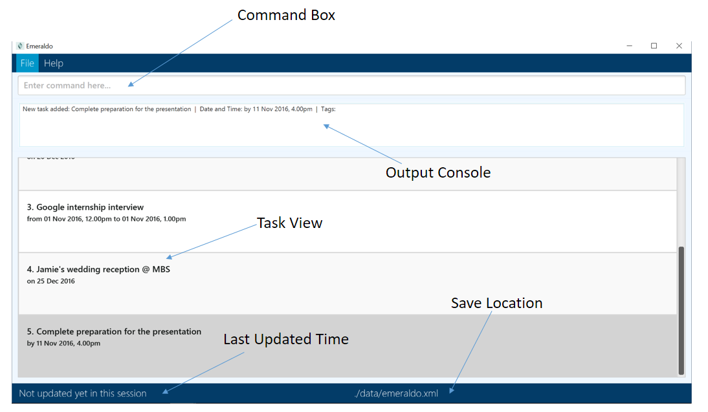

# Manual Scripted Testing

## Loading the sample data

1. Download the emeraldo.jar from the latest [release] (https://github.com/CS2103AUG2016-T10-C3/main/releases) in github.
2. Place emeraldo.jar in your desired folder for testing.
3. In the same folder where emeraldo.jar is placed, create a folder called ‘data’.
4. Place the sample data (SampleData.xml) into the folder you have just created.
5. Rename SampleData.xml to emeraldo.xml
6. You can now launch emeraldo.jar with all the sample data loaded.
 
Overview of GUI

 

 
## Add Command

Type `add “buy cheezels” ` into the command box
> Output console will display `New task added: buy cheezels  |  Date and Time: anytime  |  Tags: `  
> New task added in the task view with index 51 
> Task view jumps to the task that has just been added
 

Type `add “Sam’s wedding” on 23 dec` into the command box
> Output console will display `New task added: Sam's wedding  |  Date and Time: on 23 Dec 2016  |  Tags: ` 
> New task added in the task view with index 52 
> Task view jumps to the task that has just been added
 

Type `add “buy christmas present for christmas party” by 25/12/2016, 3pm #present` into the command box
> Output console will display `New task added: buy christmas present for christmas party  |  Date and Time: by 25 Dec 2016, 3.00pm  |  Tags: ` 
> New task added in the task view with index 53  
> Task view jumps to the task that has just been added
 

Type `add “Christmas wonderland @ gardens by the bay” from 13-12, 1600 to 13-12, 1900` into the command box
>Output console will display `New task added: Christmas wonderland @ gardens by the bay  |  Date and Time: from 13 Dec 2016, 4.00pm to 13 Dec 2016, 7.00pm  |  Tags: `  
> New task added in the task view with index 54  
> Task view jumps to the task that has just been added
 

Type `add “Christmas wonderland @ gardens by the bay” from 13 Dec 16, 4:00pm to 13 Dec 16, 7:00pm` into the command box
> Output console will display `This task already exists in the task manager` 
> Task will not be added
 

 
## Edit Command

Type `edit 2 “Surprise Anniversary date with darling”`
> Output console will display `Edited task: Surprise Anniversary date with darling  |  Date and Time: on 15 Nov 2016  |  Tags: `  
> Task with index 2 edited with new description  
> Task view jumps to the task that has been edited
 

Type `edit 3 from 12 nov, 11am to 12 nov, 12pm` 
> Output console will display `Edited task: Apple internship interview  |  Date and Time: from 12 Nov 2016, 11.00am to 12 Nov 2016, 12.00pm  |  Tags: `  
> Task with index 3 edited with new date and time  
> Task view jumps to the task that has been edited
 

Type `edit 5 by 08/11/2016, 5.20pm`
> Output console will display `Edited task: Buy MRT concession pass  |  Date and Time: by 08 Nov 2016, 5.20pm  |  Tags: `  
> Task with index 5 edited with new date and time  
> Task view jumps to the task that has been edited
 

 
## Tag Edit Command

Type `tag add 4 #impt` into the command box
> Output console will display `Edited task: 4`  
> Task with index 4 will have the tag [impt] added  
> Task view jumps to the task that has been edited 
 

Type `tag add 4 #today` into the command box
> Output console will display `The tag you have entered is one of our reserved words and is not allowed. Please use another word. Our list of reserved words are: [today, tomorrow, thisweek, nextweek, thismonth, nextmonth, completed]`
 

Type `tag delete 4 #impt` into the command box
> Output console will display `Edited task: 4`  
> Task with index 4 will have the tag [impt] deleted  
> Task view jumps to the task that has been edited
 

Type `tag delete 1 #friends` into the command box
> Output console will display `Tag does not exist in the indicated task!`
 

Type `tag clear 1` into the command box
> Output console will display `Tags are empty!`
 

Type `tag add 2 #Anniversary`  
Type `tag add 2 #Date`  
Type `tag clear 2` into the command box
> Output console will display `Edited task: 2`  
> Task with index 2 will have all its tags cleared  
>Task view jumps to the task that has been edited
 

 
## Delete Command

Type `delete 5` into the command box
> Output console will display `Deleted task: Buy MRT concession pass  |  Date and Time: by 08 Nov 2016, 5.20pm  |  Tags: `  
> Task with index 5 will be deleted
 

Type `delete 55` into the command box
> Output console will display “The task index provided is invalid”
 

 
## Completed Command

Type `completed 3` into the command box
> Output console will display `Completed task: Apple internship interview  |  Date and Time: Completed on 6 Nov 2016 at 6.54pm  |  Tags: `   
> Task with index 3 will be marked as completed
 

Type `completed 3` again into the command box
> Output console will display `This task is already completed`
 

Type `completed 55` again into the command box
> Output console will display `The task index provided is invalid`
 

 
## Clear Command

Type `clear` into the command box
> Output console will display `Emeraldo has been cleared!`  
> All task in Emeraldo will be deleted
 

 
## Undo Command

Type `undo` into the command box
> Output console will display `Undo successful!`  
> The clear command will be reversed
 

Type `add “undo this add”` into the command box  
Type `undo` into the command box
> Output console will display `Undo successful!`  
> The add command will be reversed
 

Type `edit 3 “undo this edit”` into the command box  
Type `undo` into the command box
> Output console will display `Undo successful!`  
> The edit command will be reversed
 

Type `delete 3 ` into the command box  
Type `undo` into the command box
> Output console will display `Undo successful!`  
> The delete command will be reversed
 

Type `completed 4` into the command box  
Type `undo` into the command box
> Output console will display `Undo successful!`  
> The completed command will be reversed
 

Type `tag add 3 #test` into the command box  
Type `undo` into the command box
> Output console will display `Undo successful!`  
> The tag command will be reversed
 

 
## List Command
 

Task to be added with a date to be defined by the tester.  
1. Type `add “today’s task” on (Today’s date)`
2. Type `add “tomorrow’s task” on (Tomorrow’s date) #friends`
3. Type `add “nextweek’s task” on (Any date next week)`
4. Type `add “nextmonth’s task” on (Any date next month)`
5. Type `add “uncompleted task” on 5 nov`
6. Type `Completed 54`
7. Type `Completed 55`
8. Type `Completed 56`
9. Type `Completed 57`
 

Type `list` into the command box
> Output console will display `Tasks that are uncompleted are successfully listed!` 
> All uncompleted tasks will be listed 
> There will be 52 tasks listed in total
 

Type `list friends` into the command box
> Output console will display `Uncompleted tasks with tag 'friends' successfully listed!
7 tasks listed!` 
> All uncompleted tasks with tag ‘friends’ will be listed 
> The tasks you created would not appear.
 

Type `list today` into the command box
> Output console will display `Uncompleted tasks happening today successfully listed!` 
> All uncompleted tasks occurring today will be listed. 
> The tasks you created would not appear.
 

Type `list tomorrow` into the command box
> Output console will display `Uncompleted tasks happening tomorrow successfully listed!` 
> All uncompleted tasks occurring tomorrow will be listed. 
> The tasks you created would not appear.
 

Type `list thisweek` into the command box
> Output console will display `Uncompleted tasks happening this week successfully listed!` 
> All uncompleted tasks occurring this week will be listed. 
> The tasks you created would not appear.
 

Type `list nextweek` into the command box
> Output console will display `Uncompleted tasks happening next week successfully listed!` 
> All uncompleted tasks occurring next week will be listed. 
> The tasks you created would not appear.
 

Type `list thismonth` into the command box
> Output console will display `Uncompleted tasks happening this month successfully listed!` 
> All uncompleted tasks occurring this month will be listed. 
> The tasks you created would not appear.
 

Type `list nextmonth` into the command box
> Output console will display `Uncompleted tasks happening next month successfully listed!` 
> All uncompleted tasks occurring next month will be listed. 
> The tasks you created would not appear.
 

## ListAll Command
 

Type `listall` into the command box
> Output console will display `All tasks are successfully listed!` 
> All tasks (both completed and uncompleted) will be listed. 
> There will be 57 tasks listed in total
 

Type `listall friends` into the command box
> Output console will display `All tasks with tag 'friends' successfully listed!
8 tasks listed!` 
> All tasks (both completed and uncompleted) that are tagged as “friends” will be listed. 
> The task with description “tomorrow’s task” will appear.
 

Type `listall today` into the command box
> Output console will display `All tasks happening today successfully listed!` 
> All tasks (both completed and uncompleted) occurring today will be listed. 
> The task with description “today’s task” will appear.
 

Type `listall tomorrow` into the command box
> Output console will display `All tasks happening tomorrow successfully listed!` 
> All tasks (both completed and uncompleted) occurring tomorrow will be listed. 
> The task with description “tomorrow’s task” will appear.
 

Type `listall thisweek` into the command box
> Output console will display `All tasks happening this week successfully listed! 
> All tasks (both completed and uncompleted) occurring this week will be listed. 
> The task with description “today’s task” will appear. 
> The task with description “nextweek’s task” will **not** appear. 
> Whether the other 2 tasks you created will appear, depends on what is the date you have input.
 

Type `listall nextweek` into the command box
> Output console will display `All tasks happening next week successfully listed!` 
> All tasks (both completed and uncompleted) occurring next week will be listed. 
> The task with description “nextweek’s task” will appear. 
> The task with description “today’s task” will **not** appear. 
> Whether the other 2 tasks you created will appear, depends on what is the date you have input.
 

Type `listall thismonth` into the command box
> Output console will display `All tasks happening this month successfully listed!`  
> All tasks (both completed and uncompleted) occurring this month will be listed. 
> The task with description “today’s task” will appear. 
> The task with description “nextmonth’s task” will **not** appear. 
> Whether the other 2 tasks you created will appear, depends on what is the date you have input.
 

Type `listall nextmonth` into the command box
> Output console will display `All tasks happening next month successfully listed!`  
> All tasks (both completed and uncompleted) occurring next month will be listed.  
> The task with description “nextmonth’s task” will appear.  
> The task with description “today’s task” will **not** appear.  
> Whether the other 2 tasks you created will appear, depends on what is the date you have input.
 

 
## Find Command

Type `find task` into the command box
> Output console will display `1 tasks listed!`  
> All uncompleted tasks with `task` in its description will be listed.
 

Type `find interview` into the command box
> Output console will display `4 tasks listed!`  
> All uncompleted tasks with `interview` in its description will be listed.
 

Type `find task interview` into the command box
> Output console will display `5 tasks listed!`  
> All uncompleted tasks with `interview` or `task` in its description will be listed.
 

 
## FindAll Command

Type `findall task` into the command box
> Output console will display `5 tasks listed!`  
> All tasks (both completed and uncompleted) with `task` in its description will be listed.
 

Type `findall task interview` into the command box
> Output console will display `10 tasks listed!`  
> All tasks (both completed and uncompleted) with `interview` or `task` in its description will be listed.
 

 
## Help Command

Type `help` into the command box
> Output console will not remain unchanged  
> A help window will appear which directs the user to our online User Guide in Github.
< br>

Press <kbd>alt<kbd/> + <kbd>F4<kbd\>

> Output console will display ‘Opened help window.’  
> The help window will be closed
 

 
## SaveTo Command

Type `saveto ./newFolder/` into the command box
> Output console will display `Save location changed to ./newFolder/emeraldo.xml`  
> Status bar at the bottom showing the save location will show the new path ./newFolder/emeraldo.xml  

Type `add “test data”` into the command box
> New emeraldo.xml will be created at ./newFolder/ when a change is made  
> Confirm the creation of a folder named `newFolder` and the presence of a file named `emeraldo.xml` by going to the folder where emeraldo.jar was placed.
 

Type `saveto default` into the command box
> Output console will display `Save location changed to ./data/emeraldo.xml`  
> Status bar at the bottom showing the save location will show the new path ./data/emeraldo.xml  
 

Close the program and relaunch emeraldo.jar  
> Task data stored in ./data/emeraldo will be loaded  
> The task with description “test data” will not be in the task view as it is saved in ./newFolder/emeraldo.xml.
 

 
## MotivateMe Command

Type `motivateme` into the command box
> Output console will display a motivational quote generated at random

 
 

**END OF MANUAL TESTING**
